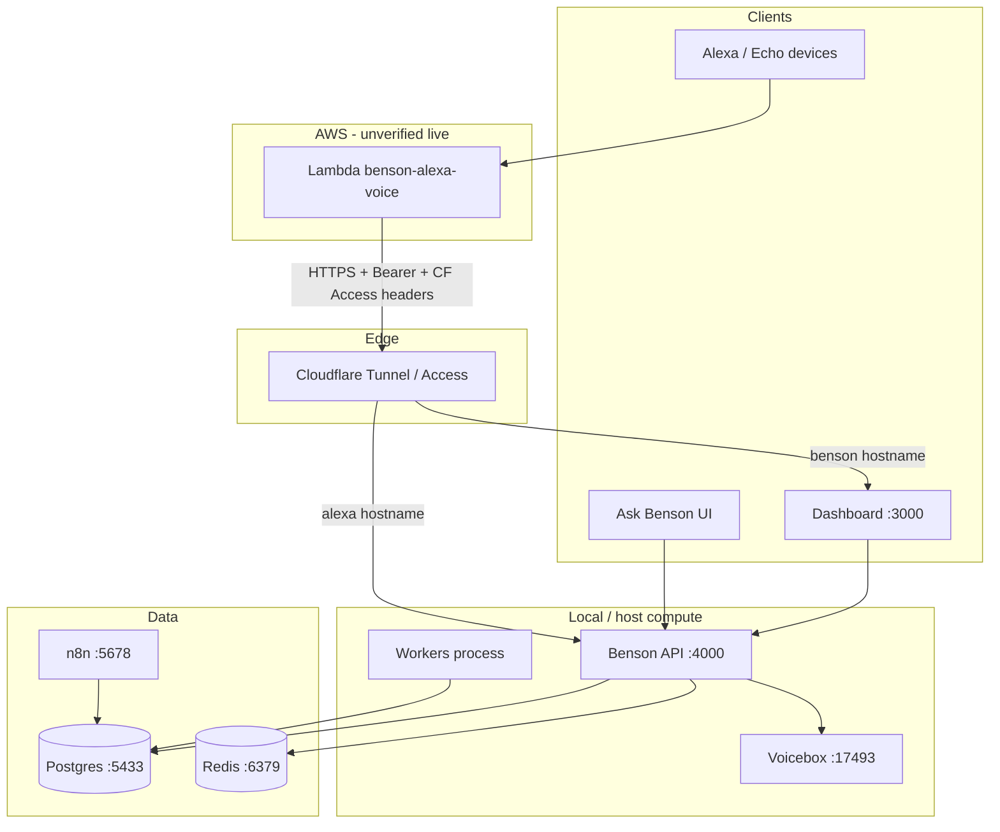

# Benson Project Audit — 2026-08-25

**Repository:** `/home/elliott/Projects/kellie-assistant/social-agent`  
**Audit mode:** READ ONLY (only this Markdown file created)  
**Branch:** `release/scout-expansion-2026-07-25`  
**Commit:** `aaad48fe43ca244c85e6a866003d953ba7848fff` (`aaad48f`)

---

## 14. Executive Summary — Where We Are Right Now

**Is Benson fundamentally healthy?**  
Partially. The monorepo has a coherent architecture (API + core + workers + dashboard + Postgres + optional Alexa Lambda package). Local API is up and fingerprint-matched to current source. The working tree is **not** a clean deployable state: ~290 dirty paths, large uncommitted Alexa/calendar/Ask Benson work, and stack-level **DRIFT** (dashboard + workers behind source).

**What major systems appear operational (local evidence)?**
- Benson API on `:4000` (health 200; identity commit `aaad48f`; source↔API fingerprint match `8c6983f38568a41b`)
- Postgres (`social_agent_postgres` on host `:5433`)
- Voicebox (`:17493`), n8n (`:5678`), Redis (`:6379`) containers up
- Voice-read routes mounted (`/api/benson-voice/*` → 401 without auth)
- Core Command Center / inventory / Ask Benson / calendar / scout code present with substantial tests

**What major systems are unfinished?**
- Alexa end-to-end for newer intents (especially WhatShouldKelliePost): Lambda zip + source exist; **no interaction-model files in repo**; AWS Console/Lambda upload not proven
- Dashboard + workers not redeployed to match current source
- Migrations `86` / `87` present as files; apply state on live DB is «UNKNOWN — requires external verification»
- Many `docs/reports/*` describe fixes that may still be local-only

**What is currently broken / failing?**
- Alexa “what should Kellie post” from physical devices: **not end-to-end verified**; most likely break is **interaction model / Lambda not deployed** (see §6)
- External `https://alexa.kckellie.com/...` returns **403** without Cloudflare Access credentials (expected gate; local `.env` reportedly lacks `CF_ACCESS_*` for agent smoke)
- Voice-read unit suite: **49 pass / 2 fail** in timezone/non-empty parity tests (see §8)
- Host Node is **v18.19.1** while package engines want `>=20` (warnings on scripts)

**What exists locally but probably isn’t deployed?**
- Full `services/alexa/` package (handlers, APL, MoreResults, WhatShouldKelliePost)
- Built artifact `services/alexa/dist/benson-alexa-voice.zip` (2026-08-24; SHA-256 `77767aae…5230`) — docs say **not uploaded to AWS**
- Large uncommitted calendar / Ask Benson / weekend-list / migrations 86–87 changes
- Dashboard fingerprint older than source (`bc36761c…` built ~2026-08-16)

**Architectural risks**
- Dual voice surfaces: Studio Voice (`/api/voice` + Voicebox) vs Alexa voice-read (`/api/benson-voice`) — related but separate
- Cloudflare tunnel backup config (`deploy/cloudflared.config.yml.working-benson`) lists `benson.kckellie.com` → `:3000` but **does not** list `alexa.kckellie.com` (live tunnel config «UNKNOWN»)
- Huge dirty tree + many session reports increase risk of “docs say done / prod doesn’t have it”

**Data risks**
- Uncommitted migrations 86–87 vs live schema apply state unknown
- Calendar / URL-intake / partnership identity work has many recent audit/fix reports — residual bad rows possible
- System-level blocker audit (`docs/reports/benson-system-level-blocker-audit-2026-08-21.md`) flags live identity/Discover/partnership junk and weak discoveries yield — code fixes may exist while residual rows remain
- Voice postToday may legitimately return empty inventory; empty speech is not by itself an Alexa outage
- **API auth model risk:** almost all Hono routes have **no app-level auth** and rely on Cloudflare Access / localhost trust; only `/api/benson-voice/*` (Bearer) and control-tower / admin-spend / newsletter-intelligence (`x-benson-admin-key`) enforce keys in-process

**Is the repo safe to continue building on?**  
Yes for **local development**, with caution: stabilize deploy parity and commit strategy before treating the tree as release-ready. Do **not** treat the dirty working tree as production truth.

**Top 5 next actions**
1. Decide commit / PR strategy for the ~290 dirty paths (or stash/branch hygiene) before more feature work.
2. Reconcile stack DRIFT: redeploy or intentionally pin dashboard + workers fingerprints.
3. Verify live DB migration head (through 87) without applying blindly.
4. Externally verify Alexa: Console interaction model intents + Lambda code SHA vs zip + CF Access service token path.
5. Fix or quarantine the 2 failing voice-read timezone parity tests so CI signal stays trustworthy.

---

## 1. Repository / Git State

| Item | Value |
|---|---|
| Repository root | `/home/elliott/Projects/kellie-assistant/social-agent` |
| Current branch | `release/scout-expansion-2026-07-25` (tracks `origin/release/scout-expansion-2026-07-25`) |
| Current commit | `aaad48fe43ca244c85e6a866003d953ba7848fff` |
| Latest commit message | `checkpoint: stabilize Benson creator ops surfaces` |
| Working tree | **Dirty — not a clean deployable state** |
| Porcelain count | **290** paths (`161` untracked `??`, `129` modified `M`) |

### Dirty-tree concentration (by top-level path prefix)

| Prefix | Approx. dirty paths | Notes |
|---|---:|---|
| `services/` | ~188 | Alexa, API, core (Ask Benson, voice-read, calendar, etc.) |
| `docs/` | ~78 | Mostly `docs/reports/benson-*` session reports |
| `dashboard/` | ~17 | Calendar, weekend-list, Ask Benson UI, etc. |
| `db/` | 2 | Migrations `86`, `87` untracked |
| Other | few | `package.json`, `pnpm-lock.yaml`, `.env.example`, scripts |

### Visible branches (local)

| Branch | Tip (short) | Notes |
|---|---|---|
| `* release/scout-expansion-2026-07-25` | `aaad48f` | Active |
| `main` | `8540247` | Tracks `upstream/main` — older UI redesign line |
| `kellie-local-agent` | `60f201a` | Home/discovery refresh |
| `release/studio-voice-voicebox-2026-07-25` | `3a94394` | Voicebox / Studio Voice |

### Recent relevant commits (on current branch, `git log --oneline -25`)

Includes calendar OAuth/acceptance, Scout watchlists, Newsletter Intelligence, Voicebox Studio Voice, Ask Benson cache fix, creator-agent lifecycle/suppression, Control Tower hardening, single-process API ownership / build identity.

### TODO / FIXME / HACK

Targeted search under `services/alexa`, `benson-voice` routes, and `benson-voice-read` found **no** TODO/FIXME/HACK markers. Broader repo TODO inventory was not exhaustively counted for every package in this pass — treat full comment debt as **partially surveyed**.

### Generated / manually edited artifacts

| Artifact | Evidence | Risk |
|---|---|---|
| `services/alexa/dist/benson-alexa-voice.zip` | Present; dated 2026-08-24; contains `index.js` + `package.json` | Build output; may be intentionally kept for manual AWS upload |
| `services/core/eng.traineddata` | Untracked (git status) | Tesseract language data — likely generated/downloaded |
| Many `docs/reports/*.md` | Untracked session reports | Documentation of work; some claim “not deployed” |

### Stale documentation vs code

- Historical Alexa architecture docs are useful but several explicitly say artifacts were **not deployed** (`docs/reports/benson-alexa-weekend-continuation-2026-08-18.md`, `benson-alexa-echo-show-apl-v1-2026-08-18.md`, `benson-alexa-what-should-kellie-post-2026-08-23.md` §12).
- `deploy/cloudflared.config.yml.working-benson` is a **backup** filename — may not match live tunnel (missing `alexa.kckellie.com`).
- Do not treat report conclusions as production truth without external verification.

### Clean deployable state?

**No.** Dirty tree + dashboard/worker fingerprint DRIFT + uncommitted migrations + Alexa AWS/Console steps incomplete.

---

## 2. High-Level Benson Architecture

Benson is a monorepo creator-operations system (“Benson Studio”) for KC-local creator workflow: inventory discovery, ranking, calendar, Ask Benson chat, outreach, Scout watchlists, optional Alexa voice-read, and Studio TTS via Voicebox.

### Component table

| Component | Purpose | Runtime | Port/URL if known | Dependencies | Current status |
|---|---|---|---|---|---|
| **dashboard** (Next.js PWA) | Creator UI: Home, Command Center surfaces, Calendar, Ask Benson, Scout, etc. | Node / Next | `:3000` (`DASHBOARD_PORT`); public hostname historically `benson.kckellie.com` | API | 🟡 Code rich; fingerprint **behind** source (`bc36761c…`, built ~2026-08-16) |
| **services/api** (Hono) | HTTP API gateway | Node + tsx/prod build | `:4000` (`API_PORT`) | core, Postgres | ✅ Locally healthy; fingerprint **matches** source |
| **services/core** | Domain logic, schema, Ask Benson, inventory, workers helpers | Library + tests | n/a | Postgres, OpenAI, OAuth providers | ✅ Primary code surface; large uncommitted delta |
| **services/workers** | Scheduled/poll workers | Node process | n/a | core, Postgres, APIs | 🟡 Process up historically; fingerprint **behind** source (`784bb22c…`, started ~2026-08-19) |
| **services/alexa** | Alexa Custom Skill Lambda adapter | AWS Lambda (intended) | Calls `BENSON_VOICE_BASE_URL` (code defaults/tests use `https://alexa.kckellie.com`) | Benson voice-read + CF Access | 🟠 Implemented in repo; AWS deploy «UNKNOWN» |
| **PostgreSQL** | System of record | Docker `pgvector/pgvector:pg16` | Host `:5433` → container `5432` | — | ✅ Container healthy |
| **Redis** | Cache/queue (present on host) | Docker | `:6379` | — | ✅ Up; exact Benson usage depth «UNKNOWN without code path audit» |
| **n8n** | Workflow automation | Docker | `:5678` | Postgres | ✅ Up |
| **Voicebox** | Studio voice TTS | Docker build `docker/voicebox` | `127.0.0.1:17493` | — | ✅ Healthy |
| **Cloudflare Tunnel / Access** | Public hostnames + auth gate | cloudflared | `benson.kckellie.com`, `alexa.kckellie.com` (docs/tests) | CF credentials | ❓ Live config «UNKNOWN»; backup YAML incomplete for Alexa |
| **Mappy** | Operator nickname for local API/host stack in deploy reports | Same as API | — | — | Naming in docs (`mappy-deploy`); not a separate package |
| **Playwright / Scout Instagram** | Browser automation for social scrape | Worker/scripts | Profile dir `SCOUT_INSTAGRAM_PROFILE_DIR` | Playwright | 🟡 Code present (`benson:instagram-login`) |
| **Telegram** | Alerts | Bot API | n/a | `TELEGRAM_*` | 🟡 Configured optionally |
| **Gmail / Google Calendar OAuth** | Inbox + calendar sync | API routes + workers | Google OAuth redirect URIs | Google cloud apps | 🟡 Implemented in commits + routes |
| **TikTok / Meta** | Analytics / connections | OAuth + workers | Redirect URIs | Platform apps | 🟡 Present |
| **OpenAI** | Ask Benson, scoring, discovery | API | n/a | `OPENAI_API_KEY`, model envs | 🟡 Required for AI features |
| **Alexa / AWS Lambda** | Voice skill | Lambda `benson-alexa-voice` (historical name) | us-east-1 historically | Zip artifact | ❓ Deploy state unverified from repo |
| **Public website manager** | kckellie.com content APIs | API + dashboard | `PUBLIC_SITE_URL` etc. | — | 🟡 Present in routes/env |

### Mermaid (verified wiring)

---

## 3. Environment / Infrastructure Inventory

**Secrets:** names only — values never printed.

### Sources of configuration
- Repo root `.env` / `.env.example` (dotenv loaded in `services/core/src/env.ts`)
- Zod `env` schema in `services/core/src/env.ts` (typed subset)
- Alexa Lambda env via `services/alexa/src/config.ts` (`loadConfig`)
- Docker Compose: `docker-compose.yml` (postgres, n8n, voicebox)
- Feature flags: `feature-flags.ts` / schema
- Cloudflare: `deploy/cloudflared.config.yml.working-benson` (backup)

### Notable environment variable groups (names)

| Group | Example names | Used by | Required? |
|---|---|---|---|
| Database | `DATABASE_URL`, `POSTGRES_*`, `TEST_DATABASE_URL` | API, workers, core, compose | Required for real mode |
| Creator identity | `CREATOR_TIMEZONE`, `CREATOR_LOCAL_SCOPE`, `CREATOR_DISPLAY_NAME`, `CREATOR_EMAIL_*` | Ranking, outreach, voice windows | Timezone strongly expected for calendar/voice |
| OpenAI / AI | `OPENAI_API_KEY`, `BENSON_ASK_MODEL`, `BENSON_ASK_DEEP_MODEL`, `BENSON_WEB_SEARCH_MODEL`, spend/budget flags | Ask Benson, discovery, scoring | Required for AI features |
| Voice-read / Alexa | `BENSON_VOICE_API_KEY`, `BENSON_VOICE_BASE_URL`, `CF_ACCESS_CLIENT_ID`, `CF_ACCESS_CLIENT_SECRET`, `BENSON_ALEXA_ALLOWED_USER_IDS` | API auth; Lambda adapter | Required for Alexa prod path |
| Control Tower | `BENSON_CONTROL_TOWER_KEY`, `BENSON_ADMIN_EMAILS` | Admin APIs | Required in prod for CT |
| Studio Voice | `VOICEBOX_BASE_URL`, `BENSON_VOICE_PRESET_ID`, `VOICE_AUDIO_STORAGE_DIR` | `/api/voice` | Optional unless Studio Voice used |
| Gmail | `GMAIL_CLIENT_ID`, `GMAIL_CLIENT_SECRET`, `GMAIL_REDIRECT_URI` | Inbox workers | Optional |
| Calendar | Google Calendar OAuth vars (via calendar routes / oauth modules) | Calendar | Optional until connected |
| TikTok / Meta | `TIKTOK_*`, `IG_*`, `META_*` | Analytics | Optional |
| Storage | `S3_*`, `ASSET_STORAGE` | Media | Optional |
| Telegram | `TELEGRAM_BOT_TOKEN`, `TELEGRAM_CHAT_ID`, `TELEGRAM_OUTREACH_ENABLED` | Alerts | Optional |
| Early signals | `EARLY_SIGNALS_ENABLED`, `EARLY_SIGNALS_INTERVAL_MS` | Worker | Optional |
| Website | `PUBLIC_SITE_URL`, `PUBLIC_API_URL`, `API_PUBLIC_URL` | Website manager | Optional |
| n8n | `N8N_*` | Compose / webhooks | Optional |

`.env.example` exposes ~144 assigned/commented names (count of name-like lines). **Not all** Alexa/CF vars are in the Zod `env` object — voice key is documented in `.env.example` and enforced in `benson-voice-read/auth.ts` via `process.env.BENSON_VOICE_API_KEY`.

### Ports (verified locally)

| Port | Service |
|---:|---|
| 3000 | Dashboard (convention) |
| 4000 | Benson API (live health verified) |
| 5433 | Postgres (social_agent) |
| 5678 | n8n |
| 6379 | Redis |
| 17493 | Voicebox |
| 5432 | Separate `postgres` container (non–social_agent; coexistence) |

### Cloudflare hostnames (from backup + code/docs)

| Hostname | Evidence | Status |
|---|---|---|
| `benson.kckellie.com` | `deploy/cloudflared.config.yml.working-benson` → `localhost:3000` | Backup file only |
| `alexa.kckellie.com` | Alexa client tests / mappy-deploy report; live curl → **403 Access** | Reachable edge; Access enforced |
| `api.kckellie.com` / `kckellie.com` | `.env.example` website section | «UNKNOWN — live DNS» |
| mentalmattersmore.org hosts | Same backup tunnel file | Appears shared tunnel with other product |

### AWS / Alexa resources referenced (code/docs — not live-verified)

| Resource | Historical / coded claim | Verified in repo? |
|---|---|---|
| Lambda name | `benson-alexa-voice` | Docs only |
| Region | `us-east-1` | Docs only |
| Runtime | Node.js 22.x | Docs; zip is Node ESM bundle |
| Handler | `index.handler` | Matches `services/alexa/src/index.ts` export `handler` |
| Invocation name | “benson studio” | Docs only — Console «UNKNOWN» |

### Cron / workers

Defined in `services/core/src/worker-heartbeat/definitions.ts` (`PRODUCTION_WORKERS`): benson-pulse, tiktok-token-refresh, milestone-watch, opportunity-refresh, source-health, expired-event-sweep, benson-learning, benson-discovery, eventbrite-kc-discovery, outreach-*, gmail-*, share-intake-media, unposted-draft-intelligence, early-signals, curator-watchlist-check, program-library-enrichment.

### Webhooks / external APIs (names)

Slack (`SLACK_WEBHOOK_URL`), n8n (`N8N_WEBHOOK_URL`), Resend (`RESEND_API_KEY`), HeyGen, Google Places/AI, Pexels, VAPID push keys.

### Config quality flags

| Issue | Evidence |
|---|---|
| Duplicated public URL vars | `PUBLIC_API_URL` vs `API_PUBLIC_URL` vs `NEXT_PUBLIC_API_URL` |
| Voice vs Control Tower keys | Explicitly warned not to reuse (`BENSON_VOICE_API_KEY` vs `BENSON_CONTROL_TOWER_KEY`) |
| CF Access for Alexa vs admin emails | Different mechanisms (service token headers vs `BENSON_ADMIN_EMAILS`) |
| Tunnel backup stale risk | No `alexa.kckellie.com` in backup YAML despite live 403 on that host |
| Node engine mismatch | engines `>=20`, host `v18.19.1` |

---

## 4. Database State

| Item | Finding |
|---|---|
| Migration system | Numbered SQL under `db/migrations/` (82 files observed) + many `pnpm migrate:*` package scripts |
| Latest migration files | `86_watch_source_canonical_key_unique.sql`, `87_calendar_category_snoozes.sql` (**untracked** in git status) |
| Schema source of truth (code) | `services/core/src/schema.ts` (Drizzle) |
| Applied migration head on live DB | «UNKNOWN — requires external verification» (migrations **not** executed this audit) |

### Major table / feature domains (from `schema.ts` + migrations)

- Content / campaigns / sources / inventory / drafts / publications
- Creator accounts, videos, metrics, platform connections
- Ask Benson: `benson_conversations`, `benson_chat_messages`, feedback
- Lifecycle / value: `creator_value_status`, `lifecycle_status`, suppressions
- Scout / watch: source watchers, curator watchlist intelligence (mig 76+), canonical key (80, 86)
- Calendar: creator calendar (73+), dismiss/idempotency (74–75), category snoozes (87)
- Newsletter intelligence (78–79)
- Partnerships (81–83), state authority (84), conversations (85)
- Early signals, outreach, Gmail, equipment, program library, etc.

### Migration risk notes

| Migration | Risk |
|---|---|
| 86 canonical_key unique | Fixes ON CONFLICT vs partial unique index; **idempotent** `CREATE UNIQUE INDEX IF NOT EXISTS` — still verify live before assuming applied |
| 87 calendar_category_snoozes | New table; UI/API must match or snooze features fail silently |
| Uncommitted vs committed head | Code may expect 86/87 while committed tip is still 85 era — drift risk |

### Creator inventory / lifecycle architecture (code)

- Inventory scoring / Command Center: `services/core/src/inventory/command-center.ts` (`computeCommandCenter`, `scorePostToday`, `qualifiesFilmThis`, sections including `postToday`)
- Lifecycle / suppressions: `creator-agent/lifecycle.ts`, `benson-learning/suppression.ts`, enums in schema
- Skip/dismiss: creator-skip + calendar dismiss migrations
- Confirmed vs suggested: inventory evidence / qualification pipelines (URL intake, newsletter gates)

Schema↔code mismatches: not exhaustively proven; flag **possible** where uncommitted schema edits exist without applied migrations.

---

## 5. Benson Feature Inventory

Status legend:
- ✅ WORKING / VERIFIED IN CODE (and often local runtime)
- 🟡 IMPLEMENTED BUT DEPLOYMENT UNKNOWN
- 🟠 PARTIAL
- 🔴 BROKEN / KNOWN ISSUE
- ⚪ PLANNED ONLY
- ⚫ STALE / POSSIBLY ABANDONED
- ❓ UNKNOWN

### Creator / event intelligence

| Feature | Status | Evidence |
|---|---|---|
| Source ingestion | ✅ code | `services/core/src/source-ingestion/` (`refresh.ts`, `registry.ts`, mute-policy) + scanner switchboard; tests on source-items/mute-policy |
| Normalization / listing extract | 🟠 | `ask-benson/listing-extract.ts`, scrape-listing, jsonld-events, editorial-container — active; listing-child identity still called out in blocker audits |
| Event/business discovery | 🟡 | `benson-discovery`, Eventbrite KC worker; newsletter promote path often weak live yield per reports |
| Duplicate handling | 🟠 | Multiple dedupe paths (URL intake dedupe, shared-hub identity, OPCC family dedupe reports) |
| Quarantine / hard gates | 🟠 | Newsletter `quality-gates.ts`; URL `quarantineWrongLocationItems`; entity quarantine reasons; obituary quarantine script — multiple “quarantine” meanings |
| Past-event rejection | 🟡 | expired-event-sweep + intake gates; blocker audit notes past suggested calendar rows may not expire |
| Geography / OOM rejection | 🟡 | `url-geo.ts`, calendar geography reports |
| Generic-content rejection | 🟡 | `isGenericTicketResaleListing` in command-center tests |
| Map mismatch | ❓ | Reports exist; live residual «UNKNOWN» |
| Freshness | 🟠 | Calendar stale-freshness audits/fixes; policy tension (`stale_freshness` vs temporally current) in reports |
| Ranking / scoring | 🟠 / duplicated | Independent rankers: `opportunity-scoring`, `command-center` scorers, `editorial-picks`, `early-signals/scoring`, sponsor-intelligence recommendations |
| Creator value status | 🟡 | schema enum + creator-agent |
| Lifecycle status | 🟠 | `creator-agent/lifecycle.ts`, `inventory/lifecycle-recompute.ts`, expire-sweep — logic present; live expiry gaps flagged |
| Suppressions | ✅ code | `entity-suppression`, `benson-learning/suppression`, `creator-skip/`, admin UI `dashboard/app/admin/suppressions/` |
| Skip / dismiss | ✅ code | creator-skip fingerprints + calendar dismiss |
| Confirmed vs suggested | 🟠 | Inventory evidence + qualification — UX completeness varies |
| Search | 🟠 | Parallel helpers: `creator-agent/inventory-search.ts` vs `ask-benson/inventory-search.ts` + dashboard `/search` |
| Early signals | ✅ code | `services/core/src/early-signals/`, `/api/early-signals`, UI `/signals`, Telegram/push alerts; unit + integration tests |
| Business openings / development | 🟡 | flags in command-center eligibility |
| Liquidator / liquidation | ✅ narrow | `providers/liquidation-sales-net.ts` + scanner type `liquidation_sales_net` (EstateSales.net MovingSales filter) — not a separate agent |
| Social-agent / browser | 🟡 | Playwright Instagram scout login script |

### Creator workflow

| Feature | Status | Evidence |
|---|---|---|
| Command Center | ✅ code | `inventory/command-center.ts` + `dashboard/app/editor/command-center-panel.tsx` + tests |
| Post Today | ✅ code / 🟠 empty live | Authoritative `sections.postToday`; voice optimized load path then same CC; live smoke count 0 on 2026-08-24 |
| Film-this / home-filmable | ✅ code | Lane `film_this` in `pre-alpha/home-showroom-lanes.ts` / today-clarity; voice `homeFilmable` maps lane |
| Content recommendations | 🟡 | CC sections + Ask Benson + content-angles |
| Calendar UI / API | 🟡 / drift | `creator-calendar/*`, `/api/calendar` (incl. category-snoozes), UI calendar + weekend-list; dashboard fingerprint old |
| Weekend list UI | 🟠 | `dashboard/app/weekend-list/` (dirty tree) |
| Creator scheduling | 🟡 | planner / content-planner routes |
| Telegram alerts | ✅ notify-only | `telegram-notifications/send.ts` (outbound); early-signals, milestones, outreach, digests — no inbound bot found |
| Content generation | 🟡 | drafts, content-angles, draft-intelligence, outreach drafting, HeyGen optional, shoot sessions |

### Ask Benson / AI

| Aspect | Status | Evidence |
|---|---|---|
| Architecture | ✅ code | `ask.ts` (~1707 lines) ordered early-exits before LLM; route `/api/ask-benson` |
| Routing order (code) | ✅ | Program Library → evidence orchestration → partnership URL fast path → concierge/preferences/corrections/cache/navigation → image/link/lookup → OpenAI |
| Provider / models | 🟡 | `BENSON_ASK_MODEL` (default `gpt-4o-mini`), `BENSON_ASK_DEEP_MODEL` (`gpt-4o`), web search model |
| Supported | 🟡 | URL intake, image attach, partnership research, concierge save, analytics chat, corrections, studio navigation |
| Unsupported / gated | 🟡 | Provider status, spend budgets, feature flags, URL failure gates |
| Safety / validation | 🟠 | Qualification/geo/past-event gates; blocker audit still flags date-only same-day `past_event` and listing chrome |
| Freeform | 🟡 | LLM path with grounded context + AnswerSchema JSON |
| Dead / duplicate AI pathways | 🟠 | Strategist briefings vs Ask Benson vs Pulse vs Learning — overlapping “advice” surfaces |
| Studio Voice playback | 🟡 | `/api/voice` + Voicebox — separate from Alexa |

**Dashboard:** ~100 `page.tsx` routes including `/`, `/home`, `/ask-benson`, `/calendar`, `/weekend-list`, `/discoveries`, `/editor`, `/signals`, `/watchlist`, `/partnerships`, `/admin/{control-tower,scout,suppressions,voice-service}`, analytics/TikTok/Meta, equipment/playbook/shoot, website manager, etc.

---

## 6. Alexa / Echo Integration — Detailed Audit

### Verified vs historical claims

| Claim | Verified? | Evidence |
|---|---|---|
| Echo → Lambda → `https://alexa.kckellie.com/api/benson-voice/...` → CF → Benson | **Partially** | Lambda client maps intents to those paths (`benson-client.ts`); external host returns **403** without Access; local routes exist |
| Invocation name “benson studio” | «UNKNOWN — Alexa Console» | Not in repo interaction model (none found) |
| AWS region `us-east-1` | «UNKNOWN — AWS» | Docs only |
| Runtime Node.js 22.x | «UNKNOWN — AWS» | Docs; local zip is bundled JS |
| Handler `index.handler` | ✅ in source/zip layout | `services/alexa/src/index.ts` exports `handler`; zip contains `index.js` |
| Lambda name `benson-alexa-voice` | «UNKNOWN — AWS» | Docs / operator convention |

**No Alexa interaction-model JSON / skill manifest found in the repository** (`find` for interaction-model / skill.json under repo excluding node_modules: none). Console model state cannot be proven from git.

### Intent matrix

| Intent | Utterance / purpose | Lambda handler | Benson route | Tests | Code status | Deployment status |
|---|---|---|---|---|---|---|
| `WeekendCalendarIntent` | Weekend calendar read | `createVoiceIntentHandler` → GET | `GET /api/benson-voice/weekend-calendar` | adapter, apl, continuation, can-fulfill, smoke | ✅ Implemented | ❓ E2E historically worked; **current AWS/Console «UNKNOWN»**; local API mounted |
| `WeekendListIntent` | Weekend list read | same | `GET /api/benson-voice/weekend-list` | same family | ✅ | ❓ same |
| `WhatShouldKelliePostIntent` | What should Kellie post today | same | `GET /api/benson-voice/what-should-kellie-post` | adapter, continuation, can-fulfill | ✅ Reuses `computeCommandCenter` postToday authority | 🔴 Not E2E; docs say Console + Lambda upload pending |
| `MoreResultsIntent` | Paginate session items | dedicated handler in `handlers.ts` | **No HTTP** (session only) | continuation.test.ts | ✅ page size 3, max 36 (`continuation.ts`) | ❓ historically “not deployed”; still no Console proof |
| `AMAZON.HelpIntent` / Stop / Cancel | Static speech | static handlers | n/a | adapter tests | ✅ | ❓ |
| Launch / APL screens | Visual Echo Show | `apl.ts` screens | n/a (directive only) | apl.test.ts | ✅ code | ❓ APL deploy historically incomplete |
| Unknown intents (e.g. AnalyticsIntent) | Reject / CFIR NO | fallback | n/a | can-fulfill / adapter | ✅ | n/a |

### Auth / headers / timeouts

- Benson: `Authorization: Bearer` must match `BENSON_VOICE_API_KEY` (`benson-voice-read/auth.ts`); middleware on all `/api/benson-voice/*`.
- Lambda: sends voice API key + optional CF Access client id/secret (`config.ts`, `shouldSendCloudflareAccessHeaders`).
- Request correlation: `x-benson-request-id`.
- HTTP timeout: `HTTP_TIMEOUT_MS` from `speech.ts` (used in config).
- Allowlist: `BENSON_ALEXA_ALLOWED_USER_IDS` (`allowlist.ts`).

### APL / Echo Show

- `services/alexa/src/apl.ts`: calendar, weekend list, post recommendations, launch screens.
- Tests prove RenderDocument when APL capable; speech unchanged.
- Docs (`benson-alexa-echo-show-apl-v1-2026-08-18.md`) state rebuilt artifact **not deployed**.

### MoreResults

- `CONTINUATION_PAGE_SIZE = 3`, `CONTINUATION_MAX_ITEMS = 36` in `continuation.ts`.
- Supports weekend_calendar, weekend_list, post_recommendations kinds.
- Unit tests pass as part of Alexa suite (52/52).

### WhatShouldKelliePost — breakpoint analysis (do not fix)

| # | Checkpoint | Status |
|---|---|---|
| 1 | Benson business logic exists | ✅ `loadWhatShouldKelliePostVoice` → Command Center `postToday` |
| 2 | Benson route exists | ✅ `benson-voice.ts` GET `/what-should-kellie-post`; local unauth **401** (mounted) |
| 3 | Lambda handler exists | ✅ maps intent in `INTENT_TO_PATH` |
| 4 | Interaction-model intent exists | ❌ **not in repo**; Console «UNKNOWN» |
| 5 | Sample utterances exist | ❌ not in repo; docs list suggested utterances for manual Console entry |
| 6 | Model was likely built | **No evidence** — do not mark true |
| 7 | Lambda code was likely deployed | **No evidence** — zip built 2026-08-24; upload not proven |
| 8 | Production route reachable | 🟠 Host responds **403** without CF token; with token «UNKNOWN» |
| 9 | Authentication matches | ❓ Requires CF service token + matching `BENSON_VOICE_API_KEY` on both sides |
| 10 | End-to-end success evidence | ❌ None in this audit; feature “doesn’t work from Alexa” aligns with missing Console/Lambda deploy |

**Most likely current break point (from repo evidence):** Alexa Developer Console interaction model missing `WhatShouldKelliePostIntent` and/or Lambda still running an older zip without that intent mapping — **not** absence of Benson route (route exists locally). Secondary risk: CF Access credentials missing/misconfigured on Lambda so even weekend intents could fail from AWS even if Console is correct.

Weekend path “previously worked on simulator + Echo Show” is **historical**; current production parity is «UNKNOWN — requires external verification».

### Alexa unit tests (this audit)

`pnpm --filter @social-agent/alexa test` → **52 pass / 0 fail**.

### Artifact

`services/alexa/dist/benson-alexa-voice.zip`  
SHA-256: `77767aae077e284c8503ff8d7fb88d930f68d6ddb897dd241eb4e40b3e3c5230`  
Contains `WhatShouldKelliePostIntent` wiring per prior mappy-deploy report.

---

## 7. HTTP / API Inventory

Registration hub: `services/api/src/server.ts` (~55 route modules under `services/api/src/routes/`).  
**API route tests:** none under `services/api` itself — coverage lives in `services/core`, `dashboard`, `services/alexa`.

### Auth model (verified in code)

| Layer | Mechanism | Where |
|---|---|---|
| Perimeter | Cloudflare Access (tunnel); Alexa Lambda sends CF Access client id/secret | Infra — **not** enforced inside Hono for most routes |
| Voice API | `Authorization: Bearer` ≡ `BENSON_VOICE_API_KEY` | **Only** `/api/benson-voice/*` |
| Admin key | `x-benson-admin-key` ≡ `BENSON_CONTROL_TOWER_KEY` (open if unset & not production) | control-tower, admin-spend, **newsletter-intelligence** |
| Dashboard admin | `BENSON_ADMIN_EMAILS` + CF `Cf-Access-Authenticated-User-Email` (local override header) | Dashboard Control Tower proxy — **not** API middleware |
| OAuth | Google Cal / Gmail / TikTok / Meta | Connector routes |
| Default | **None in app** — trust Access / localhost | Almost all other routes |
| Session cookies | Not used by API | — |

**Mount gates:** Most opportunity-era groups only mount when `featureFlags.enableOpportunitiesApi` (`ENABLE_OPPORTUNITIES_API`). Always-on: health, `/api/public/website`, campaigns/content/approvals/runs/metrics/planner. Scanner only if `ENABLE_KC_SCANNER`.

**“Mappy”:** docs/ops nickname for the local Benson host — **no `mappy` identifiers in API source**.

### Health / identity

| Method | Path | Auth | Purpose |
|---|---|---|---|
| GET | `/health` and `/api/health*` | none | Liveness / readiness / identity / dependencies |
| GET | `/api/public/website` (+ media) | none | Public site payload |

### Voice-read (Alexa) — internal/sensitive

| Method | Path | Auth | Caller | Response (high level) | Tests | Prod exposure |
|---|---|---|---|---|---|---|
| GET | `/api/benson-voice/weekend-calendar` | Bearer `BENSON_VOICE_API_KEY` | Alexa Lambda | `{ ok, speech, items, count, ... }` | voice-read + alexa | Via `alexa.kckellie.com` + CF Access |
| GET | `/api/benson-voice/weekend-list` | same | Alexa | same shape family | same | same |
| GET | `/api/benson-voice/what-should-kellie-post` | same | Alexa | post recommendations speech | same | same |

### Priority route groups (selected detail)

| Group | Mount | Notable paths | Auth |
|---|---|---|---|
| ask-benson | `/api/ask-benson` | POST `/`, conversations CRUD-ish, save-pick, feedback, transcribe | none (perimeter) |
| calendar | `/api/calendar` | weekend-list, weekend-things-to-do, items CRUD, category-snoozes, Google OAuth/export | none + OAuth |
| benson-pulse | `/api/benson-pulse` | latest, run, score-opportunities, top-opportunities, source-health | none |
| watchlist / scout | `/api/watchlist`, `/api/scout/admin` | CRUD, check-now, leads, scout health | none |
| creator-interest | `/api/creator-interest` | discoveries feed, interest, research jobs, contact | none |
| sponsors / outreach / pipeline | multiple | contacts, Gmail OAuth, pipeline won/lost | none / OAuth |
| early-signals | `/api/early-signals` | signals + watchers | none |
| voice (TTS) | `/api/voice` | jobs/audio/settings/admin | none (rate-limit on generate) |
| control-tower / admin-spend / newsletter-intelligence | respective mounts | spend, workers, backfill | **admin key** |

### Overlaps / naming traps

| Pair | Notes |
|---|---|
| `/api/calendar/weekend-list` vs `/api/benson-voice/weekend-list` | Same domain; dashboard vs Alexa (Bearer). Not deprecated. |
| `/api/voice` vs `/api/benson-voice` | TTS generation vs Alexa **read** API |
| `/api/approvals` vs `/api/outreach/approvals` | Generic vs outreach email approvals |
| `/api/pipeline/*` vs sponsor-intelligence pipeline surfaces | Parallel |
| `/api/benson-discovery` vs creator-interest `/discoveries*` | Related discovery UX; separate mounts |
| `/api/website` vs `/api/public/website` | Operator CMS vs public read |

No explicitly deprecated route files found. Production path map beyond Access perimeter «UNKNOWN» for non-Alexa hosts.

---

## 8. Tests and Validation

### Executed this audit (safe)

| Command | Result |
|---|---|
| `pnpm --filter @social-agent/alexa test` | **52 pass / 0 fail** (~3s) |
| `pnpm exec node --import tsx --test src/benson-voice-read/*.test.ts` (in `services/core`) | **51 tests: 49 pass / 2 fail** |
| `curl` local voice routes without auth | `401` for post/weekend-calendar/weekend-list (mounted) |
| `curl https://alexa.kckellie.com/api/benson-voice/weekend-calendar` | **403** (Access) |
| `pnpm benson:deployment-status` | **DRIFT** (exit 2); API fingerprint match; dashboard/worker mismatch |

### Failing voice-read tests

Suite: `what-should-kellie-post timezone / non-empty parity`  
- `not ok` — `1 VALID TIMED ITEM — NORMAL DAY (daytime Chicago)`  
- `not ok` — `11 NON-EMPTY MULTI-CANDIDATE ORDER (3 items)`  
AssertionError (details not fully dumped in filtered log). **Not fixed** (audit policy).

### Skipped (intentionally)

| Suite / action | Why skipped |
|---|---|
| Full monorepo `pnpm test` / typecheck / lint / build | Heavy; risk of long runs / env coupling; not required for snapshot when focused suites already fail |
| DB migrations | Forbidden |
| Live Alexa simulator / physical Echo | Requires AWS Console / device |
| Tests needing production mutations, browser logins, paid external scrapes | Policy |
| Authenticated CF Access smoke to alexa hostname | No `CF_ACCESS_*` available to audit agent without reading secrets |

### Typecheck / lint / build

Not run end-to-end this audit → «UNKNOWN» current full green/red.

---

## 9. Local vs Production Drift

### Deployment tooling present

- `scripts/benson-deploy-local.sh`, `scripts/restart-api.sh`, `restart:clean*`, `boot:prod`, `benson:deployment-status`
- Fingerprint / build-identity in API health
- Alexa zip manual upload documented (not automated)

### Suspected Deployment Drift

**Feature: Alexa WhatShouldKelliePost (+ possibly MoreResults/APL)**  
- Local evidence: full source, tests 52/52, zip 2026-08-24, Benson route live locally  
- Production evidence: docs explicitly “not deployed”; no interaction model in repo; no AWS deploy proof  
- Conclusion: **stranded local feature**  
- Confidence: **High**  
- External verification required: **Yes**

**Feature: Dashboard UI (calendar, weekend-list, Ask Benson panels)**  
- Local evidence: many modified/untracked dashboard files; source fingerprint newer  
- Production evidence: `dashboardFingerprint` `bc36761c…`, `dashboardBuiltAt` 2026-08-16  
- Conclusion: **UI behind source**  
- Confidence: **High**  
- External verification required: **Yes** (confirm what users hit on `benson.kckellie.com`)

**Feature: Workers**  
- Local evidence: source changes under services; worker fingerprint `784bb22c…`, started 2026-08-19  
- Production evidence: status script marks DRIFT  
- Conclusion: **workers not restarted/redeployed with latest source**  
- Confidence: **High**  
- External verification required: **Yes**

**Feature: API**  
- Local evidence: fingerprint match `8c6983f38568a41b`; restarted 2026-08-24  
- Production evidence: same local API is the “Mappy” production-mode process (`BENSON_API_MODE` production historically)  
- Conclusion: **API currently matched to source on this host**  
- Confidence: **High** for this host; multi-host «UNKNOWN»  
- External verification required: **No** for this machine; **Yes** if other hosts exist

**Feature: Migrations 86–87**  
- Local evidence: SQL files untracked  
- Production evidence: apply state unknown  
- Conclusion: **possible schema drift**  
- Confidence: **Medium**  
- External verification required: **Yes**

**Feature: Cloudflare tunnel hostname alexa.kckellie.com**  
- Local evidence: live 403; backup YAML lacks hostname  
- Production evidence: hostname resolves to Access  
- Conclusion: **edge exists; backup file incomplete/stale**  
- Confidence: **Medium**  
- External verification required: **Yes**

---

## 10. Dead Code / Duplicate Systems

| Area | Observation |
|---|---|
| Two voice stacks | Studio Voice (`/api/voice` + `benson-voice/` TTS jobs) vs Alexa (`services/alexa` → `/api/benson-voice` reads) — **separate products**, not old/new Alexa |
| Multiple ranking | `opportunity-scoring`, command-center section scorers, `editorial-picks.rankItems`, `early-signals/scoring`, sponsor-intelligence `rankItems` — intentional layering / overlap |
| Multiple postToday load paths | Authoritative CC `postToday`; voice SQL prefilter then same CC; Home/pulse may re-consume sections — duplicate loads, shared authority |
| Parallel inventory search | `creator-agent/inventory-search.ts` vs `ask-benson/inventory-search.ts` |
| Skip / suppress / quarantine | `creator-skip` vs entity-suppression vs learning suppression vs newsletter quarantine — related, not unified |
| Ask Benson vs Strategist vs Pulse vs Learning | Multiple “advice” producers |
| Calendar filtering | Dismiss / category snooze / Discover preferences — overlapping attention filters |
| URL intake pipelines | Multiple extractors (jsonld, listing-showtime, OPCC visible time, editorial containers) — layered |
| Tunnel configs | Backup YAML vs live cloudflared |
| `main` vs release branch | Divergent product lines |
| Legacy overview / demo routes | dashboard legacy/demo pages may be stale |
| n8n vs in-process workers | Dual automation styles |
| Redis vs Postgres | Both present; ownership of queues partially opaque in this pass |

Nothing deleted; items above are identification only.

---

## 11. Known Problems Register

| ID | Problem | Severity | Area | Evidence | Likely cause | Blocks what? |
|---|---|---|---|---|---|---|
| P-001 | Working tree not release-clean (~290 dirty) | P2 | Repo hygiene | `git status` | Multi-session unfinished merge of work | Safe releases / reviews |
| P-002 | Stack DRIFT (dashboard + workers) | P1 | Deploy | `benson:deployment-status` | API-only restarts | Users seeing old UI / stale jobs |
| P-003 | Alexa WhatShouldKelliePost E2E broken/unverified | P3 | Alexa | Docs + no interaction model + no deploy proof | Console/Lambda not updated | Voice “what to post” |
| P-004 | Alexa model/artifact deploy unverified for MoreResults/APL | P3 | Alexa | “not deployed” reports | Manual AWS/Console lag | Pagination / Echo Show UX |
| P-005 | External alexa host 403 without CF token | P2 | Edge auth | curl 403 | Access policy (expected) — ops must keep Lambda tokens valid | All Alexa reads if tokens wrong |
| P-006 | Voice-read timezone parity tests failing (2) | P2 | Tests / voice | test run 49/51 | Window/order assertion vs current logic | CI confidence for postToday voice |
| P-007 | Migrations 86–87 apply state unknown | P2 | Data | untracked SQL | Uncommitted schema evolution | Watch-source upserts / calendar snoozes |
| P-008 | Node 18 vs engines >=20 | P3 | Runtime | pnpm engine warnings | Host Node lag | Subtle toolchain breaks |
| P-009 | Tunnel backup missing alexa hostname | P3 | Ops docs | cloudflared backup file | Stale backup | Disaster recovery accuracy |
| P-010 | Massive untracked docs/reports | P4 | Docs | git status | Session logging habit | Signal-to-noise |
| P-011 | PostToday empty in live smoke | P4 | Data/product | 2026-08-24 smoke count 0 | Inventory/eligibility — may be legitimate | Alexa speech usefulness |
| P-012 | Calendar/Ask Benson quality debt | P2 | Data | dozens of fix/audit reports Aug 2026 | Ingestion edge cases | Trust in calendar/inventory |
| P-013 | Most API routes lack in-process auth | P1 | Security | Hono default none; CF Access assumed | Perimeter-trust design | If tunnel/Access misconfigured, APIs exposed |
| P-014 | Discover / partnership identity junk | P1 | Data integrity | system-level-blocker-audit 2026-08-21 | Venue-as-event, IG shortcode entities, listing children | Command Center / Discover trust |
| P-015 | Calendar past suggested not expiring | P2 | Lifecycle | blocker audit S2 | Expire-sweep / lifecycle gaps | Stale calendar inventory |

Alexa “what should Kellie post” is captured as **P-003 (P3)** — not elevated solely because it is currently broken.

---

## 12. Unfinished Work

| Feature | What exists | What’s missing | Last evidence | Est. completion |
|---|---|---|---|---|
| WhatShouldKelliePost Alexa E2E | Benson + Lambda source + zip + tests | Console intent/utterances/build; Lambda upload; CF token proof; E2E device test | mappy-deploy report 2026-08-24 | 75–95% code; **deploy ~0–25%** |
| MoreResults pagination | Code + tests | Proven Console/Lambda deploy | weekend-continuation report 2026-08-18 | appears complete but unverified |
| APL Echo Show | Code + tests | Proven skill APL deploy | apl-v1 report 2026-08-18 | appears complete but unverified |
| Weekend list dashboard page | Untracked UI panel | Commit + dashboard redeploy | git status | 50–75% unknown polish |
| Calendar category snoozes | Migration 87 + likely UI hooks | Migration apply + deploy | mig file | unknown |
| Watch source canonical unique | Migration 86 | Apply verification | mig file + prior script | unknown |
| Dashboard/worker parity | Source changes | Redeploy fingerprints | deployment-status | 25–50% ops |
| Ask Benson image/URL hardening | Large uncommitted core tests/modules | Commit + regression green | git status / reports | unknown |
| Liquidation sales provider | `liquidation-sales-net` scanner provider + seeds | Broader “liquidator agent” product (if ever intended) | provider + Phase 2J docs | appears complete but narrow |
| Discover / partnership identity cleanup | Gate fixes in code + reports | Residual live junk; durable identity | blocker audit + identity-gate fix reports | 50–75% unknown residual |

---

## 13. Recommended Work Order

### Fix / verify immediately
1. Working-tree triage: branch/commit plan for dirty Alexa+calendar+ask-benson work (no silent force-push).
2. Confirm live DB migration head vs files 86–87 (read-only `\dt` / migration table).
3. Re-run / diagnose 2 failing voice-read parity tests (fix only if intentional).
4. Verify CF Access service token still valid on Lambda env (names only ops check).
5. Confirm Cloudflare Access still fully gates non-public API mounts (P-013 perimeter-trust).

### Finish soon
1. Redeploy dashboard + workers to clear DRIFT (or document intentional pin).
2. Complete Alexa Console + Lambda upload for **weekend** intents first (known valuable path), then WhatShouldKelliePost.
3. Commit migrations 86–87 with apply runbook.
4. Triage Discover/partnership identity residuals from system-level blocker audit (P-014) before new ranking features.

### Valuable next features
1. Calendar attention filters (category snooze) end-to-end once schema applied.
2. Ask Benson intake quality (geo, temporal evidence) consolidation.
3. Scout / Eventbrite KC discovery persistence acceptance.
4. Calendar past-suggested expiry lifecycle (P-015).

### Low priority
1. Alexa WhatShouldKelliePost polish (why / home-filmable / JoCo follow-ups) — after E2E basics.
2. APL visual polish.
3. Cleaning untracked report markdown into an archive policy.

### Leave alone for now
1. Rewriting ranking authority away from `computeCommandCenter`.
2. Merging Studio Voice and Alexa stacks.
3. Broad refactors of Ask Benson while dirty tree unsettled.
4. Deleting suspected dead code without usage proofs.

---

## Evidence Standard Notes

Significant claims above cite paths, scripts, fingerprints, HTTP codes, test counts, migration numbers, or report filenames. Items that cannot be proven from the repository or safe local probes are marked **«UNKNOWN — requires external verification»**.

---

## Audit Metadata

| Field | Value |
|---|---|
| Audit date | 2026-08-25 |
| Git branch | `release/scout-expansion-2026-07-25` |
| Git commit SHA | `aaad48fe43ca244c85e6a866003d953ba7848fff` |
| Working-tree status | Dirty (~290 porcelain entries); **not** clean deployable |
| Report file | `BENSON_PROJECT_AUDIT_2026-08-25.md` (repository root) |
| Other files modified | **None** (this Markdown report only; enriched after explore subagents completed) |
| Follow-up enrichment | 2026-08-25 — merged denser findings from [Map API routes inventory](bd04fdbb-eb2a-4c81-8049-2756d087d37e) and [Map feature inventory evidence](76fd68c2-9a75-4d03-a91d-a4de1c69aa2b) into §§5,7,10–13 and exec summary |

### Commands executed (non-exhaustive)

- `git status` / `git branch -vv` / `git log --oneline -25` / `git rev-parse HEAD`
- `pnpm benson:deployment-status`
- `pnpm --filter @social-agent/alexa test`
- `pnpm exec node --import tsx --test src/benson-voice-read/*.test.ts`
- `curl` local `:4000` health + voice routes; external `alexa.kckellie.com`
- `docker ps` (read-only)
- `sha256sum` / `unzip -l` on Alexa zip
- Various `ls` / `grep` / `head` / `find` inspections
- Read of key sources: `server.ts`, `benson-voice.ts`, alexa handlers/config/client, command-center, env, schema, worker definitions, deploy backup, selected docs/reports

### Tests executed

- Alexa package: **52 pass**
- Benson voice-read: **49 pass / 2 fail**

### Files / directories inspected (representative)

- `services/{api,core,alexa,workers}/`
- `dashboard/app/`
- `db/migrations/`
- `deploy/`
- `docker-compose.yml`
- `.env.example`
- `docs/reports/benson-alexa-*`
- `scripts/restart-api.sh`, `scripts/benson-deploy-local.sh`
- `package.json`

### Could not inspect / incomplete

- Live Cloudflare tunnel config (only backup file)
- Alexa Developer Console interaction model
- AWS Lambda deployed code/SHA/region/runtime
- Live Postgres migration application state
- Full monorepo typecheck/lint/build
- Exhaustive TODO count across all packages
- Authenticated production smoke through CF Access
- Physical Echo / Alexa simulator E2E
- Whether `benson.kckellie.com` serves current dashboard build
- Redis/n8n exact production role depth
- Exhaustive method+path listing for every handler in all 55 route files (auth model + mount map enriched; full dump not pasted)
- Live residual row counts for Discover/partnership identity junk (blocker audit cited; not re-queried this audit)

### External systems requiring manual verification

1. AWS Lambda `benson-alexa-voice` (code, runtime, env, last deploy time)
2. Alexa Developer Console (intents, utterances, build status, APL)
3. Cloudflare Zero Trust Access policies + service tokens for `alexa.kckellie.com`
4. Live cloudflared ingress vs backup YAML
5. Postgres applied migrations through 87
6. Production dashboard/worker process versions vs fingerprints
7. Telegram/Gmail/TikTok/Meta OAuth app consoles (credentials validity)

---

*End of audit. No remediation performed.*
