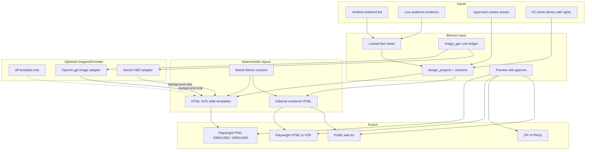
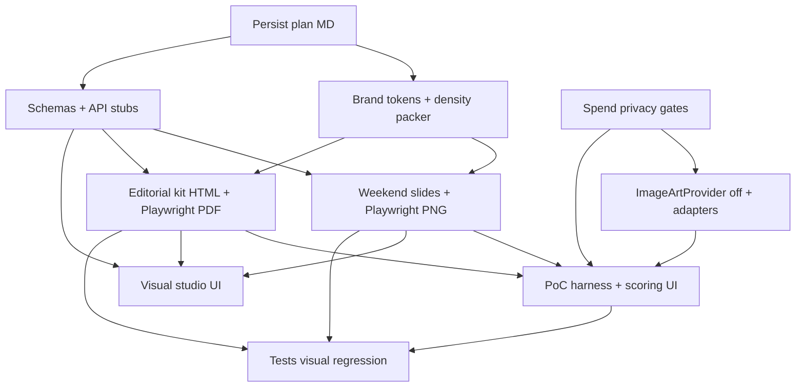

# Benson Visual Production Implementation Plan — 2026-09-06

**Status:** Approved plan (documentation only). No implementation, billable image calls, deploy, commit, push, Telegram, or email until Elliott explicitly authorizes the next phase.

**Architecture locks (defaults):**

- Carousel PNG/Story export = Playwright screenshot of deterministic HTML/SVG slides (Playwright already in repo via [`services/core/src/playwright-runtime/`](services/core/src/playwright-runtime/index.ts)).
- New media-kit PDF = Playwright HTML→PDF from the same editorial HTML as web (selectable text + links). Hand-rolled [`media-kit/pdf.ts`](services/core/src/media-kit/pdf.ts) remains for historically pinned versions only.
- Provider choice deferred until four-arm PoC scoring; adapters for both OpenAI and Gemini ship behind one interface with capability discovery.
- Reference PNGs: place Weekend Drop benchmarks at `docs/ops/references/weekend-drop-2026-09/` before brand-token finalization (not currently in repo; Hotel baseline is [`docs/ops/screenshots/asset-closeout-review-2026-09-04-hotel-web-v9.png`](docs/ops/screenshots/asset-closeout-review-2026-09-04-hotel-web-v9.png)).

---

## 1. Current-state confirmation

From [`BENSON_VISUAL_GENERATION_PIPELINE_AUDIT_2026-09-06.md`](BENSON_VISUAL_GENERATION_PIPELINE_AUDIT_2026-09-06.md) and code:

| Product | Today | Gap |
|---|---|---|
| Media kits | Deterministic HTML + hand-rolled Helvetica PDF; live TikTok stats; assigned photos | Looks like a credibility DB; prints role `other`; thrift fallback on hotel kits |
| Weekend Drop | Plain-text `formatFlyerBrief` + ChatGPT handoff ([`weekend-list-panel.tsx`](dashboard/app/weekend-list/weekend-list-panel.tsx) L144–146) | No slides, no brand system, no export |
| OpenAI | Text/vision/search/whisper only — **zero** Images API calls | No art provider for Kellie |
| Image gen | [`providers/image.ts`](services/core/src/providers/image.ts) Imagen/mock — **persona-picker only** | Must not be reused for Kellie |
| Safety already shipping | Creator-asset public-use gate, immutable `media_kit_versions`, pitch hash pins, send-safety | Must remain intact |

**Unacceptable baseline (Hotel kit):** maroon/cream, metric cards, caption “other”, thrift “Recent work”, no cover/hero, no partnership concept.

**Quality benchmark (Weekend Drop refs):** navy/yellow/teal, bold KC photography, recurring series ID, cover + daily slides, readable facts, “Every Thursday, I’m putting you on”, KCKellie personality—not Benson branding.

---

## 2. Proposed architecture



**Invariant:** factual text is never authoritative inside generated pixels. Background art is a layer under composited HTML/SVG text. Kellie’s portrait is a real approved asset overlay—not regenerated by default.

---

## 3. Component / file ownership map

| Area | New / primary ownership |
|---|---|
| Brand tokens + themes | `services/core/src/visual-production/brand/` + `themes/kckellie-weekend-drop.v1.json` |
| Fact sheet + density packer | `services/core/src/visual-production/facts/` |
| Slide layout HTML/SVG | `services/core/src/visual-production/slides/` |
| Editorial media-kit HTML | Replace visual layer of [`media-kit/render.ts`](services/core/src/media-kit/render.ts); keep [`build.ts`](services/core/src/media-kit/build.ts) evidence rules rewritten |
| Playwright export | `services/core/src/visual-production/export/` (reuses `playwright-runtime`) |
| ImageArtProvider | `services/core/src/visual-production/image-art/` — **new**; do **not** extend persona-picker |
| Spend / kill switch | Extend [`llm-spend`](services/core/src/llm-spend/index.ts) + `image_generation_attempts` table |
| API | `services/api/src/routes/visual-production.ts` |
| Visual studio UI | `dashboard/app/visual-studio/` (patterns from email approvals + creator-assets) |
| Weekend entry | Extend weekend-list panel: “Open in Visual Studio” beside “Copy flyer brief” |
| PoC harness | `services/core/src/scripts/visual-production-poc.ts` + `dashboard/app/visual-studio/poc/` |
| Tests | `services/core/src/visual-production/**/*.test.ts` + Playwright visual fixtures |

Preserve: [`creator-assets`](services/core/src/creator-assets/), [`media-kit/versions.ts`](services/core/src/media-kit/versions.ts) immutability, outreach pin fields, `assertApprovedForSend`.

---

## 4. Workstream A — Brand / design system

Extract reusable **KCKellie** language (not Benson studio purple/pink from [`globals.css`](dashboard/app/globals.css)):

| Token group | Direction from Weekend Drop benchmark |
|---|---|
| Color | Navy base, yellow highlight, teal accent; cream/paper secondary; high contrast body |
| Type | Display + tight sans for titles; readable body ≥28–32px at 1080 width; monospace only for times if needed |
| Grid | Full-bleed photo or color field; safe margins ≥64px; text band vs photo band |
| Density | Max events per info slide by character budget (e.g. 3–4 short / 2 long); overflow → new slide |
| Photo treatment | Bold KC imagery, slight vignette/grade; never sparkle stickers |
| Series ID | “Weekend Drop” wordmark + week range; tagline “Every Thursday, I’m putting you on” |
| CTA | Closing slide only; one clear next step |
| Cover vs info | Cover = identity + week promise; info = scannable facts |
| Variation | Seeded weekly rotation of 3–5 layout presets (photo-left / photo-full / color-block) — same system, not identical clones |

**Avoid “every AI flyer”:** no purple gradients, sparkles, scribble arrows, rounded-card stacks, giant face as the only idea, wallpaper decorations, walls of copy, or text-swap clones.

Public surfaces feature **KCKellie**. Benson appears only in operator studio chrome.

---

## 5. Workstream B — Weekend Drop production

```mermaid
flowchart LR
  Select[Selected verified events] --> Sheet[Lock fact sheet]
  Sheet --> Group[Editorial day grouping]
  Group --> Pack[Density packer slides]
  Pack --> Compose[Compose project version]
  Compose --> Preview[Visual studio preview]
  Preview --> Edit[Edit reorder remove swap]
  Edit --> Validate[Validate facts hash]
  Validate --> Approve[Kellie approve]
  Approve --> Export[PNG Story ZIP]
```



**Outputs:** 1080×1350 carousel; 1080×1920 Story adaptation; cover; N daily slides by density; optional CTA; per-slide PNG + ZIP; editable project/version retained.

**Imagery policy (ordered):**

1. Approved real event/venue photo with rights metadata
2. Approved KC library asset
3. Generated abstract/editorial background (labeled non-documentary)
4. Honest solid/brand-field fallback

Never imply Kellie attended; never present generated art as documentary photography.

Keep `formatFlyerBrief` forever as operator fallback.

---

## 6. Workstream C — Media kits that sell

Replace credibility-DB layout with editorial partnership document:

1. Strong cover/hero (composited approved portrait + brand field — not raw `other`)
2. KCKellie positioning for this variant
3. Creator story relevant to the business type
4. Verified audience evidence (same honesty rules; better presentation)
5. **Relevant** work only — clickable links + optional QR; thumbnails when available
6. Proposed business-specific content concept (deterministic template slots + optional LLM **copy** into structured fields, never invented metrics)
7. Deliverables
8. Compensation / usage-rights status
9. Contact / next step

**Evidence rule change (breaking current behavior):** delete thrift/top-views fallback for hotel (and peer) kits. If `<2` on-topic evidenced examples → kit status `needs_evidence_review` (internal); **do not** publish weak examples. Operator/Kellie must supply relevant posts or hold.

**Role labels:** map enums to human strings; never print `other` (use Alt/caption or omit).

**PDF:** Playwright from same HTML; historical pinned Helvetica PDFs unchanged.

---

## 7. Workstream D — ImageArtProvider

```ts
// Conceptual contract — services/core/src/visual-production/image-art/types.ts
type ImageArtKind = 'background' | 'texture' | 'editorial_illustration';
interface ImageArtRequest {
  kind: ImageArtKind;
  aspectRatio: '4:5' | '9:16' | '16:9';
  brandThemeId: string;
  styleReferenceAssetIds?: string[]; // local paths; upload only with consent
  promptVersion: string;
  negativeConstraints: string[]; // no faces, no readable event text, no fake venues
  maxAttempts: number; // PoC: 2
}
interface ImageArtProvider {
  id: 'off' | 'openai' | 'gemini';
  capabilities(): Promise<{ available: boolean; reason?: string; model?: string }>;
  generateBackground(req: ImageArtRequest): Promise<ImageArtResult>;
}
```

- `OffImageArtProvider` always available.
- OpenAI adapter: Images API (`gpt-image-2` or configured model) — backgrounds only.
- Gemini adapter: `gemini-3.1-flash-image` (Nano Banana 2).
- Capability detection: key present + probe/flag; unavailable arms report honestly in PoC UI.
- No automatic paid failover between providers.
- Isolation: persona-picker `createImageProvider()` untouched.

**Forbidden:** regenerate Kellie face by default; invent venue scenes as documentary; bake event names/times/prices into pixels as source of truth.

---

## 8. Workstream E — Controlled PoC

**Identical locked facts** → four arms:

1. Existing Benson control (current kit HTML + flyer text)
2. New deterministic template, no AI art
3. Template + OpenAI background
4. Template + Gemini/NB2 background

**Artifacts per arm (where capable):** Weekend Drop cover; one daily slide; Hotel kit cover/page.

**Config:** `BENSON_IMAGE_GEN_ENABLED=false` until PoC run authorized; PoC script sets explicit one-shot enable + `$2` hard cap; max 2 attempts/provider/design; Kellie portrait composited **locally only** (no upload); style refs from `docs/ops/references/weekend-drop-2026-09/`.

**Review:** side-by-side at 390px + 1080 preview in `/visual-studio/poc`; keep/reject; delete rejected generated blobs; no publish/pitch/send.

**Rubric (1–5):** phone attention, KCKellie identity, KC specificity, typography, factual accuracy, likeness, multi-slide consistency, editability, kit selling power, reproducibility.

---

## 9. Workstream F — Editing and approval (Visual Studio)

Phone-friendly studio (`/visual-studio`):

- Preview every slide/page at phone size
- Structured field edits (facts), not freeform pixel text
- Reorder/remove events; density re-pack
- Swap approved images
- Regenerate background without changing locked facts
- Choose layout variation
- Compare versions
- Approve exports / revoke archive
- Show cost + provider status

Gates: no public kit URL update, pitch attach, or send without `approved` project version.

Reuse UX patterns from [`email-approvals-panel.tsx`](dashboard/app/email/approvals/email-approvals-panel.tsx) and [`creator-assets-panel.tsx`](dashboard/app/creator-assets/creator-assets-panel.tsx).

---

## 10. Workstream G — Data model and migrations

New migration (e.g. `90_visual_production.sql`):

| Table | Purpose |
|---|---|
| `brand_themes` | token JSON, version, series id |
| `design_projects` | kind: `weekend_drop` \| `media_kit`; variant; status |
| `design_versions` | immutable snapshot; `facts_hash`; `art_hash`; content hash; reuse if identical |
| `design_pages` | slide/page specs: role cover/day/cta/kit_section; sort; layout preset |
| `design_fact_snapshots` | verified facts + verification timestamps |
| `design_asset_links` | asset id, role, rights, documentary vs generated |
| `image_generation_attempts` | provider, model, prompt_version, cost, status, source assets |
| `design_exports` | PNG/PDF/ZIP paths, dimensions, created_at |
| `design_approvals` | approved/revoked by, timestamps |

**Rules:** factual edit → new version if `facts_hash` changes; may reuse prior `art_hash`. Art regen → new art attempt; facts unchanged. Identical save → no new version.

Media-kit pitch pins continue to use `approved_media_kit_version_id` + content hash; new editorial kits still mint `media_kit_versions` rows (snapshot includes design_version id).

---

## 11. API contracts (sketch)

```
POST   /api/visual/projects                    create from weekend-list | kit variant
GET    /api/visual/projects/:id
POST   /api/visual/projects/:id/versions       persist edits (hash short-circuit)
POST   /api/visual/projects/:id/pack           density pack slides
POST   /api/visual/projects/:id/art            generate background (gated)
POST   /api/visual/projects/:id/export         PNG/PDF/ZIP
POST   /api/visual/projects/:id/approve
POST   /api/visual/projects/:id/revoke
GET    /api/visual/poc/arms                    capability + artifacts
POST   /api/visual/poc/run                     operator-only, capped
GET    /api/calendar/weekend-list              unchanged (+ optional projectId link)
```

All mutating routes refuse when feature flag off (except read-only template preview if desired).

---

## 12. Cost, privacy, safety

| Control | Spec |
|---|---|
| `BENSON_IMAGE_GEN_ENABLED` | default **false** |
| `BENSON_IMAGE_GEN_PROVIDER` | `off` \| `openai` \| `gemini` |
| `BENSON_IMAGE_GEN_MODEL` | provider-specific |
| `BENSON_IMAGE_GEN_DAILY_CAP_USD` | separate from `BENSON_LLM_DAILY_BUDGET_USD` |
| Per-project attempt cap | e.g. 4 backgrounds |
| Kill switch | enabled=false → Off provider only |
| Failover | **none** automatic paid |
| Consent | explicit flag before any Kellie private asset leaves the host |
| EXIF | continue sharp strip on public derivatives |
| Retention | rejected PoC art deleted; approved art retained with provenance |
| Secrets | env names only in logs; never values |

---

## 13. Test and verification strategy

- Golden facts: export OCR/text extract == locked fact sheet
- Assert no `image_generation_attempts` text fields written into fact snapshots
- Unapproved assets 403 on export compose
- Provider-disabled → template-only success
- Cap: 3rd attempt fails closed
- Idempotent retries (same attempt key)
- Density: 7 events → ≥3 info slides in fixture
- Web HTML vs PDF text parity snapshot
- No internal enums in HTML/PDF (`other`, `proof_still` raw, etc.)
- Pitch-pinned kit version immutable after approve
- Tests never send email/Telegram/publish
- Visual regression: Playwright screenshots at 390 and 1080 vs fixtures; human review checklist in PoC UI

---

## 14. Migration and rollout

1. **Isolated PoC** — flags off; script + poc UI; `$2` cap
2. **Elliott/Kellie visual selection** — pick template ± provider from rubric
3. **Weekend Drop beta** — Thursday pipeline; flyer brief remains
4. **Media-kit beta** — evidence-hold rule; new HTML/PDF; old pins intact
5. **Optional provider expansion** — enable second provider after scoring
6. **Production activation** — `BENSON_IMAGE_GEN_ENABLED` only after beta accept

**Rollback:** flag off → template-only or legacy kit renderer; revoke design approval; flyer brief + existing kit versions continue.

---

## 15. Workstream dependencies and Multitask Auto division



| Agent lane | Owns | Must not touch |
|---|---|---|
| Lane 1 Foundation | schemas, env flags, spend ledger, ImageArtProvider stubs | UI, prompts that spend |
| Lane 2 Weekend | brand tokens, slide HTML, packer, PNG export | media-kit evidence rules |
| Lane 3 Kits | evidence hold, editorial HTML, PDF export, role labels | persona-picker |
| Lane 4 Studio + PoC | visual-studio UI, poc compare, approval gates | live send / Telegram |
| Lane 5 Verify | tests, visual fixtures, rollback docs | production flags |

Integrate on one branch; Lane 5 runs after merge of 2–4.

---

## 16. Exact implementation sequence

1. Write plan MD to repo root
2. Migration `90_visual_production` + Drizzle types
3. Env flags (all default safe) + cost ledger source `image_art`
4. Brand theme v1 JSON from references
5. Fact sheet + density packer from weekend list
6. Slide HTML templates + Playwright PNG/Story
7. `OffImageArtProvider` + capability report
8. OpenAI + Gemini adapters (dead until enabled)
9. Editorial kit HTML + evidence-hold + Playwright PDF
10. Visual studio MVP (preview/edit/approve)
11. PoC harness four arms + scoring UI
12. Tests + visual fixtures
13. Elliott authorizes PoC spend → run compare → keep/reject
14. Weekend beta → kit beta → production flag

---

## 17. Acceptance criteria

- [ ] Weekend Drop export matches locked facts exactly; readable at phone size
- [ ] Cover + daily slides + optional CTA; ZIP download; project version preserved
- [ ] Template-only mode works with image gen off/failed/capped
- [ ] Hotel kit has no `other`, no thrift fallback; weak evidence holds for review
- [ ] Web and PDF kit visually aligned; text selectable; links work in PDF where permitted
- [ ] Portrait composited from approved asset; not provider-regenerated by default
- [ ] Both providers supportable; unavailable provider reported, not silently charged
- [ ] PoC completed with rubric and no production publish
- [ ] Pitch/send safety and historical kit pins unchanged
- [ ] Flyer brief still available

---

## 18. Open questions (Elliott / Kellie)

1. Place the five Weekend Drop reference PNGs into `docs/ops/references/weekend-drop-2026-09/` (or confirm path) before brand-token lock.
2. Kellie: confirm tagline lock-in for series (“Every Thursday, I’m putting you on”) vs rotatable seasonal lines.
3. Kellie: compensation/usage-rights fields for kits—what may appear publicly vs operator-only.
4. Elliott: authorize PoC spend cap (plan default **$2**) and whether Gemini key will be provisioned before arm 4.
5. Who is approver of record for Visual Studio—Kellie only, or Elliott operator override for PoC?

*(Provider winner is intentionally not asked until PoC scoring.)*

---

## 19. Risks and unknowns

- Weekend Drop reference binaries not yet in repo — token extraction may need a short revision pass after files land
- OpenAI org verification / Gemini key may leave arms 3–4 unavailable
- Playwright PDF fidelity on host memory-constrained “mappy” — may need export worker queue
- Density heuristics will need Kellie tuning after first real Thursday
- LLM-written “partnership concept” copy must stay in structured fields with hallucination guards (reuse pitch write temperature discipline)

---

## 20. Estimated scope by phase (not calendar promises)

| Phase | Relative size | Outcome |
|---|---|---|
| 0 Plan persist | XS | MD in repo |
| 1 Foundation (schema/flags/provider stubs) | M | Safe skeleton |
| 2 Weekend template + PNG | L | Usable template-only carousel |
| 3 Kit editorial + PDF | L | Sellable kit without AI art |
| 4 Studio + approval | M | Phone edit/approve |
| 5 PoC + scoring | M | Provider decision evidence |
| 6 Beta harden + tests | M | Production-ready flags still off |
| 7 Production activation | S | Flag on after accept |

---

## 21. Explicit non-goals (this program)

- Flattening kits or factual slides into one generated image
- Replacing ChatGPT handoff before template ships
- Reusing persona-picker faces for Kellie
- Auto-spending failover across providers
- Deploy/Telegram during PoC
