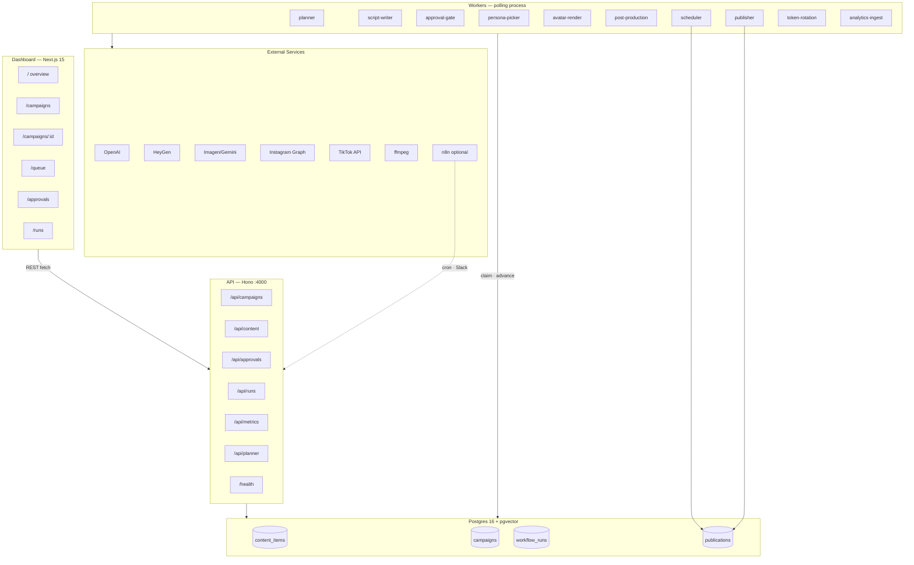
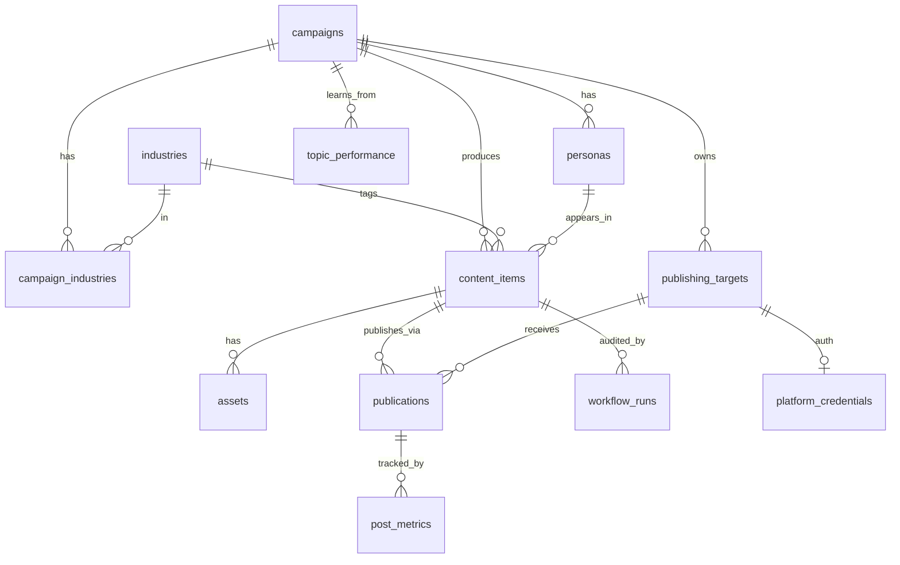

# Dependency Map: social-agent

**Audit date:** 2026-05-31  
**Purpose:** Complete dependency map for transformation planning (social-agent → Kellie Assistant)  
**Constraint:** Documentation only — no code changes

---

## System Overview



---

## 1. Frontend Pages and Routes

### Route map

| Route | File | Render | API dependencies |
|---|---|---|---|
| `/` | `dashboard/app/page.tsx` | Server | `GET /api/campaigns`, `GET /api/metrics/overview` |
| `/campaigns` | `dashboard/app/campaigns/page.tsx` | Server | `GET /api/campaigns` |
| `/campaigns/[id]` | `dashboard/app/campaigns/[id]/page.tsx` | Server | `GET /api/campaigns/:id` |
| `/queue` | `dashboard/app/queue/page.tsx` | Server | `GET /api/content?state=&limit=` |
| `/approvals` | `dashboard/app/approvals/page.tsx` | Server | `GET /api/approvals` |
| `/runs` | `dashboard/app/runs/page.tsx` | Server | `GET /api/runs?limit=` |

### Layout and shared infrastructure

| File | Role | Depends on |
|---|---|---|
| `dashboard/app/layout.tsx` | Root layout, nav, metadata | — |
| `dashboard/app/globals.css` | Design tokens, typography | — |
| `dashboard/lib/api.ts` | Typed `get` / `post` / `patch` helpers | `NEXT_PUBLIC_API_URL` |
| `dashboard/next.config.mjs` | API rewrite proxy (`/api/*` → Hono) | `NEXT_PUBLIC_API_URL` |
| `dashboard/tailwind.config.ts` | Tailwind theme | — |
| `dashboard/postcss.config.mjs` | PostCSS pipeline | — |

### Client components (mutations)

| Component | File | API call |
|---|---|---|
| `AutonomyToggle` | `dashboard/app/campaigns/[id]/autonomy-toggle.tsx` | `PATCH /api/campaigns/:id` |
| `PlannerButton` | `dashboard/app/campaigns/[id]/planner-button.tsx` | `POST /api/planner/run?campaignId=` |
| `ApprovalCard` | `dashboard/app/approvals/approval-card.tsx` | `POST /api/approvals/:id/approve`, `POST /api/approvals/:id/reject` |

### Shared UI components

| Component | File | Used by |
|---|---|---|
| `StatePill` | `dashboard/components/state-pill.tsx` | `/`, `/queue`, `/campaigns/[id]` |
| `PlatformIcon` | `dashboard/components/icons.tsx` | `/`, `/campaigns/[id]` |

### Frontend dependency graph

```
layout.tsx
├── globals.css
├── page.tsx ──────────────► lib/api.ts ──► Hono API :4000
├── campaigns/page.tsx ────► lib/api.ts
├── campaigns/[id]/
│   ├── page.tsx ──────────► lib/api.ts
│   ├── autonomy-toggle.tsx ► PATCH /api/campaigns/:id
│   └── planner-button.tsx ► POST /api/planner/run
├── queue/page.tsx ────────► lib/api.ts, StatePill
├── approvals/
│   ├── page.tsx ──────────► lib/api.ts
│   └── approval-card.tsx ► POST /api/approvals/*
└── runs/page.tsx ─────────► lib/api.ts
```

**Note:** The dashboard has no direct database access. All data flows through the Hono API (or rewrite proxy).

---

## 2. API Endpoints

Base URL: `http://localhost:4000` (configurable via `API_PORT`)

### Route registry

Defined in `services/api/src/server.ts`:

| Method | Path | Handler file | DB tables | Core modules |
|---|---|---|---|---|
| `GET` | `/health` | `server.ts` | — | — |
| `GET` | `/api/campaigns` | `routes/campaigns.ts` | `campaigns` | — |
| `GET` | `/api/campaigns/:id` | `routes/campaigns.ts` | `campaigns`, `campaign_industries`, `industries`, `content_items` | — |
| `PATCH` | `/api/campaigns/:id` | `routes/campaigns.ts` | `campaigns` | — |
| `GET` | `/api/content` | `routes/content.ts` | `content_items`, `industries`, `personas` | — |
| `GET` | `/api/content/:id` | `routes/content.ts` | `content_items`, `publications`, `publishing_targets` | — |
| `POST` | `/api/content/:id/transition` | `routes/content.ts` | `content_items` | — |
| `GET` | `/api/content/_meta/counts` | `routes/content.ts` | `content_items` | — |
| `GET` | `/api/approvals` | `routes/approvals.ts` | `content_items`, `campaigns`, `industries`, `personas` | — |
| `POST` | `/api/approvals/:id/approve` | `routes/approvals.ts` | `content_items` | — |
| `POST` | `/api/approvals/:id/reject` | `routes/approvals.ts` | `content_items` | — |
| `GET` | `/api/runs` | `routes/runs.ts` | `workflow_runs` | — |
| `GET` | `/api/metrics/overview` | `routes/metrics.ts` | `content_items`, `publications`, `publishing_targets` | — |
| `POST` | `/api/planner/run` | `routes/planner.ts` | `content_items`, `campaigns`, … | `@social-agent/core/planner` |

### API dependency stack

```
@social-agent/api
├── hono + @hono/node-server
├── zod (request validation)
└── @social-agent/core
    ├── db.ts ──► postgres driver
    ├── schema.ts
    ├── planner/ (planner route only)
    └── env.ts
```

### Who calls the API

| Consumer | Endpoints used |
|---|---|
| Dashboard (server components) | campaigns, content, approvals, runs, metrics |
| Dashboard (client components) | campaigns PATCH, planner POST, approvals POST |
| n8n workflows | `POST /api/planner/run` |
| External (none built-in) | — |

Workers **do not** call the API — they import `@social-agent/core` directly.

---

## 3. Worker Processes

All workers boot from `services/workers/src/main.ts` in a single Node process.

### Worker registry

| Worker name | Type | File | Input trigger | Reads | Writes | External deps |
|---|---|---|---|---|---|---|
| `planner` | Cron (1h) | `workflows/planner.ts` | Timer | `campaigns`, `campaign_industries`, `industries`, `topic_performance`, `content_items` | `content_items` (state=`planned`) | — |
| `script-writer` | Poll | `workflows/script-writer.ts` | state=`planned` | `campaigns`, `industries`, `content_items` | `content_items` → `script_drafted` | OpenAI (LLM + embed) |
| `approval-gate` | Cron (5s) | `workflows/approval-gate.ts` | state=`script_drafted` + autonomy=`auto` | `campaigns`, `content_items` | `content_items` → `script_approved` | — |
| `persona-picker` | Poll | `workflows/persona-picker.ts` | state=`script_approved` | `campaigns`, `personas`, `industries` | `content_items`, `personas`, `assets` → `assets_ready` | Imagen/Gemini |
| `avatar-render-start` | Poll | `workflows/avatar-render.ts` | state=`assets_ready` | `campaigns`, `personas`, `content_items` | `content_items` → `video_generating` | HeyGen |
| `avatar-render-poll` | Cron (5s) | `workflows/avatar-render.ts` | state=`video_generating` | `content_items` | `content_items` → `video_ready`, `assets` | HeyGen |
| `post-production` | Poll | `workflows/post-production.ts` | state=`video_ready` | `campaigns`, `industries`, `content_items` | `content_items` → `ready_to_publish`, `assets` | OpenAI, ffmpeg |
| `scheduler` | Poll | `workflows/scheduler.ts` | state=`ready_to_publish` | `campaigns`, `publishing_targets`, `content_items` | `content_items` → `scheduled`, `publications` | — |
| `publisher` | Cron (5s) | `workflows/publisher.ts` | `publications.status=queued` due | `content_items`, `publications`, `publishing_targets` | `publications`, `content_items` → `published` | Instagram, TikTok |
| `token-rotation` | Cron (1h) | `workflows/token-rotation.ts` | Expiring credentials | `platform_credentials`, `publishing_targets` | `platform_credentials` | IG/TikTok OAuth |
| `analytics-ingest` | Cron (30m) | `workflows/analytics-ingest.ts` | Published posts due snapshots | `publications`, `publishing_targets`, `post_metrics`, `topic_performance` | `post_metrics`, `topic_performance` | IG Insights, TikTok Display |

### Worker runtime (shared infrastructure)

`services/workers/src/runtime.ts` provides:

- **`createWorker`** — state-bound poller with `FOR UPDATE SKIP LOCKED`, retry (max 5), `workflow_runs` audit insert
- **`createCronWorker`** — interval-based runner (no state claim)

Every poll worker depends on:

```
runtime.ts
└── @social-agent/core
    ├── db.ts
    ├── schema.ts (contentItems, workflowRuns)
    └── env.ts (WORKER_POLL_INTERVAL_MS, WORKER_BATCH_SIZE)
```

### Pipeline state flow (worker chain)

```
planner ──► script-writer ──► approval-gate ──► persona-picker
                                                    │
                                                    ▼
              published ◄── publisher ◄── scheduler ◄── post-production
                              ▲              ▲              ▲
                              │              │              │
                         (publications    scheduled    ready_to_publish
                          queue)              ▲              ▲
                                              │              │
                                         avatar-render ──► video_ready
                                              ▲
                                         assets_ready
```

### Auxiliary processes (not in main worker loop)

| Process | File | Purpose |
|---|---|---|
| `pnpm demo` | `services/workers/src/demo.ts` | Flips campaign to auto mode, triggers planner for screencast |
| n8n container | `docker-compose.yml` | Optional cron/Slack; calls API, does not run workers |

---

## 4. Queue Architecture

**There is no message broker** (no Redis, RabbitMQ, SQS). Queuing is implemented as **Postgres-backed state machines** with worker polling.

### Primary queue: `content_items.state`

| Property | Value |
|---|---|
| **Queue identity** | Row state in `content_items` |
| **Claim mechanism** | `SELECT … FOR UPDATE SKIP LOCKED` (via Drizzle) |
| **Concurrency** | Horizontal — multiple worker processes claim different rows |
| **Retry** | `retry_count` incremented; state unchanged until max 5 → `failed` |
| **Audit** | Every transition logged in `workflow_runs` |
| **Dead letter** | `failed` state (terminal) |

### Secondary queue: `publications`

| Property | Value |
|---|---|
| **Queue identity** | Rows in `publications` with `status = 'queued'` |
| **Claim mechanism** | Raw SQL `FOR UPDATE SKIP LOCKED` in publisher worker |
| **Scheduling** | `scheduled_for` timestamp; publisher picks due rows |
| **Fan-out** | Scheduler creates one publication row per publishing target |

### Planner as producer

The planner cron **produces** new `content_items` rows in `planned` state. It is idempotent — skips slots already planned for the current week.

### Approval as human queue

Items in `script_drafted` with `autonomy_mode != 'auto'` sit in a **human queue** surfaced by:

- Dashboard `/approvals` (primary)
- n8n Slack workflow (optional notification)

### Queue architecture diagram

```
┌─────────────────────────────────────────────────────────────┐
│                    POSTGRES (single source of truth)         │
├─────────────────────────────────────────────────────────────┤
│  content_items                    publications               │
│  ┌─────────────────────┐         ┌─────────────────────┐      │
│  │ state = 'planned'   │         │ status = 'queued'   │      │
│  │ state = 'script_…' │         │ scheduled_for ≤ now │      │
│  │ …                   │         └──────────┬──────────┘      │
│  └──────────┬──────────┘                    │                 │
│             │ FOR UPDATE SKIP LOCKED        │ FOR UPDATE …    │
└─────────────┼───────────────────────────────┼─────────────────┘
              │                               │
              ▼                               ▼
     ┌────────────────┐              ┌────────────────┐
     │ Poll workers   │              │ publisher cron │
     │ (runtime.ts)   │              │ (5s interval)  │
     └────────────────┘              └────────────────┘
              │                               │
              ▼                               ▼
     workflow_runs audit              content_items → published
```

### Index support

| Index | Table | Purpose |
|---|---|---|
| `idx_content_state_active` | `content_items` | Fast worker polling by state |
| `idx_content_embedding` | `content_items` | pgvector dedup similarity |
| `idx_publications_due` | `publications` | Due publish job lookup |
| `idx_runs_started` | `workflow_runs` | Audit log queries |

---

## 5. Database Schema

### Init script order

```
db/init/
├── 00_extensions.sql      # uuid-ossp, citext, vector
├── 01_create_n8n_db.sql   # Separate n8n database
├── 02_schema.sql          # Core application schema + seed industries
├── 03_token_rotation.sql  # platform_credentials
├── 04_multi_account.sql   # route_strategy, target weights
└── 05_analytics.sql       # post_metrics, topic_performance
```

### Entity relationship (simplified)



### Tables by domain

| Domain | Tables | Drizzle source |
|---|---|---|
| **Reference** | `industries` | `schema.ts` |
| **Campaign config** | `campaigns`, `campaign_industries` | `schema.ts` |
| **Characters** | `personas` | `schema.ts` |
| **Pipeline** | `content_items`, `assets`, `workflow_runs` | `schema.ts` |
| **Publishing** | `publishing_targets`, `publications`, `platform_credentials` | `schema.ts` + `03_token_rotation.sql` |
| **Analytics** | `post_metrics`, `topic_performance` | `schema.ts` + `05_analytics.sql` |
| **n8n (separate DB)** | n8n internal tables | Not in Drizzle |

### Key enums

| Enum | Values | Used by |
|---|---|---|
| `content_type` | testimonial, case_study, explainer, … (8) | `content_items`, `topic_performance` |
| `content_state` | planned → published (+ failed, cancelled) | `content_items`, `workflow_runs` |
| `platform` | instagram, tiktok, youtube_shorts, linkedin | `publishing_targets` |
| `autonomy_mode` | manual, hitl, auto | `campaigns` |
| `route_strategy` | all, round_robin, weighted | `campaigns` |
| `publication_status` | queued, publishing, published, failed, cancelled | `publications` |

### Schema consumers

| Consumer | Access pattern |
|---|---|
| `@social-agent/core` | Drizzle ORM (primary) |
| Workers | Drizzle + raw SQL (dedup, publisher claim, approval-gate) |
| API | Drizzle + raw SQL (metrics, state counts) |
| n8n | Direct Postgres connection to app DB (env vars in compose) |
| Dashboard | None (via API only) |

---

## 6. External Integrations

### Infrastructure services

| Service | Config | Used by | Required |
|---|---|---|---|
| **PostgreSQL 16 + pgvector** | `DATABASE_URL`, `docker-compose.yml` | core, api, workers, n8n | Yes |
| **n8n** | `N8N_*` env vars, port 5678 | Optional cron/Slack | No |
| **ffmpeg** | System PATH | `post-production/index.ts` | Only when `DEMO_MODE=false` |
| **Local asset cache** | `services/core/tmp/assets/` | post-production | Optional |

### Third-party APIs

| Integration | Env vars | Provider module | Worker(s) | Demo fallback |
|---|---|---|---|---|
| **OpenAI** | `OPENAI_API_KEY` | `providers/llm.ts` | script-writer, post-production | `MockLlm` |
| **Google Imagen/Gemini** | `GOOGLE_AI_API_KEY` | `providers/image.ts` | persona-picker | `MockImage` |
| **HeyGen** | `HEYGEN_API_KEY` | `providers/heygen.ts` | avatar-render-start, avatar-render-poll | `MockAvatar` |
| **Pexels** | `PEXELS_API_KEY` | `providers/broll.ts` | *(not wired to pipeline)* | `MockBroll` |
| **Instagram Graph API** | `IG_PAGE_ACCESS_TOKEN`, `IG_BUSINESS_ACCOUNT_ID` | `providers/instagram.ts` | publisher, analytics, token-rotation | `MockInstagram` |
| **TikTok Content Posting API** | `TIKTOK_ACCESS_TOKEN`, `TIKTOK_OPEN_ID` | `providers/tiktok.ts` | publisher, analytics, token-rotation | `MockTikTok` |
| **Slack** | `SLACK_WEBHOOK_URL` | n8n workflow JSON | n8n only | — |

### Integration selection logic

All providers follow the same pattern in `services/core/src/providers/`:

```
if (env.DEMO_MODE || !API_KEY) → Mock* class
else → Real* class
```

Individual providers can be real while others remain mocked.

### Docker Compose service graph

```
docker-compose.yml
├── postgres (pgvector/pgvector:pg16)
│   ├── mounts db/init/*.sql
│   └── exposes :5432 (or POSTGRES_PORT)
└── n8n (n8nio/n8n:latest)
    ├── depends_on postgres
    ├── mounts n8n/workflows/
    └── exposes :5678
```

API, workers, and dashboard run **outside** Docker (local `pnpm dev:*`).

---

## 7. AI Provider Integrations

### Provider factory map

| Factory function | File | Interface | Capabilities |
|---|---|---|---|
| `createLlmProvider()` | `providers/llm.ts` | `LlmProvider` | Script gen, captions, embeddings |
| `createImageProvider()` | `providers/image.ts` | `ImageProvider` | Persona portrait generation |
| `createAvatarProvider()` | `providers/heygen.ts` | `AvatarProvider` | Avatar video render (start + poll) |
| `createInstagramProvider()` | `providers/instagram.ts` | `PublishProvider` | Reels publishing |
| `createTikTokProvider()` | `providers/tiktok.ts` | `PublishProvider` | Direct post / inbox upload |
| `createBrollProvider()` | `providers/broll.ts` | — | Stock video search *(unused in pipeline)* |

### LLM call sites

| Call | Model (real) | Prompt inputs | Output stored in |
|---|---|---|---|
| Script generation | `gpt-4o-mini` | type, industry, seeds, brand voice, recent topics, rejection reason | `content_items.topic/hook/script/cta` |
| Caption generation | `gpt-4o-mini` | script, hook, industry, type, language, CTA | `caption_instagram/tiktok`, `hashtags_*` |
| Topic embedding | `text-embedding-3-small` | topic string | `content_items.topic_embedding` |

### AI in non-provider modules

| Module | AI role |
|---|---|
| `script-writer.ts` | Orchestrates LLM + cosine dedup (threshold 0.85, 90-day window) |
| `persona-picker.ts` | Image gen for new personas |
| `avatar-render.ts` | HeyGen lip-sync video from script |
| `post-production/index.ts` | Script→SRT timing (rule-based, not LLM); ffmpeg burn |
| `planner/index.ts` | Reads `topic_performance` weights (no direct LLM) |
| `analytics/index.ts` | Fetches platform metrics (no LLM) |

### Type contracts

All provider interfaces defined in `services/core/src/providers/types.ts`.

---

## 8. Core Infrastructure vs Application-Specific Logic

### Core infrastructure (reusable patterns)

These modules implement **domain-agnostic** patterns suitable for any state-machine-driven assistant:

| Module | Path | Why it's infrastructure |
|---|---|---|
| Monorepo workspace | `pnpm-workspace.yaml`, `package.json`, `tsconfig.base.json` | Project scaffolding |
| DB connection | `services/core/src/db.ts` | Generic Drizzle + postgres setup |
| Environment config | `services/core/src/env.ts` | Zod-validated env (extend for Kellie keys) |
| Worker runtime | `services/workers/src/runtime.ts` | Generic poll/cron framework |
| Worker main/bootstrap | `services/workers/src/main.ts` | Process lifecycle (adapt registry) |
| API server shell | `services/api/src/server.ts` | Hono app wiring, CORS, error handler |
| Dashboard API client | `dashboard/lib/api.ts` | Generic fetch helpers |
| Dashboard layout shell | `dashboard/app/layout.tsx` | Nav + page structure pattern |
| Next.js config | `dashboard/next.config.mjs` | API proxy pattern |
| Docker Postgres | `docker-compose.yml` (postgres service) | Database infra |
| SQL extensions | `db/init/00_extensions.sql` | pgvector, citext |
| Audit log table | `workflow_runs` | Orchestration observability |
| Provider factory pattern | `providers/index.ts`, `providers/types.ts` | Mock/real abstraction |
| Mock/real LLM base | `providers/llm.ts` (pattern + embed) | AI integration template |

### Application-specific logic (social-agent domain)

These modules encode the **short-form video content agent** business rules:

| Module | Path | Domain coupling |
|---|---|---|
| Content state machine | `content_items` states, all workflow files | Video pipeline stages |
| Planner | `services/core/src/planner/` | Weekly video quotas, industry rotation |
| Script writer | `workflows/script-writer.ts` | Testimonial/case-study scripts |
| Persona picker | `workflows/persona-picker.ts` | HeyGen personas + portraits |
| Avatar render | `workflows/avatar-render.ts` | HeyGen video generation |
| Post-production | `post-production/`, `workflows/post-production.ts` | ffmpeg, 9:16 video, platform captions |
| Scheduler | `workflows/scheduler.ts` | IG/TikTok publication fan-out |
| Publisher | `workflows/publisher.ts` | Social platform posting |
| Token rotation | `token-rotation/`, `workflows/token-rotation.ts` | OAuth for IG/TikTok |
| Analytics | `analytics/`, `workflows/analytics-ingest.ts` | Post performance → planner bias |
| HeyGen provider | `providers/heygen.ts` | Avatar video |
| Image provider | `providers/image.ts` | Persona portraits |
| IG/TikTok providers | `providers/instagram.ts`, `providers/tiktok.ts` | Publishing |
| B-roll provider | `providers/broll.ts` | Stock video (unused) |
| Industries seed | `db/init/02_schema.sql` | Generic SMB verticals |
| Campaign quotas | `campaigns.weekly_*` columns | Video type quotas |
| Dashboard pages | All `app/*` pages | Video pipeline UI copy/states |
| n8n workflows | `n8n/workflows/*.json` | Social-agent-specific cron/Slack |
| Demo/seed | `scripts/seed.ts`, `demo.ts` | Demo Brand campaign |
| Portfolio artifacts | `portfolio-media/`, `docs/demo.tape`, render scripts | Portfolio presentation |

### Hybrid (infrastructure shape, application content)

| Module | Path | Notes |
|---|---|---|
| Drizzle schema | `services/core/src/schema.ts` | ORM pattern is core; table/column definitions are app-specific |
| SQL init scripts | `db/init/02–05` | Migration pattern is core; schema content is app-specific |
| API routes | `services/api/src/routes/*` | Hono route pattern is core; endpoints are app-specific |
| Approval gate | `workflows/approval-gate.ts` | HITL pattern is core; tied to `script_drafted` state |
| Approvals API + UI | `routes/approvals.ts`, `approvals/*` | HITL inbox pattern is core; script context is app-specific |
| LLM provider | `providers/llm.ts` | Factory + embed is core; script/caption prompts are app-specific |
| StatePill | `dashboard/components/state-pill.tsx` | Component is core; state enum values are app-specific |
| Metrics | `routes/metrics.ts` | Aggregation pattern is core; video/platform metrics are app-specific |

---

## File Survival Estimate for Kellie Assistant

Legend:

- **KEEP** — likely survives with minimal or no changes
- **MODIFY** — structural pattern kept; content/behavior rewritten for Kellie
- **REMOVE** — video/social/publishing-specific; no Kellie equivalent

### Root / monorepo

| File / directory | Verdict | Notes |
|---|---|---|
| `package.json` | MODIFY | Rename scripts, filters |
| `pnpm-workspace.yaml` | KEEP | |
| `pnpm-lock.yaml` | MODIFY | Regenerated on dep changes |
| `tsconfig.base.json` | KEEP | |
| `docker-compose.yml` | MODIFY | Keep postgres; n8n optional |
| `.env.example` | MODIFY | Kellie-specific env vars |
| `.gitignore` | KEEP | |
| `README.md` | MODIFY | Rewrite for Kellie |
| `ARCHITECTURE.md` | MODIFY | Rewrite for Kellie |
| `PROJECT_AUDIT.md` | KEEP | Reference doc |
| `CHANGELOG.md` | REMOVE | social-agent history |
| `DEPENDENCY_MAP.md` | KEEP | This document |

### Database (`db/init/`)

| File | Verdict | Notes |
|---|---|---|
| `00_extensions.sql` | KEEP | pgvector still useful for dedup |
| `01_create_n8n_db.sql` | MODIFY | Optional — keep if using n8n |
| `02_schema.sql` | MODIFY | Full schema redesign |
| `03_token_rotation.sql` | REMOVE | Unless Kellie publishes to social |
| `04_multi_account.sql` | REMOVE | Multi-account routing for IG/TikTok |
| `05_analytics.sql` | MODIFY | Adapt metrics for opportunity engagement |

### Core package (`services/core/`)

| File | Verdict | Notes |
|---|---|---|
| `src/db.ts` | KEEP | |
| `src/env.ts` | MODIFY | Add Kellie API keys, remove HeyGen/IG/TikTok |
| `src/schema.ts` | MODIFY | New tables/enums for opportunities |
| `src/index.ts` | MODIFY | Update exports |
| `src/planner/index.ts` | MODIFY | Opportunity digest vs video calendar |
| `src/providers/types.ts` | MODIFY | New interfaces (scoring, drafting) |
| `src/providers/index.ts` | MODIFY | New factory exports |
| `src/providers/llm.ts` | MODIFY | Keep factory + embed; new prompts |
| `src/providers/image.ts` | REMOVE | Persona portraits |
| `src/providers/heygen.ts` | REMOVE | Avatar video |
| `src/providers/instagram.ts` | REMOVE | Unless Kellie publishes |
| `src/providers/tiktok.ts` | REMOVE | Unless Kellie publishes |
| `src/providers/broll.ts` | REMOVE | Unused stock video |
| `src/post-production/index.ts` | REMOVE | ffmpeg video pipeline |
| `src/token-rotation/index.ts` | REMOVE | OAuth for social platforms |
| `src/analytics/index.ts` | MODIFY | Adapt for opportunity/content metrics |
| `src/scripts/seed.ts` | MODIFY | KC-specific demo data |
| `package.json` | MODIFY | Rename package |

### API package (`services/api/`)

| File | Verdict | Notes |
|---|---|---|
| `src/server.ts` | KEEP | Route registration changes only |
| `src/routes/campaigns.ts` | MODIFY | → clients/brands |
| `src/routes/content.ts` | MODIFY | → opportunities |
| `src/routes/approvals.ts` | MODIFY | Same HITL pattern |
| `src/routes/runs.ts` | KEEP | Audit log unchanged |
| `src/routes/metrics.ts` | MODIFY | Kellie KPIs |
| `src/routes/planner.ts` | MODIFY | → scanner/digest trigger |
| `package.json` | MODIFY | Rename package |

### Workers package (`services/workers/`)

| File | Verdict | Notes |
|---|---|---|
| `src/runtime.ts` | **KEEP** | Core infrastructure |
| `src/main.ts` | MODIFY | New worker registry |
| `src/workflows/planner.ts` | MODIFY | Cron trigger wrapper |
| `src/workflows/script-writer.ts` | MODIFY | → content drafter / scorer |
| `src/workflows/approval-gate.ts` | MODIFY | Same auto-approve pattern |
| `src/workflows/persona-picker.ts` | REMOVE | |
| `src/workflows/avatar-render.ts` | REMOVE | |
| `src/workflows/post-production.ts` | REMOVE | |
| `src/workflows/scheduler.ts` | MODIFY | Or REMOVE if no scheduling |
| `src/workflows/publisher.ts` | REMOVE | Unless Kellie auto-publishes |
| `src/workflows/token-rotation.ts` | REMOVE | |
| `src/workflows/analytics-ingest.ts` | MODIFY | Adapt metrics sources |
| `src/demo.ts` | MODIFY | Kellie demo flow |
| `package.json` | MODIFY | Rename package |

### Dashboard (`dashboard/`)

| File | Verdict | Notes |
|---|---|---|
| `app/layout.tsx` | MODIFY | Rebrand nav |
| `app/globals.css` | MODIFY | Kellie design system |
| `app/page.tsx` | MODIFY | Overview KPIs |
| `app/campaigns/page.tsx` | MODIFY | → clients or sources |
| `app/campaigns/[id]/page.tsx` | MODIFY | Client/source detail |
| `app/campaigns/[id]/autonomy-toggle.tsx` | KEEP | Same HITL control |
| `app/campaigns/[id]/planner-button.tsx` | MODIFY | → scan/digest trigger |
| `app/queue/page.tsx` | MODIFY | → opportunities queue |
| `app/approvals/page.tsx` | MODIFY | Same inbox pattern |
| `app/approvals/approval-card.tsx` | MODIFY | Opportunity context fields |
| `app/runs/page.tsx` | KEEP | Audit log |
| `components/state-pill.tsx` | MODIFY | New state enum values |
| `components/icons.tsx` | REMOVE | IG/TikTok icons unless needed |
| `lib/api.ts` | MODIFY | Updated types/endpoints |
| `next.config.mjs` | KEEP | |
| `tailwind.config.ts` | MODIFY | Theme tokens |
| `package.json` | MODIFY | Rename package |

### n8n (`n8n/`)

| File | Verdict | Notes |
|---|---|---|
| `README.md` | MODIFY | Kellie workflows |
| `workflows/01-planner-cron.json` | MODIFY | → opportunity scan cron |
| `workflows/02-approval-slack.json` | MODIFY | Same Slack HITL pattern |
| `workflows/03-publishing-monitor.json` | REMOVE | Publishing-specific |

### Documentation (`docs/`)

| File | Verdict | Notes |
|---|---|---|
| `state-machine.md` | MODIFY | Kellie opportunity states |
| `publishing-setup.md` | REMOVE | IG/TikTok setup |
| `heygen-setup.md` | REMOVE | HeyGen setup |
| `architecture.svg` | MODIFY | Regenerate |
| `demo.tape` | REMOVE | Portfolio screencast |
| `index.html` | REMOVE | Portfolio GitHub Pages |

### Scripts / portfolio (`scripts/`, `portfolio-media/`)

| File / directory | Verdict | Notes |
|---|---|---|
| `scripts/demo-watch.sh` | REMOVE | |
| `scripts/screenshot.mjs` | REMOVE | |
| `scripts/record-dashboard-tour.mjs` | REMOVE | |
| `scripts/render-portfolio-media.mjs` | REMOVE | |
| `scripts/render-case-study.mjs` | REMOVE | |
| `portfolio-media/` | REMOVE | Entire directory |

---

## Module Summary: KEEP / MODIFY / REMOVE

### By package

| Package / area | KEEP | MODIFY | REMOVE |
|---|---|---|---|
| **Monorepo root** | workspace config, gitignore | package.json, docker-compose, env, docs | CHANGELOG |
| **`services/core`** | db.ts | schema, env, planner, llm (pattern), analytics, seed, index | heygen, image, instagram, tiktok, broll, post-production, token-rotation |
| **`services/api`** | server.ts, runs route | all other routes | — |
| **`services/workers`** | **runtime.ts** | main, planner, script-writer, approval-gate, scheduler, analytics, demo | persona-picker, avatar-render, post-production, publisher, token-rotation |
| **`dashboard`** | layout pattern, runs page, autonomy-toggle, next.config | all pages, api.ts, state-pill, theme | icons (maybe) |
| **`db/init`** | 00_extensions | 01 (optional), 02, 05 | 03, 04 |
| **`n8n`** | — (optional) | README, planner-cron, approval-slack | publishing-monitor |
| **`docs`** | — | state-machine | publishing-setup, heygen-setup, demo.tape, index.html |
| **`scripts/` + `portfolio-media/`** | — | — | entire directories |

### Survival counts (approximate)

| Verdict | File count (approx.) | Share |
|---|---|---|
| **KEEP** | ~15 | ~15% |
| **MODIFY** | ~45 | ~45% |
| **REMOVE** | ~40 | ~40% |

The **highest-value survivors** for Kellie:

1. `services/workers/src/runtime.ts` — worker framework
2. `services/core/src/db.ts` + Drizzle setup pattern
3. `services/core/src/providers/llm.ts` — mock/real factory + embeddings
4. `services/api/src/server.ts` — API shell
5. `dashboard/lib/api.ts` + approval/HITL UI pattern
6. `workflow_runs` audit concept
7. Postgres-as-queue state machine architecture

The **largest removal block** is the video production chain (persona → HeyGen → ffmpeg → IG/TikTok), which accounts for roughly half the worker code and most external integrations.

---

## Cross-Reference: End-to-End Data Flow

```
Operator configures campaign (dashboard)
        │
        ▼
POST /api/planner/run  OR  planner cron worker
        │
        ▼
content_items (planned) ──► script-writer ──► script_drafted
        │                                          │
        │                              ┌───────────┴───────────┐
        │                              ▼                       ▼
        │                     dashboard /approvals      approval-gate (auto)
        │                              │                       │
        │                              ▼                       ▼
        │                        script_approved ◄─────────────┘
        │                              │
        │                              ▼
        │                     persona-picker → avatar-render → post-production
        │                              │
        │                              ▼
        │                     scheduler → publications queue → publisher
        │                              │
        ▼                              ▼
workflow_runs (audit)            published → analytics-ingest → topic_performance
                                        │
                                        └──► planner weight modifier (feedback loop)
```

---

*End of dependency map.*
