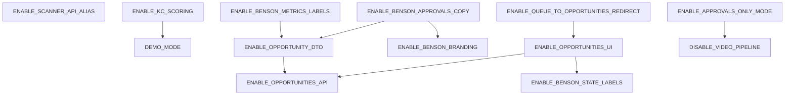

# Feature Flags — Benson Migration

**Date:** 2026-05-31  
**Purpose:** Toggle every Phase 1 (and planned Phase 2) Benson change independently — no code revert required  
**Related:** [TRANSFORMATION_PHASE_1.md](./TRANSFORMATION_PHASE_1.md) · [BOOTSTRAP_RESULTS.md](./BOOTSTRAP_RESULTS.md) · [KELLIE_TRANSFORMATION_PLAN.md](./KELLIE_TRANSFORMATION_PLAN.md)

**Constraint:** This document is planning only. Flags are not yet implemented in code.

---

## Goals

1. **Preserve legacy behavior by default** — all Benson flags default to `false`; inherited social-agent runs as bootstrapped.
2. **Granular control** — each migration step from [TRANSFORMATION_PHASE_1.md](./TRANSFORMATION_PHASE_1.md) maps to one or more flags.
3. **Instant rollback** — set flag(s) to `false` in `.env`, restart affected service(s); no git revert.
4. **Independent testing** — e.g. enable API aliases without dashboard branding, or disable video workers without enabling Benson UI.

---

## Conventions

### Naming

| Pattern | Meaning | Default when unset |
|---|---|---|
| `ENABLE_*` | Turns **on** a Benson or new behavior | `false` |
| `DISABLE_*` | Turns **off** an inherited behavior | `false` (inherited behavior stays **on**) |

### Environment variable locations

| Layer | Where defined | Read by |
|---|---|---|
| **Shared backend** | `.env` → `services/core/src/env.ts` | API, workers, seed |
| **Dashboard (server components)** | Same `.env` keys | Next.js server at request time |
| **Dashboard (client components)** | `NEXT_PUBLIC_*` mirror in `.env` | Browser — required for interactive UI toggles |

When a dashboard flag affects client components (e.g. approval card), add a `NEXT_PUBLIC_` mirror with the same semantic default. Server-only flags (e.g. worker registration) do **not** need a public mirror.

### Boolean parsing

All flags accept: `true` / `false` / `1` / `0` (same pattern as existing `DEMO_MODE`).

### Restart requirements

| Flag category | Restart needed |
|---|---|
| Worker flags | `dev:workers` (or `dev:all`) |
| API flags | `dev:api` |
| Dashboard flags | `dev:dashboard` (server flags); rebuild if only `NEXT_PUBLIC_*` changed at build time |
| Seed flags | Re-run `pnpm seed` (idempotent) |

### Health check

`GET /health` should expose active flag values (read-only) when Benson flag infrastructure lands:

```json
{
  "ok": true,
  "flags": {
    "demoMode": true,
    "enableOpportunitiesApi": false,
    "disableVideoPipeline": false
  }
}
```

---

## Preset Bundles (not runtime flags)

Use these `.env` snippets for common modes. Individual flags can still be overridden line-by-line.

### Legacy (bootstrap baseline)

```bash
# All ENABLE_* flags omitted or false
# DISABLE_VIDEO_PIPELINE=false
DEMO_MODE=true
```

### Benson Phase 1 (full)

```bash
DEMO_MODE=true
ENABLE_BENSON_BRANDING=true
ENABLE_OPPORTUNITIES_API=true
ENABLE_OPPORTUNITIES_UI=true
ENABLE_SCANNER_API_ALIAS=true
ENABLE_OPPORTUNITY_DTO=true
ENABLE_BENSON_STATE_LABELS=true
ENABLE_BENSON_APPROVALS_COPY=true
ENABLE_BENSON_OVERVIEW_COPY=true
ENABLE_BENSON_METRICS_LABELS=true
ENABLE_RUNS_WORKER_ALIASES=true
ENABLE_WORKER_LABEL_ALIASES=true
HIDE_LEGACY_CAMPAIGNS_NAV=true
ENABLE_QUEUE_TO_OPPORTUNITIES_REDIRECT=true
ENABLE_BENSON_SEED_NAMES=true
DISABLE_VIDEO_PIPELINE=true
ENABLE_APPROVALS_ONLY_MODE=true
```

### API-only smoke test (no UI changes)

```bash
ENABLE_OPPORTUNITIES_API=true
ENABLE_SCANNER_API_ALIAS=true
ENABLE_OPPORTUNITY_DTO=true
```

### Worker isolation test (video off, legacy UI)

```bash
DISABLE_VIDEO_PIPELINE=true
ENABLE_APPROVALS_ONLY_MODE=true
```

---

## Flag Dependency Graph



**Rule:** If a dependency flag is `false`, the dependent flag is ignored (no-op), not an error.

---

## Existing Flag (inherited)

### `DEMO_MODE`

| Field | Value |
|---|---|
| **Name** | `DEMO_MODE` |
| **Default** | `true` |
| **Purpose** | Use mock external providers (OpenAI, HeyGen, IG, TikTok, etc.) instead of real API calls. Required for local bootstrap without API keys. |
| **Rollback behavior** | Set `DEMO_MODE=true` to return to mocks. Set `false` + supply API keys for real integrations. |
| **Dependencies** | None. Independent of Benson flags. |
| **Read by** | `services/core/src/env.ts`, all provider factories |
| **Phase** | Inherited (pre-Benson) |

---

## Phase 1 — API & Core Flags

### `ENABLE_OPPORTUNITIES_API`

| Field | Value |
|---|---|
| **Name** | `ENABLE_OPPORTUNITIES_API` |
| **Default** | `false` |
| **Purpose** | Register and serve `GET /api/opportunities` and `GET /api/opportunities/:id`. Returns opportunity-shaped DTOs mapped from `content_items`. Legacy `/api/content` always remains registered. |
| **Rollback behavior** | Set `false`; restart API. New routes return 404; legacy `/api/content` unchanged. |
| **Dependencies** | None (mapping module loaded regardless; routes gated). |
| **Implements** | [TRANSFORMATION_PHASE_1.md §C](./TRANSFORMATION_PHASE_1.md) — API parallel routes |
| **Files (when implemented)** | `services/api/src/routes/opportunities.ts`, `services/api/src/server.ts` |

---

### `ENABLE_OPPORTUNITY_DTO`

| Field | Value |
|---|---|
| **Name** | `ENABLE_OPPORTUNITY_DTO` |
| **Default** | `false` |
| **Purpose** | Apply `contentItemToOpportunity()` field mapping (`topic`→`title`, `hook`→`angle`, `script`→`summary`, `industry`→`category`) in API responses. Affects `/api/opportunities`, and optionally `/api/approvals` + `/api/metrics/overview` when their respective flags are on. |
| **Rollback behavior** | Set `false`; responses revert to legacy field names on gated routes. |
| **Dependencies** | `ENABLE_OPPORTUNITIES_API` (for opportunities routes); optional pairing with approvals/metrics flags. |
| **Implements** | [TRANSFORMATION_PHASE_1.md §B](./TRANSFORMATION_PHASE_1.md) — mapping layer |
| **Files (when implemented)** | `services/core/src/opportunities/mapping.ts`, `services/core/src/opportunities/types.ts` |

---

### `ENABLE_SCANNER_API_ALIAS`

| Field | Value |
|---|---|
| **Name** | `ENABLE_SCANNER_API_ALIAS` |
| **Default** | `false` |
| **Purpose** | Register `POST /api/scanner/run` as an alias to the planner handler (`POST /api/planner/run`). Same behavior, Benson naming. |
| **Rollback behavior** | Set `false`; restart API. `/api/scanner/run` returns 404; `/api/planner/run` unchanged. |
| **Dependencies** | None. |
| **Implements** | [TRANSFORMATION_PHASE_1.md §C](./TRANSFORMATION_PHASE_1.md) — scanner alias |
| **Files (when implemented)** | `services/api/src/routes/scanner.ts` or `routes/planner.ts`, `server.ts` |

---

### `ENABLE_OPPORTUNITIES_SQL_VIEW`

| Field | Value |
|---|---|
| **Name** | `ENABLE_OPPORTUNITIES_SQL_VIEW` |
| **Default** | `false` |
| **Purpose** | Create/use read-only Postgres view `opportunities_v` over `content_items` with aliased column names. Optional optimization for API read paths; not required if Drizzle queries `content_items` directly. |
| **Rollback behavior** | Set `false`; API falls back to table queries. View can remain in DB harmlessly, or drop manually: `DROP VIEW IF EXISTS opportunities_v`. |
| **Dependencies** | `ENABLE_OPPORTUNITIES_API` (only affects API when view is preferred read path). |
| **Implements** | [TRANSFORMATION_PHASE_1.md §B](./TRANSFORMATION_PHASE_1.md) — optional SQL view |
| **Files (when implemented)** | `db/migrations/06_opportunities_view.sql` |

---

### `ENABLE_BENSON_METRICS_LABELS`

| Field | Value |
|---|---|
| **Name** | `ENABLE_BENSON_METRICS_LABELS` |
| **Default** | `false` |
| **Purpose** | `/api/metrics/overview` includes Benson display state labels (e.g. `script_drafted` reported as `pending_review`) alongside or instead of raw enum values. |
| **Rollback behavior** | Set `false`; metrics response reverts to legacy state names only. |
| **Dependencies** | `ENABLE_OPPORTUNITY_DTO` (recommended; uses same state mapping table). |
| **Implements** | [TRANSFORMATION_PHASE_1.md §C](./TRANSFORMATION_PHASE_1.md) — metrics mapping |
| **Files (when implemented)** | `services/api/src/routes/metrics.ts` |

---

## Phase 1 — Worker Flags

### `DISABLE_VIDEO_PIPELINE`

| Field | Value |
|---|---|
| **Name** | `DISABLE_VIDEO_PIPELINE` |
| **Default** | `false` |
| **Purpose** | Skip registration of video/publishing workers in `main.ts`. When `true`, only planner, script-writer, and approval-gate start (3 workers). Stops pipeline after `script_approved` — no persona-picker, avatar-render, post-production, scheduler, publisher, token-rotation, or analytics-ingest. |
| **Rollback behavior** | Set `false`; restart workers. All 11 workers register; full video pipeline resumes for new state transitions. Items stuck at `script_approved` will be picked up by persona-picker on next poll. |
| **Dependencies** | None. |
| **Implements** | [TRANSFORMATION_PHASE_1.md §D](./TRANSFORMATION_PHASE_1.md) — worker gating |
| **Files (when implemented)** | `services/workers/src/main.ts` |

**Workers affected when `true`:**

| Worker | Status |
|---|---|
| `planner` | Running |
| `script-writer` | Running |
| `approval-gate` | Running |
| `persona-picker` | Not started |
| `avatar-render-start` / `avatar-render-poll` | Not started |
| `post-production` | Not started |
| `scheduler` | Not started |
| `publisher` | Not started |
| `token-rotation` | Not started |
| `analytics-ingest` | Not started |

---

### `ENABLE_APPROVALS_ONLY_MODE`

| Field | Value |
|---|---|
| **Name** | `ENABLE_APPROVALS_ONLY_MODE` |
| **Default** | `false` |
| **Purpose** | Treat `script_approved` as **terminal success** in API metrics, dashboard state pills, and overview counts. Benson MVP loop ends at human approval — no video/publish states shown as in-progress. Does not change DB enum or approve handler; semantic/display layer only. |
| **Rollback behavior** | Set `false`; UI and metrics show full legacy pipeline states again. |
| **Dependencies** | **`DISABLE_VIDEO_PIPELINE=true` required** for consistent behavior. If video pipeline is still running, items will advance past `script_approved` regardless of this flag. |
| **Implements** | [TRANSFORMATION_PHASE_1.md](./TRANSFORMATION_PHASE_1.md) — Benson terminal state |
| **Files (when implemented)** | `services/api/src/routes/metrics.ts`, `dashboard/components/state-pill.tsx`, `dashboard/app/page.tsx` |

---

### `ENABLE_WORKER_LABEL_ALIASES`

| Field | Value |
|---|---|
| **Name** | `ENABLE_WORKER_LABEL_ALIASES` |
| **Default** | `false` |
| **Purpose** | Rename worker log prefixes and `workflow_runs.workflow_name` display labels: `planner`→`scanner`, `script-writer`→`scorer`. Underlying worker names in DB remain unchanged for compatibility. |
| **Rollback behavior** | Set `false`; logs and display revert to legacy worker names. |
| **Dependencies** | None. |
| **Implements** | [TRANSFORMATION_PHASE_1.md §D](./TRANSFORMATION_PHASE_1.md) — log relabeling |
| **Files (when implemented)** | `services/workers/src/workflows/planner.ts`, `script-writer.ts`, optionally `runs` API/dashboard |

---

## Phase 1 — Dashboard Flags

### `ENABLE_BENSON_BRANDING`

| Field | Value |
|---|---|
| **Name** | `ENABLE_BENSON_BRANDING` |
| **Default** | `false` |
| **Purpose** | Replace user-visible "social-agent" with **Benson** in header, page titles, metadata, footer. Includes `<Metadata>` title/description in `layout.tsx`. |
| **Rollback behavior** | Set `false`; restart dashboard. Header and metadata revert to social-agent branding. |
| **Dependencies** | None. |
| **Dashboard mirror** | `NEXT_PUBLIC_ENABLE_BENSON_BRANDING` (same default) for any client-rendered brand strings. |
| **Implements** | [TRANSFORMATION_PHASE_1.md §E](./TRANSFORMATION_PHASE_1.md) — branding |
| **Files (when implemented)** | `dashboard/app/layout.tsx` |

---

### `ENABLE_OPPORTUNITIES_UI`

| Field | Value |
|---|---|
| **Name** | `ENABLE_OPPORTUNITIES_UI` |
| **Default** | `false` |
| **Purpose** | Show `/opportunities` page and nav link. Uses opportunity field labels (`title`, `summary`, `angle`, `category`). Legacy `/queue` page remains unless redirect flag is on. |
| **Rollback behavior** | Set `false`; nav link hidden; `/opportunities` returns 404 or redirects to `/queue`. |
| **Dependencies** | **`ENABLE_OPPORTUNITIES_API=true`** (page fetches `/api/opportunities`). **`ENABLE_BENSON_STATE_LABELS`** recommended for filter labels. |
| **Dashboard mirror** | `NEXT_PUBLIC_ENABLE_OPPORTUNITIES_UI` |
| **Implements** | [TRANSFORMATION_PHASE_1.md §E Step 6](./TRANSFORMATION_PHASE_1.md) |
| **Files (when implemented)** | `dashboard/app/opportunities/page.tsx`, `dashboard/app/layout.tsx`, `dashboard/lib/api.ts` |

---

### `ENABLE_BENSON_STATE_LABELS`

| Field | Value |
|---|---|
| **Name** | `ENABLE_BENSON_STATE_LABELS` |
| **Default** | `false` |
| **Purpose** | Map legacy `content_state` values to Benson display states in `StatePill` and queue/opportunity filters (e.g. `planned`→`discovered`, `script_drafted`→`pending_review`). Optionally hide video-era states when `ENABLE_APPROVALS_ONLY_MODE=true`. |
| **Rollback behavior** | Set `false`; state pills show raw enum values. |
| **Dependencies** | None (works on legacy `/queue` too). Pairs with `ENABLE_OPPORTUNITIES_UI` and `ENABLE_APPROVALS_ONLY_MODE`. |
| **Dashboard mirror** | `NEXT_PUBLIC_ENABLE_BENSON_STATE_LABELS` |
| **Implements** | [TRANSFORMATION_PHASE_1.md](./TRANSFORMATION_PHASE_1.md) — state mapping table |
| **Files (when implemented)** | `dashboard/components/state-pill.tsx`, `dashboard/app/opportunities/page.tsx` |

---

### `ENABLE_BENSON_APPROVALS_COPY`

| Field | Value |
|---|---|
| **Name** | `ENABLE_BENSON_APPROVALS_COPY` |
| **Default** | `false` |
| **Purpose** | Approvals inbox uses Benson terminology and attribution: "Benson drafted this summary", field labels `title`/`angle`/`summary`, category instead of industry. |
| **Rollback behavior** | Set `false`; approval cards revert to hook/script/topic labels. |
| **Dependencies** | **`ENABLE_OPPORTUNITY_DTO=true`** recommended (consistent field names in API). **`ENABLE_BENSON_BRANDING=true`** recommended for attribution copy. |
| **Dashboard mirror** | `NEXT_PUBLIC_ENABLE_BENSON_APPROVALS_COPY` |
| **Implements** | [TRANSFORMATION_PHASE_1.md §E Step 7](./TRANSFORMATION_PHASE_1.md) |
| **Files (when implemented)** | `dashboard/app/approvals/approval-card.tsx`, `dashboard/app/approvals/page.tsx` |

---

### `ENABLE_BENSON_OVERVIEW_COPY`

| Field | Value |
|---|---|
| **Name** | `ENABLE_BENSON_OVERVIEW_COPY` |
| **Default** | `false` |
| **Purpose** | Overview page (`/`) uses Benson/Kellie copy ("Good morning, Kellie", "Benson scanned overnight"), opportunity-centric section headers, and fetches from `/api/opportunities` or Benson metrics when enabled. |
| **Rollback behavior** | Set `false`; overview reverts to campaigns/content legacy copy and data sources. |
| **Dependencies** | **`ENABLE_OPPORTUNITIES_API=true`** if overview reads opportunities endpoint. **`ENABLE_BENSON_METRICS_LABELS=true`** recommended. |
| **Implements** | [TRANSFORMATION_PHASE_1.md §E](./TRANSFORMATION_PHASE_1.md) — overview |
| **Files (when implemented)** | `dashboard/app/page.tsx` |

---

### `ENABLE_RUNS_WORKER_ALIASES`

| Field | Value |
|---|---|
| **Name** | `ENABLE_RUNS_WORKER_ALIASES` |
| **Default** | `false` |
| **Purpose** | `/runs` page displays `scanner`/`scorer` instead of `planner`/`script-writer` in the workflow name column. |
| **Rollback behavior** | Set `false`; runs table shows raw `workflow_name` from DB. |
| **Dependencies** | None. Pairs with `ENABLE_WORKER_LABEL_ALIASES` for consistency. |
| **Implements** | [TRANSFORMATION_PHASE_1.md §E](./TRANSFORMATION_PHASE_1.md) — runs page |
| **Files (when implemented)** | `dashboard/app/runs/page.tsx` |

---

### `HIDE_LEGACY_CAMPAIGNS_NAV`

| Field | Value |
|---|---|
| **Name** | `HIDE_LEGACY_CAMPAIGNS_NAV` |
| **Default** | `false` |
| **Purpose** | Remove `[campaigns]` from dashboard nav. Route `/campaigns` and `/campaigns/[id]` remain reachable by direct URL for debugging and rollback. Aligns with single-creator MVP ([MVP_SIMPLIFICATION.md](./MVP_SIMPLIFICATION.md)). |
| **Rollback behavior** | Set `false`; campaigns link reappears in nav. |
| **Dependencies** | None. |
| **Dashboard mirror** | `NEXT_PUBLIC_HIDE_LEGACY_CAMPAIGNS_NAV` |
| **Implements** | [TRANSFORMATION_PHASE_1.md §E](./TRANSFORMATION_PHASE_1.md), [MVP_SIMPLIFICATION.md](./MVP_SIMPLIFICATION.md) |
| **Files (when implemented)** | `dashboard/app/layout.tsx` |

---

### `ENABLE_QUEUE_TO_OPPORTUNITIES_REDIRECT`

| Field | Value |
|---|---|
| **Name** | `ENABLE_QUEUE_TO_OPPORTUNITIES_REDIRECT` |
| **Default** | `false` |
| **Purpose** | HTTP redirect `/queue` → `/opportunities` (preserves query params). Legacy queue page code remains in repo. |
| **Rollback behavior** | Set `false`; `/queue` renders legacy page again. |
| **Dependencies** | **`ENABLE_OPPORTUNITIES_UI=true`** (redirect target must exist). |
| **Implements** | [TRANSFORMATION_PHASE_1.md §E](./TRANSFORMATION_PHASE_1.md) — deprecate queue |
| **Files (when implemented)** | `dashboard/app/queue/page.tsx` or `dashboard/middleware.ts` |

---

### `HIDE_LEGACY_QUEUE_NAV`

| Field | Value |
|---|---|
| **Name** | `HIDE_LEGACY_QUEUE_NAV` |
| **Default** | `false` |
| **Purpose** | Remove `[queue]` from nav when `[opportunities]` is shown. Avoid duplicate nav entries. |
| **Rollback behavior** | Set `false`; both queue and opportunities links visible (if both pages enabled). |
| **Dependencies** | **`ENABLE_OPPORTUNITIES_UI=true`**. |
| **Dashboard mirror** | `NEXT_PUBLIC_HIDE_LEGACY_QUEUE_NAV` |
| **Files (when implemented)** | `dashboard/app/layout.tsx` |

---

## Phase 1 — Seed & Demo Flags

### `ENABLE_BENSON_SEED_NAMES`

| Field | Value |
|---|---|
| **Name** | `ENABLE_BENSON_SEED_NAMES` |
| **Default** | `false` |
| **Purpose** | Seed script uses Benson workspace display name (`Kellie KC`) instead of `Demo Brand`. Does not rename DB tables or change schema; updates `campaigns.name` on seed run only. |
| **Rollback behavior** | Set `false`; re-run `pnpm seed` (or manually update name). Legacy `Demo Brand` restored on next seed. |
| **Dependencies** | None. |
| **Implements** | [TRANSFORMATION_PHASE_1.md §F](./TRANSFORMATION_PHASE_1.md) |
| **Files (when implemented)** | `services/core/src/scripts/seed.ts` |

---

### `ENABLE_BENSON_DEMO_SCRIPT`

| Field | Value |
|---|---|
| **Name** | `ENABLE_BENSON_DEMO_SCRIPT` |
| **Default** | `false` |
| **Purpose** | `pnpm demo` respects Benson mode: does not force full video auto-publish path when `DISABLE_VIDEO_PIPELINE=true`; triggers scan/planner and stops at approval-eligible states. |
| **Rollback behavior** | Set `false`; `pnpm demo` restores legacy auto-mode + full pipeline behavior. |
| **Dependencies** | **`DISABLE_VIDEO_PIPELINE=true`** for meaningful Benson demo path. |
| **Implements** | [TRANSFORMATION_PHASE_1.md §D](./TRANSFORMATION_PHASE_1.md) — demo.ts |
| **Files (when implemented)** | `services/workers/src/demo.ts` |

---

## Phase 2 — Scoring & Sources Flags (planned, not Phase 1)

These flags are defined now so Phase 1 code can reserve env keys. All default `false`; no Phase 1 behavior change.

### `ENABLE_KC_SCORING`

| Field | Value |
|---|---|
| **Name** | `ENABLE_KC_SCORING` |
| **Default** | `false` |
| **Purpose** | Replace script-writer prompts with Kansas City relevance + urgency scoring. Writes `relevance_score`, `urgency_score`, Benson summary, and suggested angle to item metadata (or future columns). Still uses `script-writer` worker slot until dedicated `scorer` worker lands. |
| **Rollback behavior** | Set `false`; restart workers. Script-writer reverts to legacy video script prompts. |
| **Dependencies** | `DEMO_MODE=true` uses mock KC scoring without API keys. **`OPENAI_API_KEY`** required when `DEMO_MODE=false`. Independent of Benson UI flags. |
| **Implements** | [KELLIE_TRANSFORMATION_PLAN.md §2](./KELLIE_TRANSFORMATION_PLAN.md), [BENSON_VISION.md](./BENSON_VISION.md) |
| **Files (when implemented)** | `services/workers/src/workflows/script-writer.ts`, `services/core/src/scoring/` (new) |

---

### `ENABLE_KC_SCANNER`

| Field | Value |
|---|---|
| **Name** | `ENABLE_KC_SCANNER` |
| **Default** | `false` |
| **Purpose** | Replace calendar/quota planner logic with real source ingest from configured `sources` table (Reddit, RSS, events). Creates items in `planned`/`discovered` state from external feeds instead of synthetic weekly quotas. |
| **Rollback behavior** | Set `false`; planner worker uses legacy quota rotation. |
| **Dependencies** | Phase 2 `sources` table migration. **`ENABLE_MOCK_KC_SOURCES=true`** or real source credentials per source type. |
| **Implements** | [KELLIE_TRANSFORMATION_PLAN.md §9–10](./KELLIE_TRANSFORMATION_PLAN.md) |
| **Files (when implemented)** | `services/workers/src/workflows/planner.ts` or new `scanner.ts`, `services/core/src/scanner/` |

---

### `ENABLE_MOCK_KC_SOURCES`

| Field | Value |
|---|---|
| **Name** | `ENABLE_MOCK_KC_SOURCES` |
| **Default** | `false` |
| **Purpose** | When `ENABLE_KC_SCANNER=true`, use `MockRedditProvider` / `MockRssProvider` / `MockEventProvider` returning deterministic KC-flavored sample data. Works with `DEMO_MODE=true`. |
| **Rollback behavior** | Set `false`; scanner requires real source configs and credentials. |
| **Dependencies** | **`ENABLE_KC_SCANNER=true`**. **`DEMO_MODE=true`** recommended. |
| **Implements** | [KELLIE_TRANSFORMATION_PLAN.md §9](./KELLIE_TRANSFORMATION_PLAN.md) — mock providers |
| **Files (when implemented)** | `services/core/src/providers/reddit.ts`, `rss.ts`, `events/` |

---

### `ENABLE_REDDIT_SOURCES`

| Field | Value |
|---|---|
| **Name** | `ENABLE_REDDIT_SOURCES` |
| **Default** | `false` |
| **Purpose** | Allow scanner to poll Reddit sources from `sources` table. No-op when `ENABLE_KC_SCANNER=false`. |
| **Rollback behavior** | Set `false`; Reddit sources skipped during scan (marked inactive in run log). |
| **Dependencies** | **`ENABLE_KC_SCANNER=true`**. **`ENABLE_MOCK_KC_SOURCES=true`** OR Reddit API credentials / public JSON endpoints. |
| **Phase** | 2 |

---

### `ENABLE_EVENT_SOURCES`

| Field | Value |
|---|---|
| **Name** | `ENABLE_EVENT_SOURCES` |
| **Default** | `false` |
| **Purpose** | Allow scanner to poll RSS/ICS/event API sources. |
| **Rollback behavior** | Set `false`; event sources skipped during scan. |
| **Dependencies** | **`ENABLE_KC_SCANNER=true`**. **`ENABLE_MOCK_KC_SOURCES=true`** OR feed URLs / Eventbrite token. |
| **Phase** | 2 |

---

### `ENABLE_GOOGLE_MAPS_SOURCES`

| Field | Value |
|---|---|
| **Name** | `ENABLE_GOOGLE_MAPS_SOURCES` |
| **Default** | `false` |
| **Purpose** | Allow scanner to poll Google Maps Places sources (new openings, venues). |
| **Rollback behavior** | Set `false`; Maps sources skipped during scan. |
| **Dependencies** | **`ENABLE_KC_SCANNER=true`**. **`GOOGLE_MAPS_API_KEY`** (or mock provider when `ENABLE_MOCK_KC_SOURCES=true`). |
| **Phase** | 2+ |

---

## Phase 2 — UX & Workflow Flags (planned)

### `ENABLE_SINGLE_WORKSPACE_UI`

| Field | Value |
|---|---|
| **Name** | `ENABLE_SINGLE_WORKSPACE_UI` |
| **Default** | `false` |
| **Purpose** | Hardcode singleton workspace in API/UI — hide `campaignId` filters, remove campaign name from approval cards, use global source/scoring config. Stronger than `HIDE_LEGACY_CAMPAIGNS_NAV` alone. |
| **Rollback behavior** | Set `false`; campaign scoping reappears in API queries and UI. |
| **Dependencies** | **`HIDE_LEGACY_CAMPAIGNS_NAV=true`** recommended. |
| **Implements** | [MVP_SIMPLIFICATION.md — Option A](./MVP_SIMPLIFICATION.md) |
| **Phase** | 2 |

---

### `FORCE_HITL_MODE`

| Field | Value |
|---|---|
| **Name** | `FORCE_HITL_MODE` |
| **Default** | `false` |
| **Purpose** | Ignore `campaigns.autonomy_mode=auto`; all items require human approval. Approval-gate worker becomes no-op. MVP simplification: hitl-only ([MVP_SIMPLIFICATION.md](./MVP_SIMPLIFICATION.md)). |
| **Rollback behavior** | Set `false`; auto mode and approval-gate worker behave as inherited. |
| **Dependencies** | None. Compatible with `DISABLE_VIDEO_PIPELINE=true`. |
| **Phase** | 2 (optional MVP tightening) |

---

### `ENABLE_BENSON_SCORE_EXPLANATIONS`

| Field | Value |
|---|---|
| **Name** | `ENABLE_BENSON_SCORE_EXPLANATIONS` |
| **Default** | `false` |
| **Purpose** | Show "Why Benson scored it this way" panel on approval cards with structured relevance/urgency breakdown. |
| **Rollback behavior** | Set `false`; approval cards hide explanation panel. |
| **Dependencies** | **`ENABLE_KC_SCORING=true`** (requires score metadata). **`ENABLE_BENSON_APPROVALS_COPY=true`** recommended. |
| **Implements** | [BENSON_VISION.md §4](./BENSON_VISION.md), [KELLIE_PRODUCT_SPEC.md](./KELLIE_PRODUCT_SPEC.md) |
| **Phase** | 2 |

---

## Complete Flag Index

| Flag | Default | Phase | Layer |
|---|---|---|---|
| `DEMO_MODE` | `true` | Inherited | Core / providers |
| `ENABLE_OPPORTUNITIES_API` | `false` | 1 | API |
| `ENABLE_OPPORTUNITY_DTO` | `false` | 1 | API / core |
| `ENABLE_SCANNER_API_ALIAS` | `false` | 1 | API |
| `ENABLE_OPPORTUNITIES_SQL_VIEW` | `false` | 1 | DB / API |
| `ENABLE_BENSON_METRICS_LABELS` | `false` | 1 | API |
| `DISABLE_VIDEO_PIPELINE` | `false` | 1 | Workers |
| `ENABLE_APPROVALS_ONLY_MODE` | `false` | 1 | API / dashboard |
| `ENABLE_WORKER_LABEL_ALIASES` | `false` | 1 | Workers |
| `ENABLE_BENSON_BRANDING` | `false` | 1 | Dashboard |
| `ENABLE_OPPORTUNITIES_UI` | `false` | 1 | Dashboard |
| `ENABLE_BENSON_STATE_LABELS` | `false` | 1 | Dashboard |
| `ENABLE_BENSON_APPROVALS_COPY` | `false` | 1 | Dashboard |
| `ENABLE_BENSON_OVERVIEW_COPY` | `false` | 1 | Dashboard |
| `ENABLE_RUNS_WORKER_ALIASES` | `false` | 1 | Dashboard |
| `HIDE_LEGACY_CAMPAIGNS_NAV` | `false` | 1 | Dashboard |
| `ENABLE_QUEUE_TO_OPPORTUNITIES_REDIRECT` | `false` | 1 | Dashboard |
| `HIDE_LEGACY_QUEUE_NAV` | `false` | 1 | Dashboard |
| `ENABLE_BENSON_SEED_NAMES` | `false` | 1 | Seed |
| `ENABLE_BENSON_DEMO_SCRIPT` | `false` | 1 | Workers / demo |
| `ENABLE_KC_SCORING` | `false` | 2 | Workers |
| `ENABLE_KC_SCANNER` | `false` | 2 | Workers |
| `ENABLE_MOCK_KC_SOURCES` | `false` | 2 | Core / providers |
| `ENABLE_REDDIT_SOURCES` | `false` | 2 | Scanner |
| `ENABLE_EVENT_SOURCES` | `false` | 2 | Scanner |
| `ENABLE_GOOGLE_MAPS_SOURCES` | `false` | 2+ | Scanner |
| `ENABLE_SINGLE_WORKSPACE_UI` | `false` | 2 | API / dashboard |
| `FORCE_HITL_MODE` | `false` | 2 | Workers |
| `ENABLE_BENSON_SCORE_EXPLANATIONS` | `false` | 2 | Dashboard |

---

## Rollback Quick Reference

| Symptom | Flag to toggle | Action |
|---|---|---|
| Benson branding wrong | `ENABLE_BENSON_BRANDING=false` | Restart dashboard |
| `/opportunities` broken | `ENABLE_OPPORTUNITIES_UI=false` | Use `/queue`; restart dashboard |
| API clients expect `/api/content` | Leave `ENABLE_OPPORTUNITIES_API=false` | Legacy route always available |
| Items stuck after approve | `DISABLE_VIDEO_PIPELINE=false` | Restart workers; pipeline resumes |
| Overview shows wrong states | `ENABLE_BENSON_STATE_LABELS=false`, `ENABLE_APPROVALS_ONLY_MODE=false` | Restart dashboard |
| Want full legacy 11-worker demo | All `ENABLE_*=false`, `DISABLE_VIDEO_PIPELINE=false` | Restart all services |
| KC scoring prompts wrong | `ENABLE_KC_SCORING=false` | Restart workers |

---

## Implementation Notes (for Phase 1 execution)

1. **Centralize in `env.ts`** — single `FeatureFlags` object exported from `@social-agent/core`; all services import it.
2. **Never remove legacy routes** — flags only gate *new* routes and *display* layers.
3. **Dashboard reads flags at runtime** — prefer server components reading shared env; pass as props to client components instead of duplicating logic.
4. **Log active flags at startup** — workers and API log non-default flags for debugging.
5. **`.env.example`** — document every flag with default and one-line comment; group by phase.
6. **Tests** — bootstrap verification ([BOOTSTRAP_PLAN.md](./BOOTSTRAP_PLAN.md)) must pass with all flags `false`; Benson preset must pass with full Phase 1 bundle `true`.

---

## Mapping: Phase 1 Steps → Flags

| [TRANSFORMATION_PHASE_1.md](./TRANSFORMATION_PHASE_1.md) step | Flags introduced |
|---|---|
| Step 1 — Feature flags only | All flags in `env.ts` (no-op defaults) |
| Step 2 — Mapping module | `ENABLE_OPPORTUNITY_DTO`, `ENABLE_OPPORTUNITIES_SQL_VIEW` |
| Step 3 — API routes | `ENABLE_OPPORTUNITIES_API`, `ENABLE_SCANNER_API_ALIAS`, `ENABLE_BENSON_METRICS_LABELS` |
| Step 4 — Disable video workers | `DISABLE_VIDEO_PIPELINE`, `ENABLE_APPROVALS_ONLY_MODE` |
| Step 5 — Dashboard branding | `ENABLE_BENSON_BRANDING`, `ENABLE_BENSON_STATE_LABELS` |
| Step 6 — Opportunities page | `ENABLE_OPPORTUNITIES_UI`, `HIDE_LEGACY_QUEUE_NAV`, `ENABLE_QUEUE_TO_OPPORTUNITIES_REDIRECT` |
| Step 7 — Approvals copy | `ENABLE_BENSON_APPROVALS_COPY` |
| Step 8 — Benson mode on | Full preset bundle + `ENABLE_BENSON_SEED_NAMES`, `ENABLE_BENSON_OVERVIEW_COPY`, `HIDE_LEGACY_CAMPAIGNS_NAV` |
| Step 9 — Docs | `.env.example` updated |

---

*End of feature flags specification.*
