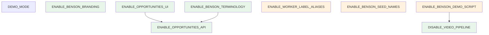

# Feature Flags (Simplified) — Benson Migration

**Date:** 2026-05-31  
**Purpose:** Minimum Phase 1 flag set — 8 flags, down from 19 in [FEATURE_FLAGS.md](./FEATURE_FLAGS.md)  
**Related:** [TRANSFORMATION_PHASE_1.md](./TRANSFORMATION_PHASE_1.md) · [FEATURE_FLAGS.md](./FEATURE_FLAGS.md)

**Constraint:** Planning only. No application code changes.

---

## Summary

| Category | Count | Notes |
|---|---|---|
| **Inherited** | 1 | `DEMO_MODE` — pre-Benson |
| **Phase 1 required** | 5 | Minimum viable Benson migration |
| **Phase 1 nice-to-have** | 3 | Polish; safe to ship Phase 1 without |
| **Phase 2+** | 9 | Deferred; not implemented in Phase 1 |

**Phase 1 total: 8 flags** (plus inherited `DEMO_MODE`).

Redundant granular flags from [FEATURE_FLAGS.md](./FEATURE_FLAGS.md) are **merged**, not deleted from the codebase conceptually — implementation reads one env var and enables a **bundle** of behaviors.

---

## Design Rules

1. **Default `false` for all Benson flags** — legacy bootstrap unchanged.
2. **One flag, one concern** — API, workers, branding, UI, terminology are separate for rollback.
3. **Bundled behavior** — when a simplified flag is `true`, all sub-behaviors in its bundle activate together; no sub-flags in Phase 1.
4. **Legacy routes always on** — `/api/content`, `/api/planner/run`, `/queue`, `/campaigns` never removed; only hidden or aliased when Benson flags enable alternatives.

---

## Phase 1 — Required Flags (5)

These five flags are the **minimum** to meet [TRANSFORMATION_PHASE_1.md](./TRANSFORMATION_PHASE_1.md) goals. All default `false`.

### 1. `DISABLE_VIDEO_PIPELINE`

| Field | Value |
|---|---|
| **Default** | `false` |
| **Purpose** | Stop video/publishing workers; Benson pipeline ends at human approval. |
| **Rollback** | Set `false`; restart workers. All 11 workers register; items at `script_approved` resume through video chain. |
| **Dependencies** | None |

**Bundle includes (merged from [FEATURE_FLAGS.md](./FEATURE_FLAGS.md)):**

| Merged flag | Behavior |
|---|---|
| `DISABLE_VIDEO_PIPELINE` | Skip persona-picker, avatar-render, post-production, scheduler, publisher, token-rotation, analytics-ingest |
| `ENABLE_APPROVALS_ONLY_MODE` | When video disabled, treat `script_approved` as terminal in metrics, state pills, and overview counts |

**Workers when `true`:** planner, script-writer, approval-gate only (3).

---

### 2. `ENABLE_OPPORTUNITIES_API`

| Field | Value |
|---|---|
| **Default** | `false` |
| **Purpose** | Benson API surface over existing `content_items` data. |
| **Rollback** | Set `false`; restart API. `/api/opportunities` and `/api/scanner/run` return 404; legacy routes unchanged. |
| **Dependencies** | None |

**Bundle includes:**

| Merged flag | Behavior |
|---|---|
| `ENABLE_OPPORTUNITIES_API` | `GET /api/opportunities`, `GET /api/opportunities/:id` |
| `ENABLE_OPPORTUNITY_DTO` | Field mapping: `topic`→`title`, `hook`→`angle`, `script`→`summary`, `industry`→`category` |
| `ENABLE_SCANNER_API_ALIAS` | `POST /api/scanner/run` → same handler as `/api/planner/run` |
| `ENABLE_BENSON_METRICS_LABELS` | `/api/metrics/overview` uses Benson display state names |

**Not included:** SQL view (`ENABLE_OPPORTUNITIES_SQL_VIEW`) — use Drizzle on `content_items` directly; view is unnecessary for Phase 1.

---

### 3. `ENABLE_BENSON_BRANDING`

| Field | Value |
|---|---|
| **Default** | `false` |
| **Purpose** | User-visible product identity: **Benson** instead of social-agent. |
| **Rollback** | Set `false`; restart dashboard. Header, title, footer revert. |
| **Dependencies** | None |

**Bundle includes:**

| Merged flag | Behavior |
|---|---|
| `ENABLE_BENSON_BRANDING` | Header logo text, `<Metadata>` title/description, footer copy |

**Dashboard:** Server components read `.env` directly. Client components use `NEXT_PUBLIC_ENABLE_BENSON_BRANDING` mirror (same default).

---

### 4. `ENABLE_OPPORTUNITIES_UI`

| Field | Value |
|---|---|
| **Default** | `false` |
| **Purpose** | Benson queue experience: `/opportunities` replaces `/queue` in nav and routing. |
| **Rollback** | Set `false`; restart dashboard. Nav shows `[queue]`; `/opportunities` unavailable. |
| **Dependencies** | **`ENABLE_OPPORTUNITIES_API=true`** (page fetches `/api/opportunities`) |

**Bundle includes:**

| Merged flag | Behavior |
|---|---|
| `ENABLE_OPPORTUNITIES_UI` | `/opportunities` page + nav link |
| `HIDE_LEGACY_QUEUE_NAV` | Remove `[queue]` from nav when opportunities shown |
| `ENABLE_QUEUE_TO_OPPORTUNITIES_REDIRECT` | `/queue` → `/opportunities` redirect (preserves query params) |
| `HIDE_LEGACY_CAMPAIGNS_NAV` | Remove `[campaigns]` from nav; routes still work by direct URL |

---

### 5. `ENABLE_BENSON_TERMINOLOGY`

| Field | Value |
|---|---|
| **Default** | `false` |
| **Purpose** | Benson voice and domain language across dashboard pages (not header branding). |
| **Rollback** | Set `false`; restart dashboard. Legacy labels (topic, hook, script, raw states) return. |
| **Dependencies** | **`ENABLE_OPPORTUNITIES_API=true`** recommended (consistent DTO field names) |

**Bundle includes:**

| Merged flag | Behavior |
|---|---|
| `ENABLE_BENSON_STATE_LABELS` | StatePill: `planned`→`discovered`, `script_drafted`→`pending_review`, etc.; hide video states when `DISABLE_VIDEO_PIPELINE=true` |
| `ENABLE_BENSON_APPROVALS_COPY` | Approval cards: title/angle/summary labels, "Benson drafted this summary" |
| `ENABLE_BENSON_OVERVIEW_COPY` | Overview: Kellie/Benson greeting, opportunity-centric sections, Benson metrics labels |

---

## Phase 1 — Nice-to-Have Flags (3)

Optional polish. Phase 1 verification can pass without these.

### 6. `ENABLE_WORKER_LABEL_ALIASES`

| Field | Value |
|---|---|
| **Default** | `false` |
| **Purpose** | Benson names in logs and audit UI: planner→scanner, script-writer→scorer. |
| **Rollback** | Set `false`; restart workers + dashboard. Raw worker names in logs and `/runs`. |
| **Dependencies** | None |

**Bundle includes:** `ENABLE_WORKER_LABEL_ALIASES` + `ENABLE_RUNS_WORKER_ALIASES`.

---

### 7. `ENABLE_BENSON_SEED_NAMES`

| Field | Value |
|---|---|
| **Default** | `false` |
| **Purpose** | Seed campaign display name `Kellie KC` instead of `Demo Brand`. |
| **Rollback** | Set `false`; re-run `pnpm seed`. |
| **Dependencies** | None |

---

### 8. `ENABLE_BENSON_DEMO_SCRIPT`

| Field | Value |
|---|---|
| **Default** | `false` |
| **Purpose** | `pnpm demo` stops at approval-eligible states when video pipeline disabled. |
| **Rollback** | Set `false`; demo restores legacy auto-publish path. |
| **Dependencies** | **`DISABLE_VIDEO_PIPELINE=true`** for meaningful effect |

---

## Inherited Flag (not Phase 1)

### `DEMO_MODE`

| Default | `true` |
|---|---|
| **Purpose** | Mock external providers; required for local bootstrap without API keys. |
| **Rollback** | Set `true` for mocks; `false` + API keys for real integrations. |
| **Dependencies** | Independent of all Benson flags. |

---

## Phase 1 Presets

### Legacy (bootstrap baseline)

```bash
DEMO_MODE=true
# All 8 Phase 1 flags omitted or false
```

### Benson Phase 1 — required only (5 flags)

```bash
DEMO_MODE=true
DISABLE_VIDEO_PIPELINE=true
ENABLE_OPPORTUNITIES_API=true
ENABLE_BENSON_BRANDING=true
ENABLE_OPPORTUNITIES_UI=true
ENABLE_BENSON_TERMINOLOGY=true
```

### Benson Phase 1 — full (all 8 flags)

```bash
DEMO_MODE=true
DISABLE_VIDEO_PIPELINE=true
ENABLE_OPPORTUNITIES_API=true
ENABLE_BENSON_BRANDING=true
ENABLE_OPPORTUNITIES_UI=true
ENABLE_BENSON_TERMINOLOGY=true
ENABLE_WORKER_LABEL_ALIASES=true
ENABLE_BENSON_SEED_NAMES=true
ENABLE_BENSON_DEMO_SCRIPT=true
```

### Partial rollback examples

| Goal | Toggle |
|---|---|
| Benson UI but legacy API field names | `ENABLE_BENSON_TERMINOLOGY=false` |
| Benson API but legacy dashboard | All `ENABLE_BENSON_*` and `ENABLE_OPPORTUNITIES_UI=false` |
| Full legacy 11-worker pipeline | `DISABLE_VIDEO_PIPELINE=false` |
| Keep opportunities page, show campaigns nav | Not supported in simplified set — set `ENABLE_OPPORTUNITIES_UI=false` or use [FEATURE_FLAGS.md](./FEATURE_FLAGS.md) granular flags in Phase 1.5 |

---

## Dependency Graph (Simplified)



Green = required. Orange = nice-to-have.

---

## Merge Map: Granular → Simplified

Use this when implementing or reading [FEATURE_FLAGS.md](./FEATURE_FLAGS.md).

| Simplified flag | Absorbed granular flags |
|---|---|
| `DISABLE_VIDEO_PIPELINE` | `DISABLE_VIDEO_PIPELINE`, `ENABLE_APPROVALS_ONLY_MODE` |
| `ENABLE_OPPORTUNITIES_API` | `ENABLE_OPPORTUNITIES_API`, `ENABLE_OPPORTUNITY_DTO`, `ENABLE_SCANNER_API_ALIAS`, `ENABLE_BENSON_METRICS_LABELS` |
| `ENABLE_BENSON_BRANDING` | `ENABLE_BENSON_BRANDING` |
| `ENABLE_OPPORTUNITIES_UI` | `ENABLE_OPPORTUNITIES_UI`, `HIDE_LEGACY_QUEUE_NAV`, `ENABLE_QUEUE_TO_OPPORTUNITIES_REDIRECT`, `HIDE_LEGACY_CAMPAIGNS_NAV` |
| `ENABLE_BENSON_TERMINOLOGY` | `ENABLE_BENSON_STATE_LABELS`, `ENABLE_BENSON_APPROVALS_COPY`, `ENABLE_BENSON_OVERVIEW_COPY` |
| `ENABLE_WORKER_LABEL_ALIASES` | `ENABLE_WORKER_LABEL_ALIASES`, `ENABLE_RUNS_WORKER_ALIASES` |
| `ENABLE_BENSON_SEED_NAMES` | `ENABLE_BENSON_SEED_NAMES` |
| `ENABLE_BENSON_DEMO_SCRIPT` | `ENABLE_BENSON_DEMO_SCRIPT` |

**Dropped from Phase 1 (no flag needed):**

| Granular flag | Reason |
|---|---|
| `ENABLE_OPPORTUNITIES_SQL_VIEW` | Optional optimization; query `content_items` via Drizzle |

---

## Phase 2+ Flags (not Phase 1)

Implement after Phase 1 verification. All default `false`. Grouped by theme — do not add to Phase 1 `env.ts` until needed.

### Scoring & intelligence

| Flag | Purpose |
|---|---|
| `ENABLE_KC_SCORING` | KC relevance + urgency prompts in script-writer/scorer |
| `ENABLE_BENSON_SCORE_EXPLANATIONS` | "Why Benson scored it this way" panel on approval cards |

### Source ingest

| Flag | Purpose |
|---|---|
| `ENABLE_KC_SCANNER` | Real source ingest replacing quota planner |
| `ENABLE_MOCK_KC_SOURCES` | Mock Reddit/RSS/event data in demo mode |
| `ENABLE_REDDIT_SOURCES` | Poll Reddit sources from `sources` table |
| `ENABLE_EVENT_SOURCES` | Poll RSS/ICS/event API sources |
| `ENABLE_GOOGLE_MAPS_SOURCES` | Poll Google Maps Places sources |

### UX & workflow

| Flag | Purpose |
|---|---|
| `ENABLE_SINGLE_WORKSPACE_UI` | Singleton workspace; hide campaign scoping in API/UI |
| `FORCE_HITL_MODE` | Disable auto-approve; approval-gate no-op |

**Phase 2 note:** Source-type flags (`ENABLE_REDDIT_SOURCES`, etc.) can be collapsed into `ENABLE_KC_SCANNER` + per-source `active` column when Phase 2 starts — same simplification pattern as Phase 1.

---

## Quick Reference Table

| Flag | Default | Phase 1 tier | Layer | Restart |
|---|---|---|---|---|
| `DEMO_MODE` | `true` | Inherited | Core | All |
| `DISABLE_VIDEO_PIPELINE` | `false` | **Required** | Workers | Workers |
| `ENABLE_OPPORTUNITIES_API` | `false` | **Required** | API | API |
| `ENABLE_BENSON_BRANDING` | `false` | **Required** | Dashboard | Dashboard |
| `ENABLE_OPPORTUNITIES_UI` | `false` | **Required** | Dashboard | Dashboard |
| `ENABLE_BENSON_TERMINOLOGY` | `false` | **Required** | Dashboard | Dashboard |
| `ENABLE_WORKER_LABEL_ALIASES` | `false` | Nice-to-have | Workers + dashboard | Workers + dashboard |
| `ENABLE_BENSON_SEED_NAMES` | `false` | Nice-to-have | Seed | Re-run seed |
| `ENABLE_BENSON_DEMO_SCRIPT` | `false` | Nice-to-have | Workers | — |
| `ENABLE_KC_SCORING` | `false` | Phase 2 | Workers | Workers |
| `ENABLE_KC_SCANNER` | `false` | Phase 2 | Workers | Workers |
| `ENABLE_MOCK_KC_SOURCES` | `false` | Phase 2 | Core | Workers |
| `ENABLE_REDDIT_SOURCES` | `false` | Phase 2 | Scanner | Workers |
| `ENABLE_EVENT_SOURCES` | `false` | Phase 2 | Scanner | Workers |
| `ENABLE_GOOGLE_MAPS_SOURCES` | `false` | Phase 2+ | Scanner | Workers |
| `ENABLE_SINGLE_WORKSPACE_UI` | `false` | Phase 2 | API + dashboard | All |
| `FORCE_HITL_MODE` | `false` | Phase 2 | Workers | Workers |
| `ENABLE_BENSON_SCORE_EXPLANATIONS` | `false` | Phase 2 | Dashboard | Dashboard |

---

## Mapping to [TRANSFORMATION_PHASE_1.md](./TRANSFORMATION_PHASE_1.md) Steps

| Step | Simplified flags to enable |
|---|---|
| Step 1 — Feature flags in `env.ts` | Define all 8; defaults `false` |
| Step 2 — Mapping module | Gated by `ENABLE_OPPORTUNITIES_API` |
| Step 3 — API routes | `ENABLE_OPPORTUNITIES_API=true` |
| Step 4 — Disable video workers | `DISABLE_VIDEO_PIPELINE=true` |
| Step 5 — Dashboard branding | `ENABLE_BENSON_BRANDING=true` |
| Step 6 — Opportunities page | `ENABLE_OPPORTUNITIES_UI=true` |
| Step 7 — Approvals copy | `ENABLE_BENSON_TERMINOLOGY=true` |
| Step 8 — Benson mode on | All 5 required flags `true` |
| Step 9 — Docs | `.env.example` lists 8 flags only |

---

## Implementation Notes

1. **Single `FeatureFlags` object** in `services/core/src/env.ts` — 8 booleans + `demoMode`.
2. **Health check** exposes the 8 flags:

```json
{
  "ok": true,
  "flags": {
    "demoMode": true,
    "disableVideoPipeline": false,
    "enableOpportunitiesApi": false,
    "enableBensonBranding": false,
    "enableOpportunitiesUi": false,
    "enableBensonTerminology": false,
    "enableWorkerLabelAliases": false,
    "enableBensonSeedNames": false,
    "enableBensonDemoScript": false
  }
}
```

3. **Granular flags deferred** — if Phase 1 needs finer rollback mid-sprint, add flags from [FEATURE_FLAGS.md](./FEATURE_FLAGS.md) as Phase 1.5; do not expand the default set.
4. **Verification** — [BOOTSTRAP_PLAN.md](./BOOTSTRAP_PLAN.md) passes with all 8 flags `false`; Phase 1 complete with 5 required flags `true`.

---

## When to Use Full [FEATURE_FLAGS.md](./FEATURE_FLAGS.md)

Use the granular spec if you need independent control over:

- API-only rollout without dashboard changes
- Benson branding without hiding campaigns nav
- Approvals-only semantics without disabling video workers (display-only testing)
- SQL view for read-path optimization

For normal Phase 1 execution, **this simplified document is canonical**.

---

*End of simplified feature flags specification.*
