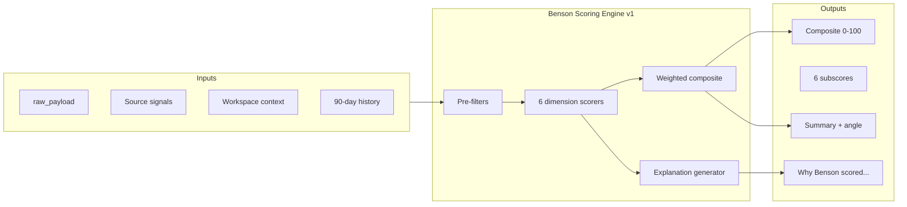

# KC Scoring Model — Benson Opportunity Engine v1

**Date:** 2026-05-31  
**Status:** Design document only — no application code  
**Context:** [BENSON_VISION.md](./BENSON_VISION.md) · [KELLIE_PRODUCT_SPEC.md](./KELLIE_PRODUCT_SPEC.md) · [PHASE_2_KC_DATA_PLAN.md](./PHASE_2_KC_DATA_PLAN.md) · [MVP_SIMPLIFICATION.md](./MVP_SIMPLIFICATION.md)

---

## Purpose

This document defines **Benson Scoring Engine v1** — the first structured model for ranking Kansas City content opportunities on a **0–100 composite scale**. Every discovered opportunity receives six subscores, a weighted composite, a plain-language explanation, and the summary/angle Kellie sees on approval cards.

**Design principle:** Benson scores like a local content strategist, not like a search engine. Kellie sees *why* — not embedding math.

---

## Overview



| Stage | When | Owner |
|---|---|---|
| Discovery | Scanner ingest | `scanner` worker |
| Scoring | Within 2–5s after ingest | `script-writer` slot (`ENABLE_KC_SCORING=true`) |
| Explanation | Same LLM call (structured JSON) | Scorer |
| Display | Approval card + opportunities list | Dashboard |

**Storage mapping (Phase 2):**

| User-facing | DB field | Notes |
|---|---|---|
| Composite 0–100 | `relevance_score` | Store as `0.00–1.00` (`score / 100`) for compatibility |
| Subscores + rationale | `metadata.bensonScore` | JSON blob (see schema below) |
| Urgency (separate) | `urgency_score` | Time-sensitivity; not part of composite |

---

## Composite Score (0–100)

The **Benson Score** is a weighted average of six dimension subscores, each on **0–100**:

```
composite = round(
  visual_appeal       × w_visual
+ uniqueness          × w_unique
+ affordability       × w_afford
+ local_interest      × w_local
+ world_cup_relevance × w_wc
+ social_media_potential × w_social
)
```

Where all `w_*` sum to **1.0**.

### Default weights (v1)

Tuned for Kellie — KC content strategist, social-first output, FIFA World Cup 2026 host city.

| Dimension | Weight | Rationale |
|---|---|---|
| **Local interest** | **25%** | Core mission: is KC actually talking about this? |
| **Social media potential** | **20%** | Kellie's deliverable is shareable content |
| **Visual appeal** | **18%** | Filmable, photogenic, scroll-stopping |
| **Uniqueness** | **15%** | Differentiation from generic national coverage |
| **World Cup relevance** | **12%** | Seasonal lift during 2026; near-zero weight effect when dimension scores low |
| **Affordability** | **10%** | Audience accessibility; "free/cheap" angles perform locally |

**Default weight constants:**

```typescript
// Design reference — not implemented code
const BENSON_WEIGHTS_V1 = {
  local_interest:         0.25,
  social_media_potential: 0.20,
  visual_appeal:          0.18,
  uniqueness:             0.15,
  world_cup_relevance:    0.12,
  affordability:          0.10,
} as const;
```

### Seasonal weight adjustment (World Cup window)

During the **FIFA World Cup 2026 Kansas City hosting window** (Jun 11 – Jul 19, 2026, GEHA Field at Arrowhead), Benson temporarily shifts weight from uniqueness toward World Cup relevance:

| Dimension | Off-season | WC window |
|---|---|---|
| Local interest | 25% | 22% |
| Social media potential | 20% | 20% |
| Visual appeal | 18% | 18% |
| Uniqueness | 15% | 10% |
| **World Cup relevance** | **12%** | **22%** |
| Affordability | 10% | 8% |

Implementation: date-gated config in scorer; no ML required for v1.

### Composite bands (user-facing)

| Composite | Label | Inbox behavior |
|---|---|---|
| **85–100** | Excellent | Top of queue; highlight badge |
| **70–84** | Strong | Standard inbox |
| **50–69** | Fair | Inbox with caution copy |
| **Below 50** | Low | Auto-archived — Kellie does not see |

Auto-approve threshold (when `autonomy_mode=auto`): **≥ 75**.

---

## Dimension Definitions

Each dimension is scored **0–100** by the LLM with optional **deterministic pre-signals** (rules) passed in as hints. The LLM must justify scores ≥ 80 or ≤ 30.

### 1. Visual appeal (0–100)

*How photogenic, filmable, and visually interesting is this opportunity for social video or photography?*

| Score band | Meaning |
|---|---|
| 85–100 | Iconic KC backdrop, crowd energy, food beauty shots, mural/street scene, stadium atmosphere |
| 60–84 | Decent B-roll potential; indoor or static but workable |
| 30–59 | Talking-head only; generic interior; hard to make visually compelling |
| 0–29 | No visual hook; text-only thread; abstract policy debate |

**Raises score:** outdoor events, food/drink, sports, art installations, skyline views, fan zones, parade/festival imagery.

**Lowers score:** pure Q&A threads, housing/legal posts, link-only news with no local photo.

---

### 2. Uniqueness (0–100)

*Is this distinctly Kansas City — or generic content that could apply to any mid-size city?*

| Score band | Meaning |
|---|---|
| 85–100 | Only-in-KC hook (Joe's KC, Crossroads, specific neighborhood, local business name) |
| 60–84 | KC-specific with some generic framing |
| 30–59 | National trend with weak local tie |
| 0–29 | Could be Anywhere, USA |

**Raises score:** named neighborhoods, local institutions, KC-specific slang, cross-post absent from other cities.

**Lowers score:** duplicate national meme, generic "best cities" listicle, semantic near-duplicate of recent approval.

---

### 3. Affordability (0–100)

*How accessible is this to a broad local audience — free, cheap, or reasonably priced?*

| Score band | Meaning |
|---|---|
| 85–100 | Free event, public park, street festival, free museum day |
| 60–84 | Under ~$25, happy hour, casual dining |
| 30–59 | Moderate ticket price; splurge dining |
| 0–29 | Luxury-only, high ticket, members-only |

**Raises score:** "free admission", farmers market, First Fridays, streetcar-accessible, pay-what-you-can.

**Lowers score:** $200+ tickets, exclusive galas, fine-dining-only with no public angle.

**Note:** Low affordability does not auto-reject — a high-end opening can still score well on other dimensions. Benson notes cost explicitly in explanations.

---

### 4. Local interest (0–100)

*Is the KC community already engaged — or likely to care?*

| Score band | Meaning |
|---|---|
| 85–100 | Hot Reddit thread, sold-out event, multiple local sources, breaking local news |
| 60–84 | Steady interest; niche but active audience |
| 30–59 | Low engagement; speculative interest |
| 0–29 | No KC signal; wrong subreddit; outside metro |

**Raises score:** Reddit upvotes/comments, Visit KC featured event, multiple neighborhood mentions, recent local media.

**Lowers score:** zero comments, stale post, geo outside 50 km radius, blocklisted flair.

This dimension receives the **deterministic pre-score hints** below (highest signal-to-noise ratio).

---

### 5. World Cup relevance (0–100)

*Does this connect to FIFA World Cup 2026 in Kansas City — matches, fan festivals, watch parties, tourism surge, transit/hospitality impact?*

| Score band | Meaning |
|---|---|
| 85–100 | Direct WC event at Arrowhead/fan zone; official FIFA/KC2026 programming |
| 60–84 | WC-adjacent (hotel packages, watch parties, soccer bars, international food) |
| 30–59 | General summer tourism; weak soccer tie |
| 0–29 | No WC connection |

**Raises score:** GEHA Field, KC2026 hashtags, FIFA official listings, Visit KC convention feed tags, match dates Jun–Jul 2026.

**Lowers score:** off-season unrelated content (expected 0–20 on this dimension — pulls composite down slightly via 12% weight).

**Keyword hints (deterministic):** `world cup`, `fifa`, `kc2026`, `arrowhead`, `geha field`, `fan fest`, `fan zone`, `usmnt`, national team names during window.

---

### 6. Social media potential (0–100)

*Will this produce strong short-form content — hooks, shares, comments, saves?*

| Score band | Meaning |
|---|---|
| 85–100 | Clear hook, debate-worthy, listicle-friendly, timeliness, emotional payoff |
| 60–84 | Solid post; may need sharper angle |
| 30–59 | Informative but dull; low shareability |
| 0–29 | No angle; violates platform norms |

**Raises score:** controversy (constructive), "hidden gem", countdown, POV format, before/after, community poll potential.

**Lowers score:** press release tone, duplicate topic Kellie covered recently, low Reddit engagement.

---

## Data Sources by Dimension

| Dimension | Primary data | Secondary data | Phase |
|---|---|---|---|
| **Visual appeal** | LLM inference from title/body/venue type | Google Maps photos (2C), event category tags | 2A LLM; 2C enriched |
| **Uniqueness** | LLM + embedding dedup vs 90d history | Cross-source dedup (Reddit + Visit KC) | 2A |
| **Affordability** | LLM from description; Eventbrite price fields | Visit KC event text; Reddit comments | 2A LLM; 2C Eventbrite |
| **Local interest** | Reddit score, comments, flair; geo match | Visit KC listing prominence; scan recency | 2A |
| **World Cup relevance** | Keyword rules + LLM; Visit KC convention RSS | KC2026 official pages; match calendar | 2A rules; 2B feeds |
| **Social media potential** | LLM; Reddit engagement velocity | Historical approve rate by category (future ML) | 2A |

### Normalized ingest fields (from `raw_payload`)

All dimensions consume a common **ScoringContext** assembled by the scanner:

```jsonc
{
  "sourceType": "reddit",
  "sourceName": "r/kansascity hot",
  "title": "...",
  "body": "...",
  "url": "...",
  "publishedAt": "2026-05-31T10:00:00Z",
  "location": { "name": "Crossroads", "lat": 39.08, "lng": -94.58 },
  "event": { "startsAt": "2026-06-06T18:00:00Z", "endsAt": null },
  "reddit": { "score": 142, "comments": 38, "flair": "Event" },
  "price": { "isFree": true, "minUsd": null, "maxUsd": null },
  "tags": ["arts", "first-fridays"],
  "wcHints": { "keywordMatches": [], "inHostingWindow": true }
}
```

### Deterministic pre-signals (rules layer)

Before the LLM call, compute **hints** (not final scores) to reduce hallucination:

| Rule | Affects | Logic |
|---|---|---|
| Geo outside 50 km | Local interest | Cap hint at 40 |
| Reddit score > 100 AND comments > 20 | Local interest, Social | Boost hint +15 |
| Blocklisted flair | All | Early archive if composite pre-check < 30 |
| `event.startsAt` within 3 days | Urgency (separate) | urgency ≥ 0.80 |
| WC keyword match | World Cup relevance | Floor hint at 50 |
| Embedding similarity > 0.85 vs 90d | Uniqueness | Cap uniqueness hint at 35 |
| Eventbrite min price > $75 | Affordability | Cap affordability hint at 45 |

Rules run in code; LLM receives hints as **non-binding guidance**.

---

## Prompt Templates

### System prompt (scorer v1)

```
You are Benson, a Kansas City content opportunity analyst working for Kellie,
a local content strategist. Score opportunities for social-first storytelling —
not for SEO or national news desks.

Score six dimensions from 0 to 100 (integers). Be calibrated:
- 50 = average / uncertain
- 70 = solid local opportunity
- 85+ = exceptional; reserve for clearly strong cases
- Below 30 = clearly weak on that dimension

Use the provided pre-signals as hints; you may override with one-sentence justification.

Output valid JSON only matching the schema. Write like Benson: direct, local, honest.
Never mention embeddings, cosine similarity, or model internals in user-facing fields.
```

### User prompt template

```
## Workspace
Brand voice: {{brand_voice}}
Active categories: {{categories_json}}
Geo: {{lat}}, {{lng}} — {{radius_km}} km radius
Today: {{iso_date}}
World Cup KC hosting window active: {{wc_window_active}}

## Source
Type: {{source_type}}
Name: {{source_name}}
URL: {{source_url}}

## Opportunity
Title: {{title}}
Body: {{body}}
Location: {{location_name}}
Event start: {{event_starts_at}}

## Source signals
{{signals_json}}

## Pre-signals (hints from rules engine)
{{pre_signals_json}}

## Recent context (last 90 days)
Approved titles: {{approved_titles_json}}
Rejected titles: {{rejected_titles_json}}

## Task
1. Score all six dimensions (0-100 integers).
2. Compute weighted composite using weights: {{weights_json}}
3. Assign best category slug from: {{category_slugs}}
4. Write summary (2-4 sentences), angle (1 sentence).
5. Write explanation bullets (3-5) for Kellie — plain language, no jargon.
6. Write one paragraph for "Ask Benson" expandable detail.

Return JSON:
{
  "dimensions": {
    "visual_appeal": 0,
    "uniqueness": 0,
    "affordability": 0,
    "local_interest": 0,
    "world_cup_relevance": 0,
    "social_media_potential": 0
  },
  "composite": 0,
  "category_slug": "",
  "summary": "",
  "angle": "",
  "explanation_bullets": ["", ""],
  "ask_benson": "",
  "confidence": "high|medium|low"
}
```

### DEMO_MODE prompt suffix

```
DEMO_MODE: Return deterministic scores for fixture ID {{fixture_id}} per mock table.
```

Mock table returns fixed dimension scores for CI/regression (e.g. fixture `first-fridays` → composite 92).

---

## Explanation Generation

Explanations are **first-class outputs**, not post-hoc templating. The LLM generates them in the same structured call as scores.

### Explanation structure

| Field | Audience | Format |
|---|---|---|
| `explanation_bullets` | Approval card | 3–5 lines; leading ✓ / ⚠ / ✗ |
| `ask_benson` | Expandable panel | 1 short paragraph; cites top 2 dimensions |
| `metadata.bensonScore` | Runs / debug | Full dimension breakdown + weights used |

### Bullet authoring rules

1. **Lead with the top two weighted contributors** — name the dimension in plain English ("Local interest", not `local_interest`).
2. **Cite evidence** — Reddit comment count, event date, neighborhood name, price signal.
3. **Flag uncertainty** — use ⚠ when `confidence=medium` or any dimension 45–55.
4. **Never fabricate** — if body lacks price info, say "Benson couldn't confirm ticket cost."
5. **World Cup** — mention only if `world_cup_relevance ≥ 50`.

### Template fallback (LLM failure)

If the LLM call fails after retries, generate a minimal deterministic explanation:

```
Benson scored this {{composite}}/100 using available source signals.
• Local interest: based on {{reddit_score}} upvotes and {{comment_count}} comments
• Visual appeal: estimated from event type ({{type}})
• Full analysis unavailable — please review manually
```

Item lands in inbox at composite **55** (neutral) with `confidence=low`.

### Stored metadata schema

```json
{
  "bensonScore": {
    "version": "1.0",
    "composite": 92,
    "dimensions": {
      "visual_appeal": 95,
      "uniqueness": 88,
      "affordability": 90,
      "local_interest": 94,
      "world_cup_relevance": 72,
      "social_media_potential": 96
    },
    "weights": { "local_interest": 0.25, "...": "..." },
    "explanation_bullets": ["...", "..."],
    "ask_benson": "...",
    "confidence": "high",
    "scored_at": "2026-05-31T12:00:00Z",
    "model": "gpt-4o-mini"
  }
}
```

---

## Output Example — 92/100

### Opportunity

**First Fridays returns to the Crossroads — June 2026 gallery walk**

| Field | Value |
|---|---|
| Source | Visit KC Events (RSS) + corroborating r/kansascity thread |
| Event | Fri Jun 6, 2026 · 6–9 PM · Crossroads Arts District |
| Price | Free |

### Dimension breakdown

| Dimension | Score | Weight | Weighted |
|---|---|---|---|
| Visual appeal | 95 | 18% | 17.1 |
| Uniqueness | 88 | 15% | 13.2 |
| Affordability | 90 | 10% | 9.0 |
| Local interest | 94 | 25% | 23.5 |
| World Cup relevance | 72 | 12% | 8.6 |
| Social media potential | 96 | 20% | 19.2 |
| **Composite** | | | **92** |

### Approval card copy

**First Fridays returns to the Crossroads — Benson Score 92/100**

**Summary:** Crossroads First Fridays is back this Friday with dozens of galleries open late, food trucks, and street energy. Strong weekend-planning content for KC audiences — free and highly walkable.

**Angle:** Film a 60-second "gallery hop" POV starting at Kauffman Garage and ending at a food truck on Baltimore.

---

### Why Benson scored this 92/100

- ✓ **Local interest (94)** — Visit KC featured listing plus an r/kansascity thread with 140+ upvotes and 35 comments this week
- ✓ **Social media potential (96)** — Clear hook ("free art night"), list-friendly (gallery names), strong save/share potential for weekend plans
- ✓ **Visual appeal (95)** — Outdoor crowd scenes, murals, gallery interiors, golden-hour Crossroads B-roll
- ✓ **Affordability (90)** — Free admission; Benson flagged this as accessible for broad audiences
- ✓ **Uniqueness (88)** — Crossroads-specific gallery names; not a generic national "art walk" post
- ○ **World Cup relevance (72)** — No match-day tie, but June tourism surge and visiting fan activity add a timely angle during KC's World Cup summer

**[ Ask Benson why ]**

> Benson scored this 92/100 because local engagement is unusually strong for a recurring event — the Reddit thread shows people actively planning their route, which raises both local interest and social potential. Benson weighted visual appeal highly since First Fridays is one of KC's most filmable free events. World Cup relevance is moderate: it won't overlap a match day, but Benson noted that downtown foot traffic and visitor content will peak in June 2026, making this a smart pre-weekend post. If you prefer not to cover recurring monthly events, reject and Benson will deprioritize similar listings.

---

## Urgency (companion score)

Urgency remains **separate from the 0–100 Benson Score** — it drives sort order and timeliness labels, not overall quality.

| Input | Urgency effect |
|---|---|
| Event in ≤ 3 days | 85–100 |
| Event in 4–14 days | 60–84 |
| Reddit post < 24h old + rising comments | +10 bump |
| No date | 20–40 |

Display: **92/100 · High urgency — event in 2 days**

---

## Future Machine-Learning Improvements

v1 is **LLM + rules**. ML layers accumulate data from Kellie's decisions without blocking MVP ship.

### Phase ML-1 — Learning from Kellie (3–4 weeks after 2A)

| Improvement | Method | Data |
|---|---|---|
| **Weight personalization** | Bayesian update on dimension weights per workspace | Approve/reject + dwell time on card |
| **Category priors** | Logistic regression: P(approve) by category × dimension | 90d labeled opportunities |
| **Archive threshold tuning** | Optimize cutoff (default 50) for precision | False-positive archive rate |

### Phase ML-2 — Engagement prediction (2–3 months)

| Improvement | Method | Data |
|---|---|---|
| **Social media potential** | Gradient boosting on Reddit features + historical post performance | Kellie's published post metrics (manual import initially) |
| **Local interest** | Time-decay engagement model | Reddit score velocity, comment growth rate |
| **Uniqueness** | Embedding clustering + novelty score | Opportunity corpus per metro |

### Phase ML-3 — Multimodal and external signals (6+ months)

| Improvement | Method | Data |
|---|---|---|
| **Visual appeal** | CLIP/image classifier on venue photos | Google Maps photos, Instagram geotags (with ToS compliance) |
| **Affordability** | Structured extraction model | Eventbrite price tiers, menu PDF scraping |
| **World Cup relevance** | Entity linker to FIFA schedule KB | Official match calendar, geofenced fan zones |
| **Cross-source fusion** | Graph model linking Reddit ↔ events ↔ venues | Shared entity IDs in `raw_payload` |

### Phase ML-4 — Full ranking model

Replace weighted average with **learning-to-rank** (LambdaMART or neural ranker):

- **Features:** 6 v1 dimensions + source type + hour-of-day + season + WC window
- **Labels:** approve=1, reject=0, archive=0, implicit positive if Kellie copies angle to clipboard (future telemetry)
- **Evaluation:** NDCG@10 on weekly inbox vs Kellie's actual top picks
- **Guardrails:** LLM explanations remain; ML only adjusts composite and sort — Kellie always sees reasoning

### Data collection prerequisites

| Table / event | Purpose |
|---|---|
| `opportunity_scores` (optional audit) | Versioned score snapshots |
| `kellie_decisions` | approve / reject / snooze + timestamp |
| `explanation_feedback` | thumbs up/down on "Ask Benson" |
| Published post outcomes | Views, shares (manual CSV → later API) |

---

## Compatibility Notes

| Existing concept | v1 mapping |
|---|---|
| `relevance_score` (0–1) | `composite / 100` |
| `urgency_score` (0–1) | Unchanged; separate |
| KELLIE_PRODUCT_SPEC relevance bands | Same thresholds on composite |
| Phase 2 archive rule | composite < 50 → archive |
| Benson terminology | Display "Benson Score 92/100" not "relevance 0.92" |

---

## Implementation Checklist (when approved)

- [ ] Add `metadata.bensonScore` schema validation in scorer worker
- [ ] Implement rules pre-signal layer
- [ ] Wire system + user prompt templates behind `ENABLE_KC_SCORING`
- [ ] Dashboard: dimension breakdown accordion on approval card
- [ ] DEMO_MODE fixture table for regression
- [ ] Document env vars: `OPENAI_API_KEY`, optional `BENSON_SCORER_MODEL=gpt-4o-mini`

---

## Next Step

**Stop here.** Review and approve this model before implementing scorer prompts in Phase 2A.

---

*End of KC Scoring Model v1.*
