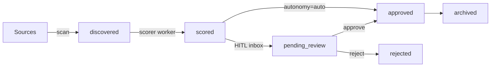
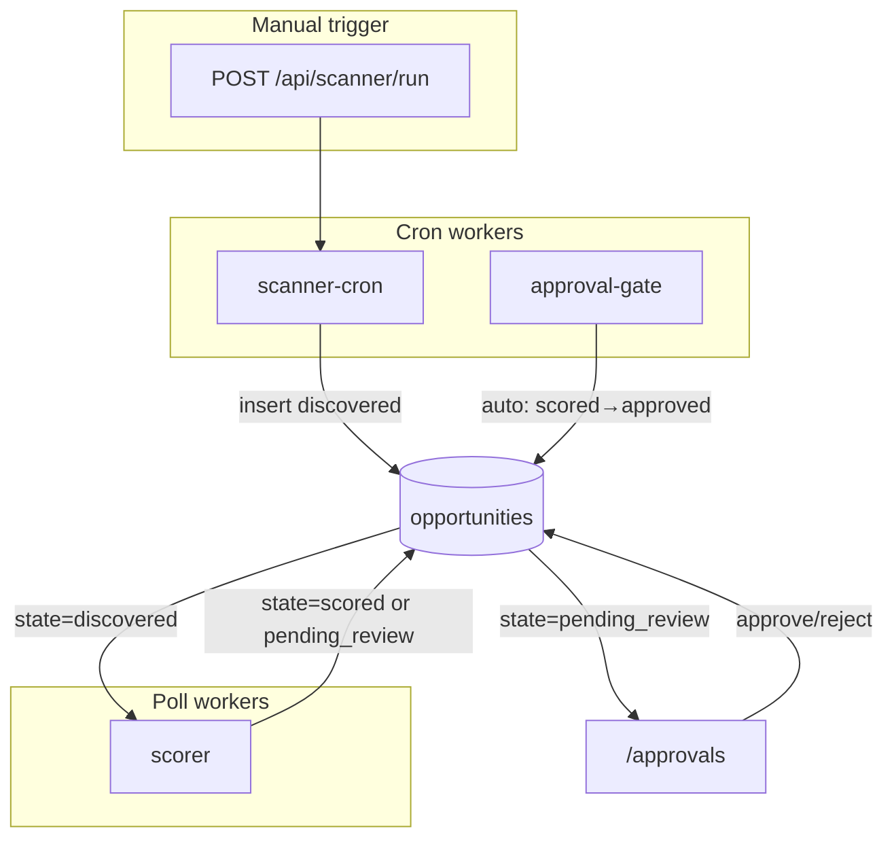

# Kellie Transformation Plan

**Date:** 2026-05-31  
**Based on:** [PROJECT_AUDIT.md](./PROJECT_AUDIT.md), [DEPENDENCY_MAP.md](./DEPENDENCY_MAP.md)  
**Goal:** Smallest MVP that can **discover, score, review, and approve** Kansas City content opportunities  
**Constraint:** Planning document only — no code changes  
**Assistant (user-facing):** **Benson** — see [BENSON_VISION.md](./BENSON_VISION.md)  
**Product (internal):** Kellie Assistant

---

## Naming: Benson vs Kellie Assistant

| Layer | Name | Notes |
|---|---|---|
| **User-facing assistant voice** | Benson | UI copy, score explanations, notifications, Slack digests |
| **Human operator** | Kellie | Primary user persona in specs |
| **Engineering / repo / packages** | Kellie Assistant | `@kellie/*` package rename, internal docs, API during development |

Transformation work may continue to reference **Kellie Assistant** in file names, package names, and schema comments. All **user-visible strings** introduced during transformation should attribute actions to **Benson** (e.g. scorer output labeled "Benson's summary", not "LLM output").

---

## MVP Definition

Kellie Assistant MVP is **not** a video production or publishing system. It is an operator-facing pipeline where **Benson** (the assistant):

1. **Discovers** raw opportunities from configured sources (Reddit, events, RSS — at least one real source in MVP)
2. **Scores** each opportunity for KC relevance, timeliness, and deduplicates near-duplicates via embeddings
3. **Explains** scores in plain language on every approval card
4. **Presents** scored opportunities in Kellie's inbox (HITL by default) for review and approval

**Explicitly out of MVP scope:** HeyGen video, persona generation, ffmpeg, Instagram/TikTok publishing, analytics feedback loop, auto-publishing, content calendar quotas, multi-account routing.

**MVP success criteria:**

- Operator triggers a scan (button or cron) and sees new rows appear in the queue within minutes
- Each opportunity has a Benson-attributed relevance score, source link, category, and summary
- Kellie approves/rejects from `/approvals`; reject optionally feeds back into rescoring (Phase 2)
- Full audit trail in `/runs`
- `DEMO_MODE=true` runs end-to-end with mock source data

---

## Target MVP Pipeline



**MVP state enum (`opportunity_state`):**

| State | Meaning |
|---|---|
| `discovered` | Raw ingest complete; awaiting scoring |
| `scored` | LLM score + summary written; dedup checked |
| `pending_review` | Held for human review (default when `autonomy_mode=hitl`) |
| `approved` | Operator accepted — terminal success for MVP |
| `rejected` | Operator rejected — terminal; optional rescan |
| `failed` | Worker error after retries |
| `archived` | Operator or system archived old items |

**Note:** In `auto` mode, `approval-gate` advances `scored → approved` directly (same pattern as social-agent). In `hitl` mode, scorer advances `scored → pending_review`.

---

## 1. What We Keep Unchanged

These files and patterns carry over **without behavioral changes** (rename-only where noted in §2):

### Infrastructure (verbatim)

| Asset | Path | Rationale |
|---|---|---|
| Worker runtime | `services/workers/src/runtime.ts` | Generic poll/cron + `FOR UPDATE SKIP LOCKED` + audit |
| DB connection | `services/core/src/db.ts` | Drizzle + postgres setup |
| API server shell | `services/api/src/server.ts` | Hono wiring, CORS, health, error handler |
| Runs API route | `services/api/src/routes/runs.ts` | Audit log query — table rename only |
| Runs dashboard page | `dashboard/app/runs/page.tsx` | Audit log UI |
| Dashboard API client pattern | `dashboard/lib/api.ts` | `get` / `post` / `patch` helpers |
| Next.js API proxy | `dashboard/next.config.mjs` | `/api/*` rewrite |
| Monorepo workspace | `pnpm-workspace.yaml`, `tsconfig.base.json` | Workspace layout |
| Postgres extensions | `db/init/00_extensions.sql` | uuid-ossp, citext, **pgvector** |
| Docker Postgres service | `docker-compose.yml` (postgres block) | Same container image |
| `.gitignore` | `.gitignore` | |
| Provider factory pattern | `providers/index.ts` structure, mock/real selector | Extend, don't replace |
| HITL autonomy toggle component | `dashboard/app/campaigns/[id]/autonomy-toggle.tsx` | Same UX; retarget API path |
| Audit table concept | `workflow_runs` | Rename FK column only |

### Behavioral patterns (unchanged logic)

| Pattern | Current | Kellie MVP |
|---|---|---|
| Postgres-as-queue | `content_items.state` polling | `opportunities.state` polling |
| Retry policy | Max 5 retries → `failed` | Same |
| Demo mode | `DEMO_MODE` + mock providers | Same; mock sources + mock LLM |
| Embedding dedup | Cosine threshold 0.85, 90-day window | Same thresholds on opportunity title+summary |
| Approval reject loop | Reject → clear fields → re-enter pipeline | Reject → `rejected` (MVP); optional Phase 2 rescan |
| Cron + manual trigger | n8n cron + dashboard button | Same for source scan |

---

## 2. What Gets Renamed

### Package and project names

| Current | Kellie |
|---|---|
| `social-agent` (root) | `kellie-assistant` |
| `@social-agent/core` | `@kellie/core` |
| `@social-agent/api` | `@kellie/api` |
| `@social-agent/workers` | `@kellie/workers` |
| `@social-agent/dashboard` | `@kellie/dashboard` |
| `social_agent` (Postgres user/db) | `kellie` (or keep for dev simplicity) |
| `POSTGRES_DB=social_agent` | `POSTGRES_DB=kellie` |

### Domain concepts

| Current | Kellie | Notes |
|---|---|---|
| `campaigns` | `clients` | Brand/client profiles (voice, categories, autonomy) |
| `campaign_industries` | `client_categories` | M:N client ↔ KC category |
| `industries` | `categories` | KC content categories (food, events, neighborhoods, …) |
| `content_items` | `opportunities` | State machine row |
| `content_type` | `opportunity_type` | event, news, trend, venue, reddit_post, seasonal |
| `content_state` | `opportunity_state` | See MVP pipeline above |
| `planner` | `scanner` | Discovers opportunities from sources (not calendar planning) |
| `script-writer` worker | `scorer` worker | Scores + summarizes (not video scripts) |
| `topic` | `title` | Opportunity headline |
| `script` | `summary` | LLM summary for review |
| `hook` | `angle` | Suggested content angle (optional MVP field) |
| `topic_embedding` | `embedding` | Same pgvector column |
| `workflow_runs.content_item_id` | `workflow_runs.opportunity_id` | FK rename |

### API routes

| Current | Kellie |
|---|---|
| `/api/campaigns` | `/api/clients` |
| `/api/content` | `/api/opportunities` |
| `/api/planner/run` | `/api/scanner/run` |
| `/api/approvals` | `/api/approvals` (unchanged path; queries `pending_review`) |
| `/api/metrics/overview` | `/api/metrics/overview` (unchanged path; new aggregates) |
| `/api/runs` | `/api/runs` (unchanged) |

### Dashboard routes

| Current | Kellie |
|---|---|
| `/campaigns` | `/clients` |
| `/campaigns/[id]` | `/clients/[id]` |
| `/queue` | `/opportunities` |
| `/approvals` | `/approvals` (unchanged) |
| `/runs` | `/runs` (unchanged) |
| `/` | `/` (overview — updated KPIs) |

### Scripts and env

| Current | Kellie |
|---|---|
| `pnpm dev:api` | Same (filter rename) |
| `pnpm seed` | Seeds KC demo client + categories + mock sources |
| `pnpm demo` | Triggers scan → score → auto-approve demo flow |
| `OPENAI_API_KEY` | Keep |
| `HEYGEN_*`, `IG_*`, `TIKTOK_*` | Remove from `.env.example` |

### n8n workflows

| Current file | Kellie file |
|---|---|
| `01-planner-cron.json` | `01-scanner-cron.json` |
| `02-approval-slack.json` | `02-approval-slack.json` (update URLs/copy) |
| `03-publishing-monitor.json` | *(removed)* |

---

## 3. What Gets Removed Entirely

Delete these modules, tables, and files — they have no Kellie MVP equivalent.

### Workers (6 of 11)

| Worker | Path |
|---|---|
| `persona-picker` | `services/workers/src/workflows/persona-picker.ts` |
| `avatar-render-start` / `avatar-render-poll` | `services/workers/src/workflows/avatar-render.ts` |
| `post-production` | `services/workers/src/workflows/post-production.ts` |
| `publisher` | `services/workers/src/workflows/publisher.ts` |
| `token-rotation` | `services/workers/src/workflows/token-rotation.ts` |
| `scheduler` | `services/workers/src/workflows/scheduler.ts` |

**Defer post-MVP (remove from MVP worker registry, keep code archived or deleted):**

| Worker | Reason |
|---|---|
| `analytics-ingest` | No publishing metrics in MVP |

### Core providers and modules

| Module | Path |
|---|---|
| HeyGen | `services/core/src/providers/heygen.ts` |
| Imagen/Gemini portraits | `services/core/src/providers/image.ts` |
| Instagram | `services/core/src/providers/instagram.ts` |
| TikTok | `services/core/src/providers/tiktok.ts` |
| B-roll / Pexels | `services/core/src/providers/broll.ts` |
| Post-production / ffmpeg | `services/core/src/post-production/` |
| Token rotation | `services/core/src/token-rotation/` |
| Planner (video calendar) | Replace with `scanner/` — delete quota rotation logic |

### Database (tables and migrations)

| Remove | Migration file |
|---|---|
| `personas` | `02_schema.sql` |
| `assets` | `02_schema.sql` |
| `publishing_targets` | `02_schema.sql` |
| `publications` | `02_schema.sql` |
| `platform_credentials` | `03_token_rotation.sql` — delete entire file |
| `post_metrics` | `05_analytics.sql` — defer/delete for MVP |
| `topic_performance` | `05_analytics.sql` — defer/delete for MVP |
| `route_strategy` enum + columns | `04_multi_account.sql` — delete entire file |
| Campaign video quota columns | `weekly_testimonials`, etc. |
| Founder HeyGen columns | `founder_heygen_*` |
| Video-specific content columns | `heygen_*`, `final_video_url`, `caption_*`, `hashtags_*`, `duration_seconds` |

### Dashboard

| Remove | Path |
|---|---|
| Platform icons (IG/TikTok) | `dashboard/components/icons.tsx` |
| Video state filters | References to `video_generating`, etc. |

### Documentation and portfolio

| Remove | Path |
|---|---|
| Portfolio media | `portfolio-media/` |
| Demo screencast tooling | `docs/demo.tape`, `scripts/*.mjs`, `scripts/demo-watch.sh` |
| Publishing setup | `docs/publishing-setup.md` |
| HeyGen setup | `docs/heygen-setup.md` |
| GitHub Pages index | `docs/index.html` |
| social-agent changelog | `CHANGELOG.md` |
| n8n publishing monitor | `n8n/workflows/03-publishing-monitor.json` |

---

## 4. New Database Tables

MVP schema replaces video pipeline tables with an opportunity-centric model. Existing `workflow_runs` is kept with renamed FK.

### New enums

```sql
-- opportunity_type
'event' | 'news' | 'trend' | 'venue' | 'reddit_post' | 'seasonal' | 'community'

-- opportunity_state
'discovered' | 'scored' | 'pending_review' | 'approved' | 'rejected' | 'failed' | 'archived'

-- source_type
'rss' | 'reddit' | 'event_api' | 'google_maps' | 'manual' | 'ics'

-- autonomy_mode (unchanged)
'manual' | 'hitl' | 'auto'
```

### Core tables (MVP)

#### `categories` *(replaces `industries`)*

KC content categories for scoring and filtering.

| Column | Type | Notes |
|---|---|---|
| `id` | UUID PK | |
| `slug` | CITEXT UNIQUE | e.g. `food-drink`, `events`, `crossroads` |
| `name` | TEXT | Display name |
| `description` | TEXT | Optional |
| `keywords` | TEXT[] | Seed terms for LLM scoring |
| `created_at` | TIMESTAMPTZ | |

#### `clients` *(replaces `campaigns`)*

| Column | Type | Notes |
|---|---|---|
| `id` | UUID PK | |
| `name` | TEXT | Client or internal brand name |
| `description` | TEXT | |
| `active` | BOOLEAN | |
| `autonomy_mode` | autonomy_mode | Default `hitl` |
| `brand_voice` | TEXT | Passed to scorer/drafter prompts |
| `geo_center_lat` | NUMERIC | KC default: ~39.0997 |
| `geo_center_lng` | NUMERIC | KC default: ~-94.5786 |
| `geo_radius_km` | NUMERIC | Default 50 — metro filter |
| `languages` | language_code[] | Default `['en']` |
| `created_at`, `updated_at` | TIMESTAMPTZ | |

#### `client_categories`

M:N with weight (same pattern as `campaign_industries`).

#### `sources`

Configured ingest endpoints per client.

| Column | Type | Notes |
|---|---|---|
| `id` | UUID PK | |
| `client_id` | UUID FK → clients | |
| `type` | source_type | rss, reddit, event_api, google_maps, manual, ics |
| `name` | TEXT | e.g. "r/kansascity hot" |
| `config` | JSONB | Type-specific: subreddit, feed URL, place type, API params |
| `active` | BOOLEAN | |
| `poll_interval_cron` | TEXT | Optional override; default global scan cron |
| `last_scan_at` | TIMESTAMPTZ | |
| `last_error` | TEXT | |
| `created_at` | TIMESTAMPTZ | |

**Example `config` shapes:**

```jsonc
// reddit
{ "subreddit": "kansascity", "sort": "hot", "limit": 25, "min_score": 5 }

// rss
{ "feed_url": "https://example.com/kc-events/rss", "max_items": 20 }

// event_api
{ "provider": "eventbrite", "location": "Kansas City, MO", "radius_km": 40 }

// google_maps
{ "place_type": "restaurant", "keyword": "new opening", "radius_m": 30000 }

// ics
{ "calendar_url": "https://...", "lookahead_days": 14 }
```

#### `opportunities` *(replaces `content_items`)*

| Column | Type | Notes |
|---|---|---|
| `id` | UUID PK | |
| `client_id` | UUID FK | |
| `source_id` | UUID FK → sources | Nullable for manual |
| `category_id` | UUID FK → categories | Set by scorer |
| `type` | opportunity_type | |
| `state` | opportunity_state | |
| `title` | TEXT | |
| `summary` | TEXT | LLM-generated review summary |
| `angle` | TEXT | Suggested content angle |
| `embedding` | vector(1536) | Dedup on title+summary |
| `relevance_score` | NUMERIC(4,3) | 0–1 from LLM |
| `urgency_score` | NUMERIC(4,3) | Optional; timeliness |
| `source_url` | TEXT | Canonical link |
| `source_external_id` | TEXT | Dedup key per source (reddit id, event id, place_id) |
| `event_starts_at` | TIMESTAMPTZ | For events |
| `event_ends_at` | TIMESTAMPTZ | |
| `location_name` | TEXT | Venue/neighborhood |
| `location_lat`, `location_lng` | NUMERIC | From Maps or geocode |
| `raw_payload` | JSONB | Original API response |
| `reviewed_at` | TIMESTAMPTZ | |
| `reviewed_by` | TEXT | |
| `rejection_reason` | TEXT | |
| `last_error` | TEXT | |
| `retry_count` | INT | |
| `metadata` | JSONB | |
| `created_at`, `updated_at` | TIMESTAMPTZ | |

**Unique constraint:** `(source_id, source_external_id)` WHERE source_id IS NOT NULL — prevents re-ingest duplicates.

#### `source_scan_runs` *(new — scan audit)*

| Column | Type | Notes |
|---|---|---|
| `id` | UUID PK | |
| `source_id` | UUID FK | |
| `started_at`, `finished_at` | TIMESTAMPTZ | |
| `status` | TEXT | running, success, failed |
| `items_found` | INT | |
| `items_created` | INT | |
| `error` | TEXT | |

#### `workflow_runs` *(keep, modify)*

Same structure; rename `content_item_id` → `opportunity_id`; update `state_from` / `state_to` enum.

### Indexes (MVP)

| Index | Purpose |
|---|---|
| `opportunities(state)` partial (active states) | Worker polling |
| `opportunities(client_id, created_at DESC)` | Queue listing |
| `opportunities(source_id, source_external_id)` UNIQUE | Ingest dedup |
| `opportunities` IVFFlat on `embedding` | Semantic dedup |
| `sources(client_id, active)` | Scanner lookup |

### Seed data (MVP)

Replace dentist/coffee shop industries with KC categories:

- Food & Drink, Events, Neighborhoods, Sports, Arts & Culture, Business, Community

One demo client: **"Kellie KC"** with `autonomy_mode=hitl`, wired to all categories, 2–3 mock sources.

---

## 5. New Dashboard Pages

MVP dashboard: **5 routes** (same count as today, remapped).

| Route | Purpose | Key UI elements |
|---|---|---|
| **`/`** | Pipeline overview | Counts by state, recent scans, top categories, client table |
| **`/clients`** | Client list | Name, mode, active sources count, opportunities this week |
| **`/clients/[id]`** | Client detail | Autonomy toggle, **Scan now** button, category weights, source list, state breakdown |
| **`/opportunities`** | Opportunity queue | Filter by state/type/category; table with score, title, source, event date, location |
| **`/approvals`** | Review inbox | Scored/pending items: title, summary, angle, scores, source link, map link (if geo), approve/reject |
| **`/runs`** | Audit log | *(unchanged layout)* worker transitions |

### New pages post-MVP (not in MVP)

| Route | Phase |
|---|---|
| `/sources` | Phase 2 — dedicated source CRUD (MVP: sources on client detail only) |
| `/sources/[id]` | Phase 2 — scan history, config editor |
| `/opportunities/[id]` | Phase 2 — full detail + raw payload viewer |
| `/map` | Phase 3 — Google Maps embed of geocoded opportunities |

### Client components (MVP)

| Component | Replaces | Actions |
|---|---|---|
| `AutonomyToggle` | same | `PATCH /api/clients/:id` |
| `ScanButton` | `PlannerButton` | `POST /api/scanner/run?clientId=` |
| `ApprovalCard` | same | Approve/reject; show score, source URL, event date |

### Removed pages

- No separate `/queue` — renamed to `/opportunities`
- No video preview, persona, or platform columns

---

## 6. New Worker Architecture

MVP reduces **11 workers → 4 workers** (+ shared runtime).



### Worker registry (MVP)

| Worker | Type | Input | Output | Module |
|---|---|---|---|---|
| **`scanner-cron`** | Cron (6h default) | Active `sources` due for poll | Inserts `opportunities` in `discovered` | `workflows/scanner-cron.ts` |
| **`scorer`** | Poll | `state=discovered` | `scored` or `pending_review` | `workflows/scorer.ts` |
| **`approval-gate`** | Cron (5s) | `scored` + client `autonomy_mode=auto` | `approved` | `workflows/approval-gate.ts` |
| **`scanner-run`** | On-demand | API / n8n POST | Same as scanner-cron for one client or source | Invoked from `scanner/` core module |

**`services/workers/src/main.ts` MVP registry:**

```typescript
// MVP — 3 long-running workers
[scannerCronWorker, scorerWorker, approvalGateWorker]
```

### Scanner core module (`services/core/src/scanner/`)

Replaces `planner/`. Responsibilities:

1. Load active sources for client (or all clients)
2. Dispatch to type-specific fetcher via provider factory
3. Normalize to common `RawOpportunity` shape
4. Skip if `(source_id, source_external_id)` already exists
5. Insert `opportunities` row in `discovered`
6. Write `source_scan_runs` audit row

### Scorer worker

1. Load client + categories
2. Call LLM: relevance score (0–1), category assignment, type, summary, angle
3. Embed `title + summary`; cosine dedup vs last 90 days same client
4. If duplicate: mark `archived` or skip advance (configurable; MVP: set `failed` with reason)
5. Advance to `pending_review` if `hitl`, else `scored` (approval-gate picks up auto)

### Provider factories (new)

| Factory | File | MVP? |
|---|---|---|
| `createRedditProvider()` | `providers/reddit.ts` | Yes — first real source |
| `createRssProvider()` | `providers/rss.ts` | Yes — fallback / events feeds |
| `createEventProvider()` | `providers/events.ts` | Phase 2 |
| `createGoogleMapsProvider()` | `providers/google-maps.ts` | Phase 2 |
| `createLlmProvider()` | `providers/llm.ts` | Yes — add `scoreOpportunity()` |

### What stays in `runtime.ts`

Unchanged: `createWorker`, `createCronWorker`, claim logic, retry, `workflow_runs` insert.

---

## 7. n8n Integration Points

n8n remains **optional** for MVP. TS workers handle all pipeline work; n8n adds scheduling and notifications without requiring n8n for local dev.

### MVP n8n workflows (2)

| Workflow | Schedule | Action | Endpoint |
|---|---|---|---|
| **`01-scanner-cron.json`** | Daily 06:00 CST | Trigger full scan | `POST /api/scanner/run` |
| **`02-approval-slack.json`** | Every 30 min | Notify pending reviews | `GET /api/approvals` → Slack webhook |

### n8n integration diagram

```
n8n (docker)
  │
  ├─[cron]──► POST http://api:4000/api/scanner/run
  │              └──► scanner core ──► opportunities (discovered)
  │
  └─[cron]──► GET  http://api:4000/api/approvals
                └──► IF items > 0 ──► Slack webhook (SLACK_WEBHOOK_URL)
                         └──► optional: approve/reject callback webhook (Phase 2)
```

### n8n env vars (docker-compose — keep)

| Var | Purpose |
|---|---|
| `APP_DB_*` | Direct SQL reads for monitoring workflows (optional) |
| `OPENAI_API_KEY` | Only if n8n does inline AI (not recommended — keep AI in workers) |
| `SLACK_WEBHOOK_URL` | Approval notifications |

### Not in MVP

- OAuth callback receivers (no IG/TikTok)
- Publishing failure monitor (removed)
- n8n-as-primary orchestrator (workers remain primary)

### Phase 2 n8n additions

| Workflow | Trigger | Purpose |
|---|---|---|
| `03-source-health.json` | Hourly | Alert if any source `last_error` set |
| `04-digest-email.json` | Weekly | Approved opportunities digest |

---

## 8. Google Maps API Integration Points

**Not required for MVP.** Include in Phase 2 once core pipeline works with Reddit/RSS.

### APIs to use

| API | Use case | Worker/module |
|---|---|---|
| **Places API (Nearby Search)** | New venues, trending restaurants, local openings | `google-maps` provider → scanner |
| **Places API (Place Details)** | Hours, website, reviews snippet for scoring context | Scorer enrichment step |
| **Geocoding API** | Normalize addresses; verify within KC metro bbox | Scanner normalize |
| **Maps JavaScript API** | Dashboard map view (Phase 3) | `/map` page |

### Env vars

```
GOOGLE_MAPS_API_KEY=
KC_GEO_BOUNDS_SW=38.72,-95.12   # optional bbox filter
KC_GEO_BOUNDS_NE=39.45,-94.42
```

### Data flow

```
source (type=google_maps, config={ place_type, keyword, radius_m })
  │
  ▼
GoogleMapsProvider.searchNearby()
  │
  ▼
For each place: normalize → opportunity (discovered)
  ├── source_external_id = place_id
  ├── location_lat/lng = geometry
  ├── location_name = name
  ├── title = e.g. "New spot: {name} in {neighborhood}"
  └── raw_payload = Places API response
  │
  ▼
scorer: LLM uses reviews snippet + types + KC category keywords
```

### MVP stub

Implement `MockGoogleMapsProvider` in Phase 1 (returns 3 fake KC venues) so pipeline is testable without API key. Wire real provider in Phase 2.

### Cost controls

- Cache place details in `raw_payload`; don't re-fetch on rescans within 24h
- `source_external_id = place_id` prevents duplicate rows
- Limit to `radius_m ≤ 30000` and max 20 results per scan

---

## 9. Reddit Integration Points

**Primary real source for MVP** — public, KC-specific, no OAuth required for read-only ingest.

### API approach

| Method | MVP recommendation |
|---|---|
| **Reddit public JSON** | `https://www.reddit.com/r/kansascity/hot.json?limit=25` — no auth for low volume |
| **Reddit OAuth API** | Phase 2 if rate limits hit — higher reliability |

### Env vars

```
REDDIT_CLIENT_ID=          # Phase 2
REDDIT_CLIENT_SECRET=      # Phase 2
REDDIT_USER_AGENT=kellie-assistant/0.1 (by /u/...)
```

### Source config (`sources.config`)

```json
{
  "subreddit": "kansascity",
  "sort": "hot",
  "limit": 25,
  "min_score": 10,
  "min_comments": 3,
  "flair_allowlist": ["Event", "Food", "News"],
  "flair_blocklist": ["For Sale", "Housing"]
}
```

Also support: `r/KansasCity`, `r/KCMO`, `r/kcfood` (Phase 2 multi-source).

### Provider module: `services/core/src/providers/reddit.ts`

| Method | Responsibility |
|---|---|
| `fetchPosts(config)` | HTTP GET → parse listing |
| `normalizePost(post)` | → `RawOpportunity { externalId, title, url, createdAt, raw }` |

### Integration points

| Stage | Behavior |
|---|---|
| **Scanner** | Creates `opportunities` with `type=reddit_post`, `source_url=permalink`, `source_external_id=post id` |
| **Scorer** | LLM prompt includes subreddit, score, comment count, flair; filters non-KC or low-quality |
| **Dedup** | `source_external_id` (exact) + embedding (near-duplicate cross-posts) |
| **Dashboard** | Approval card links to Reddit permalink |

### Mock provider (DEMO_MODE)

`MockRedditProvider` returns 5 deterministic fake r/kansascity-style posts (event announcement, restaurant opening, neighborhood news, etc.).

### Rate limiting

- Max 1 request per source per scan
- Scanner cron default: every 6 hours (not continuous)
- User-Agent header required by Reddit API guidelines

---

## 10. Event Source Integration Points

**Phase 2** for real APIs; **MVP** uses RSS/ICS feeds that many KC venues publish without proprietary APIs.

### Tier 1 — MVP (RSS / ICS via `rss` + `event` providers)

| Source type | Example | Config |
|---|---|---|
| RSS event feed | Visit KC, venue blogs, theater calendars | `{ feed_url, max_items }` |
| ICS calendar | `{ calendar_url, lookahead_days: 14 }` | Parse VEVENT → opportunity |

No API key required. Scanner treats parsed events as `type=event` with `event_starts_at` / `event_ends_at`.

### Tier 2 — Event APIs (Phase 2)

| Provider | API | Integration module |
|---|---|---|
| **Eventbrite** | Event Search API | `providers/events/eventbrite.ts` |
| **PredictHQ** | Events API (commercial) | Optional — high quality |
| **Ticketmaster Discovery** | Events API | Concerts, sports |
| **Google Calendar API** | Public calendars | If RSS/ICS insufficient |

### Env vars (Phase 2)

```
EVENTBRITE_API_TOKEN=
TICKETMASTER_API_KEY=
```

### Source config examples

```jsonc
// eventbrite
{
  "provider": "eventbrite",
  "location": "Kansas City, MO",
  "radius_km": 40,
  "categories": ["food-and-drink", "music", "community"],
  "lookahead_days": 30
}

// ics (MVP)
{
  "provider": "ics",
  "calendar_url": "https://www.visitkc.com/events/calendar.ics",
  "lookahead_days": 14
}
```

### Normalized event fields

| Raw field | `opportunities` column |
|---|---|
| Event name | `title` |
| Start / end | `event_starts_at`, `event_ends_at` |
| Venue | `location_name` |
| URL | `source_url` |
| Provider event ID | `source_external_id` |
| Full response | `raw_payload` |

### Scorer enrichment for events

LLM prompt adds:

- Days until event (urgency_score boost if ≤ 7 days)
- Category match vs client preferences
- Duplicate detection vs same event from multiple sources (embedding + external id)

### KC-specific seed sources (Phase 2)

- Visit KC events calendar
- Kauffman Center, Crossroads First Fridays, KC Streetcar events
- Sporting KC / Royals / Chiefs schedules (Ticketmaster)
- Eventbrite location search

---

## 11. Estimated Phases for Implementation

Focused on **smallest path to discover → score → review → approve**.

### Phase 0 — Strip and rename (3–4 days)

**Goal:** Clean repo, new package names, empty worker registry compiles.

| Task | Output |
|---|---|
| Rename packages `@social-agent/*` → `@kellie/*` | Updated package.json files |
| Delete video workers, providers, portfolio dirs | ~40 files removed |
| Update `docker-compose`, `.env.example` | Kellie env vars |
| Stub new schema SQL (empty tables) | `db/init/02_kellie_schema.sql` |

**Exit criteria:** `pnpm install && pnpm typecheck` passes; postgres boots.

---

### Phase 1 — Schema and core pipeline (5–7 days)

**Goal:** End-to-end pipeline with mock sources only.

| Task | Output |
|---|---|
| Implement MVP tables (§4) | SQL + Drizzle schema |
| `scanner/` core module + `MockRedditProvider` | Inserts `discovered` rows |
| `scorer` worker + LLM `scoreOpportunity()` | Advances to `pending_review` |
| `approval-gate` worker | Auto mode support |
| API: clients, opportunities, approvals, scanner/run, metrics | Hono routes |
| Update `workflow_runs` FK | `opportunity_id` |
| Seed: Kellie KC client + categories | `pnpm seed` |

**Exit criteria:** `pnpm demo` runs mock scan → score → items in `pending_review`; `DEMO_MODE=true` only.

---

### Phase 2 — Dashboard MVP (4–5 days)

**Goal:** Operator can review and approve.

| Task | Output |
|---|---|
| Rebrand layout nav | `/clients`, `/opportunities`, `/approvals` |
| Overview, client detail, opportunity queue, approval card | 5 pages |
| `ScanButton`, `AutonomyToggle` wired | Manual scan works |
| `StatePill` updated for new states | |
| Approve/reject API + UI | Terminal states |

**Exit criteria:** Human can approve/reject from browser; `/runs` shows full audit.

---

### Phase 3 — Real Reddit ingest (2–3 days)

**Goal:** First live external source.

| Task | Output |
|---|---|
| `RedditProvider` (public JSON) | Real posts from r/kansascity |
| Source row in seed config | Active reddit source |
| Rate limit + error handling on source | `sources.last_error` |
| Flair filtering in config | Reduce noise |

**Exit criteria:** Scan pulls real Reddit posts; scorer filters and ranks them.

---

### Phase 4 — n8n + Slack (2 days, optional)

**Goal:** Scheduled scans and approval notifications.

| Task | Output |
|---|---|
| `01-scanner-cron.json` | Daily scan |
| `02-approval-slack.json` | Pending review alerts |
| Update `n8n/README.md` | Import instructions |

**Exit criteria:** n8n cron triggers scan; Slack message on pending approvals.

**Can ship MVP without this phase** — use dashboard Scan button + worker cron only.

---

### Phase 5 — Event feeds (3–4 days, post-MVP)

**Goal:** RSS/ICS event discovery.

| Task | Output |
|---|---|
| `RssProvider` + ICS parser | Event-type opportunities |
| 2–3 KC RSS/ICS sources in seed | Visit KC or venue calendars |
| Event-specific scorer prompts | urgency_score populated |

---

### Phase 6 — Google Maps (3–5 days, post-MVP)

**Goal:** Venue and opening discovery.

| Task | Output |
|---|---|
| `GoogleMapsProvider` + mock | Nearby search |
| Geo bbox filter for KC metro | |
| Optional `/map` dashboard page | Maps JS embed |

---

### Timeline summary

| Phase | Duration | Cumulative | MVP? |
|---|---|---|---|
| 0 — Strip/rename | 3–4 days | ~1 week | Yes |
| 1 — Schema + pipeline | 5–7 days | ~2 weeks | Yes |
| 2 — Dashboard | 4–5 days | ~3 weeks | Yes |
| 3 — Reddit live | 2–3 days | ~3.5 weeks | Yes |
| 4 — n8n/Slack | 2 days | ~4 weeks | Optional |
| 5 — Event feeds | 3–4 days | — | Post-MVP |
| 6 — Google Maps | 3–5 days | — | Post-MVP |

**MVP ship target: ~3–4 weeks** (Phases 0–3, optionally 4).

---

## MVP API Surface (final)

| Method | Path | Purpose |
|---|---|---|
| `GET` | `/health` | Health check |
| `GET` | `/api/clients` | List clients |
| `GET` | `/api/clients/:id` | Client detail + sources + state counts |
| `PATCH` | `/api/clients/:id` | Update autonomy_mode, active |
| `GET` | `/api/opportunities` | Queue (`?state=&clientId=&limit=`) |
| `GET` | `/api/opportunities/:id` | Detail + raw payload |
| `GET` | `/api/approvals` | `pending_review` inbox |
| `POST` | `/api/approvals/:id/approve` | → `approved` |
| `POST` | `/api/approvals/:id/reject` | → `rejected` |
| `GET` | `/api/runs` | Audit log |
| `GET` | `/api/metrics/overview` | State counts, scans today, avg score |
| `POST` | `/api/scanner/run` | Trigger scan (`?clientId=&sourceId=`) |

---

## Decision Log

| Decision | Choice | Rationale |
|---|---|---|
| Publishing in MVP? | No | Smallest scope; approve is terminal |
| Content drafting in MVP? | Summary only, no full post draft | Review needs context; drafting is Phase 2 |
| Primary source for MVP | Reddit r/kansascity | Free, KC-specific, fast to integrate |
| Google Maps in MVP? | No — mock only | API cost/complexity; defer to Phase 6 |
| Keep n8n? | Optional | TS worker cron sufficient for MVP |
| Rename campaigns → clients? | Yes | Matches Kellie multi-brand use case |
| Keep pgvector dedup? | Yes | Cross-source duplicate events common in KC |
| Analytics feedback loop? | Post-MVP | No published content to measure in MVP |

---

## References

- [PROJECT_AUDIT.md](./PROJECT_AUDIT.md) — current system analysis
- [DEPENDENCY_MAP.md](./DEPENDENCY_MAP.md) — file-level KEEP/MODIFY/REMOVE
- [KELLIE_PRODUCT_SPEC.md](./KELLIE_PRODUCT_SPEC.md) — UI spec with Benson copy
- [BENSON_VISION.md](./BENSON_VISION.md) — assistant purpose, personality, phased capabilities
- [MVP_SIMPLIFICATION.md](./MVP_SIMPLIFICATION.md) — single-creator MVP scope
- [ARCHITECTURE.md](./ARCHITECTURE.md) — original social-agent design (to be rewritten post-transform)

---

*End of transformation plan.*
