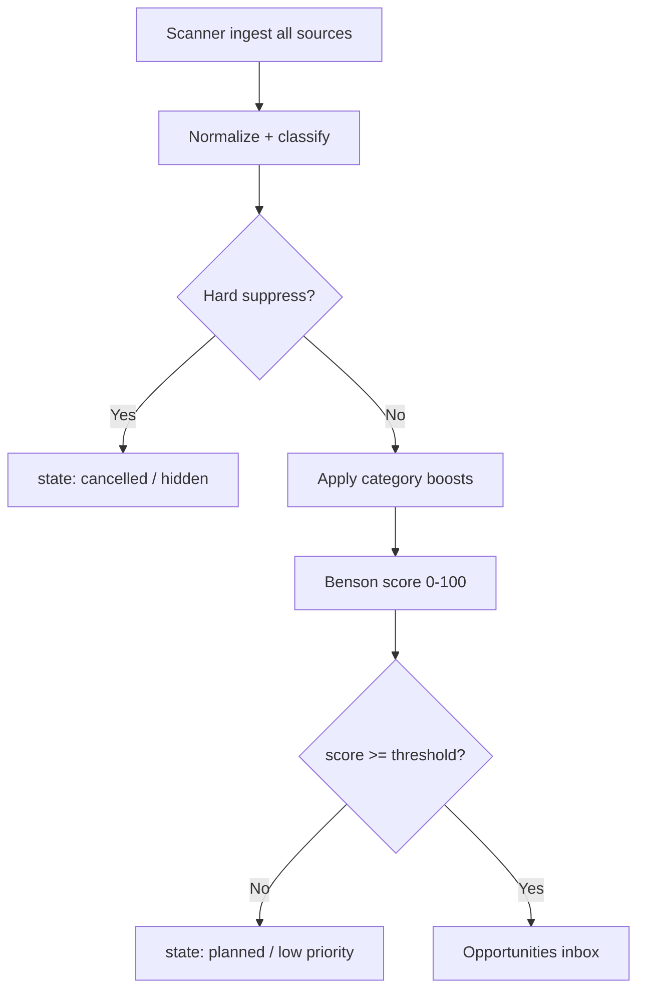

# Phase 2B — High-Value Sources Plan

**Date:** 2026-05-31  
**Status:** Planning only — no application code changes  
**Builds on:** [PHASE_2A_RSS_RESULTS.md](./PHASE_2A_RSS_RESULTS.md) · [REDDIT_403_ANALYSIS.md](./REDDIT_403_ANALYSIS.md) · [PHASE_2_KC_DATA_PLAN.md](./PHASE_2_KC_DATA_PLAN.md) · [KC_SCORING_MODEL.md](./KC_SCORING_MODEL.md) · [BENSON_VISION.md](./BENSON_VISION.md)

---

## Executive Summary

Phase 2A proved Benson can **ingest live KC data** via r/kansascity RSS. It did **not** prove the feed is **editorially aligned** with Kellie's business. A live sample of 50 ingested rows shows **60% classified as `discussion`**, dominated by help requests, contractor questions, and personal advice — not festivals, openings, or tourism moments Kellie would post.

**Phase 2B shifts the source strategy:**

1. **Add curated event/tourism sources** (Visit KC, venues, calendars) as the primary opportunity pipeline.
2. **Keep Reddit ingestion unchanged** (per constraint) but **reposition it as supplemental** behind a future quality filter.
3. **Introduce a pre-display quality gate** that suppresses low-value Reddit noise and boosts postable event categories.

**Target outcome:** Kellie's opportunities inbox is dominated by dated, venue-backed, tourism-relevant events — with Reddit surfacing occasional high-signal openings and buzz, not raw community chatter.

---

## Part 1 — Why the Current Reddit Feed Is Low-Value

### Live feed snapshot (2026-05-31)

Sample of 50 ingested r/kansascity RSS rows:

| Category | Count | Share |
|---|---|---|
| `discussion` | 30 | **60%** |
| `event` | 6 | 12% |
| `deal` | 6 | 12% |
| `attraction` | 4 | 8% |
| `restaurant_opening` | 3 | 6% |
| `festival` | 1 | 2% |

**Representative titles (actual ingested rows):**

| Title | Why low-value for Kellie |
|---|---|
| Sunroom skylight replacement | Contractor/home repair request |
| Anyone here work for Panasonic? | Job/career question |
| Need help with a few things | Generic help request |
| older stone foundations around waldo, how scary are they? | Homebuyer anxiety / advice |
| ISO car lot or auto repair shop | Recommendation shopping |
| *actually affordable* thrifting in the area? | Shopping advice thread |
| Hakes Brothers - Good or Bad? | Contractor reputation query |
| KCwater unable to log in | Troubleshooting / utility issue |
| Stupid question, any pedestrian bridges… | Personal advice |

**High-value rows in the same batch (minority):**

| Title | Why valuable |
|---|---|
| Red Lobster permanently closes 2 Kansas City area locations | Local business / food news |
| Another impressive wedding reception… Liberty Memorial | Place-based KC moment |
| Dog activities this weekend? | Weekend activity signal (weak — still a question) |

### Root causes (system + source)

#### 1. Source mismatch — community board ≠ content calendar

r/kansascity is a **general-purpose metro subreddit**. Its hot feed optimizes for engagement (questions, controversy, advice, news reactions), not for **postable tourism/content opportunities**. Kellie's business needs **events, openings, attractions, and seasonal moments** — a different signal entirely.

#### 2. RSS feed selection amplifies noise

Phase 2A uses:

```
https://www.reddit.com/r/kansascity/hot.rss?limit=50
```

The **hot** sort surfaces whatever the community is arguing about or asking right now. It does not prioritize:

- Dated events with venues
- Official announcements
- Tourism-ready experiences

There is no `flair=Event` filter in RSS (flair was planned in Phase 2 JSON config but is unavailable in Atom feeds).

#### 3. Weak classification defaults to `discussion`

Current heuristic in `services/core/src/providers/reddit.ts`:

- Keyword lists for event/festival/deal/etc. are checked in order.
- **`discussion` has empty keywords and is the default fallback.**
- Result: anything that doesn't hit a keyword → `discussion` → displayed equally in opportunities UI.

This explains the 60% discussion rate even when some rows might be tangentially event-related.

#### 4. Title blocklist is too narrow

Current blocklist (title substring only):

```
for sale, housing, job posting, lost/found, employment
```

**Not blocked but should be:** ISO, need help, anyone here, recommend, contractor, repair, stupid question, how do I, unable to log in, work for, good or bad.

#### 5. No quality gate between ingest and display

Phase 2A stores every RSS row as `content_items.state = planned` and the opportunities page shows **all** Reddit-sourced rows (`?reddit=true`). There is:

- No minimum quality threshold
- No suppress/hide for non-postable categories
- No `event_starts_at` requirement
- No source-priority weighting

#### 6. Missing structured event fields

RSS provides title, link, date published, HTML body snippet. It does **not** provide:

- Event start/end datetime
- Venue name (reliably)
- Ticket URL
- Official organizer
- "Free" / "family-friendly" flags

Kellie cannot confidently post from most Reddit rows without manual research — the opposite of Benson's promise.

#### 7. Original Phase 2A design assumed JSON + flair + score filters

The [PHASE_2_KC_DATA_PLAN.md](./PHASE_2_KC_DATA_PLAN.md) seed config included `flair_allowlist`, `min_score`, and `min_comments`. RSS mode removed all three. The POC validated **plumbing**; it did not validate **editorial fit**.

### Conclusion

The Reddit RSS POC succeeded **technically** and failed **strategically** because Benson is reading the wrong newspaper section. Fixing this requires **better sources first**, then **filtering what Reddit contributes**.

---

## Part 2 — Source Strategy for Kellie-Postable Content

### Design principles

| Principle | Implication |
|---|---|
| **Official beats crowdsourced** | Visit KC + venue calendars before Reddit hot feed |
| **Dated beats timeless** | Require or strongly prefer `event_starts_at` |
| **Venue-backed beats vague** | Union Station > "something downtown this weekend" |
| **Tourism angle beats local logistics** | Festivals, attractions, openings > ISO mechanic threads |
| **Reddit is a tip line, not the calendar** | Keep ingest; filter before Kellie sees it |

### Kellie-postable opportunity definition

An opportunity Kellie would actually post has most of:

- **Specific activity** (event, opening, exhibit, game, festival)
- **Place** (venue, neighborhood, or landmark)
- **Time** (date or "this weekend" at minimum)
- **Audience hook** (family, date night, free, seasonal, sports, food)
- **Visual potential** (Benson scoring dimension: visual appeal)

---

## Part 3 — Priority Source Profiles

### 1. Visit KC (official tourism DMO)

| Field | Detail |
|---|---|
| **URL(s)** | Main RSS: [https://news.visitkc.com/rss.xml](https://news.visitkc.com/rss.xml) · Media RSS: [https://news.visitkc.com/media_rss.xml](https://news.visitkc.com/media_rss.xml) · Events calendar: [https://www.visitkc.com/events/](https://www.visitkc.com/events/) · Blog/events hub: [https://www.visitkc.com/blog/events/](https://www.visitkc.com/blog/events/) |
| **Feed type** | **RSS** (press releases, event announcements) + **HTML scrape** (searchable events calendar — 4,000+ listings) |
| **Expected quality** | **Very high** — curated tourism voice; aligns with Kellie's audience |
| **Implementation difficulty** | **Low–Medium** — RSS is immediate; calendar requires HTML/JSON discovery or partner feed |
| **Authentication** | **None** for public RSS and calendar pages |
| **Est. daily opportunities** | **3–8** from RSS; **15–40** if calendar ingested (many duplicates across days) |

**Notes:** Verified 2026-05-31: `news.visitkc.com/rss.xml` returns valid RSS (`text/xml`). Category-specific feeds listed on [news.visitkc.com/rss](https://news.visitkc.com/rss) resolve to the same index page — use main RSS + calendar scrape for breadth.

---

### 2. KC tourism feeds (aggregate)

| Field | Detail |
|---|---|
| **URL(s)** | Visit KC (above) · KC Streetcar events: [https://kcstreetcar.org/](https://kcstreetcar.org/) · Explore KC / regional CVBs (Lenexa, Overland Park, Independence tourism pages) |
| **Feed type** | **RSS** where available; otherwise **HTML scrape** |
| **Expected quality** | **High** — official visitor-facing content |
| **Implementation difficulty** | **Medium** — heterogeneous sites, one config row per feed |
| **Authentication** | **None** for public feeds |
| **Est. daily opportunities** | **5–15** combined (after dedup) |

**Notes:** Treat as a **source bundle** in `sources` table — multiple rows, one `rss` provider each.

---

### 3. First Fridays (Crossroads)

| Field | Detail |
|---|---|
| **URL(s)** | [https://kccrossroads.org/first-fridays/](https://kccrossroads.org/first-fridays/) · Event category: [https://kccrossroads.org/events/first-friday/](https://kccrossroads.org/events/first-friday/) |
| **Feed type** | **Rule-based synthetic** (first Friday, April–October, 5–9 PM) + **HTML scrape** for monthly gallery/participant details |
| **Expected quality** | **Very high** — signature KC cultural moment; strong visual content |
| **Implementation difficulty** | **Low** — recurring date rule needs no external fetch; optional scrape for lineup |
| **Authentication** | **None** |
| **Est. daily opportunities** | **0 most days; 1 on First Friday** (~7/year peak months) |

**Notes:** Highest ROI per implementation hour. Generate opportunity 3–5 days before each First Friday with Crossroads/KC Streetcar location clues.

---

### 4. Crossroads events (district calendar)

| Field | Detail |
|---|---|
| **URL(s)** | Site RSS: [https://kccrossroads.org/feed/](https://kccrossroads.org/feed/) (verified RSS 200) · Events page: [https://kccrossroads.org/events/](https://kccrossroads.org/events/) · Night Market: [https://kccrossroads.org/crossroads-events/crossroads-night-market-2026-5/](https://kccrossroads.org/crossroads-events/crossroads-night-market-2026-5/) |
| **Feed type** | **RSS** (site posts) + **HTML scrape** (The Events Calendar / WordPress event pages) |
| **Expected quality** | **High** — art walks, markets, comedy, FIFA-adjacent 2026 programming |
| **Implementation difficulty** | **Medium** — WordPress event plugin; test `?ical=1` / REST API endpoints |
| **Authentication** | **None** |
| **Est. daily opportunities** | **2–6** during active seasons; **0–1** off-season |

---

### 5. Union Station events

| Field | Detail |
|---|---|
| **URL(s)** | [https://unionstation.org/events/](https://unionstation.org/events/) · Science City / Planetarium / exhibition pages · Visit KC listing mirror: [https://www.visitkc.com/listings/union-station-kansas-city/](https://www.visitkc.com/listings/union-station-kansas-city/) |
| **Feed type** | **HTML scrape** (JS-loaded calendar) — legacy `events-json` endpoint returned WordPress error 2026-05-31 |
| **Expected quality** | **Very high** — exhibits, Science City, concerts, seasonal installations |
| **Implementation difficulty** | **Medium–High** — dynamic page load; may need headless fetch or WP REST API discovery |
| **Authentication** | **None** for public schedule |
| **Est. daily opportunities** | **3–10** (exhibitions repeat daily; dedup by exhibition + date) |

---

### 6. Kauffman Center events

| Field | Detail |
|---|---|
| **URL(s)** | [https://www.kauffmancenter.org/events/](https://www.kauffmancenter.org/events/) · Ticketing: [https://tickets.kauffmancenter.org/events](https://tickets.kauffmancenter.org/events) · Harriman-Jewell Series: [https://www.hjseries.org/events](https://www.hjseries.org/events) |
| **Feed type** | **HTML scrape** · Per-event **ICS** links on partner pages (no unified venue ICS) |
| **Expected quality** | **Very high** — concerts, ballet, symphony; premium Kellie content |
| **Implementation difficulty** | **Medium–High** — multiple presenters (KC Symphony, Lyric Opera, KC Ballet) on one campus |
| **Authentication** | **None** for public listings |
| **Est. daily opportunities** | **1–4** new/changed per day |

---

### 7. KC Current events (NWSL)

| Field | Detail |
|---|---|
| **URL(s)** | [https://www.kansascitycurrent.com/schedule/](https://www.kansascitycurrent.com/schedule/) · [https://www.kansascitycurrent.com/news/](https://www.kansascitycurrent.com/news/) |
| **Feed type** | **HTML scrape** · Possible **ICS** via "Add to Calendar" on schedule page |
| **Expected quality** | **High** (seasonal) — sports + growing women's sports audience |
| **Implementation difficulty** | **Medium** — MLS/NWSL sites use league templates; schedule is structured |
| **Authentication** | **None** |
| **Est. daily opportunities** | **0–1** (match-day spikes March–October) |

---

### 8. Sporting KC events (MLS)

| Field | Detail |
|---|---|
| **URL(s)** | [https://www.sportingkc.com/schedule/](https://www.sportingkc.com/schedule/) · [https://www.sportingkc.com/news/](https://www.sportingkc.com/news/) |
| **Feed type** | **HTML scrape** · Third-party **ICS** (e.g. fixtur.es) as fallback — prefer official source |
| **Expected quality** | **High** — major KC sports brand; World Cup 2026 adjacency |
| **Implementation difficulty** | **Medium** — structured schedule table |
| **Authentication** | **None** |
| **Est. daily opportunities** | **0–1** (match weeks); **2–3/week** during season |

---

### 9. KC Zoo events

| Field | Detail |
|---|---|
| **URL(s)** | [https://kansascityzoo.org/events](https://kansascityzoo.org/events) · Daily schedule: [https://kansascityzoo.org/events/daily-schedule](https://kansascityzoo.org/events/daily-schedule) |
| **Feed type** | **HTML scrape** |
| **Expected quality** | **High** for family/tourism content — Jazzoo, seasonal days, animal chats |
| **Implementation difficulty** | **Medium** — monthly event grid + recurring daily programs |
| **Authentication** | **None** |
| **Est. daily opportunities** | **1–3** (dedup daily chats vs special events) |

---

### 10. Powell Gardens events

| Field | Detail |
|---|---|
| **URL(s)** | [https://powellgardens.org/events-and-classes/](https://powellgardens.org/events-and-classes/) |
| **Feed type** | **HTML scrape** · Test WordPress **`?ical=1`** / events plugin export |
| **Expected quality** | **High** — festivals (butterflies, lights), classes, seasonal exhibitions |
| **Implementation difficulty** | **Medium** — filterable calendar (Class/Exhibition/Festival/Free) |
| **Authentication** | **None** |
| **Est. daily opportunities** | **2–5** |

---

### 11. Local festival calendars (aggregate)

| Field | Detail |
|---|---|
| **URL(s)** | Visit KC Special Events RSS content via [news.visitkc.com/rss.xml](https://news.visitkc.com/rss.xml) · Crossroads Night Market (Jun–Jul 2026) · [KC Restaurant Week](https://www.kcrestaurantweek.com/) · Plaza Art Fair · Brookside Art Annual · Ethnic Enrichment Festival · KC Irish Fest · Boulevardia · Uncorked KC |
| **Feed type** | **RSS** (announcements) + **HTML scrape** + **rule-based** (known annual dates) |
| **Expected quality** | **Very high** — core Kellie content pillars |
| **Implementation difficulty** | **Medium** — many one-off configs; annual recurrence rules reduce ongoing cost |
| **Authentication** | **None** for public pages |
| **Est. daily opportunities** | **1–5** (spikes around festival announcements; quiet between seasons) |

**Notes:** Maintain a **`sources` seed pack** of ~15 annual KC festivals with known months; scanner generates opportunities when within lead window (14–21 days out).

---

### 12. Free event calendars (aggregate)

| Field | Detail |
|---|---|
| **URL(s)** | Visit KC events (free filter on [visitkc.com/events](https://www.visitkc.com/events/)) · KC Public Library events · KCMO Parks & Rec · First Fridays (free admission) · Nelson-Atkins free days · Kemper Museum · Money Museum |
| **Feed type** | **HTML scrape** · Some **ICS** (libraries, parks) |
| **Expected quality** | **High** — "free things to do" is a proven social content format |
| **Implementation difficulty** | **Medium–High** — fragmented; tag `metadata.price = free` during normalize |
| **Authentication** | **None** |
| **Est. daily opportunities** | **3–12** |

---

## Part 4 — Implementation Ranking

Sources ranked by **(editorial value × 2) + (ease × 1) + (daily yield × 0.5)**, highest first.

| Rank | Source | Feed type | Quality | Difficulty | Auth | Est. daily | Phase |
|---|---|---|---|---|---|---|---|
| **1** | Visit KC main RSS | RSS | Very high | Low | None | 3–8 | **2B.1** |
| **2** | First Fridays (rule-based) | Synthetic + HTML | Very high | Low | None | 0–1 | **2B.1** |
| **3** | Crossroads site RSS | RSS | High | Low–Med | None | 2–6 | **2B.1** |
| **4** | Powell Gardens events | HTML/ICS | High | Medium | None | 2–5 | **2B.2** |
| **5** | KC Zoo events | HTML | High | Medium | None | 1–3 | **2B.2** |
| **6** | Visit KC events calendar | HTML scrape | Very high | Medium | None | 15–40 | **2B.2** |
| **7** | Union Station events | HTML scrape | Very high | Med–High | None | 3–10 | **2B.2** |
| **8** | Kauffman Center events | HTML/ICS | Very high | Med–High | None | 1–4 | **2B.3** |
| **9** | Local festival calendar pack | RSS + rules | Very high | Medium | None | 1–5 | **2B.3** |
| **10** | Sporting KC schedule | HTML/ICS | High | Medium | None | 0–1 | **2B.3** |
| **11** | KC Current schedule | HTML/ICS | High | Medium | None | 0–1 | **2B.3** |
| **12** | Free events aggregate | HTML/ICS | High | Med–High | None | 3–12 | **2B.4** |
| **13** | Crossroads events HTML | HTML scrape | High | Medium | None | 2–6 | **2B.4** |
| **14** | Reddit r/kansascity RSS *(existing)* | RSS | Low–Med | **Done** | None | 50 raw → **3–8 filtered** | **2B.4** (filter only) |
| **15** | The Pitch calendar | HTML articles | Med–High | High | None | 2–5 | **2C** |

### Recommended phasing

| Phase | Deliverable | Kellie-visible impact |
|---|---|---|
| **2B.1** | Visit KC RSS + First Fridays rules + Crossroads RSS | Immediate shift from "Reddit help threads" to official KC announcements |
| **2B.2** | Venue HTML scrapers (Zoo, Powell, Union Station) + Visit KC calendar | Dated, venue-backed daily opportunities |
| **2B.3** | Kauffman + sports schedules + festival seed pack | Concerts, games, seasonal festivals |
| **2B.4** | Free-events layer + Reddit quality filter | Polished inbox; Reddit as tip line only |

---

## Part 5 — Reddit: Primary, Supplemental, or Remove?

### Recommendation: **Supplemental source** (keep ingest, change presentation)

| Option | Verdict | Rationale |
|---|---|---|
| **Primary source** | **Reject** | 60% discussion; no event dates; wrong signal for Kellie's content business |
| **Supplemental source** | **Accept** | Reddit catches restaurant buzz, soft openings, and community moments official calendars miss — *after filtering* |
| **Remove entirely** | **Reject** | Loses early signal on openings and local chatter; Phase 2A plumbing works; zero-cost to keep at low volume |

### Supplemental operating model

| Aspect | Current (2A) | Target (2B+) |
|---|---|---|
| **Scan frequency** | 6h cron | **Daily** (or 2×/day max) |
| **Ingest cap** | 50/run | **50 ingest → ≤10 pass filter** |
| **UI visibility** | All Reddit rows in opportunities | **Filtered rows only**; optional "community tips" tab |
| **Source priority** | Only source | **Rank below all venue/tourism sources** |
| **Default sort** | By ingest time | **By quality score + event date** |

### When Reddit *is* worth keeping

- Restaurant/bar soft opening chatter (often beats official PR)
- "Grand opening" neighborhood posts
- Festival buzz threads with dates in comments
- Viral local moments (Liberty Memorial wedding photo, plaza events)

### When Reddit should never surface

- ISO / recommendation requests
- Contractor, repair, homeownership questions
- Job/career posts
- Utility/troubleshooting threads
- Political news without tourism angle

**Constraint honored:** Phase 2B does **not** modify existing Reddit ingestion code. Changes are **planning-only** — filter applies in a **future scoring/display layer** (`ENABLE_KC_SCORING` / quality gate).

---

## Part 6 — Future Opportunity Quality Filter (Design)

A two-stage gate applied **after ingest, before Kellie's inbox**. Aligns with [KC_SCORING_MODEL.md](./KC_SCORING_MODEL.md) pre-filter stage.



### Stage 1 — Hard suppress (automatic, no LLM required)

Set `metadata.suppressed = true` and `state = cancelled` (or dedicated `discovered_hidden` state). **Never show in opportunities UI.**

| Suppress class | Detection signals (title + body) | Example from live feed |
|---|---|---|
| **Help requests** | `need help`, `ISO`, `anyone know`, `where can I`, `looking for`, `recommend`, `suggestions?` | "Need help with a few things" |
| **Personal advice** | `should I`, `what do you think`, `stupid question`, `how scary`, `anyone here` | "older stone foundations… how scary are they?" |
| **Job questions** | `work for`, `hiring`, `job`, `career`, `interview`, `employer` | "Anyone here work for Panasonic?" |
| **Contractor recommendations** | `contractor`, `repair`, `replace`, `HVAC`, `plumber`, `roof`, `foundation`, `skylight`, `good or bad` | "Sunroom skylight replacement" |
| **General discussions** | Default `discussion` category AND no date/venue/location AND no boost keywords | Most hot-feed threads |
| **Troubleshooting** | `unable to`, `can't log in`, `how do I fix`, `problem with`, `error`, `not working` | "KCwater unable to log in" |

**Implementation:** Regex/keyword lists in `metadata.qualityGate` — fast, deterministic, auditable. Optional Phase 2C: lightweight LLM confirm for borderline rows only.

### Stage 2 — Category boost (soft scoring hints)

Add `metadata.qualityBoost` points (0–30) before Benson composite score. Sources from official calendars start with **+20 base**; Reddit starts at **0**.

| Boost category | Keywords / signals | Source examples |
|---|---|---|
| **Festivals** | festival, first fridays, art fair, street fair, parade, fest | Crossroads, Visit KC |
| **Concerts** | concert, live music, symphony, tour, performs at | Kauffman, Sporting venues |
| **Restaurant openings** | opening, soft open, grand opening, new restaurant, new spot | Reddit (filtered), Visit KC Dining RSS |
| **Family activities** | family, kids, zoo, aquarium, science city, children | KC Zoo, Union Station |
| **Attractions** | exhibit, museum, gallery, opening, installation | Nelson-Atkins, Union Station |
| **Sporting events** | sporting kc, current, chiefs, royals, match, game day, vs. | SKC, Current, Chiefs |
| **Tourism** | visit kc, things to do, visitor, explore, destination | Visit KC |
| **Free events** | free admission, free entry, no cover, complimentary, $0 | First Fridays, library, parks |
| **Seasonal events** | halloween, holiday, christmas, world cup, restaurant week, summer guide | Visit KC releases |
| **Weekend activities** | this weekend, saturday, sunday, friday night, tonight | All calendars |

### Stage 3 — Display threshold

| Source tier | Default minimum Benson score to show |
|---|---|
| Official tourism / venue | **40** (lenient — trusted sources) |
| Festival calendar pack | **35** |
| Reddit supplemental | **65** (strict — must be clearly postable) |

### Filter output schema (stored in `metadata.qualityGate`)

```json
{
  "suppressed": false,
  "suppressReason": null,
  "boostCategories": ["festival", "free_events"],
  "boostPoints": 25,
  "sourceTier": "official_rss",
  "matchedSuppressRules": [],
  "matchedBoostRules": ["first fridays", "free admission"],
  "displayEligible": true
}
```

### Expected impact on live Reddit batch

Applying suppress rules to the 2026-05-31 sample (estimated):

| Outcome | Est. count (of 50) |
|---|---|
| Hard suppressed | **~35–40** |
| Pass to scoring | **~10–15** |
| Display-eligible (score ≥ 65) | **~3–8** |

Combined with Visit KC + venue sources (**~15–30 high-quality/day**), Kellie's inbox flips from **60% noise** to **80%+ postable content**.

---

## Part 7 — Architecture Notes (Future Implementation)

### Provider types to add (no code in this phase)

| Provider | `source_type` enum | Config shape |
|---|---|---|
| Visit KC RSS | `rss` | `{ url, categoryTag }` |
| Venue HTML | `scrape` | `{ url, selectors, venue }` |
| Recurring festival | `manual` | `{ cronRule, title, location, url }` |
| ICS calendar | `ics` | `{ url, timezone }` |

### Deduplication across sources

Same event may appear on Visit KC + Union Station + Reddit. Dedup key:

```
normalize(title) + event_starts_at(date) + normalize(venue)
```

Keep highest `sourceTier` row; merge URLs into `metadata.alternateUrls`.

### Opportunities UI (future)

| Tab | Contents |
|---|---|
| **Recommended** | Score ≥ threshold, sorted by date + score |
| **This weekend** | `event_starts_at` within Fri–Sun |
| **Community tips** | Passed-filter Reddit only |
| **All sources** | Power-user view |

---

## Part 8 — Success Metrics for Phase 2B

| Metric | Phase 2A baseline | Phase 2B target |
|---|---|---|
| % opportunities with `event_starts_at` | ~0% | **≥70%** |
| % `discussion` category in inbox | ~60% | **≤10%** |
| % from official tourism/venue sources | 0% | **≥60%** |
| Avg Benson score of displayed rows | N/A (no scoring) | **≥55** |
| Kellie approval rate (approve / reviewed) | Unknown | **≥40%** |

---

## Part 9 — Out of Scope (Phase 2B Plan Only)

- Modifying existing Reddit RSS ingestion (`services/core/src/providers/reddit.ts`)
- OAuth Reddit JSON
- Benson scoring engine implementation (`ENABLE_KC_SCORING`)
- LLM ranking
- Eventbrite / Google Maps
- UI redesign beyond filter tabs (future)

---

## Summary

| Question | Answer |
|---|---|
| Why is Reddit low-value? | Wrong source type (community Q&A), hot sort, weak classification default, no quality gate, no event structure |
| What sources first? | Visit KC RSS → First Fridays rules → Crossroads RSS → venue calendars |
| Reddit role? | **Supplemental** — keep ingest, filter before display |
| Quality filter? | Hard suppress 6 noise classes; boost 10 postable categories; tiered display thresholds |

**Next step after approval:** Implement Phase 2B.1 sources (Visit KC RSS + First Fridays + Crossroads RSS) as new `sources` rows — separate from Reddit provider.

---

**Planning complete. No application code modified.**
