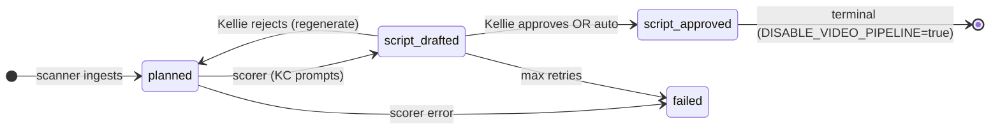

# Phase 2 — Kansas City Data Ingestion Plan

**Date:** 2026-05-31  
**Status:** Planning only — no application code changes  
**Builds on:** Phase 1 complete ([PHASE1_STEP5_RESULTS.md](./PHASE1_STEP5_RESULTS.md))  
**Context:** [KELLIE_TRANSFORMATION_PLAN.md](./KELLIE_TRANSFORMATION_PLAN.md) · [KELLIE_PRODUCT_SPEC.md](./KELLIE_PRODUCT_SPEC.md) · [BENSON_VISION.md](./BENSON_VISION.md) · [MVP_SIMPLIFICATION.md](./MVP_SIMPLIFICATION.md) · [FEATURE_FLAGS.md](./FEATURE_FLAGS.md)

---

## Purpose

Phase 2 replaces the inherited **synthetic quota planner** with **real Kansas City signal ingestion**. Benson discovers opportunities from external sources, scores them for Kellie's editorial focus, and presents them for review — using the existing `content_items` queue, approval flow, and audit trail established in Phase 1.

**North-star loop:** Scan KC sources → normalize → deduplicate → score → inbox → Kellie approves or rejects.

---

## Current Implementation Baseline (Post–Phase 1)

| Layer | Today | Phase 2 target |
|---|---|---|
| **Discovery** | `planner` worker creates synthetic `planned` rows from weekly quotas | `scanner` ingests real posts/events into `planned` |
| **Drafting** | `script-writer` generates video scripts (topic/hook/script) | `scorer` (same worker slot) writes KC summary + angle + scores |
| **Approval** | HITL inbox at `script_drafted`; approve → `script_approved` | Same states; Benson copy; terminal at `script_approved` when `DISABLE_VIDEO_PIPELINE=true` |
| **API** | `/api/content` + `/api/opportunities` (DTO alias) | Unchanged legacy routes; scanner via `/api/planner/run` then `/api/scanner/run` alias |
| **DB** | `content_items`, `campaigns`, `industries`, `workflow_runs` | Additive columns + `sources` table; no table renames in Phase 2A |
| **Providers** | LLM, HeyGen, Instagram, TikTok, image | New: `reddit`, `rss`, `ics`, `eventbrite`, `google-maps` |
| **Feature flags** | Benson UI/API/video gating (Steps 1–5) | `ENABLE_KC_SCANNER`, `ENABLE_KC_SCORING`, `ENABLE_MOCK_KC_SOURCES` |

**Recommended runtime preset for Phase 2 development:**

```bash
DISABLE_VIDEO_PIPELINE=true
ENABLE_BENSON_BRANDING=true
ENABLE_BENSON_TERMINOLOGY=true
ENABLE_OPPORTUNITIES_UI=true
ENABLE_OPPORTUNITIES_API=true
ENABLE_KC_SCANNER=true          # Phase 2A
ENABLE_KC_SCORING=true          # Phase 2A
```

---

## Source Evaluation

Six source families requested for evaluation. Rankings use **1 = best** (highest rank).

### Implementation difficulty (1 = easiest)

| Rank | Source | Difficulty | Rationale |
|---|---|---|---|
| **1** | **Reddit r/kansascity** | Low | Public JSON endpoint (`/r/kansascity/hot.json`); well-documented shape; no OAuth for MVP volume; existing plan + mock provider spec |
| **2** | **Visit KC** | Low–Medium | Official RSS at [news.visitkc.com/rss](https://news.visitkc.com/rss) including **Event** content type and category feeds (Arts & Culture, Music, Dining, etc.); main [visitkc.com/events](https://www.visitkc.com/events/) calendar may need HTML/API discovery for structured dates |
| **3** | **Local event calendars** | Medium | Heterogeneous: venue ICS links (Squarespace), RSS, JSON-LD on WordPress sites; each source is a one-off config row, not one integration |
| **4** | **KC2026 / FIFA World Cup KC** | Medium | High-value but fragmented: Visit KC press/convention RSS, FIFA/KC2026 official site (scrape or partner feed), Ticketmaster Discovery API for match events; seasonal spike; ToS scrutiny |
| **5** | **Eventbrite** | Medium–High | Official Event Search API requires OAuth private token, pagination, location filter tuning; stable schema but account + rate limits |
| **6** | **Google Maps** | High | Places API (New) requires billing account, key restriction, geo queries, ongoing cost; best for venue/opening discovery, not breaking news |

### Content value for Kellie's KC content strategy (1 = highest)

| Rank | Source | Value | Why |
|---|---|---|---|
| **1** | **Reddit r/kansascity** | Very high | Real-time community signal, neighborhood context, restaurant/opening chatter, event buzz, flair filtering; matches Benson's "what KC is talking about" |
| **2** | **Visit KC** | Very high | Curated official events, tourism calendar, FIFA/KC2026 adjacent programming, neighborhood festivals |
| **3** | **KC2026 / FIFA World Cup KC** | Very high (seasonal) | Time-bound, high audience interest during 2026; best as **feeds derived from Visit KC + official KC2026 pages**, not a separate integration on day one |
| **4** | **Local event calendars** | High | Kauffman Center, Crossroads First Fridays, Nelson-Atkins, city/neighborhood calendars — structured dates + venues |
| **5** | **Eventbrite** | Medium–High | Broad long-tail events; noisier than curated feeds; good supplement after RSS baseline |
| **6** | **Google Maps** | Medium | Strong for "new opening" and venue discovery; weak for narrative angles and breaking conversation |

### API key requirements

| Source | Without API key | API key / credentials | MVP path |
|---|---|---|---|
| **Reddit r/kansascity** | ✓ Public JSON + User-Agent header (low volume) | OAuth app (Phase 2C) for rate limits | **No key for 2A** |
| **Visit KC** | ✓ RSS feeds (Event + category feeds) | None for RSS | **No key for 2B** |
| **Local event calendars** | ✓ RSS / public ICS URLs per venue | None for most KC venue calendars | **No key for 2B** |
| **KC2026 / FIFA KC** | ✓ Visit KC RSS + HTML scrape of official schedule pages | Ticketmaster Discovery API key (optional 2C) | **No key for 2B** (RSS/scrape first) |
| **Eventbrite** | ✗ | `EVENTBRITE_API_TOKEN` (private OAuth token) | **Key required — Phase 2C** |
| **Google Maps** | ✗ | `GOOGLE_MAPS_API_KEY` (Places API, billing enabled) | **Key required — Phase 2C** |

### Combined recommendation matrix

| Source | Difficulty | Value | No-key MVP? | Phase |
|---|---|---|---|---|
| Reddit r/kansascity | 1 | 1 | Yes | **2A** |
| Visit KC (Event RSS) | 2 | 2 | Yes | **2B** |
| Local calendars (ICS/RSS) | 3 | 4 | Yes | **2B** |
| KC2026 / FIFA (via Visit KC + official pages) | 4 | 3 | Mostly | **2B** |
| Eventbrite | 5 | 5 | No | **2C** |
| Google Maps | 6 | 6 | No | **2C** |

---

## First Source Recommendation

**Implement Reddit r/kansascity first (Phase 2A).**

| Factor | Detail |
|---|---|
| **Alignment** | Unanimous across [KELLIE_TRANSFORMATION_PLAN.md §9](./KELLIE_TRANSFORMATION_PLAN.md), [KELLIE_PRODUCT_SPEC.md](./KELLIE_PRODUCT_SPEC.md), and [BENSON_VISION.md](./BENSON_VISION.md) |
| **Effort** | 2–3 days for provider + scanner + seed row + verification |
| **Risk** | Low — public read-only; mock provider for CI/demo |
| **Value** | Immediate real KC signal; validates full discover → score → review loop |
| **Dependencies** | None beyond OpenAI key (already used by script-writer) |

**Seed config (first `sources` row):**

```json
{
  "subreddit": "kansascity",
  "sort": "hot",
  "limit": 25,
  "min_score": 5,
  "min_comments": 1,
  "flair_allowlist": ["Event", "Food", "News", "Recommendation"],
  "flair_blocklist": ["For Sale", "Housing", "Job Posting", "Lost/Found"]
}
```

**Phase 2B adds Visit KC Event RSS** as the second source — pairs well with Reddit (conversation + official calendar).

---

## Recommended Database Schema Changes

Phase 2 uses **additive migrations only**. Legacy planner rows and video-era columns remain. Map Benson concepts onto existing tables until a later rename migration.

### Migration 1 — `sources` table (Phase 2A)

```sql
CREATE TYPE source_type AS ENUM (
  'reddit', 'rss', 'ics', 'event_api', 'google_maps', 'manual', 'scrape'
);

CREATE TABLE sources (
  id              UUID PRIMARY KEY DEFAULT gen_random_uuid(),
  campaign_id     UUID NOT NULL REFERENCES campaigns(id) ON DELETE CASCADE,
  type            source_type NOT NULL,
  name            TEXT NOT NULL,
  config          JSONB NOT NULL DEFAULT '{}',
  active          BOOLEAN NOT NULL DEFAULT true,
  poll_interval_cron TEXT,
  last_scan_at    TIMESTAMPTZ,
  last_error      TEXT,
  created_at      TIMESTAMPTZ NOT NULL DEFAULT now(),
  updated_at      TIMESTAMPTZ NOT NULL DEFAULT now()
);
```

Singleton workspace: all sources FK to seeded **Demo Brand** / future **Kellie KC** campaign ([MVP_SIMPLIFICATION.md](./MVP_SIMPLIFICATION.md) Option A).

### Migration 2 — Additive columns on `content_items` (Phase 2A)

| Column | Type | Purpose |
|---|---|---|
| `source_id` | UUID FK → sources, nullable | Which source discovered this row |
| `source_external_id` | TEXT, nullable | Reddit post id, event id — exact dedup |
| `source_url` | TEXT, nullable | Canonical permalink |
| `discovered_at` | TIMESTAMPTZ, nullable | When scanner ingested (vs `created_at` planner legacy) |
| `relevance_score` | NUMERIC(4,3), nullable | 0–1 from scorer |
| `urgency_score` | NUMERIC(4,3), nullable | 0–1 from scorer |
| `event_starts_at` | TIMESTAMPTZ, nullable | Events only |
| `event_ends_at` | TIMESTAMPTZ, nullable | Events only |
| `location_name` | TEXT, nullable | Venue or neighborhood |
| `location_lat` | NUMERIC, nullable | Geo filter / future map |
| `location_lng` | NUMERIC, nullable | Geo filter / future map |
| `raw_payload` | JSONB, nullable | Normalized source snapshot for scorer + audit |

**Indexes:**

```sql
CREATE UNIQUE INDEX idx_content_source_external
  ON content_items (source_id, source_external_id)
  WHERE source_id IS NOT NULL AND source_external_id IS NOT NULL;

CREATE INDEX idx_content_discovered_at ON content_items (discovered_at DESC);
CREATE INDEX idx_content_relevance ON content_items (relevance_score DESC NULLS LAST);
```

**Reuse existing columns:**

| Legacy column | KC opportunity use |
|---|---|
| `topic` / API `title` | Headline from source or LLM-refined title |
| `hook` / `angle` | Suggested content angle |
| `script` / `summary` | Benson 2–4 sentence summary |
| `topic_embedding` | Semantic dedup (keep) |
| `metadata` | Scorer rationale JSON, flair, Reddit score, Benson labels until dedicated columns land |
| `type` | Extend usage: treat as opportunity type where `reddit_post`, `event` map to existing `content_type` enum values or `metadata.opportunityType` until enum extended |
| `industry_id` | Maps to KC category (existing `industries` table = categories) |
| `state` | See lifecycle below — no enum change in Phase 2A |

### Migration 3 — `scan_runs` audit table (Phase 2A)

```sql
CREATE TABLE scan_runs (
  id              UUID PRIMARY KEY DEFAULT gen_random_uuid(),
  source_id       UUID REFERENCES sources(id) ON DELETE SET NULL,
  campaign_id     UUID NOT NULL REFERENCES campaigns(id),
  started_at      TIMESTAMPTZ NOT NULL DEFAULT now(),
  finished_at     TIMESTAMPTZ,
  status          TEXT NOT NULL DEFAULT 'running',
  items_found     INT NOT NULL DEFAULT 0,
  items_created   INT NOT NULL DEFAULT 0,
  items_skipped   INT NOT NULL DEFAULT 0,
  error           TEXT,
  payload         JSONB
);
```

Complements existing `workflow_runs` — scan-level audit vs item-level state transitions.

### Migration 4 — Campaign geo defaults (Phase 2A, optional)

Add to `campaigns` (or `metadata` if avoiding campaign DDL):

| Column | Default | Purpose |
|---|---|---|
| `geo_center_lat` | 39.0997 | Downtown KC |
| `geo_center_lng` | -94.5786 | |
| `geo_radius_km` | 50 | Metro filter for scorer |
| `brand_voice` | TEXT, nullable | Scorer prompt context |

**Deferred to Phase 2C+:** `clients` table rename, `opportunities` table split, `opportunity_state` enum migration.

---

## Recommended Scoring Inputs

Scoring reuses the **`script-writer` worker slot** behind `ENABLE_KC_SCORING` ([FEATURE_FLAGS.md](./FEATURE_FLAGS.md)). Inputs align with [KELLIE_PRODUCT_SPEC.md § Scoring](./KELLIE_PRODUCT_SPEC.md).

### Universal inputs (all sources)

| Input | Source in DB | Use |
|---|---|---|
| Raw normalized payload | `raw_payload` | Title, body, URL, timestamps |
| Workspace brand voice | `campaigns.brand_voice` or description | Tone + editorial fit |
| Active categories | `campaign_industries` + `industries` | Category assignment + weight |
| Geo boundary | `geo_center_*`, `geo_radius_km` | Filter non-KC / out-of-metro |
| Recent decisions | Last 90d `script_approved` / rejections | Taste + dedup context |
| Embedding | `topic_embedding` | Semantic dedup > 0.85 → archive |

### Source-specific inputs

| Source | Extra inputs | Score effects |
|---|---|---|
| **Reddit** | `score`, `num_comments`, `link_flair_text`, `created_utc`, self vs link post | High engagement ↑ relevance; blocklisted flair ↓; recency ↑ urgency |
| **Visit KC / RSS events** | `event_starts_at`, venue, categories from feed tags | Days-until-event → urgency; category tag match → relevance |
| **ICS / local calendars** | VEVENT DTSTART/DTEND, LOCATION, SUMMARY | Structured urgency; venue for angle |
| **KC2026 / FIFA** | Event date, venue (GEHA Field at Arrowhead), official vs fan posts | Urgency spike within 7 days; cross-ref Reddit threads for relevance boost |
| **Eventbrite** | Ticket availability, category id, organizer | Long-tail discovery; paid vs free heuristics |
| **Google Maps** | `rating`, `user_ratings_total`, `business_status`, opening date signals | New opening detection; lower narrative value without Reddit corroboration |

### Scorer outputs (written to existing columns)

| Output | Field | Inbox rule |
|---|---|---|
| Relevance | `relevance_score` | ≥ 0.75 auto-approve (if `autonomy_mode=auto`); 0.50–0.74 inbox; < 0.50 archive |
| Urgency | `urgency_score` | Display only in MVP; sort key on approvals |
| Category | `industry_id` | FK to seeded KC category |
| Summary | `script` | Approval card body |
| Angle | `hook` | Approval card subtitle |
| Title | `topic` | List + card headline |
| Rationale | `metadata.scorerRationale` | "Why Benson scored it this way" bullets |

**LLM requirement:** `OPENAI_API_KEY` (existing). `DEMO_MODE=true` uses deterministic mock scores.

---

## Recommended Opportunity Lifecycle

Phase 2 **maps KC lifecycle onto existing `content_state` enum** — no enum migration in 2A/2B.



| Benson display (Phase 1 terminology) | DB `content_state` | Set by | Terminal? |
|---|---|---|---|
| discovered | `planned` | Scanner | No — awaiting score |
| pending_review | `script_drafted` | Scorer | No — in inbox |
| approved | `script_approved` | Approval API / approval-gate | **Yes** (video disabled) |
| rejected → retry | `planned` | Reject API (clears script, keeps source link) | No |
| archived (low score) | `cancelled` or `metadata.archived=true` + stay `planned` | Scorer | Yes — hidden from inbox |
| failed | `failed` | Worker error | Yes — review in runs |

**Exact dedup:** Scanner skips insert when `(source_id, source_external_id)` already exists.

**Semantic dedup:** Scorer compares embedding to 90-day window; near-duplicates archived with note in `metadata`.

**Legacy coexistence:** Quota planner rows (no `source_id`) continue to flow through old script-writer prompts when `ENABLE_KC_SCANNER=false`.

---

## Phased Roadmap

### Phase 2A — Foundation + Reddit (first real source)

**Goal:** End-to-end real ingest from r/kansascity through scoring to Kellie's inbox.

| Work item | Deliverable |
|---|---|
| DB migrations | `sources`, `scan_runs`, additive `content_items` columns |
| `services/core/src/scanner/` | Orchestrator: poll sources → normalize → dedup → insert `planned` |
| `services/core/src/providers/reddit.ts` | `fetchPosts`, `normalizePost`, mock provider |
| `ENABLE_KC_SCANNER` flag | Scanner replaces planner cron when true; planner kept when false |
| `ENABLE_KC_SCORING` flag | Script-writer uses KC scorer prompts when true |
| `ENABLE_MOCK_KC_SOURCES` flag | Deterministic KC-flavored Reddit fixtures in demo |
| Seed | One active Reddit source on Demo Brand campaign |
| API | `POST /api/scanner/run` alias (optional); extend `/api/runs` or scan_runs endpoint for scan audit |
| Dashboard | Wire `/opportunities` to `/api/opportunities`; show `source_url` on cards (minimal) |

**Exit criteria:**

- [ ] Scan pulls real r/kansascity posts (or mock in demo)
- [ ] Scorer populates title/summary/angle + relevance_score
- [ ] Items appear in `/approvals` with Benson copy
- [ ] Approve → `script_approved` and **stops** (with `DISABLE_VIDEO_PIPELINE=true`)
- [ ] Re-scan skips exact duplicates
- [ ] Legacy mode unchanged with all Phase 2 flags false

| Estimate | Risk |
|---|---|
| **5–7 engineering days** | **Low** — well-specified; public API; builds on Phase 1 |

**Risks:** Reddit rate limits (mitigate: User-Agent, 6h cron, OAuth in 2C); LLM cost per item (mitigate: pre-filter by flair/score before LLM).

---

### Phase 2B — Event feeds + KC calendar layer

**Goal:** Structured events with dates, venues, and urgency scoring.

| Work item | Deliverable |
|---|---|
| `providers/rss.ts` | Generic RSS/Atom parser → normalized event/article |
| `providers/ics.ts` | VEVENT parser, lookahead window |
| Seed sources | Visit KC Event RSS; 2–3 local calendars (e.g. Kauffman Center, Crossroads, city calendar if ICS available) |
| KC2026 / FIFA | Dedicated source row pointing at Visit KC convention/special-events RSS + optional scrape of [KC FIFA host site](https://www.visitkc.com/) schedule pages — not a bespoke FIFA API |
| Scorer | Event-aware urgency prompt (days until start); geo from venue text |
| Dashboard | Event date + location on opportunity cards; sort by urgency |

**Suggested source rows (2B seed):**

| Name | Type | Config highlight |
|---|---|---|
| Visit KC Events | `rss` | `news.visitkc.com` Event feed |
| Visit KC Arts & Culture | `rss` | Category feed |
| KC2026 / FIFA programming | `rss` | Visit KC convention / special events feeds |
| Kauffman Center | `ics` or `rss` | Venue public calendar URL |
| Crossroads First Fridays | `rss` or `scrape` | Monthly art walk |

**Exit criteria:**

- [ ] Events arrive with `event_starts_at` populated
- [ ] Urgency score reflects proximity (e.g. event in 2 days → high)
- [ ] Reddit + Visit KC dedup cross-source (same First Fridays from both → one inbox item)

| Estimate | Risk |
|---|---|
| **4–6 engineering days** | **Medium** — feed heterogeneity; Visit KC main calendar may need HTML parsing if RSS lacks dates |

**Risks:** RSS items without structured dates (mitigate: LLM date extraction, lower urgency default); feed URL changes (mitigate: `sources.last_error` + dashboard alert).

---

### Phase 2C — API-backed sources + hardening

**Goal:** Long-tail events, venue discovery, production-grade ingest.

| Work item | Deliverable |
|---|---|
| `providers/eventbrite.ts` | Event Search API, KC geo filter |
| `providers/google-maps.ts` | Nearby Search / Place Details for openings |
| Reddit OAuth | `REDDIT_CLIENT_ID/SECRET` for higher rate limits |
| Optional | Ticketmaster Discovery for Chiefs/Royals/sporting + FIFA ticketed events |
| Settings UI | `/settings/sources` — toggle sources, view last scan (deferred from MVP_SIMPLIFICATION) |
| Cross-source intelligence | Boost relevance when Reddit + event source agree |
| n8n | `01-scanner-cron.json` daily 6 AM CST |

**Exit criteria:**

- [ ] Eventbrite events ingest with token
- [ ] Google Maps "new restaurant" query returns venue opportunities
- [ ] Production env documented in `.env.example`
- [ ] Rate limit + error handling on all providers

| Estimate | Risk |
|---|---|
| **6–10 engineering days** | **Medium–High** — API keys, billing, ToS, ongoing cost monitoring |

**Risks:** Google Maps cost (mitigate: strict quotas, cache, weekly not hourly); Eventbrite API access approval; scraping ToS for any remaining HTML sources.

---

## Timeline Summary

| Phase | Duration | Cumulative | Delivers |
|---|---|---|---|
| **2A** — Reddit + schema + scanner + scorer | 5–7 days | ~1.5 weeks | First real KC opportunities in inbox |
| **2B** — RSS/ICS + Visit KC + local calendars | 4–6 days | ~2.5 weeks | Dated events + urgency |
| **2C** — Eventbrite + Maps + OAuth + hardening | 6–10 days | ~4–5 weeks | Full source portfolio |

**MVP milestone (Kellie usable daily):** End of **Phase 2A + 2B** (~2.5 weeks) with Reddit + Visit KC Event RSS.

---

## Feature Flags (Phase 2)

| Flag | Phase | Purpose |
|---|---|---|
| `ENABLE_KC_SCANNER` | 2A | Scanner worker + source ingest (planner quota bypass) |
| `ENABLE_KC_SCORING` | 2A | KC relevance/urgency prompts in script-writer slot |
| `ENABLE_MOCK_KC_SOURCES` | 2A | Mock Reddit/RSS for demo/CI |
| `ENABLE_REDDIT_SOURCES` | 2A | Optional granular gate (can fold into active column) |
| `ENABLE_EVENT_SOURCES` | 2B | RSS/ICS providers |
| `ENABLE_GOOGLE_MAPS_SOURCES` | 2C | Maps provider |
| `ENABLE_SCANNER_API_ALIAS` | 2A | `POST /api/scanner/run` (Phase 1 bundle, not yet implemented) |

All default **`false`** — legacy planner + video script pipeline unchanged.

---

## Verification Checklist (Phase 2 complete)

| Check | 2A | 2B | 2C |
|---|---|---|---|
| Typecheck passes | ✓ | ✓ | ✓ |
| Legacy flags off → quota planner unchanged | ✓ | ✓ | ✓ |
| Real Reddit ingest | ✓ | ✓ | ✓ |
| Visit KC events with dates | — | ✓ | ✓ |
| Eventbrite ingest | — | — | ✓ |
| Google Maps ingest | — | — | ✓ |
| Approved items terminal (video disabled) | ✓ | ✓ | ✓ |
| `workflow_runs` + `scan_runs` audit | ✓ | ✓ | ✓ |
| Dashboard + API health | ✓ | ✓ | ✓ |

---

## Explicit Non-Goals (Phase 2)

- Renaming `content_items` → `opportunities` table
- Replacing `content_state` enum values
- Deleting video worker code
- Full Benson chat / content ideas ([BENSON_VISION.md](./BENSON_VISION.md) Phase 2 creative features)
- Multi-client UI ([MVP_SIMPLIFICATION.md](./MVP_SIMPLIFICATION.md) Option B)
- Autonomous publishing

---

## Next Step

**Stop here.** Review and approve this plan before executing Phase 2A code changes. First implementation PR should be scoped to **2A only**: `sources` migration + Reddit provider + scanner + KC scoring + seed row.

---

*End of Phase 2 KC data plan.*
