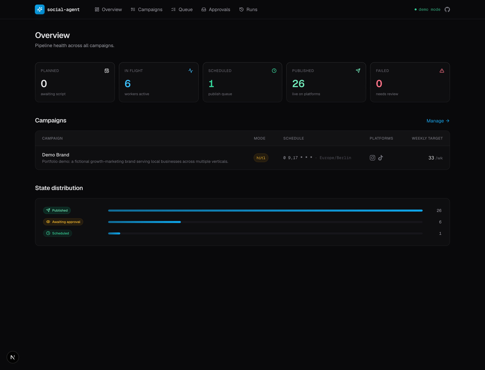
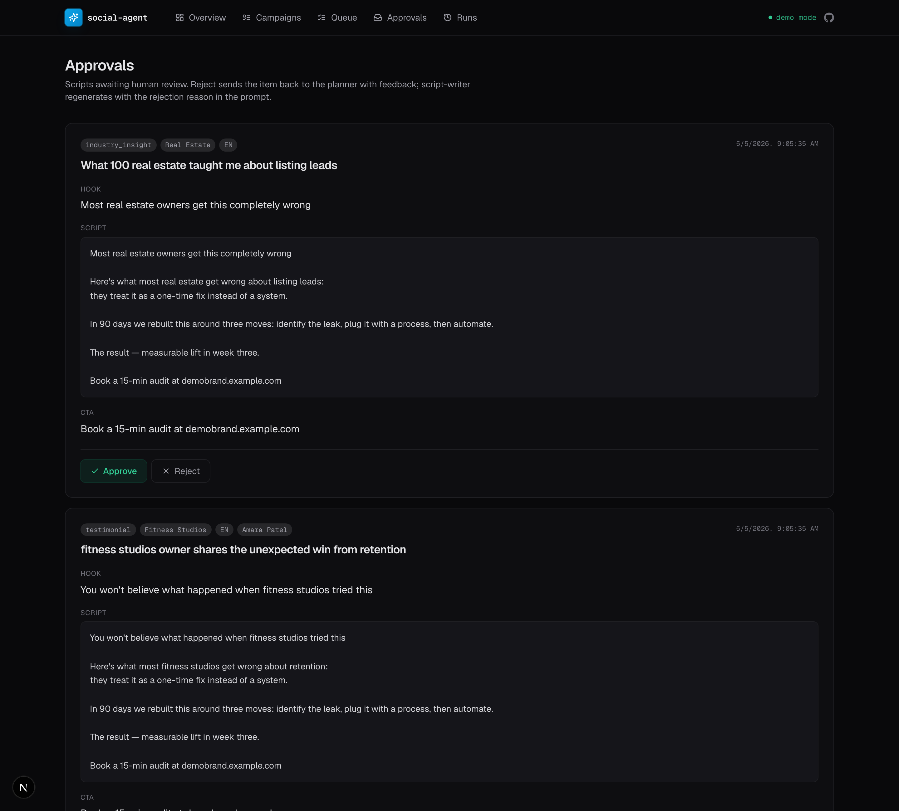
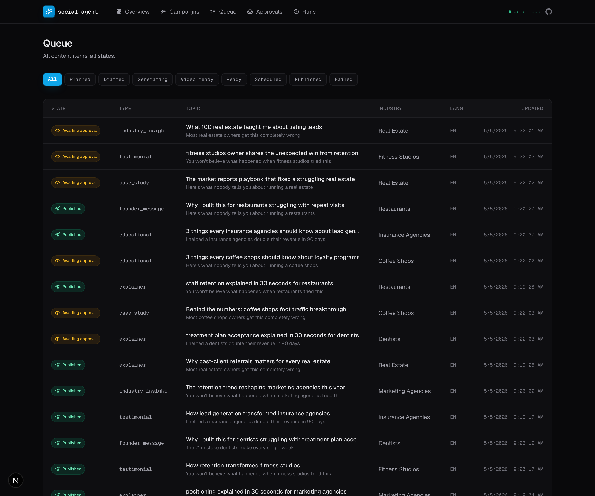
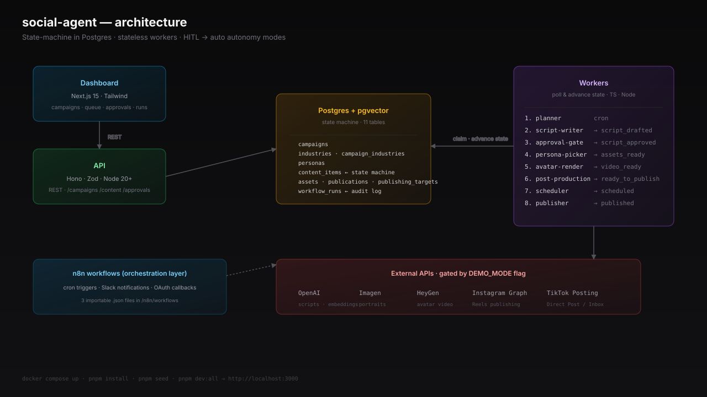
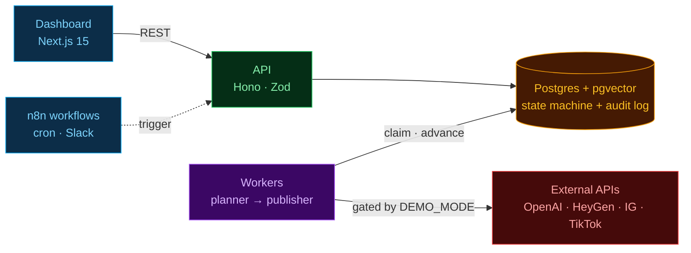

# Social Agent

Self-running AI content agent for short-form social video. Generates testimonial / case-study / explainer / educational vertical videos from a campaign config and publishes them to Instagram and TikTok — autonomously, with optional human-in-the-loop approval.

This is a **portfolio piece** — engineered as a complete production system, but ships with `DEMO_MODE=true` so it runs end-to-end without any paid API keys.

## What it actually does

You give it: a list of industries, weekly content quotas per type, a posting schedule.

It produces:
- a content calendar that rotates industries, deduplicates topics, and respects quotas
- LLM-generated scripts (testimonial / case study / explainer / etc.) with brand voice
- AI-generated personas with portraits + HeyGen-rendered avatar videos
- platform-optimized captions and hashtags
- scheduled publication to IG and TikTok via direct API integration

…and exposes a dashboard to configure campaigns, approve scripts, monitor the queue, and watch every state transition land in the audit log.

## Demo


## Dashboard







## Architecture





See [ARCHITECTURE.md](ARCHITECTURE.md) for the full design rationale: why state-machine-in-Postgres + stateless workers, autonomy modes, dedup strategy, cost expectations.

## Stack

- **Postgres 16** (pgvector for topic dedup, citext, uuid-ossp)
- **TypeScript** monorepo (pnpm workspaces)
- **Drizzle ORM** for type-safe queries
- **Hono** API on Node 20+
- **Next.js 15** App Router dashboard with Tailwind
- **n8n** for cron triggers, Slack notifications, OAuth callbacks

External providers (all gated by `DEMO_MODE`):
- **OpenAI** for scripts + embeddings (GPT-4o mini, text-embedding-3-small)
- **Imagen / Gemini** for persona portraits
- **HeyGen** for avatar video rendering
- **Instagram Graph API** (Reels publishing)
- **TikTok Content Posting API** (Direct Post / Inbox)

## Quickstart

```bash
# 1. Boot the database
cp .env.example .env
docker compose up -d postgres

# 2. Install + seed
pnpm install
pnpm seed

# 3. Run the API + workers + dashboard
pnpm dev:api        # → http://localhost:4000
pnpm dev:workers    # → polls Postgres, processes the pipeline
pnpm dev:dashboard  # → http://localhost:3000
```

Or all at once:

```bash
pnpm dev:all
```

To watch the pipeline progress visibly, flip the seeded campaign into autonomous mode and trigger the planner:

```bash
pnpm demo
```

Then refresh the dashboard — you'll see items flow `planned → script_drafted → script_approved → assets_ready → video_generating → video_ready → ready_to_publish → scheduled → published` over the next ~30 seconds.

## Switching to real APIs

In `.env`, set `DEMO_MODE=false` and supply real keys:

| Var | Used for | Required |
|---|---|---|
| `OPENAI_API_KEY` | scripts, captions, embeddings | yes (real mode) |
| `HEYGEN_API_KEY` | avatar video render | yes (real mode) |
| `GOOGLE_AI_API_KEY` | persona portrait generation | optional (mock fallback) |
| `IG_PAGE_ACCESS_TOKEN` + `IG_BUSINESS_ACCOUNT_ID` | Instagram publishing | optional |
| `TIKTOK_ACCESS_TOKEN` | TikTok publishing | optional (and requires app audit — see [docs/publishing-setup.md](docs/publishing-setup.md)) |

Each provider falls back to mock independently. So you can wire OpenAI + HeyGen for real video output and still mock the publishing step.

## Repository layout

```
.
├── docker-compose.yml             # Postgres (pgvector) + n8n
├── db/init/                       # Auto-applied SQL on first Postgres boot
├── services/
│   ├── core/                      # @social-agent/core — db, schema, providers, planner
│   │   └── src/providers/         # llm.ts, image.ts, heygen.ts, instagram.ts, tiktok.ts
│   ├── workers/                   # @social-agent/workers — 8 polling workers + runtime
│   │   └── src/workflows/
│   │       ├── planner.ts
│   │       ├── script-writer.ts
│   │       ├── approval-gate.ts
│   │       ├── persona-picker.ts
│   │       ├── avatar-render.ts
│   │       ├── post-production.ts
│   │       ├── scheduler.ts
│   │       └── publisher.ts
│   └── api/                       # @social-agent/api — Hono REST API
├── dashboard/                     # @social-agent/dashboard — Next.js 15
│   ├── app/
│   │   ├── page.tsx               # Overview dashboard
│   │   ├── campaigns/             # List + detail w/ autonomy toggle + planner button
│   │   ├── queue/                 # All content items, filterable by state
│   │   ├── approvals/             # HITL approval inbox
│   │   └── runs/                  # Workflow run audit log
│   └── components/
├── n8n/workflows/                 # Importable n8n JSON (cron, slack, monitor)
└── docs/
    ├── state-machine.md
    ├── publishing-setup.md
    └── heygen-setup.md
```

## Key design decisions

**State machine in Postgres, workers stateless.** Each `content_item` row walks a strict-forward state machine. Workers poll for items in a given state with `FOR UPDATE SKIP LOCKED`, do their job, advance the state. This means:

- horizontal scaling is free — run more worker processes
- crash recovery is automatic — interrupted work resumes from the last good state
- adding a new step (e.g. brand-safety scan) is one new worker, no orchestration changes
- the audit log (`workflow_runs`) tells you exactly what happened to every item

**HITL by default.** New campaigns boot in `autonomy_mode='hitl'` — script generation completes but the item parks in `script_drafted` until the dashboard approves it. Flip to `auto` once you trust the output. The approval-gate worker is a single SQL UPDATE in auto mode; the dashboard handles the transition for HITL.

**pgvector dedup.** Naïve string matching can't catch "5 ways dentists grow" vs "How dentists 10x revenue". Topics are embedded (1536-dim) on draft; cosine distance against last 90 days in same `(campaign, industry, language)` regenerates if max similarity > 0.85.

**Direct API publishing, no third-party tax.** IG Graph API + TikTok Content Posting API integrations are written but gated. For TikTok, the app needs audit (~2-4 weeks) to do true autonomous Direct Post — until then the code falls back to inbox upload. Documented in [docs/publishing-setup.md](docs/publishing-setup.md).

**Mock providers for portfolio.** Every external API has a `Mock*` class that returns realistic data with realistic delays. The selector reads `DEMO_MODE` and the relevant API key — switch one env var to flip individual providers between real and mocked.

## Documentation

- [ARCHITECTURE.md](ARCHITECTURE.md) — full design rationale
- [docs/state-machine.md](docs/state-machine.md) — every state transition explained
- [docs/publishing-setup.md](docs/publishing-setup.md) — IG Graph API + TikTok audit path
- [docs/heygen-setup.md](docs/heygen-setup.md) — founder avatar + persona pipeline
- [n8n/README.md](n8n/README.md) — n8n workflow imports

## Generating a screencast

A [VHS](https://github.com/charmbracelet/vhs) tape is included to record an animated GIF of the pipeline:

```bash
brew install vhs
vhs docs/demo.tape   # writes docs/screenshots/demo.gif
```

## Status

**v0.1.0 — Phases 0-6 complete** — fully working demo from `pnpm install` to a live dashboard with content flowing end-to-end. Real API integrations are written and gated behind env flags. See [CHANGELOG.md](CHANGELOG.md).

Roadmap:
- token rotation service for IG / TikTok
- analytics ingestion (post performance → planner bias)
- B-roll sourcing (Pexels API)
- multi-account-per-platform per campaign
- ffmpeg-based real post-production (subtitles, CTA overlays, transcoding)

## License

MIT
