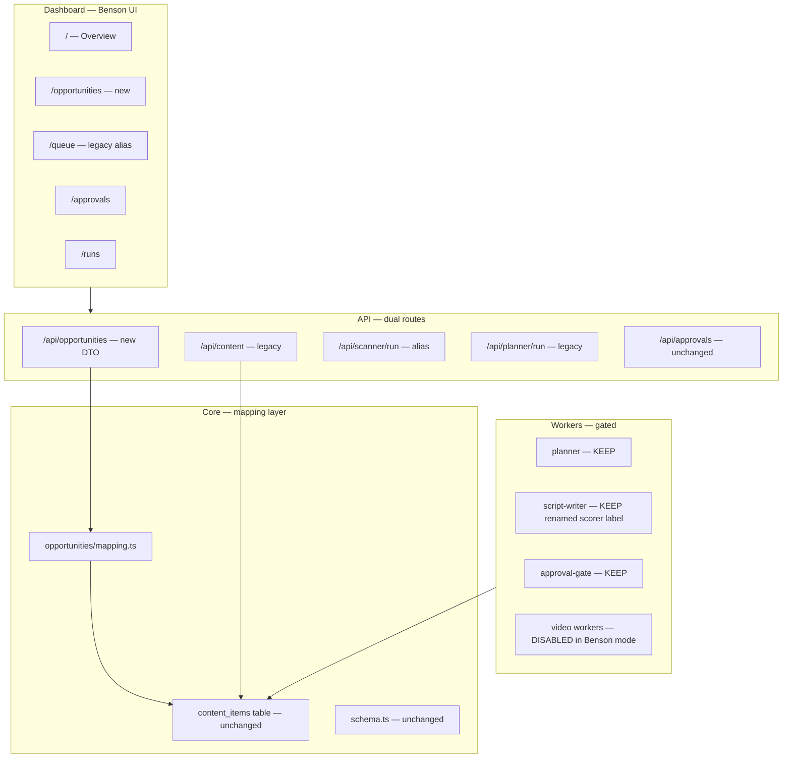

# Transformation Phase 1 — social-agent → Benson

**Date:** 2026-05-31  
**Branch:** `kellie-local-agent`  
**Baseline:** [BOOTSTRAP_RESULTS.md](./BOOTSTRAP_RESULTS.md) — inherited app verified working  
**Planning context:** [PROJECT_AUDIT.md](./PROJECT_AUDIT.md) · [DEPENDENCY_MAP.md](./DEPENDENCY_MAP.md) · [KELLIE_TRANSFORMATION_PLAN.md](./KELLIE_TRANSFORMATION_PLAN.md) · [MVP_SIMPLIFICATION.md](./MVP_SIMPLIFICATION.md) · [BENSON_VISION.md](./BENSON_VISION.md)

**Constraint:** This document is planning only. No application code changes until Phase 1 execution is approved.

---

## Purpose

Phase 1 is the **smallest possible migration** that introduces Benson as the user-facing product identity and the **opportunities** domain concept — while the inherited social-agent stack continues to run exactly as verified in bootstrap.

Phase 1 is a **parallel naming and alias layer**, not a rewrite. Nothing is deleted. Video pipeline workers, publishing tables, and legacy routes remain in the codebase and database; they are **disabled or deprecated**, not removed.

---

## Phase 1 Goals (from requirements)

| # | Goal | Phase 1 approach |
|---|---|---|
| 1 | Preserve the working application | Legacy routes, tables, and workers stay functional behind feature flags |
| 2 | Remove nothing yet | Zero file deletions; zero `DROP TABLE` |
| 3 | Disable rather than delete features | Env-gated worker registration; UI hides video states when Benson mode is on |
| 4 | Replace social-agent terminology with Benson | User-facing strings, nav, metadata, seed display names |
| 5 | Replace `content_items` concept with opportunities | DTO mapping layer + `/api/opportunities` alias; DB table unchanged |
| 6 | Preserve database compatibility | No enum/table renames; optional SQL **views** only |
| 7 | Preserve approval flow | Same HITL inbox; approve/reject unchanged at DB level |
| 8 | Preserve worker framework | `runtime.ts` untouched; conditional registration in `main.ts` |
| 9 | Preserve queue/state machine | Same `content_items.state` column; Benson labels mapped in UI/API |

---

## Explicitly Out of Scope (Phase 2+)

| Deferred item | Why |
|---|---|
| Delete video workers / providers | Phase 1 disables registration only |
| Drop `personas`, `assets`, `publications`, etc. | Tables remain; unused when video pipeline disabled |
| Rename Postgres tables (`content_items` → `opportunities`) | Breaks compatibility; use views/DTOs first |
| Replace `content_state` enum values | Requires migration + worker rewrites |
| Real KC source integrations (Reddit, Maps, events) | Phase 2 scanner implementation |
| Package rename `@social-agent/*` → `@kellie/*` | High blast radius; defer unless needed for branding |
| `/clients` UI or multi-tenant model | Option A single-creator per [MVP_SIMPLIFICATION.md](./MVP_SIMPLIFICATION.md) |
| Authentication / login | Not in inherited app |
| n8n workflow rewrites | Optional; workers remain primary |

---

## Architecture: Strangler-Fig Pattern

Phase 1 adds a **Benson façade** in front of the existing stack. Legacy and Benson paths coexist.



**Key principle:** Benson speaks *opportunities*; Postgres still stores *content_items*. The mapping layer translates between them.

---

## Domain Mapping Reference

### Entity rename (conceptual only — Phase 1)

| Legacy (DB/code) | Benson (UI/API DTO) | Phase 1 action |
|---|---|---|
| `content_items` | `opportunities` | DTO alias; table name unchanged |
| `content_items.id` | `opportunity.id` | Field rename in JSON responses |
| `topic` | `title` | Display + API DTO |
| `hook` | `angle` | Display + API DTO |
| `script` | `summary` | Display + API DTO |
| `industry` / `industries` | `category` / `categories` | Display labels only |
| `campaigns` | `workspace` (UI) | Hide multi-campaign UI; singleton Demo Brand |
| `planner` | `scanner` (UI label) | "Scan now" button copy |
| `script-writer` worker | `scorer` (audit label) | Log/display name only |
| `social-agent` | `Benson` | All user-visible branding |

### State mapping (display layer — DB enum unchanged)

Benson UI shows simplified states. Legacy states remain in Postgres for worker compatibility.

| Legacy `content_state` | Benson display state | Visible in Benson UI? |
|---|---|---|
| `planned` | `discovered` | Yes (queue filter) |
| `script_drafted` | `pending_review` | Yes — approvals inbox |
| `script_approved` | `approved` | Yes — terminal in Benson mode when video disabled |
| `script_rejected` | `rejected` | Yes |
| `assets_ready` | `processing` | Hidden when video pipeline disabled |
| `video_generating` | `processing` | Hidden |
| `video_ready` | `processing` | Hidden |
| `post_production` | `processing` | Hidden |
| `ready_to_publish` | `processing` | Hidden |
| `scheduled` | `processing` | Hidden |
| `published` | `published` | Hidden in Benson MVP UI |
| `failed` | `failed` | Yes |
| `cancelled` | `archived` | Yes |

When `BENSON_MODE=true` and `DISABLE_VIDEO_PIPELINE=true`, approving an item sets `script_approved` and **workers do not advance it further** — Benson treats `script_approved` as terminal success.

---

## Classification Legend

| Tag | Meaning in Phase 1 |
|---|---|
| **KEEP** | No behavioral change |
| **ADAPT** | Add alias, mapping, copy, or feature flag — legacy path still works |
| **DEPRECATE** | Keep functional; mark legacy in code comments, nav, or API docs |
| **REMOVE LATER** | Disabled via flag now; deletion scheduled for Phase 2+ |

---

## Change Inventory

### A. Configuration and feature flags

| Change | File(s) | Risk | Rollback | Tag |
|---|---|---|---|---|
| Add `BENSON_MODE` env flag (default `false` for safe rollout) | `services/core/src/env.ts`, `.env.example` | **Low** | Set `BENSON_MODE=false` | ADAPT |
| Add `DISABLE_VIDEO_PIPELINE` env flag (default `false`; auto-true when `BENSON_MODE=true`) | `services/core/src/env.ts`, `.env.example` | **Low** | Set flag false; restart workers | ADAPT |
| Document flags in bootstrap docs | `BOOTSTRAP_PLAN.md`, `README.md` | **Low** | Revert doc edit | ADAPT |
| Export flags from `@social-agent/core` index | `services/core/src/index.ts` | **Low** | Remove exports | ADAPT |

### B. Opportunities mapping layer (core)

| Change | File(s) | Risk | Rollback | Tag |
|---|---|---|---|---|
| Create `Opportunity` TypeScript type (DTO) | `services/core/src/opportunities/types.ts` (new) | **Low** | Delete new file | ADAPT |
| Create `contentItemToOpportunity()` mapper | `services/core/src/opportunities/mapping.ts` (new) | **Low** | Delete new file | ADAPT |
| Create reverse mapper for writes (approve still writes `content_items`) | `services/core/src/opportunities/mapping.ts` | **Low** | Delete new file | ADAPT |
| Export opportunity types from core package | `services/core/src/index.ts` | **Low** | Remove exports | ADAPT |
| Optional: SQL view `opportunities_v` over `content_items` | `db/migrations/06_opportunities_view.sql` (new) | **Medium** | `DROP VIEW`; no data loss | ADAPT |
| Keep `schema.ts` `contentItems` table definition | `services/core/src/schema.ts` | **Low** | N/A | KEEP |

**View approach (optional, recommended):** A read-only Postgres view aliases columns without touching the table:

```sql
-- db/migrations/06_opportunities_view.sql (additive only)
CREATE OR REPLACE VIEW opportunities_v AS
SELECT
  id,
  campaign_id   AS workspace_id,
  industry_id   AS category_id,
  type,
  state,
  topic         AS title,
  hook          AS angle,
  script        AS summary,
  topic_embedding AS embedding,
  metadata,
  created_at,
  updated_at
FROM content_items;
```

Workers and Drizzle continue using `content_items`. API can query the view for read paths if desired.

### C. API — parallel routes and aliases

| Change | File(s) | Risk | Rollback | Tag |
|---|---|---|---|---|
| New `/api/opportunities` route (GET list, GET by id) | `services/api/src/routes/opportunities.ts` (new) | **Medium** | Remove route registration | ADAPT |
| Delegate to existing content queries; map response DTO | `services/api/src/routes/opportunities.ts` | **Medium** | Same | ADAPT |
| Register route in server | `services/api/src/server.ts` | **Low** | Remove one line | ADAPT |
| Keep `/api/content` unchanged | `services/api/src/routes/content.ts` | **Low** | N/A | DEPRECATE |
| New `/api/scanner/run` alias → planner handler | `services/api/src/routes/scanner.ts` (new) or alias in `planner.ts` | **Low** | Remove alias | ADAPT |
| Keep `/api/planner/run` unchanged | `services/api/src/routes/planner.ts` | **Low** | N/A | DEPRECATE |
| Approvals route: optional `opportunities` key in response | `services/api/src/routes/approvals.ts` | **Medium** | Revert response shape; keep `items` | ADAPT |
| Metrics: Benson-friendly state labels in response | `services/api/src/routes/metrics.ts` | **Low** | Revert mapping | ADAPT |
| Campaigns route unchanged (workspace singleton) | `services/api/src/routes/campaigns.ts` | **Low** | N/A | KEEP |
| Runs route unchanged | `services/api/src/routes/runs.ts` | **Low** | N/A | KEEP |
| Health check: add `{ bensonMode, videoPipelineDisabled }` | `services/api/src/server.ts` | **Low** | Revert health payload | ADAPT |

### D. Workers — disable, do not delete

| Change | File(s) | Risk | Rollback | Tag |
|---|---|---|---|---|
| Conditional worker registration based on `DISABLE_VIDEO_PIPELINE` | `services/workers/src/main.ts` | **Medium** | Set flag false; all 11 workers restart | ADAPT |
| Workers kept in codebase but not started when disabled | `persona-picker.ts`, `avatar-render.ts`, `post-production.ts`, `scheduler.ts`, `publisher.ts`, `token-rotation.ts`, `analytics-ingest.ts` | **Low** | Re-enable in main.ts | REMOVE LATER |
| Planner worker — KEEP, relabel logs as `[scanner]` | `services/workers/src/workflows/planner.ts` | **Low** | Revert log strings | ADAPT |
| Script-writer — KEEP, relabel logs as `[scorer]` | `services/workers/src/workflows/script-writer.ts` | **Low** | Revert log strings | ADAPT |
| Approval-gate — KEEP (needed for auto mode testing) | `services/workers/src/workflows/approval-gate.ts` | **Low** | N/A | KEEP |
| Worker runtime — no changes | `services/workers/src/runtime.ts` | **Low** | N/A | KEEP |
| Demo script: respect Benson mode | `services/workers/src/demo.ts` | **Low** | Revert | ADAPT |

**Workers always registered (Benson mode):**

| Worker | Role in Benson Phase 1 |
|---|---|
| `planner` | Creates `planned` items (future: replaced by real scanner) |
| `script-writer` | Drafts script → `script_drafted` (future: scorer) |
| `approval-gate` | Auto-approve when `autonomy_mode=auto` |

**Workers disabled when `DISABLE_VIDEO_PIPELINE=true`:**

| Worker | File |
|---|---|
| `persona-picker` | `workflows/persona-picker.ts` |
| `avatar-render-start` / `avatar-render-poll` | `workflows/avatar-render.ts` |
| `post-production` | `workflows/post-production.ts` |
| `scheduler` | `workflows/scheduler.ts` |
| `publisher` | `workflows/publisher.ts` |
| `token-rotation` | `workflows/token-rotation.ts` |
| `analytics-ingest` | `workflows/analytics-ingest.ts` |

### E. Dashboard — Benson branding and routes

| Change | File(s) | Risk | Rollback | Tag |
|---|---|---|---|---|
| Rename header brand: `social-agent` → `Benson` | `dashboard/app/layout.tsx` | **Low** | Revert strings | ADAPT |
| Update `<Metadata>` title/description | `dashboard/app/layout.tsx` | **Low** | Revert | ADAPT |
| Nav: add `opportunities`; keep `queue` as legacy link or redirect | `dashboard/app/layout.tsx` | **Low** | Revert nav array | ADAPT |
| New `/opportunities` page (adapt from queue) | `dashboard/app/opportunities/page.tsx` (new) | **Medium** | Delete page; use `/queue` | ADAPT |
| `/queue` → redirect to `/opportunities` when `BENSON_MODE` | `dashboard/app/queue/page.tsx` or middleware | **Low** | Remove redirect | DEPRECATE |
| Overview: Benson copy ("Good morning, Kellie") | `dashboard/app/page.tsx` | **Low** | Revert copy | ADAPT |
| Overview: fetch `/api/opportunities` or mapped metrics | `dashboard/app/page.tsx` | **Medium** | Revert to campaigns/content | ADAPT |
| Approval card: `title`/`summary`/`angle` labels; Benson attribution | `dashboard/app/approvals/approval-card.tsx` | **Medium** | Revert labels | ADAPT |
| Approvals page: Benson inbox copy | `dashboard/app/approvals/page.tsx` | **Low** | Revert | ADAPT |
| State pill: Benson display states | `dashboard/components/state-pill.tsx` | **Low** | Revert mapping | ADAPT |
| API client: add `Opportunity` type + helpers | `dashboard/lib/api.ts` | **Low** | Revert types | ADAPT |
| Campaigns pages: hide from nav; keep routes working | `dashboard/app/campaigns/*` | **Low** | Restore nav link | DEPRECATE |
| Runs page: optional worker name mapping (scorer vs script-writer) | `dashboard/app/runs/page.tsx` | **Low** | Revert | ADAPT |
| Footer: update repo link text | `dashboard/app/layout.tsx` | **Low** | Revert | ADAPT |

### F. Seed and demo data

| Change | File(s) | Risk | Rollback | Tag |
|---|---|---|---|---|
| Rename seed campaign display name: `Demo Brand` → `Kellie KC` (or keep slug, change name only) | `services/core/src/scripts/seed.ts` | **Low** | Re-seed or revert name | ADAPT |
| Add idempotent Benson seed comment/header | `services/core/src/scripts/seed.ts` | **Low** | Revert | ADAPT |
| Keep all wired industries/personas/targets | `services/core/src/scripts/seed.ts` | **Low** | N/A | KEEP |
| Do not delete persona/publishing seed rows | `services/core/src/scripts/seed.ts` | **Low** | N/A | KEEP |

### G. Documentation and metadata (no runtime impact)

| Change | File(s) | Risk | Rollback | Tag |
|---|---|---|---|---|
| Root `package.json` description → Benson | `package.json` | **Low** | Revert | ADAPT |
| Package `description` fields in workspace packages | `services/*/package.json` | **Low** | Revert | ADAPT |
| `README.md` — dual-mode note (legacy + Benson) | `README.md` | **Low** | Revert | ADAPT |
| n8n workflows — no changes Phase 1 | `n8n/workflows/*.json` | **Low** | N/A | KEEP |

### H. Explicitly unchanged (KEEP)

| Asset | Path | Reason |
|---|---|---|
| Worker runtime | `services/workers/src/runtime.ts` | Core poll/cron framework |
| DB connection | `services/core/src/db.ts` | |
| Drizzle schema (tables) | `services/core/src/schema.ts` | Compatibility |
| Init SQL scripts | `db/init/*.sql` | No destructive migrations |
| Docker compose | `docker-compose.yml` | |
| Provider factory | `services/core/src/providers/index.ts` | Disabled workers won't call video providers |
| HITL approve/reject logic | `services/api/src/routes/approvals.ts` | Same state transitions |
| Next.js API proxy | `dashboard/next.config.mjs` | |

---

## Step-by-Step Migration Order

Execute in this order. **Verify bootstrap health checks after each step** before proceeding.

### Step 0 — Preconditions

- [ ] [BOOTSTRAP_RESULTS.md](./BOOTSTRAP_RESULTS.md) baseline passes on clean branch
- [ ] Create git branch `phase-1-benson` from `kellie-local-agent`
- [ ] Tag current HEAD as `baseline-pre-benson` for rollback reference

**Verification:** `curl http://localhost:4000/health` → `{"ok":true}`

---

### Step 1 — Feature flags only (no behavior change)

**Changes:** `env.ts`, `.env.example`, export from core index.

Set defaults so **existing behavior is unchanged** (`BENSON_MODE=false`, `DISABLE_VIDEO_PIPELINE=false`).

**Verification:**
- All 11 workers still start
- Bootstrap HITL flow still works
- Health check unchanged (or extended with flags showing `false`)

**Risk if skipped:** Later steps cannot toggle Benson mode safely.

---

### Step 2 — Opportunities mapping module (core, no consumers yet)

**Changes:** New `services/core/src/opportunities/` directory with types + mapping functions. Optional SQL view migration.

**Verification:**
- `pnpm typecheck` passes
- Unit test or manual REPL: `contentItemToOpportunity(mockRow)` returns expected shape
- No API or worker behavior change

**Risk if skipped:** API and dashboard would duplicate mapping logic.

---

### Step 3 — API parallel routes (legacy routes untouched)

**Changes:** `routes/opportunities.ts`, scanner alias, server registration, health payload extension.

**Verification:**
```bash
curl -s http://localhost:4000/api/content?limit=1        # legacy — still works
curl -s http://localhost:4000/api/opportunities?limit=1    # new — same data, Benson field names
curl -s -X POST http://localhost:4000/api/scanner/run?campaignId=<id>  # alias — same as planner
curl -s http://localhost:4000/health                       # includes mode flags
```

**Risk if skipped:** Dashboard cannot use Benson terminology without breaking legacy clients.

---

### Step 4 — Disable video workers (flag-gated)

**Changes:** Conditional registration in `main.ts` only.

**Rollout:** Set `DISABLE_VIDEO_PIPELINE=true` in `.env` (keep `BENSON_MODE=false` first to test worker gating in isolation).

**Verification:**
- Worker log shows 3 workers started (planner, script-writer, approval-gate)
- HITL flow: planner → script_drafted → approve → **stays at `script_approved`** (no persona-picker)
- `/runs` shows no persona-picker / avatar-render entries after approve
- Set flag back to `false`; confirm all 11 workers restart and full pipeline works again

**Risk if skipped:** Approved items would enter video pipeline, contradicting Benson MVP UX.

---

### Step 5 — Dashboard Benson branding (read paths first)

**Changes:** `layout.tsx` metadata/header, `state-pill.tsx` mapping, `lib/api.ts` Opportunity type.

**Verification:**
- All existing routes still HTTP 200
- Header shows "Benson"
- Legacy `/queue` still renders

**Risk if skipped:** User-facing rename incomplete.

---

### Step 6 — Opportunities page and nav

**Changes:** New `dashboard/app/opportunities/page.tsx` using `/api/opportunities`. Nav update. Optional `/queue` redirect.

**Verification:**
- `/opportunities` loads with Benson field labels (`title`, `summary`, `angle`)
- `/queue` still works or redirects cleanly
- Overview uses opportunity terminology

---

### Step 7 — Approvals inbox Benson copy

**Changes:** `approval-card.tsx`, `approvals/page.tsx` — labels and Benson attribution ("Benson drafted this summary").

**Verification:** Full HITL path from [BOOTSTRAP_PLAN.md §6F](./BOOTSTRAP_PLAN.md):
1. Trigger planner
2. Items appear in `/approvals`
3. Approve one item → leaves inbox
4. With video disabled → state stays `script_approved`
5. `/runs` shows audit entries

**Risk if skipped:** Core MVP loop lacks Benson identity.

---

### Step 8 — Enable Benson mode + seed display name

**Changes:** Set `BENSON_MODE=true` in `.env`. Update seed campaign name to `Kellie KC`. Re-run seed (idempotent).

**Verification:**
- Health check reports `bensonMode: true`
- Overview greeting references Kellie + Benson
- Campaigns pages hidden from nav but direct URL still works
- Full bootstrap checklist from BOOTSTRAP_PLAN passes in Benson mode

---

### Step 9 — Documentation pass

**Changes:** Update `README.md`, add note to `BOOTSTRAP_PLAN.md` for Benson-mode verification path.

**Verification:** New developer can follow docs to run Benson mode from scratch.

---

## Verification Checklist (Phase 1 Complete)

Mark Phase 1 done when all pass with `BENSON_MODE=true` and `DISABLE_VIDEO_PIPELINE=true`:

- [ ] `curl http://localhost:4000/health` → `ok: true`, mode flags present
- [ ] Legacy `/api/content` and new `/api/opportunities` both return data
- [ ] Legacy `/api/planner/run` and `/api/scanner/run` both trigger planner
- [ ] Dashboard header reads **Benson**
- [ ] `/opportunities` loads; shows `title` not `topic`
- [ ] `/approvals` inbox works; approve transitions item out
- [ ] Approved item **does not** enter video pipeline (stays `script_approved`)
- [ ] 3 workers running (not 11)
- [ ] `/runs` audit log populates
- [ ] Setting `BENSON_MODE=false` + `DISABLE_VIDEO_PIPELINE=false` restores full legacy behavior
- [ ] No files deleted; no tables dropped

**Optional regression:** Run full legacy `pnpm demo` path with flags off to confirm nothing broke.

---

## Rollback Strategy (Global)

| Level | Action |
|---|---|
| **Instant** | Set `BENSON_MODE=false`, `DISABLE_VIDEO_PIPELINE=false` in `.env`; restart services |
| **API only** | Remove `/api/opportunities` and `/api/scanner` route registration from `server.ts` |
| **Dashboard only** | Revert `layout.tsx` nav and delete `opportunities/page.tsx` |
| **Full rollback** | `git checkout baseline-pre-benson` tag; restart stack per BOOTSTRAP_RESULTS |
| **Database** | No Phase 1 migrations are destructive; optional view drop: `DROP VIEW IF EXISTS opportunities_v` |

---

## Risk Summary

| Area | Highest risk step | Mitigation |
|---|---|---|
| Worker gating | Step 4 | Test with flag off first; verify 11-worker legacy path after |
| API response shape | Step 3 | Keep legacy routes; additive DTO only |
| Approval terminal state | Step 4 + 7 | Document that `script_approved` = Benson "approved" when video disabled |
| Dashboard dual routes | Step 6 | Keep `/queue` until Phase 2 |
| SQL view | Step 2 (optional) | Read-only view; workers unaffected |

---

## Phase 2 Preview (not Phase 1)

After Phase 1 stabilizes:

1. **Real scanner worker** — replace planner quota logic with source ingest
2. **Scorer worker** — replace script-writer prompts with KC relevance scoring
3. **New tables** — `sources`, additive columns on `content_items` or parallel `opportunities` table with backfill
4. **State enum migration** — `content_state` → `opportunity_state` with compatibility trigger
5. **Remove video workers** — delete files flagged REMOVE LATER
6. **Package rename** — `@social-agent/*` → `@kellie/*`
7. **Settings page** — absorb campaigns detail (sources, categories, voice)
8. **Delete deprecated routes** — `/api/content`, `/queue`, `/campaigns` nav

---

## File Change Summary

| Action | Count | Examples |
|---|---|---|
| **New files** | ~5–7 | `opportunities/types.ts`, `mapping.ts`, `routes/opportunities.ts`, `app/opportunities/page.tsx`, optional SQL view |
| **Adapted files** | ~15–20 | `env.ts`, `main.ts`, `layout.tsx`, `approval-card.tsx`, `state-pill.tsx`, `server.ts`, `seed.ts` |
| **Deprecated (kept)** | ~10 | `routes/content.ts`, `routes/planner.ts`, `app/queue/*`, `app/campaigns/*`, 8 worker files |
| **Deleted** | **0** | — |

---

## Naming Reference for Implementers

| Context | Use |
|---|---|
| User-facing UI, notifications | **Benson** |
| Human operator in copy | **Kellie** |
| Internal docs, env vars, branch names | **Kellie Assistant** / `BENSON_MODE` |
| Postgres tables (Phase 1) | Legacy names (`content_items`, `campaigns`) |
| JSON API (Benson mode) | `opportunities`, `title`, `summary`, `angle`, `category` |
| JSON API (legacy) | `content`, `topic`, `script`, `hook`, `industry` |

---

## Next Step

**Stop here.** Review and approve this plan before executing Phase 1 code changes. After approval, begin at Step 0 and run verification gates sequentially.

Do not begin Phase 2 (real KC sources, schema migration, worker deletion) until Phase 1 verification checklist passes and is signed off.

---

*End of Phase 1 transformation plan.*
