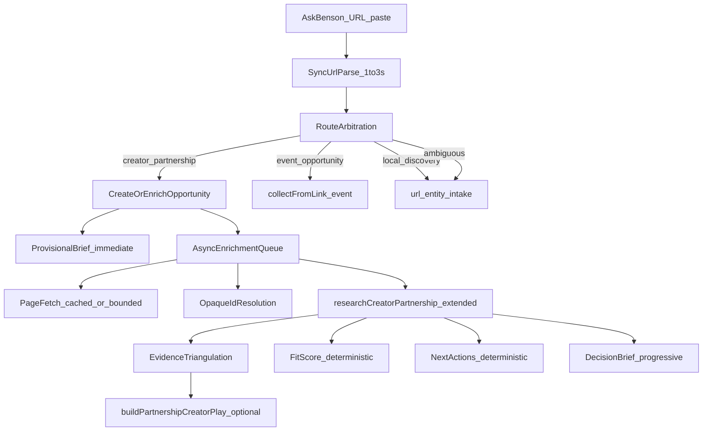
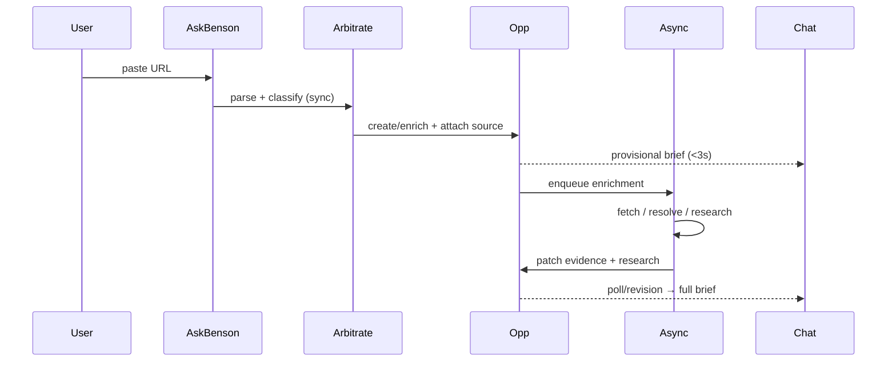

# Ask Benson URL Intelligence Plan (Revised)

**Status:** APPROVED — first slice implemented; awaiting deploy approval (2026-08-09).

**Overview:** Extend the existing creator-partnership and Ask Benson URL intake pipelines with fast sync classification, multi-source opportunity enrichment, staged async research, evidence triangulation, and progressive decision-brief UX—without a parallel subsystem, retailer hard-coding, or commerce URL = partnership as a hard rule.

---

## APPROVED DECISIONS (locked)

### Decision 1 — Source storage

- **v1:** `metadata.sourceUrls[]` on the durable opportunity record.
- **Do not** create `partnership_sources` table in this slice.
- **Required:** small internal source abstraction (`partnership-sources.ts` or equivalent) so future relational migration does not rewrite dedupe, evidence attachment, research, UI, or source-role logic.

Each source record must retain at minimum:

| Field | Purpose |
|-------|---------|
| `original_url` | User-facing URL |
| `normalized_url` | Dedupe key |
| `role` | `discovery` \| `program` \| `product` \| `store` \| `supporting` |
| `discovered_at` | First attach |
| `last_observed_at` | Re-paste / refresh |
| `entityContext` | Retailer/brand/product if known from URL |
| `provenance` | Intake route, status |
| `parseSnapshot` | URL-only intel at attach |

### Decision 2 — Ambiguous routing

- **Default ambiguous URLs → entity/discovery intake**, not creator partnership.
- **Forbidden rule:** commerce URL = partnership.
- **Direct `creator_partnership` routing** only when strong creator-business evidence exists (creator/influencer/ambassador/affiliate/sponsorship/collaboration/gifting/UGC program language, explicit creator application path, program URL path + signal).
- When scores are close (Δ < 0.15) and no strong creator-business signal → `local_discovery` / `collectFromLink`.
- Research may later **suggest** promoting to Creator Partnership; preserve original URL + research (no restart from scratch).

### Decision 3 — Ask Benson completion UX

- **Poll + patch v1** (no second assistant message on normal research completion).
- Flow: paste → provisional card → async research → `emitDataChange` on `opportunities` → chat polls partnership → **same card** updates to completed Decision Brief.
- Proactive notification architecture may be preserved for later; not in this slice.

### Decision 4 — Normalized URL uniqueness

- **Defer** global `UNIQUE(submitted_url_normalized)`.
- **Implement now:** normalization, source-level dedupe, opportunity fingerprint, source attach/reuse.
- Do **not** assume one normalized URL maps globally to one opportunity.

### Additional correction — Local scope

- **Fix in this slice:** partnership research must not hardcode `"Kansas City"` query strings.
- Introduce/reuse **`getCreatorLocalScope()`** — operating geography separate from `getCreatorTimezone()` (timezone for time only).
- Config via `CREATOR_LOCAL_SCOPE` env (e.g. `Kansas City metro` for KCKellie).
- If no scope configured: research national relevance; mark local relevance unresolved — do not invent geography.

---

## Approved implementation slice

Build **only this slice** (no P3 capability cache, no auto-pitching, no automatic lifecycle transitions):

| # | Deliverable | Target |
|---|-------------|--------|
| 1 | URL parser + `normalizeSourceUrl()` | sync <50ms |
| 2 | `classifyUrlIntakeRoute()` arbitration | sync <100ms |
| 3 | Remove sync network fetch from submit path | sync **1–3s**, no fetch/browser/search |
| 4 | Source attach + opportunity fingerprint dedupe via source abstraction | — |
| 5 | `getCreatorLocalScope()` + remove hardcoded KC from research queries | — |
| 6 | Fix Ask Benson server/client types (`partnershipId`, `intakeRoute`, `researchStatus`, `decisionBrief`) | — |
| 7 | Immediate provisional decision brief in chat | sync |
| 8 | Async staged research (existing engine + async fetch) | 30–90s |
| 9 | Extend existing synthesis JSON: `storyAngleCandidates`, `nextActionInputs` | 1 LLM call |
| 10 | Deterministic `sanitizeStoryAngles` + `rankPartnershipNextActions` | — |
| 11 | `emitDataChange({ domains: ['opportunities'] })` on research complete | — |
| 12 | Poll + patch Ask Benson card (no append message) | — |
| 13 | SCHEELS acceptance fixture (behaviors, not hard-coded answers) | — |
| 14 | Routing negative/regression fixtures | — |

Feature flag: `PARTNERSHIP_URL_INTELLIGENCE=1`.

### Performance acceptance

Synchronous Ask Benson path: **~1–3 seconds**; must **not** perform page fetch, browser render, or web search.

### SCHEELS acceptance (behaviors only)

Generic system must demonstrate: URL/filter decode, provisional store context, entity candidates, opportunity attach/reuse, async resolve/research, store-filter ≠ confirmed inventory, creator/affiliate research, verification-aware story angles, ranked next actions. No SCHEELS-specific product logic.

### Before deploy — required report

- Files/modules changed
- Migrations (if any)
- Sync latency measurement
- SCHEELS fixture outcome
- Route-arbitration regression results
- Duplicate/source-reuse tests
- LLM/search calls in acceptance run
- Any architectural assumption that changed

### Out of scope for this slice

- P3 retailer capability caching
- Auto-pitching
- Automatic lifecycle transitions
- `partnership_sources` table
- Global UNIQUE on normalized URL

---

## Implementation todos

| ID | Task | Status |
|----|------|--------|
| p0-url-parser | `url-intelligence.ts` + `normalizeSourceUrl()`; source dedupe; remove sync fetch from submit | pending |
| p0-route-arbitration | `classifyUrlIntakeRoute()`; replace commerce=partnership hard rule | pending |
| p0-opportunity-sources | Opportunity fingerprint + `metadata.sourceUrls[]`; multi-URL attach | pending |
| p0-routing-types | Fix ask-benson-types `partnershipId`; chat provisional brief | pending |
| p1-async-enrichment | Async page fetch, ID resolution, store lookup, web research (bounded) | pending |
| p1-evidence-model | Structured `PartnershipEvidenceItem` + triangulation | pending |
| p2-research-extend | Extend existing synthesis JSON; deterministic story/next-action modules | pending |
| p2-async-ux | `emitDataChange` + chat poll; full decision brief (state D) | pending |
| p2-verification-bridge | Provisional signals → verification-context + field-verification | pending |
| tests-fixtures | SCHEELS + 6 URL classes + routing negatives; replay script | pending |
| p3-capability-cache | Validated observation cache only (no executable adaptors) | pending |
| migration-sources-table | Optional `partnership_sources` table + indexes (after model proven) | pending |

---

# Ask Benson URL → Creator Opportunity Plan

## Product principle

Elliott pastes something interesting—a URL, optionally with a short note. Benson figures out **what kind of opportunity it represents**, discovers entities, researches creator viability where relevant, surfaces verification gaps, ranks next actions, and creates or **enriches** a durable opportunity record. No manual classification required.

Primary acceptance URL (test fixture only, not product logic):

`https://www.scheels.com/c/all/b/what%20goes%20around%20comes%20around?r=storeAvailability%3A88`

Supporting URLs for the same opportunity (fixture examples, not product logic):

- SCHEELS creator program page
- Individual WGACA product URL
- SCHEELS Overland Park store locator page

---

## A. Recommended architecture

**Single intake spine, route arbitration, progressive enrichment** — extend what exists; do not fork.



### Sync path (target: **1–3 seconds**)

No network I/O on the critical path except DB read/write.

1. `normalizeSourceUrl(url)`
2. `parsePartnershipUrl(url)` — decode path slugs, query filters (`storeAvailability:88`), heuristic entity hints
3. `classifyUrlIntakeRoute(url, optionalMessage)` — select Benson path with confidence
4. Source-level dedupe: if normalized URL already attached to an opportunity → reuse
5. Else opportunity fingerprint match → attach source, refresh stale research if needed
6. Else create opportunity row + attach first source
7. Return **provisional brief** (tentative headline, parsed entities, filter signals, gaps, link)

**Explicitly NOT on sync path:** page fetch, Playwright, opaque ID resolution, store directory lookup, web search, LLM synthesis.

**Exception:** if a **validated, non-expired capability cache** or prior fetch artifact for this exact normalized URL exists in DB/metadata with `observed_at` within TTL, async worker may treat it as warm-start—but sync still returns without waiting for it.

### Async path (target: **30–90 seconds bounded**)

Staged, cancellable enrichment per opportunity:

| Stage | Work | Budget |
|-------|------|--------|
| A | Page fetch (reuse single `fetchUrlWithPipeline` result; share across sources when same domain+session) | 5–15s |
| B | Opaque identifier resolution + store locator patterns | 10–20s |
| C | Targeted web search (graph-driven queries, not 6 blind queries when URL intel already high-confidence) | 15–40s |
| D | Existing research synthesis (one LLM call) → structured fields including story angles + next-action inputs | 5–15s |
| E | Deterministic fit score, evidence merge, action ranking, brief patch | <1s |

Emit data revision + update chat via poll when stage D completes.

### Layer responsibilities

| Layer | Role |
|-------|------|
| **Route arbitration** | Classify URL + message into existing Benson paths |
| **URL intelligence (sync)** | Parse, normalize, tentative entity inference from URL structure only |
| **Opportunity + sources** | Durable record; many URLs enrich one opportunity |
| **Async enrichment** | Fetch, resolve, research |
| **Evidence ledger** | Authority-aware, scope-aware, conflict-preserving |
| **Decision outputs** | Fit score, ranked actions, optional Creator Play — consume same research + evidence |

**Do not build:** second research engine, parallel partnership tables, retailer-specific switch statements, executable capability adaptors.

---

## B. Route arbitration

### Problem (current code)

[`detect.ts`](services/core/src/creator-partnership/detect.ts) treats many commerce-looking URLs as creator partnership when message lacks event keywords (`looksLikeProductOrBrandUrl` fallback: any single path segment → true). That **contradicts** keeping restaurant/local/event URLs on their existing paths, and it **over-narrowly equates** commerce URLs with partnerships.

### Product rule

**Commerce URL ≠ creator partnership.** Benson selects among existing paths:

| Route | Existing handler | Typical signals |
|-------|------------------|-----------------|
| `creator_partnership` | `submitCreatorPartnership` | Creator/affiliate program language; brand+retailer monetization URL; user message partnership keywords; high-confidence brand/retailer graph with program path |
| `event_opportunity` | `collectOpportunitiesFromLink` | Ticket domains; `/events`, `/calendar`, `/ticket` paths; event date language; Eventbrite/Ticketmaster patterns |
| `local_discovery` | `url-entity-opportunity` / entity intake | Restaurant/menu/hours patterns; single-location business site; discovery/opener angles |
| `product_brand_opportunity` | Entity intake or partnership (see tie-breaker) | Product SKU pages without program signals — may enrich partnership if fingerprint matches existing brand opportunity |
| `unsupported` | Failure brief + suggested actions | Unparseable URL, blocked shortener, no confident route |

### New module: `classifyUrlIntakeRoute(input)`

**Inputs:** normalized URL, parsed URL intel, optional user message, optional cached capability hints (non-blocking read).

**Outputs:**

```typescript
{
  route: IntakeRoute;
  confidence: number;           // 0–1
  alternatives: Array<{ route: IntakeRoute; confidence: number; reason: string }>;
  signals: Array<{ name: string; weight: number; direction: IntakeRoute }>;
  ambiguous: boolean;           // true when top two routes within 0.15
}
```

### Confidence rules (deterministic first)

1. **Hard blocks:** ticket/event domains → `event_opportunity` (confidence ≥0.9). Partnership detect must not override.
2. **Hard partnership signals:** `PARTNERSHIP_SIGNAL_RE` in message → `creator_partnership` (≥0.85) unless explicit “add these events” language.
3. **URL structure scores:** `/c/`, `/product/`, `storeAvailability` filter → +partnership and +product_brand weights; `/menu`, `/order`, `/reservations` → +local_discovery; `/events/` → +event.
4. **Message keywords:** `EVENT_INTAKE_RE` terms reduce partnership weight; partnership terms increase it.
5. **Ambiguous band (Δ < 0.15):** apply approved tie-breaker — default **`local_discovery` / entity intake**, offer partnership promotion in brief.

### No Elliott classification

Arbitration runs automatically on every URL paste. User message nudges weights but does not gate routing.

### Inspection finding: likely collisions today

| URL class | Current behavior | Risk |
|-----------|------------------|------|
| `https://restaurant.com/menu` (plain paste) | `looksLikeProductOrBrandUrl` true → partnership | **Misroute** |
| Scheels `/c/all/b/...?r=storeAvailability:88` | Partnership | Correct |
| Eventbrite / ticketmaster | Blocked by hostname | Correct |
| Venue site `/events/...` | `looksLikeProductOrBrandUrl` false → entity intake | Correct |
| Silk Road KC event site (plain paste) | Entity intake via `collectFromLink` | Correct |
| Brand creator program landing page | Partnership (keyword or URL) | Correct |

Arbitration module replaces the `isCreatorPartnershipIntake` URL-only shortcut.

---

## C. Opportunity vs source URL model

### Conceptual model

| Concept | Durable? | Cardinality |
|---------|----------|-------------|
| **Opportunity** (`creator_partnerships` row) | Yes | One per monetization focus (brand+retailer+program angle) |
| **Source URL / evidence input** | Append-only history | Many per opportunity |

Example: SCHEELS WGACA category URL, creator program URL, product URL, and Overland Park store page → **one** WGACA@SCHEELS opportunity, **four** source records.

### Phase 1 storage (recommended default)

Extend `creator_partnerships.metadata`:

```typescript
{
  opportunityFingerprint: string;     // hash of primary entity roles
  sourceUrls: Array<{
    normalizedUrl: string;
    originalUrl: string;
    role: 'discovery' | 'program' | 'product' | 'store' | 'supporting';
    attachedAt: string;
    parseSnapshot?: PartnershipUrlIntelligence;  // URL-only intel at attach time
  }>;
  primaryDiscoveryUrl: string;        // first source
  entityGraph?: PartnershipEntityGraph;
  evidenceLedger?: PartnershipEvidenceItem[];
  decisionBrief?: PartnershipDecisionBrief;
}
```

**Source-level dedupe:** before insert, lookup `metadata.sourceUrls[].normalizedUrl` across partnerships (JSONB GIN or phase-2 table). Same normalized URL → attach to existing opportunity (update `attachedAt`), do not create row.

**Opportunity fingerprint:** `hash(registrableDomain + primaryBrandSlug + primaryRetailerSlug + collectionSlug + programSlug?)` — reuse opportunity when new URL shares fingerprint; add source with appropriate `role`.

### Phase 2 optional: `partnership_sources` table

Justified when:

- Source attach volume makes JSONB scans costly
- Need indexed queries (“all store locator sources for partnership X”)
- Need FK-level uniqueness `(partnership_id, normalized_url)`

Columns: `id`, `partnership_id`, `normalized_url`, `original_url`, `role`, `parse_snapshot jsonb`, `attached_at`, `last_fetch_at`, `fetch_artifact_ref?`.

**No UNIQUE(global normalized_url)** until attach semantics are proven. Prefer **`UNIQUE(partnership_id, normalized_url)`** plus lookup index on `normalized_url` for dedupe queries.

### Same source / same opportunity / related separate

| Case | Behavior |
|------|----------|
| **Same source** | Identical `normalizedUrl` → idempotent attach; refresh `attachedAt`; optional stale fetch refresh |
| **Same opportunity** | Fingerprint match OR manual merge → add source; merge entity graph |
| **Related but separate** | Same brand, different retailer monetization path; platform-only (ShopMy/LTK) → link [`creator_platform_relationships`](db/migrations/83_creator_platform_relationships.sql), do not duplicate brand partnership |
| **Split threshold** | Materially different `monetizationPaths` (official brand program vs retailer-only resale angle) → new opportunity + `relatedOpportunityIds[]` in metadata |

### Stale research refresh

- Re-attach of existing source: no full re-research if `researchedAt` < 7 days and user did not force refresh
- New source on existing opportunity: incremental enrichment (fetch new URL, merge graph, targeted delta searches)
- User “refresh research” or verification conflict: full async pipeline

### `content_items` relationship

Keep 1:1 `creator_partnerships.content_item_id` as today. Additional sources do not create additional content items unless user explicitly splits opportunity.

---

## D. Evidence quality model

Replace flat three-layer trust with structured **`PartnershipEvidenceItem`**:

```typescript
type PartnershipEvidenceItem = {
  id: string;
  fact: string;
  sourceAuthority: 'official' | 'primary' | 'secondary' | 'unknown';
  sourceLayer: 'url_structure' | 'page_fetch' | 'web_search' | 'field_verification' | 'email' | 'platform';
  freshness: {
    observedAt: string;          // ISO
    staleAfter?: string;         // optional TTL hint
    isStale?: boolean;
  };
  extractionConfidence: number;  // 0–1 parser/search confidence
  verificationStatus: 'verified' | 'inferred' | 'needs_verification' | 'conflicting' | 'refuted';
  scope: 'chain_wide' | 'store_specific' | 'product_specific' | 'program_specific';
  provenance: {
    url?: string;
    citationTitle?: string;
    partnershipSourceNormalizedUrl?: string;
    fieldVerificationTaskKey?: string;
    emailActivityId?: string;
  };
  conflictsWith?: string[];      // other evidence item ids
};
```

### Authority scoring (deterministic)

| Signal | Authority |
|--------|-----------|
| Same registrable domain as retailer/brand official site | `official` |
| Store locator on official domain | `official` |
| Field verification result | `primary` |
| Major retailer page fetch | `primary` |
| Creator program page on brand domain | `official` |
| ShopMy/LTK/platform email | `primary` (platform scope) |
| Random blog / third-party article | `secondary` |
| URL param decode only | `unknown` for inventory truth; `official` for “filter applied” fact |

**Never** give a third-party article the same weight as an official retailer program page. Weight enters triangulation as a multiplier on `extractionConfidence`, not as a separate opaque “trust model.”

### Triangulation rules (preserve conflicts)

- Conflicting items remain linked via `conflictsWith`; no silent winner
- Promotion to `verified` requires `official` or `primary` authority **or** field verification
- `storeAvailability:88` → evidence: `{ fact: 'URL store filter 88 applied', scope: 'store_specific', verificationStatus: 'inferred', sourceLayer: 'url_structure' }` — **not** in-stock confirmation
- Stale `observedAt` beyond TTL → downgrade to `needs_verification` or mark `isStale`

Integrate with [`verification-context.ts`](services/core/src/creator-partnership/verification-context.ts) and [`creator-play-consistency.ts`](services/core/src/creator-partnership/creator-play-consistency.ts).

---

## E. Data flow (end-to-end)



---

## F. URL parsing / resolution strategy

### F1. Sync: `parsePartnershipUrl(url)` (no fetch)

| Signal bucket | Examples |
|---------------|----------|
| Identity | domain, registrable domain |
| Path | decoded slugs, category tokens |
| Query | `storeAvailability:88`, sort, pagination |
| Heuristic labels | `likely_brand_slug`, `likely_store_filter` — confidence scored |

`normalizeSourceUrl()`: lowercase host, strip `www.`, drop tracking params, stable query key order, canonical path. **Runs first** in every intake path.

### F2. Async: opaque identifier resolution

Moved off sync path. Same chain as prior plan (JSON-LD, store locator crawl, read-only GET, web search) with attempt log. Failed → field-verification task.

### F3. Async: page fetch

Single bounded `fetchUrlWithPipeline` per source URL per enrichment cycle; share text across entity graph update and research input.

---

## G. Entity model strategy

Unchanged graph shape (`PartnershipEntityGraph` in metadata), but:

- Graph merges across **all attached sources**
- `primaryFocus` may shift when program URL source added
- Edges carry `sourceNormalizedUrl` provenance

Multi-entity rules updated for fingerprint + source attach (see section C).

---

## H. Verification integration

Provisional **`LocalAvailabilitySignal`** enum (unchanged intent):

- `url_local_filter_present` — **not** `confirmed_available`
- Field verification bridge via [`field-verification.ts`](services/core/src/creator-partnership/field-verification.ts)
- Evidence items from field verification → `sourceLayer: 'field_verification'`, `sourceAuthority: 'primary'`

---

## I. Story angles and next actions (no extra LLM by default)

### Research synthesis extension (one existing call)

Extend [`research.ts`](services/core/src/creator-partnership/research.ts) `ResearchSchema` / system prompt to also return:

```typescript
{
  // existing fields...
  storyAngleCandidates: Array<{
    angle: string;
    premiseTags: Array<'verified' | 'inferred' | 'blocked'>;
    blockedReason?: string;
  }>;
  nextActionInputs: Array<{
    action: string;
    rationale: string;
    blockedBy?: string[];
  }>;
  monetizationPaths: Array<{ path: string; status: string; source?: string }>;
}
```

**No additional LLM call** unless acceptance testing shows structured extraction quality is insufficient—in that case document a gated `story_angles_synthesis` flag as P4 optional.

### Deterministic modules

- **`sanitizeStoryAngles.ts`** — drop/block angles whose premises violate verification ledger
- **`rankPartnershipNextActions.ts`** — rank `nextActionInputs` + rule table (verify before in-store filming, etc.)

### Cost / latency estimates (revised)

| Phase | LLM calls | Web searches | Typical wall time |
|-------|-----------|--------------|-------------------|
| Sync | 0 | 0 | **1–3s** |
| Async enrichment | **1** (existing synthesis) | 2–4 targeted (down from 6 when URL intel high) | 30–90s |
| Worst case (low confidence + fetch fail) | 1 | up to 6 | ~90–120s cap |

Per partnership async cost ≈ **$0.05–0.12** (searches @ ~$0.012 + one mini synthesis)—similar to today, not +1 synthesis.

---

## J. Ask Benson UX flow

### States (progressive)

| State | Timing | Chat shows |
|-------|--------|------------|
| **A Provisional** | Sync 1–3s | Parsed URL signals, tentative entities, route chosen, gaps, **Open opportunity** link |
| **B Fetching** | Async | “Fetching page…” (optional substatus) |
| **C Researching** | Async | “Researching programs, local context, fit…” |
| **D Decision brief** | Async complete | Full structured card |

### Conversation update mechanism (recommended)

1. Add to types: `partnershipId`, `intakeRoute`, `partnershipResearchStatus`, `decisionBrief`
2. On research complete: `emitDataChange({ domains: ['opportunities'], eventType: 'manual_update', source: 'partnership_research' })`
3. Chat: while `researchStatus === 'researching'`, poll `GET /api/creator-partnerships/:id` every 3s (foreground) via existing refresh provider pattern
4. Patch same assistant message brief section when complete (avoid thread spam unless Elliott chooses append alternative)

---

## K. Normalized URL + dedupe (foundational, early)

**Order of operations:**

1. `normalizeSourceUrl(raw)` — always first
2. Source dedupe lookup (metadata scan → later indexed)
3. Opportunity fingerprint match
4. Create or attach

**Defer:** global `UNIQUE(submitted_url_normalized)` on `creator_partnerships` until source model stable.

**Do now:** normalized URL on each source entry; idempotent attach; fingerprint on opportunity.

---

## L. Failure handling

(Unchanged behaviors; all failures list what could not be verified.)

Sync failures (unparseable URL, DB error) still return under 3s with actionable brief.

Async failures degrade: URL-only intel + search inference; never invent inventory.

---

## M. Testing strategy

**Primary:** SCHEELS URL — assert behaviors attempted (not hard-coded store/city answers).

**Routing negatives (new emphasis):**

- Restaurant `/menu` plain paste → `local_discovery`, not partnership
- Eventbrite → `event_opportunity`
- Scheels category + filter → `creator_partnership` or `product_brand` with partnership enrich

**Multi-source:** attach four SCHEELS-related URLs → one opportunity, four sources.

**Evidence:** official vs secondary authority weighting; conflict preservation.

VCR fixtures for fetch; no live SCHEELS in CI.

---

## N. Migration requirements

| Phase | Migration |
|-------|-----------|
| **P0** | None — metadata JSONB only |
| **P1** | Optional GIN on `metadata->'sourceUrls'` if needed |
| **P2** | `partnership_sources` table + `(partnership_id, normalized_url)` unique; index on `normalized_url` for lookup — **not** global unique on URL |
| **P3** | `retailer_url_capabilities` observation cache |

No breaking changes to Gmail matching, platform activities, or field verification schema.

---

## O. Rollout phases

| Phase | Scope | User-visible |
|-------|-------|--------------|
| **P0** | Sync parse + arbitration + source attach + fingerprint dedupe + provisional brief | Paste → useful answer in ~1–3s + link |
| **P1** | Async fetch + ID resolution + evidence model + extended synthesis | Progressive enrichment |
| **P2** | Full decision brief + chat poll + verification bridge | Complete brief |
| **P3** | Validated capability observation cache + JSON-LD typed extract | Faster repeat domains |
| **P4** | Auto-suggest Creator Play when fit + verification gates met | One-click play |

Feature flag: `PARTNERSHIP_URL_INTELLIGENCE=1`.

---

## P. Risks / tradeoffs

| Risk | Mitigation |
|------|------------|
| Sync too slow if fetch sneaks back in | Code review gate: `submitCreatorPartnership` must not await fetch |
| Wrong route | Arbitration + ambiguous fallback to entity intake; negative tests |
| Multi-URL complexity | metadata first; table later |
| Evidence overload | Ledger capped + summarized in brief |
| Cache false confidence | Observation cache with expiry + revalidation (section Q) |
| LLM cost | One synthesis; fewer searches when URL intel strong |
| Stale brief | Data revision + poll |

---

## Q. Capability cache safety

**Stores validated structured observations only — never executable or generated retailer-specific code.**

Example record (`retailer_url_capabilities` or metadata cache):

```typescript
{
  registrableDomain: 'scheels.com',
  observationType: 'query_param_semantics' | 'store_locator_pattern' | 'json_ld_types' | 'public_read_endpoint';
  observation: {
    param: 'r',
    pattern: 'storeAvailability:{storeId}',
    storeLocatorPath: '/stores',
  };
  lastVerifiedAt: string;
  expiresAt: string;
  confidence: number;
  successCount: number;
  failureCount: number;
  sources: string[];  // normalized URLs that supported observation
}
```

**Rules:**

- Observations expire (`expiresAt`) or decay when `failureCount` rises
- One successful inference **does not** permanently trust behavior — requires revalidation after TTL or on conflict
- Cache informs parsers/resolvers; does not bypass evidence authority rules
- No stored JS snippets, selectors as “run this”, or dynamic code execution

---

## R. Pre-approval inspection findings (read-only, actual)

Performed against current codebase on 2026-08-09.

### 1. SCHEELS fetch tier behavior

**Finding:** [`submitCreatorPartnership`](services/core/src/creator-partnership/pipeline.ts) **already awaits** `fetchUrlWithPipeline(submittedUrl)` synchronously before insert (lines 53–57). [`fetchUrlWithPipeline`](services/core/src/ask-benson/url-intake-pipeline.ts) runs HTTP → surface crawl → **Playwright browser render** if text < 400 chars or JS shell detected → OCR fallback. SCHEELS-like SPAs typically hit browser tier (often 5–20+ seconds).

**Implication:** Removing sync fetch is the **highest-impact** latency fix; SCHEELS acceptance must tolerate URL-only provisional brief until async fetch completes.

### 2. Ask Benson `partnershipId` / type mismatch

**Finding:** [`ask.ts`](services/core/src/ask-benson/ask.ts) sets `collection.partnershipId` and `items[].partnershipId` (lines 842–845) with `source: 'creator_partnership'`. Server [`AskBensonCollectionResult`](services/core/src/ask-benson/types.ts) has **no** `partnershipId` field. Client [`dashboard/lib/ask-benson-types.ts`](dashboard/lib/ask-benson-types.ts) also missing. [`benson-chat-panel.tsx`](dashboard/components/benson-chat-panel.tsx) has **no** references to `partnershipId` or `creator_partnership` source — partnership path is invisible in chat UI today.

### 3. Preferred async chat update mechanism

**Finding:** [`BensonDataRefreshProvider`](dashboard/lib/benson-data-refresh.tsx) already polls `/api/data-revision/status` at 12s (3s foreground) and exposes `subscribe(domains, listener)`. [`runPartnershipResearch`](services/core/src/creator-partnership/pipeline.ts) does **not** call `emitDataChange` today. No partnership-specific chat poll exists.

**Recommendation:** Emit `opportunities` domain bump on research complete + partnership GET poll in open Ask Benson thread (reuse existing provider). No new websocket required.

### 4. Appropriate data revision domain

**Finding:** [`DATA_REVISION_DOMAINS`](services/core/src/data-revision/types.ts) includes `opportunities` but **not** `partnerships`. Partnership records are not wired to revision system. Home refresh already watches `opportunities`.

**Recommendation:** Use **`opportunities`** domain for v1 (partnerships surface through opportunity/content flows). Add dedicated `partnerships` domain only if partnership list pages need independent invalidation.

### 5. LLM budget / headroom

**Finding:** Default [`BENSON_LLM_DAILY_BUDGET_USD`](services/core/src/env.ts) = **$3/day**. [`researchCreatorPartnership`](services/core/src/creator-partnership/research.ts) runs **6** `searchWeb` calls (~$0.072) + one synthesis (~$0.01–0.04). User partnership path is not gated by `shouldSkipBackgroundLlm`. Extending existing synthesis JSON adds negligible cost vs a second call.

**Implication:** Budget is tight for heavy Ask Benson + discovery days; staged/search-reduced research helps. No extra story-angle LLM planned.

### 6. Creator local / metro scope

**Finding:** KC metro matching lives in [`url-geo.ts`](services/core/src/ask-benson/url-geo.ts) (`KC_METRO_RE`, `matchesLocationScope`, `extractLocationScopeFromMessage`). Creator timezone: [`getCreatorTimezone()`](services/core/src/datetime.ts) → `CREATOR_TIMEZONE` env or **`America/Chicago`**. Partnership local rows use [`local-verification.ts`](services/core/src/creator-partnership/local-verification.ts) KC markers; research search hardcodes “Kansas City Missouri” in query text. URL intake qualification uses metro scope for entity opportunities.

**Recommendation:** Reuse `url-geo` + `getCreatorTimezone` for “local relevance” in brief; align partnership search query builder with creator metro config.

### 7. Routing collisions (event / local business)

**Finding:** [`looksLikeProductOrBrandUrl`](services/core/src/creator-partnership/detect.ts) returns true for any URL with ≥1 path segment on non-ticket domains (line 43 fallback). Plain paste of a restaurant menu URL **routes to partnership today** unless message contains `restaurant|dining|food|...` from `EVENT_INTAKE_RE`. Event ticket hosts blocked; venue `/events/` paths blocked.

**Implication:** Route arbitration (section B) is required before broadening partnership routing further.

---

## S. Implementation order (revised)

1. **`normalizeSourceUrl` + sync `parsePartnershipUrl`** — no network
2. **`classifyUrlIntakeRoute`** — replace commerce=partnership shortcut
3. **Opportunity fingerprint + `metadata.sourceUrls[]`** — attach semantics
4. **Refactor `submitCreatorPartnership`** — remove sync fetch; provisional brief payload
5. **Fix Ask Benson + chat types/UI** — provisional brief card, partnership link, poll
6. **Structured `PartnershipEvidenceItem` + triangulation**
7. **Async enrichment worker** — fetch, resolve, staged search
8. **Extend `research.ts` synthesis JSON** — story angles + next-action inputs (one LLM)
9. **Deterministic `sanitizeStoryAngles` + `rankPartnershipNextActions`**
10. **`emitDataChange` on research complete**
11. **Verification bridge** — provisional signals → field verification
12. **Tests + fixture replay script**
13. **Optional `partnership_sources` table + indexes**
14. **Validated capability observation cache (P3)**

---

## SCHEELS acceptance (behavioral checklist)

Without hard-coded answers, a successful run **attempts**:

- Sync (<3s): decode `r=storeAvailability%3A88`; tentative retailer + brand/collection from path; provisional brief + opportunity link
- Route: creator partnership or product_brand → partnership enrich (not restaurant/event)
- Attach source with normalized URL; do not create duplicate on re-paste
- Async: resolution attempts for store `88`; fetch tier logged in trace
- Evidence: `url_local_filter_present`; **not** confirmed in-store stock without official/field proof
- Authority: official SCHEELS pages rank above third-party articles
- One synthesis produces story angle candidates + next-action inputs; deterministic rank puts verify/call before in-store filming
- Second URL (creator program page) attaches to **same** opportunity

Expected findings are **not** encoded in product logic — only validated in acceptance tests against fixtures.
