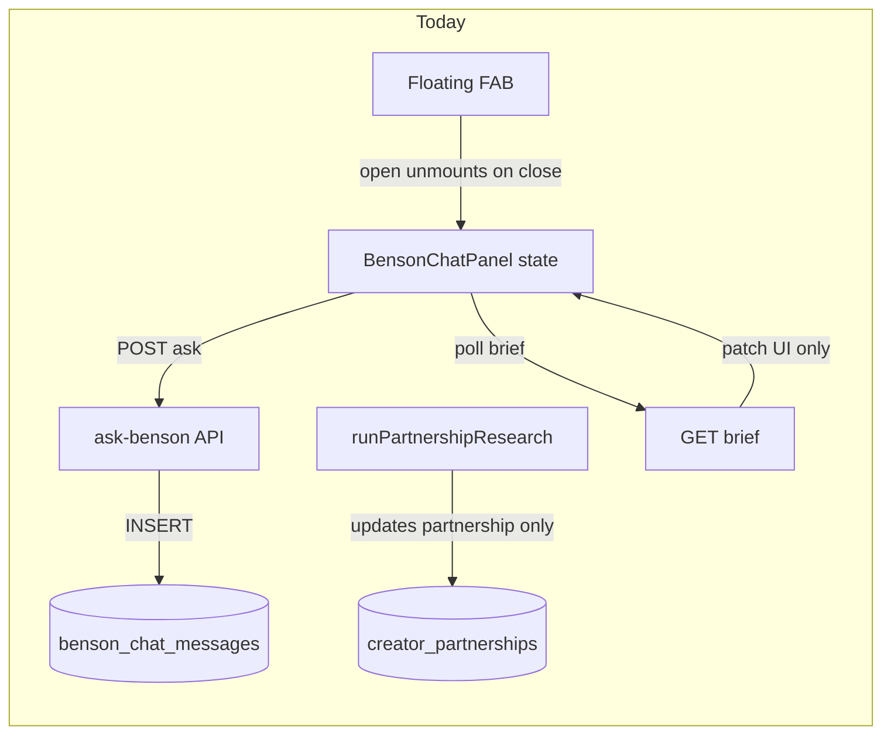
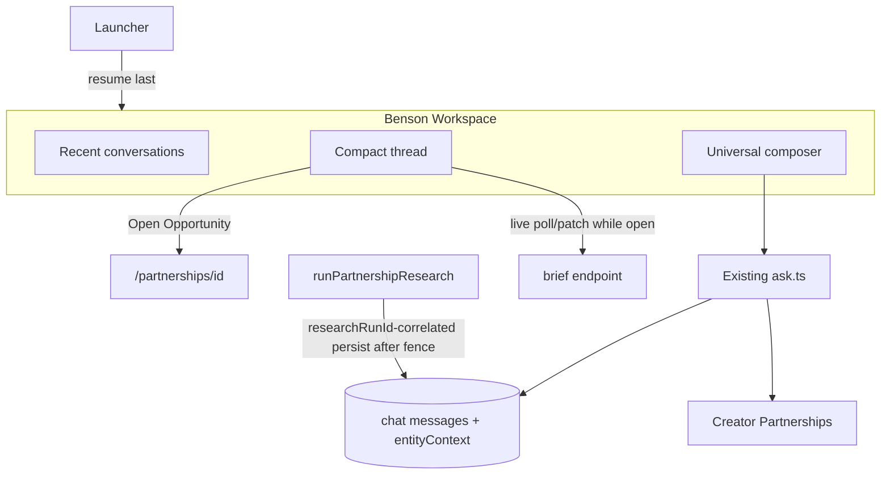
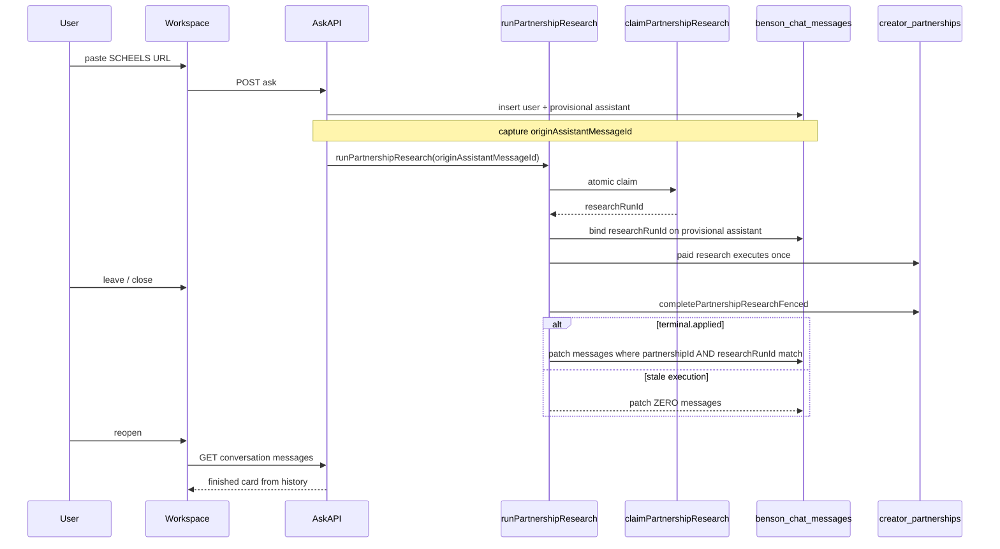

# Benson Persistent Workspace UX Plan

**Status:** Unpaused — singleflight hotfix and producer-authority fix deployed/validated; ready for Workspace MVP implementation  
**Production baseline:** fingerprint `0935047cd8ac8b85`; Migration 84 applied; email actionability and durable discovery skip authority are closed. Workspace work must not revisit those systems unless a new production failure appears. AI budget/throttling remains unchanged.  
**Operational SCHEELS partnership ID (connected DB):** `341940fa-edca-4bdf-b44b-d06b2b63327d` (historical storm analysis ID `cec7d31d-…` absent from connected database)
**Principle:** Benson should feel like one persistent place where Elliott can throw anything, ask anything, leave, come back later, and continue working. The intelligence can be deep. The default interface should be simple.

**Scope boundary:** Backend intelligence (URL Intelligence v1, Creator Partnerships, Field Verification, Gmail matching, platform activities, research, verification ledger, Creator Play, etc.) remains intact. This plan covers UX/presentation/persistence on top of existing systems.

---

## LOCKED PRODUCT DECISIONS (APPROVED)

| # | Decision | Locked choice |
|---|----------|---------------|
| 1 | Primary route / naming | **1A** — [`/ask-benson`](../../dashboard/app/ask-benson/page.tsx) becomes the full persistent Benson Workspace. [`/benson`](../../dashboard/app/benson/page.tsx) briefing hub remains for now. FAB / nav “Ask Benson” open the workspace. |
| 2 | Desktop primary chrome | **2A** — Full-page workspace with collapsible Recent sidebar. Dockable side panel is phase 2 only (same components, extra chrome). |
| 3 | Floating launcher in MVP | **3A** — FAB is **launcher-only**. No competing mini-chat. Optional badge for finished background work. |
| 4 | Conversation titles | **4A** — Automatic titles from the first durable signal (entity/URL/host/first user line); user edit later. |

### Corrections locked into this revision

1. **True full-screen mobile workspace** — hide app bottom nav + FAB while inside Benson; one scroller; sticky composer; keyboard/safe-area; Android/browser Back returns to originating page; leave/reopen preserves conversation.
2. **Message-level context association** — `conversation.primary_partnership_id` is **not** authoritative routing context. Each message can retain its own entity/opportunity associations. Conversation primary is UI hint / title aid / default candidate only.
3. **Server-side async completion persistence** — research completion path persists finished brief/card onto stored assistant message(s) **correlated by `researchRunId`**, only after fenced terminal apply succeeds. Poll/patch remains live UX only; reopen must not depend on the workspace having stayed open or on GET side effects.
4. **Singleflight-aligned chat persistence (post-deploy hotfix)** — reuse deployed `researchRunId` fencing from [`research-singleflight.ts`](../../services/core/src/creator-partnership/research-singleflight.ts). **Never** patch assistant messages by `partnershipId` alone. Workspace is downstream of claim/lease/fence; do not redesign singleflight.

### LOCKED CORRELATION MODEL (post-singleflight)

| Identity | Role |
|----------|------|
| **`partnershipId`** | Durable opportunity identity |
| **`originAssistantMessageId`** | Exact originating assistant chat-message id (durable row id in `benson_chat_messages`) |
| **`researchRunId`** | Exact research execution identity / fencing token (from atomic claim; stored on partnership metadata and assistant `output_json`) |

**Rules:**

- **`researchRunId` is a canonical top-level field on assistant `output_json`** — **not** inside `entityContext`. Entity association and execution correlation are separate concepts.
- **`originAssistantMessageId`** binds the originating provisional assistant immediately; **`researchRunId`** is the durable execution key that may also update any additional assistant messages that explicitly joined the same active run.
- **Do not create** a parallel research execution identifier or concurrency system. Reuse [`claimPartnershipResearch`](../../services/core/src/creator-partnership/research-singleflight.ts), `RESEARCH_LEASE_MS`, and fenced terminal writes in [`pipeline.ts`](../../services/core/src/creator-partnership/pipeline.ts).

## RECOMMENDED FIRST SLICE (UPDATED)

Ship a reviewable slice that makes Benson feel persistent and readable **without** rebuilding intelligence. **Backend-first order (see §W):**

1. Migration `85_benson_conversations.sql` + backfill on the existing `benson_chat_messages` log.
2. Conversation APIs + `entityContext` conventions.
3. **`originAssistantMessageId` + `researchRunId` correlation** on provisional assistant insert.
4. **Fenced server-side terminal persistence** in `runPartnershipResearch` (after `terminal.applied === true` only).
5. **Provider/status-state correctness** (no bogus Instagram/TikTok copy on normal websites — §M-bis).
6. Reload/resume last conversation; live poll/patch **while open only**.
7. Compact **Tier-1** cards (`BensonResultCard`).
8. Desktop Recent Workspace chrome.
9. **Mobile true full-screen shell**.
10. FAB launcher-only.
11. Acceptance/hardening (correlation tests A–G + provider regressions — §V).

**Deferred within MVP polish order (see §W):** full chooser UI, pinned/search, PDF, active-work rail, dock mode.

**Out of first slice:** pinned/search, dockable side panel, full ambiguous chooser UI (unless association ambiguity blocks a critical path), PDF attachments, proactive notification center, voice-as-first-class notes storage.

**MVP model must not prevent** the later chooser:

```
Which opportunity is this about?
[SCHEELS × WGACA] [REKLAIM × Jared] [New Opportunity]
```

---

## A. Current-state findings

| Area | Reality today |
|------|----------------|
| Persistence | Messages stored in [`benson_chat_messages`](../../db/migrations/39_benson_chat_messages.sql) with durable `conversation_id` (uuid on rows, **no conversations table**, no titles). |
| UI state | [`BensonChatPanel`](../../dashboard/components/benson-chat-panel.tsx) holds `messages` + `conversationId` in React state only. |
| Close behavior | [`BensonChatFloating`](../../dashboard/components/benson-chat-floating.tsx) does `{open && <BensonChatPanel />}` — **unmount loses the thread**. Server rows remain but are never reloaded. |
| Routes | `/ask-benson` = full-page same panel; `/benson` = **briefing hub**, not chat; FAB hidden on `/ask-benson`, limited other routes via [`shouldShowAskBensonFloating`](../../dashboard/lib/ask-benson-types.ts). |
| Layout | App shell always mounts [`StudioMobileNav`](../../dashboard/components/studio-nav.tsx) + pads main with `--studio-tab-bar-height` — consumes vertical space even on `/ask-benson`. |
| API | POST ask / feedback / save-pick / transcribe only — **no list/get conversation APIs**. |
| Attachments | Images via multipart (hash in `input_snapshot`, no blob store); video/audio → `/api/intake/share` (draft inbox); **no PDF**. |
| Structured intel | `collection.decisionBrief`, `partnershipId`, `partnershipResearchStatus`, `items`, `suggestedActions` already returned; UI mostly flattens brief into long text + a thin strip. |
| Async research | [`runPartnershipResearch`](../../services/core/src/creator-partnership/pipeline.ts) updates partnership + `emitDataChange`; client polls brief every 3s and **patches React state only**, not the stored assistant message. |
| Ask partnership-path ordering | Both the URL opportunity fast path and the main link-collection partnership path in [`ask.ts`](../../services/core/src/ask-benson/ask.ts) can call `submitCreatorPartnership()` before the relevant user/provisional assistant rows exist; `submitCreatorPartnership()` starts fire-and-forget research unless `skipResearch` is set. Every chat-triggered partnership branch must defer that launch until its provisional assistant exists. |
| Join result gap | [`claimPartnershipResearch`](../../services/core/src/creator-partnership/research-singleflight.ts) currently returns `{ claimed: false }` with no active run id when another execution owns the lease. Workspace needs a read-only active-run join result/helper so an additional provisional assistant can bind to the authoritative current `researchRunId` without changing atomic claim ownership. |
| Chat mutation gap | `benson_chat_messages` is currently insert-only; there is no server-side message UPDATE path. Workspace must add one focused persistence helper for run binding and fenced terminal patches rather than scattering JSONB updates through the pipeline. |
| Model history | Last **12** messages loaded server-side for LLM context; user cannot browse older turns in UI. |



**Additional inspection notes:**

- Feedback lives in `benson_chat_feedback`; voice jobs can FK to message ids.
- Embedded chat variants exist on discoveries/drafts/media-kits using the same panel.
- Partnership brief GET returns `{ partnershipId, researchStatus, decisionBrief, fitScore, needsVerification }` — enough for compact cards without new intelligence.
- `formatProvisionalBriefAnswer` / `formatCompletedBriefAnswer` / client `formatDecisionBriefContent` serialize structured briefs into long text today.

---

## B. UX problems confirmed from code

1. **Readability:** Floating panel capped ~`24rem` / `70dvh`; answers are long prose stuffed into a small scroll region.
2. **False closure:** Closing FAB destroys state; user cannot continue the same thread from the bubble.
3. **Split identity:** Briefing hub (`/benson`) vs chat (`/ask-benson`) vs floating panel compete conceptually.
4. **Detail always on:** Evidence / full brief text always expanded; no Tier-1/Tier-2 hierarchy.
5. **Async continuity gap:** Research completion is not written back to chat messages server-side; reopen after closed workspace can miss the finished card.
6. **Mobile chrome tax:** Bottom tab bar + FAB + page padding steal viewport inside “Ask Benson.”
7. **Composer is almost universal already** — but no drag/drop, no multi-image+text polish, no PDF, no durable attachment gallery.
8. **Context is under-modeled:** only conversation-scoped React state + occasional `partnershipId` on assistant output; no durable per-message association model for multi-opportunity threads.

---

## C. Recommended product model

**One intake surface. Persistent history. Compact by default. Depth on demand. Message-level entity context.**

- **Benson Workspace** = primary product surface (conversation thread + composer + lightweight Recent + optional Active strip later).
- **Floating Benson** = launcher / presence only in MVP (open workspace, badge) — not a second chat product.
- **Partnership detail** (`/partnerships/[id]`) = durable structured record; Benson deep-links into it.
- **Briefing hub** (`/benson`) stays a morning/ops overview; CTA into Workspace, not a parallel chat.

Intelligence stays in core; workspace is presentation + persistence + association UX.



**Boundary vs partnership detail:**

| Benson Workspace | `/partnerships/[id]` |
|------------------|----------------------|
| Intake, reasoning, conversation | Durable structured record |
| Updates, cross-opportunity help | Full research, lifecycle |
| Next actions, compact cards | Evidence, FV, activity, Creator Play |

---

## D. Mobile experience — TRUE FULL-SCREEN WORKSPACE

When Benson Workspace (`/ask-benson`) is open on mobile:

| Requirement | Behavior |
|-------------|----------|
| Viewport | Use the full practical viewport (`100dvh` / dynamic viewport), not “page inside tab-padded main.” |
| Bottom nav | **Hide** `StudioMobileNav` / app tab bar entirely while Workspace is mounted. |
| FAB | **Hide** floating Benson launcher while already inside Workspace (already partially true; keep enforced). |
| Scrolling | **One** primary conversation scroller. History is a sheet/drawer over the thread, not a second pane. |
| Composer | Sticky compact composer pinned to the bottom of the workspace shell. |
| Insets | Account for `safe-area-inset-*` and virtual keyboard (`dvh` / `visualViewport` / env padding). Composer stays above keyboard. |
| Back | Android/browser **Back** returns to the **originating Benson app page** (store `returnTo` / `document.referrer` / session `bensonWorkspaceReturnTo` when launching from FAB or in-app link; `history.back()` when stack entry exists, else navigate to stored origin or `/home`). |
| Persistence | Leaving / reopening / reload preserves the active conversation via server history + last-opened id. |

**Layout implication:** Introduce a Workspace shell mode on `/ask-benson` that opts out of the normal studio main padding (`pb-[calc(var(--studio-tab-bar-height)+…)]`) and suppresses mobile nav chrome. Do not leave the tab bar consuming vertical space “under” the chat.

Desktop Recent sidebar remains; on mobile, Recent opens as a full-height sheet from the header.

---

## E. Desktop experience

- Full-page Workspace with **collapsible left Recent** (≈240–280px) + center thread (max readable measure ~40–44rem) + optional right “context” later.
- Phase 2: optional dock/side-open mode for multitasking beside `/partnerships/[id]` — same components, different chrome.
- Wider surface used for Tier-2/3 expanded research, not for dumping Tier-1 walls of text.
- One coherent Benson experience across mobile and desktop — not two products.

---

## F. Launcher behavior (3A locked)

| Layer | Owns | Does not own |
|-------|------|----------------|
| **FAB** | Presence, navigate/open Workspace (resume last conversation), badge (research done later) | Full answer reading, long threads, mini-chat |
| **Quick-entry** | Deferred (post-MVP) | — |
| **Workspace** | History, reading, expansion, deep links, resume | Replacing partnership detail pages |

MVP: **FAB → Workspace resume**. No floating `BensonChatPanel` for long answers.

---

## G. Full Benson workspace layout

**Desktop:**

```
┌──────────────┬─────────────────────────────┐
│ Recent       │ Conversation title          │
│ • SCHEELS…   │ Compact message cards       │
│ • REKLAIM…   │ …                           │
│ • Mixed…     │ [Expand / actions]          │
│              ├─────────────────────────────┤
│              │ Universal composer          │
└──────────────┴─────────────────────────────┘
```

**Mobile (full-screen):**

```
┌─────────────────────────────┐
│ ← Back   Title    History   │  ← workspace chrome only
├─────────────────────────────┤
│                             │
│   one conversation scroll   │
│                             │
├─────────────────────────────┤
│ sticky composer (+ insets)  │
└─────────────────────────────┘
   (no app tab bar, no FAB)
```

---

## H. Universal composer design

Reuse and extend current composer in [`benson-chat-panel.tsx`](../../dashboard/components/benson-chat-panel.tsx):

- Single text area (questions, URLs, call notes, pasted email).
- Attachments: multiple images in MVP; video/audio → existing share intake with a clear result card in-thread.
- Shortcuts: Upload, Camera (mobile capture), Mic (existing).
- Desktop: drag/drop images onto composer (phase 1 if cheap; else immediate follow-up).
- **No input-type selector required.** Backend routing remains the classifier.
- Draft text: `localStorage` keyed by `conversationId`; attachments-in-progress best-effort.

Do not create separate user-facing forms for URLs, screenshots, call notes, etc.

---

## I. Compact response / card system

One visual language: **BensonResultCard** with variants (same chrome, different slots).

| Type | Primary signal | Default body |
|------|----------------|--------------|
| A Question answer | Short answer | 3–7 lines + sources link |
| B New opportunity | Headline + entities | Found / Local / Creator / Next |
| C Existing updated | “Updated” + what changed | Delta + Next |
| D Evidence received | What was captured | Linked opportunity |
| E Research completed | Phase complete + fit | Same compact brief, refreshed |
| F Action required | Next action emphasis | 1 primary CTA |
| G Verification result | Verified / unresolved | Call script CTA |
| H Email/app status | Platform/partnership activity | Open email / confirm |
| I Comparison | Ranked list | Top pick + why |
| J Error / unsure | One-line failure + next best step | Choices if ambiguous |

**SCHEELS Tier 1 example** uses existing `decisionBrief` fields — no new research model. Stop dumping full `formatDecisionBriefContent` into the default bubble.

**Actions:** 1 primary, 1–2 secondary, overflow for the rest.

---

## J. Expandable detail model

| Tier | Default size | Contents |
|------|--------------|----------|
| **Tier 1 — default** | ~3–7 concise lines / compact card | What I found, what changed, what still needs verification, what to do next |
| **Tier 2 — expanded** | Key reasoning + evidence | Research summary, gaps, top evidence, monetization, story angles, next-action list |
| **Tier 3 — full detail** | Complete research / sources / long-form | Deep link to `/partnerships/[id]` |

- User controls expansion.
- **Never collapse critical warnings** in Tier 1.
- Ambiguous association uses compact chooser card (type J), not a wall of text.

---

## K. Conversation persistence / history + schema

### Conversation table (metadata only)

```sql
benson_conversations (
  id uuid PK,                 -- same ids already on messages.conversation_id
  creator_id uuid not null,
  title text not null,
  title_source text not null, -- 'auto' | 'user'
  -- SOFT HINT ONLY — never authoritative routing context
  primary_partnership_id uuid null,
  last_message_at timestamptz not null,
  last_message_preview text,
  last_opened_at timestamptz null,
  metadata jsonb not null default '{}'::jsonb
)
```

Create this as Workspace-only migration **`85_benson_conversations.sql`** (84 is the deployed producer-authority migration and remains untouched). Backfill from distinct `benson_chat_messages.conversation_id`; derive creator, first/last timestamps, title seed, and preview deterministically from existing rows. Add the corresponding Drizzle schema and a dedicated idempotent migration runner/package command following the repository's existing migration pattern.

Migration 85 must not assume the general pre-alpha migration catalog is current (the catalog presently ends before recent file-only migrations). Apply Workspace through its dedicated runner. Do not expand this slice into reconciling unrelated `db/init` / migrations 80–84 drift.

**`primary_partnership_id` meaning (corrected):**

- UI hint (e.g. Recent subtitle, “related to…”)
- Auto-title aid
- Default **candidate** when a follow-up has no explicit URL/entity
- **Not** the sole routing key for evidence / FV / research attachment

### Message-level context (no new table in MVP)

Store on existing JSON columns:

**User message `input_snapshot.entityContext` (example shape):**

```json
{
  "associations": [
    {
      "entityType": "creator_partnership",
      "entityId": "341940fa-edca-4bdf-b44b-d06b2b63327d",
      "role": "subject",
      "confidence": 0.92,
      "source": "explicit_url"
    }
  ],
  "candidates": [],
  "needsChooser": false,
  "resolvedAt": null
}
```

**Assistant message `output_json` (canonical top-level fields — extend existing):**

```json
{
  "answer": "…",
  "partnershipId": "341940fa-edca-4bdf-b44b-d06b2b63327d",
  "researchRunId": "18074b62-b02a-4496-aa76-b63122359daa",
  "researchStatus": "researching",
  "decisionBrief": null,
  "uiCard": {
    "type": "research_provisional",
    "headline": "…",
    "tier1": { },
    "actions": []
  },
  "entityContext": {
    "associations": [
      {
        "entityType": "creator_partnership",
        "entityId": "341940fa-edca-4bdf-b44b-d06b2b63327d",
        "role": "subject",
        "confidence": 1,
        "source": "pipeline"
      }
    ]
  },
  "collection": { "partnershipId": "341940fa-edca-4bdf-b44b-d06b2b63327d", "partnershipResearchStatus": "researching" }
}
```

**Conventions:**

- Set **`researchRunId`** on the provisional assistant **after** successful singleflight claim/join and **before** expensive web/LLM research begins.
- On terminal completion, update `researchStatus`, `decisionBrief`, `uiCard` (and optional short Tier-1 `answer` refresh) — still keyed by the same top-level `researchRunId`.
- **`researchRunId` must NOT appear inside `entityContext`.**
- Preserve original source URL/provenance in message/card payload (do not drop submitted URL when updating status copy).
- Define the chat association shape as an explicit Ask Benson message type. Do not reuse the unrelated `creator_partnerships.metadata.entityContext` source-name shape (`brandName` / `retailerName` / `productName`).
- Normalize assistant write branches through shared output helpers so fast-path, main LLM, cache/navigation, reload, and terminal patch agree on canonical top-level fields.

`uiCard` may be client-derived in early MVP if server derivation is deferred, but **completed research persistence must write `decisionBrief` + `researchStatus` + `researchRunId` (+ `uiCard` when available) server-side**, and only after fenced terminal apply succeeds.

### APIs

- `GET /api/ask-benson/conversations` — recent, limit/cursor
- `GET /api/ask-benson/conversations/:id/messages` — paginated (includes entityContext / uiCard)
- `PATCH /api/ask-benson/conversations/:id` — title / last_opened
- On `POST /api/ask-benson` — upsert conversation; write per-message entityContext; optionally refresh soft primary hint

**Organization (MVP):** flat Recent by `last_message_at`.  
**Later:** Opportunities filter (messages or soft primary), Pinned, General, search.

**Chronology invariant:** `last_message_at` advances only when a new user/assistant chat message is appended. An in-place background update of an existing assistant from non-terminal to terminal must **not** bump `benson_conversations.last_message_at` or reorder Recent. Future unseen-completion state belongs in conversation/message metadata or a badge field, not chronological ordering.

---

## L. Message-context association strategy (corrected)

Elliott may discuss multiple unrelated opportunities in one conversation:

```
msg1 → SCHEELS partnership
msg2 → SCHEELS (follow-up note)
msg3 → REKLAIM
msg4 → unrelated new opportunity
msg5 → SCHEELS again
```

### Association signals (priority order)

1. **Explicit URL/entity in current message** (including newly pasted commerce/program URL) — **overrides** stale conversation primary and recent subject.
2. **Attachments / evidence** tied to an entity (image intake that resolves to a known partnership, etc.).
3. **Recent message subject** — last assistant/user association with high confidence in-thread (short window), used only when current message has no explicit entity.
4. **Existing linked opportunity** on the immediately preceding turn when the user is clearly continuing (“they have 15 bags…”).
5. **Conversation soft primary** — weakest default candidate only.
6. **Confidence gate** — if top candidate is weak or multiple near-ties → `needsChooser: true` (compact chooser card). Do **not** blindly attach.

### MVP vs later for chooser

- **MVP data model:** always write `entityContext` (associations / candidates / needsChooser) so chooser can be added without migration churn.
- **MVP behavior:** auto-associate when confidence is high (explicit URL, or clear same-subject continuation). If ambiguous, either ask a short clarifying question in Tier 1 or set `needsChooser` and show a minimal stub; **full chooser UI can land immediately after MVP** without schema redesign.
- **Do not** route all follow-ups through `conversation.primary_partnership_id`.

### Soft primary updates

When a high-confidence association occurs, may set/update `conversations.primary_partnership_id` for title/Recent hints — but subsequent explicit REKLAIM/SCHEELS URLs must associate to the **message**, not force the whole thread onto one opportunity.

---

## M. Background research + exact async-persistence flow (singleflight-aligned)

**Prerequisite:** Deployed Creator Partnership singleflight is live ([`research-singleflight.ts`](../../services/core/src/creator-partnership/research-singleflight.ts), [`pipeline.ts`](../../services/core/src/creator-partnership/pipeline.ts)). Workspace hooks are **downstream only** — do not weaken atomic claim, `RESEARCH_LEASE_MS`, `researchRunId` fencing, stale execution rejection, or touch metadata preservation.

### Live UX (workspace open)

- Keep 3s brief poll + opportunities data-revision.
- Patch the in-memory card for snappy UI.
- **Do not treat poll/GET as the persistence mechanism.**

### Chat-triggered research flow (Ask Benson)

When Ask Benson triggers partnership research:

1. **POST Ask Benson** inserts the user message.
2. On every chat-triggered partnership branch (URL fast path and main link-collection path), call `submitCreatorPartnership(..., { skipResearch: true })` (or an equivalent internal no-launch path) so the partnership/intake record exists but paid research has not started.
3. Insert the **provisional assistant message before** expensive research starts.
4. Capture **`originAssistantMessageId`** (the inserted assistant row id).
5. Pass **`originAssistantMessageId`** in the internal `runPartnershipResearch` invocation/context.
6. **`runPartnershipResearch` performs the existing atomic singleflight claim** (unchanged).
7. **If this request wins a new claim:** obtain the new **`researchRunId`** → persist it onto the originating assistant `output_json` **before** the current page fetch at the start of `runPartnershipResearch`, and before all expensive web/LLM research.
8. **If this request joins an already-active research cycle:** execute the race-safe join invariant below. Do not return merely because the first read found an active run.

Multiple assistant messages may explicitly join one legitimate active research cycle (same `researchRunId`, one research execution).

**Current-code integration constraint:** do not reinterpret `claimed: false` as ownership and do not weaken the atomic UPDATE in `claimPartnershipResearch`. The join path only reads the already-owned active run and binds an assistant message to it. If no current active run can be verified, leave the message unbound/clarifying rather than attaching it to a stale run.

### Race-safe active-run join invariant

A provisional assistant joining an existing run must leave the join flow in exactly one durable state:

- **A. Active-bound:** bound to the **same** `researchRunId` while that run is still actively `researching` with a valid lease.
- **B. Terminal-caught-up:** bound to that run and immediately persisted with that same run's already-applied terminal `researchStatus`, `decisionBrief`, and compact `uiCard`.

It must never remain durably `researching` merely because normal terminal persistence raced ahead of message binding.

**Required join sequence:**

1. `claimPartnershipResearch` returns `claimed: false`; this grants no execution ownership.
2. Read the authoritative partnership state; verify active `researchStatus`, current lease, and capture `joinResearchRunId`.
3. Bind only `originAssistantMessageId` to `joinResearchRunId` using an idempotent execution-correlated helper.
4. Immediately re-read authoritative partnership research state.
5. If the **same** `joinResearchRunId` remains actively `researching` with a valid lease, the join is durable state A; return without launching research.
6. If the **same** `joinResearchRunId` is now terminal, immediately catch up that exact assistant message from the already-applied partnership terminal state using the same compact `decisionBrief` / `uiCard` mapper as normal terminal persistence; this is durable state B.
7. If the partnership moved to a **different** `researchRunId`, do not silently join the newer run and do not apply stale Run A terminal data as Run B. Reconcile the provisional message to an explicit safe retry/clarify state; any later join attempt must repeat verification against the newly named run.

The bind and catch-up operations must be idempotent and match exact assistant id + `partnershipId` + `researchRunId` + expected non-terminal state. They must never patch by `partnershipId` alone, launch duplicate paid research, depend on client polling/GET side effects, or treat a joiner as the research owner.

### Fenced server-side terminal completion (authoritative)

When research reaches a terminal result (`complete`, `needs_verification`, or `failed`):

1. Perform the existing fenced partnership terminal write first:

```typescript
const terminal = await completePartnershipResearchFenced({ ... })
// or failPartnershipResearchFenced for failed
```

2. **If `terminal.applied !== true`:** this execution is **stale/superseded** → **patch ZERO Benson chat messages** → return. Do not emit completion cards for stale runs.

3. **If `terminal.applied === true`:** then patch assistant chat messages where **all** of the following match:

- `output_json.partnershipId` = current partnership id
- `output_json.researchRunId` = **this execution’s** `researchRunId`
- stored `researchStatus` is still non-terminal (provisional / researching / queued)

4. For each matching message, update in place:

- `researchStatus` / `collection.partnershipResearchStatus`
- `decisionBrief` / `collection.decisionBrief`
- `uiCard` compact payload (or fields sufficient to rebuild Tier-1)
- optional short Tier-1 `answer` refresh (avoid appending a second wall of text)
- brief timestamps (`updatedAt`)

5. `emitDataChange({ domain: 'opportunities', … })` as today (after successful partnership terminal write).

These in-place terminal patches and race catch-ups must not update `benson_conversations.last_message_at`; completion/unseen metadata may change independently without reordering Recent.

**Explicitly forbidden:** finding or patching assistant messages by **`partnershipId` alone**. A future SCHEELS refresh (Run B) must **not** rewrite historical provisional messages from Run A merely because they share the same `partnershipId`.

**Failure path:** same fenced gate — if `failPartnershipResearchFenced` returns `applied: false`, patch zero messages; if `applied: true`, persist compact error card to messages matching `partnershipId` **and** `researchRunId`.

### Background / non-chat research

If research starts **outside Ask Benson** and no assistant message explicitly joined that `researchRunId`:

- **Do not** search for arbitrary historical messages by `partnershipId`.
- **Do not** rewrite old chat history.



### Explicit non-dependencies

Completion persistence must **not** depend on:

- workspace remaining open
- client polling succeeding
- a GET `/brief` handler side effect

Poll/patch remains the live UX mechanism **while Benson is open**.

### Reopen behavior

Load conversation history → render stored `uiCard` / `decisionBrief` / `researchRunId`. If any message still non-terminal for its bound `researchRunId`, resume poll once. No duplicate assistant message for the same research completion.

### Launcher badge

MVP: client `localStorage` of last-seen brief `updatedAt` / conversation completion flag. Later: server `hasUnseenResearchCompletion`.

---

## M-bis. Provider / status copy (MVP — explicit bug fix)

**Observed bug (must fix in MVP):** normal websites such as **Clothes Mentor** and **SCHEELS** received copy equivalent to *“Benson is still reading that link — Instagram carousels can take a few minutes.”* via generic network-error mapping in [`ask-benson-types.ts`](../../dashboard/lib/ask-benson-types.ts) (`ASK_BENSON_LINK_TIMEOUT_ERROR`).

**Rule:** Provider-specific status text must be derived from **actual** normalized source/provider diagnostics — not a stale/default provider label.

### Locked status semantics

| State | User-facing copy (locked) | Visual |
|-------|---------------------------|--------|
| **Generic processing** | “Benson is still reading that link. I’ll keep working on it in the background.” | neutral / accent |
| **Direct page read failed, fallback research active** | “I couldn’t read the page directly, so I’m checking other sources.” | neutral / accent |
| **Terminal verification failure** | “I couldn’t verify this page right now.” | error / red |
| **Provider-specific (Instagram, TikTok, …)** | Only when **both** normalized source/provider matches **and** active processing diagnostics support that provider-specific state | per provider |

**Additional rules:**

- A normal commerce/local site must **NEVER** inherit Instagram/TikTok status copy.
- **Do not** tell the user to retry while background processing is still active.
- **Needs user input** states use warning styling (distinct from active processing and terminal failure).
- Original submitted URL / provenance must remain intact on the message/card payload.
- Persist normalized provider/status plus relevant diagnostics in assistant output so reload renders the same state without reconstructing it from a transient network error.
- Apply the resolver consistently in server output mapping and [`benson-chat-panel.tsx`](../../dashboard/components/benson-chat-panel.tsx), not only `userFacingAskBensonError`.
- There is currently no TikTok-specific URL intake processor. Do not add one solely for copy: without matching TikTok diagnostics, TikTok-specific text must not render.

### Provider-status regression tests (MVP)

- Clothes Mentor URL → status copy **never mentions Instagram**
- SCHEELS URL → status copy **never mentions Instagram**
- Generic non-social website → **never mentions Instagram or TikTok**
- Instagram-specific text → **only** for Instagram URL **and** matching Instagram processor diagnostics
- TikTok-specific text → **only** for TikTok URL **and** matching TikTok diagnostics
- Active fallback copy **≠** terminal failure copy
- Active processing **does not** show premature “try again” copy
- Original URL/provenance preserved after status updates

---

## N. Active-work representation

- **MVP:** not a new system.
- **Phase 2:** Workspace top rail linking into Action Center + partnerships (Active / Waiting / Needs action / Recently changed).
- Complements dashboards; does not duplicate CRM.

---

## O. Existing modules to reuse

| Reuse | Path |
|-------|------|
| Chat panel / composer | [`dashboard/components/benson-chat-panel.tsx`](../../dashboard/components/benson-chat-panel.tsx) |
| Floating shell → launcher only | [`benson-chat-floating.tsx`](../../dashboard/components/benson-chat-floating.tsx) |
| Layout chrome control | [`dashboard/app/layout.tsx`](../../dashboard/app/layout.tsx), studio nav |
| Types | [`ask-benson-types.ts`](../../dashboard/lib/ask-benson-types.ts) |
| Ask core | [`ask.ts`](../../services/core/src/ask-benson/ask.ts) |
| Ask HTTP conversation endpoints | [`services/api/src/routes/ask-benson.ts`](../../services/api/src/routes/ask-benson.ts); existing dashboard wildcard proxy already forwards nested paths |
| Research completion hook point | [`pipeline.ts` `runPartnershipResearch`](../../services/core/src/creator-partnership/pipeline.ts) — insert chat persist **after** `terminal.applied` |
| Singleflight claim / fencing | [`research-singleflight.ts`](../../services/core/src/creator-partnership/research-singleflight.ts) |
| Provider/status copy fix | [`ask-benson-types.ts`](../../dashboard/lib/ask-benson-types.ts), [`benson-chat-panel.tsx`](../../dashboard/components/benson-chat-panel.tsx), and existing core URL diagnostics/output mapping (§M-bis) |
| Decision brief | [`decision-brief.ts`](../../services/core/src/creator-partnership/decision-brief.ts) |
| Brief GET (live poll only) | creator-partnerships `/:id/brief` |
| Data revision | [`benson-data-refresh.tsx`](../../dashboard/lib/benson-data-refresh.tsx) |
| Message JSON columns | `input_snapshot`, `output_json` on `benson_chat_messages` |

**Do not** rebuild ask routing, URL Intelligence, FV, Gmail matching, or a parallel message store.

---

## P. Backend / schema changes (only if necessary)

**Necessary:**

- `benson_conversations` table + backfill
- List/get/patch conversation APIs
- Upsert conversation on ask
- Message-level `entityContext` convention in existing JSON columns
- **Server-side** assistant-message patch from research completion / failure in `runPartnershipResearch` — **only after** `terminal.applied === true`, matching **`partnershipId` AND `researchRunId` AND non-terminal status** (never `partnershipId` alone)
- **`originAssistantMessageId` + `researchRunId` binding** on provisional assistant insert before expensive research
- **Provider/status copy correctness** in Ask Benson status mapping (see §M-bis)
- Soft `primary_partnership_id` hint updates (non-authoritative)

**Not necessary in MVP:**

- New `benson_message_entities` table (defer unless JSON query pain appears)
- New attachment blob store / PDF pipeline
- New intelligence pipeline
- Websockets
- Full-text search index
- GET `/brief` write side effects

---

## Q. Performance strategy

- Opening Workspace: metadata + last N messages only — no strategist/preference LLM.
- Virtualize/window after ~50 messages.
- Compact cards hydrate from stored `output_json`; poll only non-terminal.
- Prefetch Recent; lazy older pages.
- FAB mount stays cheap (navigation only).
- Mobile full-screen shell avoids double scroll + tab-bar layout thrash.

---

## R. Accessibility / readability

- Cap Tier-1 width; clear hierarchy; collapsible Tier-2.
- Critical warnings never buried.
- Focus: composer on open; history sheet focus trap on mobile.
- Touch targets ≥44px; keyboard does not cover composer.
- Back control labeled; does not trap the user in Workspace without an exit.

---

## S. MVP implementation slice (detail, corrected)

1. Workspace-only migration `85_benson_conversations.sql` + backfill; do not modify/reapply Migration 84.
2. Conversation list/get/patch APIs; ask upserts conversation + writes message `entityContext`.
3. **`originAssistantMessageId` + `researchRunId` correlation** on provisional assistant insert; defer chat-triggered research until after that insert, then bind after claim or complete the race-safe verified join/catch-up invariant before returning.
4. **Fenced server-side terminal persistence** in `runPartnershipResearch` — patch messages only when `terminal.applied === true` and `partnershipId` + `researchRunId` + non-terminal status match.
5. **Provider/status copy correctness** (§M-bis) — no bogus Instagram/TikTok copy on normal websites.
6. Message reload + last-conversation resume; live poll/patch **while open only**.
7. Extract `BensonComposer`, `BensonMessageList`, and `BensonResultCard`; render Tier-1 by default and Tier-2 on demand.
8. **Desktop** workspace chrome (collapsible Recent) on `/ask-benson`.
9. **Mobile true full-screen** shell: hide tab bar + FAB, one scroller, sticky composer, safe-area/keyboard, Back → origin, persistence.
10. FAB launcher-only + badge stub.
11. Acceptance/hardening: correlation tests A–G + provider regressions (§V).

**Preserve:** URL Intelligence v1, partnership routing, research, verification ledger, FV, Creator Play, Gmail matching, platform relationships, sponsorship pipeline, existing opportunity records. **Do not weaken** deployed singleflight/lease/fencing.

---

## T. Later phases

- Full ambiguous association chooser UI (model ready in MVP)
- Quick-entry sheet on FAB; dockable desktop side workspace
- Active-work rail wired to Action Center
- Pinned + search/filter; editable titles polish
- PDF/document attach + durable media gallery
- Cross-device drafts; share-to-Benson; light notification center
- Voice notes as first-class evidence objects

---

## U. Risks / tradeoffs

| Risk | Mitigation |
|------|------------|
| Dual UI | MVP launcher-only FAB |
| Conversation primary mis-routes evidence | Message-level entityContext; primary is soft hint only |
| Research finishes while UI closed | Server persist in `runPartnershipResearch` **after fenced terminal apply**; reload from conversation history |
| Stale research run patches wrong messages | **`researchRunId` correlation** + `terminal.applied` gate; never patch by `partnershipId` alone |
| Run B rewrites Run A provisional cards | Terminal patch requires matching **`researchRunId`**; historical Run A messages untouched |
| Bogus Instagram/TikTok status on normal sites | Provider/status copy from actual normalized provider + diagnostics (§M-bis); fix `ASK_BENSON_LINK_TIMEOUT_ERROR` mapping |
| Mobile still feels cramped | Hide tab bar + FAB; full-viewport shell |
| Long LLM answers | Cards first for partnership path; prompt nudge later |
| Chooser deferred too long | Persist `needsChooser` / candidates in MVP JSON |
| Finding messages to patch on completion | Put JSONB update/query logic in a focused Ask Benson persistence helper; query `output_json` by **`partnershipId` AND `researchRunId` AND non-terminal status** — not partnershipId-only sweep |
| Chat fast path starts research before assistant exists | Use the existing internal `skipResearch` option during partnership submission, insert user + provisional assistant, then invoke research with `originAssistantMessageId` |
| Losing claim has no join id today | Add a read-only verified active-run join result/helper; preserve the current atomic claim UPDATE and never treat a joiner as execution owner |
| Terminal persistence races ahead of join binding | Post-bind authoritative re-read; same-run terminal catch-up of the exact assistant message; different-run state must retry/clarify without silent rebinding |
| Background completion reorders Recent | In-place assistant terminal patches never change `benson_conversations.last_message_at`; track unseen completion separately |
| Background research with no joined message | No historical message sweep; partnership row + data-revision only |
| Back stack ambiguity | Store `returnTo` when opening Workspace from FAB/in-app links |
| Weakening deployed singleflight | Workspace hooks **downstream only**; merge after `completePartnershipResearchFenced` / `failPartnershipResearchFenced` `terminal.applied` checks (see §X) |

---

## V. Test / acceptance plan

### Correlation / fenced persistence (required)

| # | Scenario | Expected |
|---|----------|----------|
| **A** | One assistant message starts Run A → Run A completes | Only that message (matching `partnershipId` + `researchRunId` A) receives terminal patch |
| **B** | Two assistant messages explicitly join Run A | Both may update on Run A completion; still **one** research execution |
| **C** | Later Run B for same partnership | Run B completion **does not** rewrite Run A messages |
| **D** | Stale Run A terminal returns `applied: false` | **Zero** chat message patches |
| **E** | Background/non-chat research with no joined assistant message | **No** historical message sweep by `partnershipId` |
| **F** | Close Workspace before completion → reopen after complete | Server-persisted terminal card visible from conversation history (no poll dependency) |
| **G** | Run A active; Message B verifies Run A; Run A terminal write + normal patch completes before B's bind; B then binds and post-bind verifies | Post-bind verification detects the same Run A is terminal and immediately persists B with Run A's terminal card; exactly one research execution; reopening shows both Run-A messages complete without polling |

**Conversation ordering acceptance:** capture `benson_conversations.last_message_at`, apply an in-place assistant `researching` → terminal update (normal patch and race catch-up variants), and verify `last_message_at` and Recent ordering are unchanged.

### Provider / status copy (required — §M-bis)

- Clothes Mentor URL → status copy **never mentions Instagram**
- SCHEELS URL → status copy **never mentions Instagram**
- Generic non-social website → **never mentions Instagram or TikTok**
- Instagram-specific text → **only** for Instagram URL **and** matching Instagram processor diagnostics
- TikTok-specific text → **only** for TikTok URL **and** matching TikTok diagnostics
- Active fallback copy **≠** terminal failure copy
- Active processing **does not** show premature “try again” / retry copy
- Original URL/provenance preserved after status updates

### Workspace UX (required)

- Close Workspace / reload → same conversation; finished research card present **without** requiring poll.
- Start SCHEELS research, leave before complete, reopen after complete → Tier-1 completed card from history.
- SCHEELS then REKLAIM then SCHEELS again in one thread → each message retains correct associations; soft primary may change but does not erase prior message links.
- Explicit new URL overrides stale soft primary.
- Ambiguous association does not silently attach to the wrong opportunity; persist candidates/`needsChooser` and ask a compact clarifying question or show the minimal chooser stub.
- Reload resumes the same active conversation; desktop Recent lists and opens persisted conversations.
- `/menus` still no partnership.
- Mobile: no bottom nav, no FAB, full practical viewport, exactly one primary conversation scroller, sticky composer above keyboard, Back returns to origin.
- FAB opens Workspace only (no mini-chat).
- Existing: Creator Partnership, FV, Creator Play, Gmail matching, and platform relationship/activity systems remain intact.
- Unit: entityContext write/read; fenced terminal patch keyed by `researchRunId`; card mapping from `decisionBrief`.

---

## W. Final recommended MVP implementation order

**Backend-first (do not reorder):**

1. **`benson_conversations` migration + backfill**
2. **Conversation APIs + `entityContext` conventions**
3. **`originAssistantMessageId` + `researchRunId` correlation** on provisional assistant insert, including race-safe active-run join + terminal catch-up
4. **Fenced server-side terminal persistence** in `runPartnershipResearch` (after `terminal.applied === true` only)
5. **Provider/status correctness** (§M-bis)
6. **Reload/resume** conversation history; live poll/patch while open only
7. **`BensonResultCard`** Tier-1/2 from stored brief/uiCard
8. **Desktop Recent** workspace chrome (collapsible sidebar) on `/ask-benson`
9. **Mobile true full-screen** workspace shell (hide tab bar + FAB, one scroller, sticky composer, safe-area/keyboard, Back → origin)
10. **FAB launcher-only** navigation + badge stub; remove competing floating chat panel
11. **Acceptance/hardening** — correlation tests A–G + conversation-ordering check + provider regressions (§V)

Stop for review before full chooser UI / Active-work rail / search / PDF / dock mode.

---

## X. Merge-risk note (singleflight hotfix)

[`pipeline.ts`](../../services/core/src/creator-partnership/pipeline.ts) was materially changed by the deployed Creator Partnership singleflight hotfix. Current code confirms the Workspace hook points remain:

- Immediately after a winning claim obtains `researchRunId` (~L440–442), bind the originating assistant **before** the page fetch / paid research.
- After `completePartnershipResearchFenced` → existing `if (!terminal.applied) return` gate (~L570–585); patch chat only after that gate.
- After `failPartnershipResearchFenced` → existing `if (!failed.applied) return` gate (~L611–616); patch failure card only after that gate.

Both Ask Benson partnership paths in [`ask.ts`](../../services/core/src/ask-benson/ask.ts) are merge-risk areas: the fast path currently submits/launches research (~L516) before inserting user and assistant messages (~L567–592), and the main link-collection path can also submit before its later message inserts. Reorder only chat-triggered launches using the existing internal no-launch option; do not redesign partnership submission.

**Exact current merge-risk file set:**

- [`services/core/src/ask-benson/ask.ts`](../../services/core/src/ask-benson/ask.ts) and [`services/core/src/ask-benson/types.ts`](../../services/core/src/ask-benson/types.ts) — conversation upsert, canonical output types, per-message context, provisional assistant ordering across both partnership paths, research launch.
- [`services/core/src/creator-partnership/pipeline.ts`](../../services/core/src/creator-partnership/pipeline.ts) — origin binding and terminal persistence hook points.
- [`services/core/src/creator-partnership/research-singleflight.ts`](../../services/core/src/creator-partnership/research-singleflight.ts) — verified active-run join result/helper only; preserve atomic claim/fence behavior.
- [`services/core/src/schema.ts`](../../services/core/src/schema.ts), new `db/migrations/85_benson_conversations.sql`, and dedicated Workspace migration runner/package scripts.
- [`services/api/src/routes/ask-benson.ts`](../../services/api/src/routes/ask-benson.ts) — list/get/patch endpoints; [`dashboard/app/api/ask-benson/[[...path]]/route.ts`](../../dashboard/app/api/ask-benson/[[...path]]/route.ts) already proxies GET/PATCH nested paths and should remain generic.
- [`dashboard/components/benson-chat-panel.tsx`](../../dashboard/components/benson-chat-panel.tsx) — split/reuse composer, message list, reload/poll/card mapping.
- [`dashboard/components/benson-chat-floating.tsx`](../../dashboard/components/benson-chat-floating.tsx) and [`dashboard/components/ask-benson-shell.tsx`](../../dashboard/components/ask-benson-shell.tsx) — launcher-only conversion.
- [`dashboard/app/ask-benson/page.tsx`](../../dashboard/app/ask-benson/page.tsx), [`dashboard/app/layout.tsx`](../../dashboard/app/layout.tsx), [`dashboard/components/studio-nav.tsx`](../../dashboard/components/studio-nav.tsx), and [`dashboard/app/globals.css`](../../dashboard/app/globals.css) — desktop Workspace and mobile full-screen shell/chrome suppression.
- [`dashboard/lib/ask-benson-types.ts`](../../dashboard/lib/ask-benson-types.ts) plus existing URL-intake diagnostics types — provider/status semantics and persisted message/card contracts.
- [`dashboard/lib/client-api.ts`](../../dashboard/lib/client-api.ts) — preserve the existing direct/proxy strategy for POST ask while adding conversation GET/PATCH calls consistently.

**Do not:**

- Weaken atomic claim, `RESEARCH_LEASE_MS`, or `researchRunId` fencing
- Patch assistant messages when `terminal.applied !== true`
- Patch assistant messages by `partnershipId` alone
- Introduce a parallel research execution identifier or concurrency system
- Change producer-authority email/actionability or discovery-skip files as part of Workspace

---

## Effect on first-slice scope

| Item | Change vs prior draft |
|------|------------------------|
| Mobile shell | **In MVP** — true full-screen is required, not a polish pass |
| Message entityContext | **In MVP** — JSON convention + write path; chooser UI can wait |
| Conversation primary | Downgraded to soft hint; not routing authority |
| Async completion persist | **In MVP and server-side** — fenced `terminal.applied` gate; **`researchRunId` correlation**; not partnershipId-only sweep |
| Provider/status copy bug | **In MVP** — fix bogus Instagram/TikTok copy on normal websites (§M-bis) |
| Ambiguous chooser UI | Still post-MVP unless blocking; **data model included now** |
| FAB mini-chat | Explicitly out |

---

## Implementation todos (tracking)

- [x] Lock decisions 1A / 2A / 3A / 4A
- [x] Corrections: full-screen mobile, message-level context, server async persist, singleflight-aligned correlation
- [x] Prerequisite deployments closed: singleflight (2026-08-09) and producer authority (fingerprint `0935047cd8ac8b85`)
- [ ] MVP-1: `85_benson_conversations.sql` migration + backfill
- [ ] MVP-2: Conversation APIs + `entityContext` conventions
- [ ] MVP-3: `originAssistantMessageId` + `researchRunId` correlation on provisional assistant insert, including race-safe active-run join + terminal catch-up
- [ ] MVP-4: Fenced server-side terminal persistence (`terminal.applied` gate; `partnershipId` + `researchRunId` match)
- [ ] MVP-5: Provider/status copy correctness (§M-bis)
- [ ] MVP-6: Reload/resume conversation history; live poll/patch while open only
- [ ] MVP-7: `BensonResultCard` Tier-1/2; stop default wall-of-text
- [ ] MVP-8: Desktop Recent workspace chrome
- [ ] MVP-9: Mobile true full-screen workspace shell
- [ ] MVP-10: FAB launcher-only + badge stub
- [ ] MVP-11: Acceptance/hardening — correlation tests A–G + conversation-ordering check + provider regressions (§V)
- [ ] Later: full ambiguous chooser UI, active-work rail, dock mode, search/PDF
