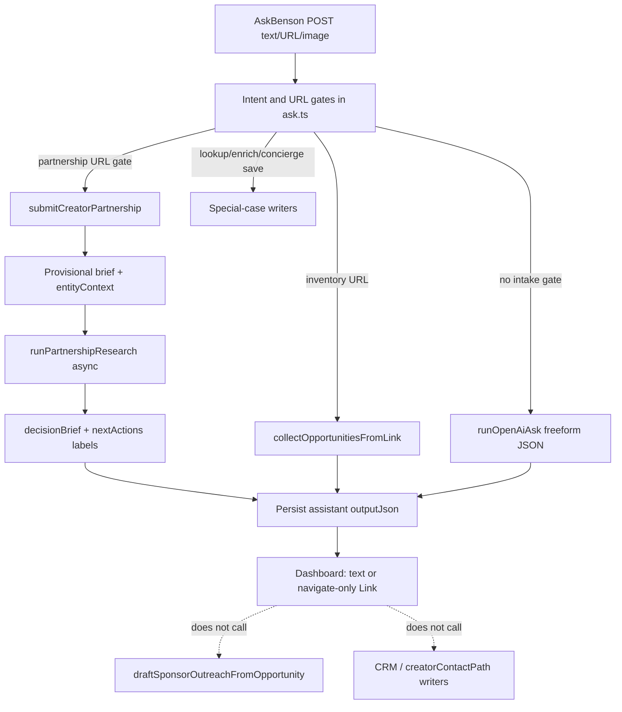
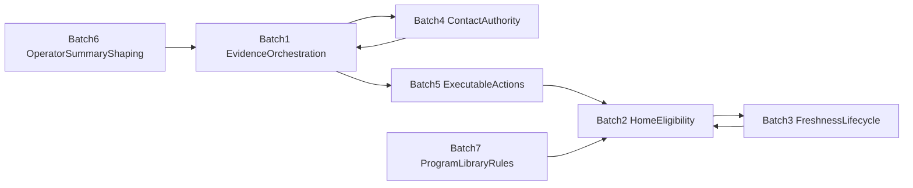

# Benson Decision Quality + Operator Usefulness — AUDIT

**Date:** 2026-08-10  
**Mode:** Read-only audit (no implementation, migration, or deploy)  
**Scope:** Seven production decision-quality failures observed after Workspace MVP deploy  
**Baseline preserved:** Workspace / Migration 85 / researchRunId fencing / provider-status terminal handling / email actionability / durable discovery skip — **closed; do not reopen unless a failure proves a direct regression**

Named examples (Plato’s Closet, Loews Kansas City Hotel, Style Encore, Job Opportunities, Revive) are **regression fixtures for general rules**, not brand-specific fix targets.

---

## Executive root-cause summary

1. **No evidence → mutate → safe-execute orchestration in Ask Benson** — free-text/URL evidence often falls through to LLM paraphrase; `suggestedActions` are decorative or navigate-only; pitch/contact writers live outside chat.
2. **Home promotes after soft metadata ranking without operator eligibility gates** — employment/jobs content can become `creator_candidate` and Top Move; “Confidence: High” is a cheap metadata heuristic, not usefulness-in-context.
3. **Time/lifecycle and contact authority are stamped once and rarely recomputed** — expired events stay “active/current”; stale “no verified contact” is not supersedable ranked evidence when a stronger official form arrives.

**Shared pattern:** authority fields and operator copy are written at ingest, then ranking/UI amplify them without re-eligibility or re-authority.

**Product target loop:**

```
USER INPUT → UNDERSTAND → ASSOCIATE → MUTATE DURABLE STATE
  → EXECUTE SAFE INTERNAL NEXT STEP → REPORT DELTA
```

Not:

```
USER INPUT → PARAPHRASE → SUGGEST WORK ELLIOTT MUST DO
```

---

## Explicit do-not-change boundaries

Document integration points only; do not casually redesign:

| System | Status |
|--------|--------|
| Workspace persistence / `benson_conversations` / Migration 85 | Preserve |
| `researchRunId` chat correlation / singleflight / lease / fencing | Preserve |
| Provider-status terminal handling | Preserve |
| Email actionability producer authority | Preserve |
| Durable discovery skip authority | Preserve |
| Creator Partnership lifecycle / Field Verification / Creator Play | Preserve |
| Gmail matching | Preserve |

If a correction batch crosses these, wire at the integration edge (e.g. persist delta into existing chat `outputJson`) without rewriting the deployed subsystem.

---

## Failure 1 — Benson parrots user evidence

### Producer / control flow



### Exact root cause

**Mutation/orchestration gap.** There is no generic “evidence changed durable state” result. Routing is a gate ladder in [`services/core/src/ask-benson/ask.ts`](../../services/core/src/ask-benson/ask.ts). When free-text sponsor evidence (Plato) or a better contact URL (Loews) does not hit a write branch, `runOpenAiAsk` paraphrases and emits freeform `suggestedActions`. `entityContext` is correlation metadata (`partnershipEntityContext` always sets `confidence: 1`) — it does **not** drive follow-up mutation. “Draft a pitch” never invokes `draftSponsorOutreachFromOpportunity` / Action Center `start_pitch`.

### Authoritative state

| Now | Should |
|-----|--------|
| Assistant prose + optional partnership brief labels | Durable evidence ledger + opportunity/contact fields + safe internal draft/follow-up |
| Decorative “Draft a pitch” | Create/update internal draft when sufficient; report delta |
| Stale contact narrative in CRM/research | Preferred contact path updated from stronger evidence |

### Failure layers

association + mutation/orchestration + action routing + rendering

### Existing safe internal capabilities (already in repo)

- Partnership submit/touch + research: `submitCreatorPartnership`, `runPartnershipResearch`
- Inventory writers: `collectOpportunitiesFromLink/Image/Lookup`, `persistUserConfirmedOpportunity`, enrich
- Concierge save / preferences / pass
- Outreach draft creators (outside chat): `createBensonOutreachDraft`, `draftSponsorOutreachFromOpportunity`, Action Center `start_pitch`
- CRM contact mutators: `recordManualBusinessContact`, `markContactFormSent`, `updateSponsorContact`
- Chat persistence / terminal patches (Workspace)

### Proposed execution policy

**SAFE AUTO:** attach evidence; update verified facts; update preferred contact path; reconcile stale facts; create/update internal pitch draft; create internal follow-up; deterministic lifecycle/status changes.

**USER APPROVAL REQUIRED:** send email; submit external form; publish; irreversible external action.

### Smallest general fix

Evidence classifier → entity associate/chooser → durable mutate → safe auto-execute → delta-first response (LLM narrates mutations; does not invent work for Elliott).

### Files / functions / tables

| Area | Path |
|------|------|
| Gates / LLM | `services/core/src/ask-benson/ask.ts`, `intake-intents.ts` |
| Partnership | `creator-partnership/pipeline.ts`, `decision-brief.ts`, `next-actions.ts` (`pitch_brand` filtered) |
| UI | `dashboard/components/benson-chat-panel.tsx`, `benson-result-card.tsx` |
| Drafts | `sponsor-outreach/benson-drafting/draft.ts`, `action-center/execute.ts` |
| Tables | `sponsor_contacts`, `outreach_emails`, `creator_partnerships.research`, `benson_chat_messages.output_json` |

### Migration

**Likely yes (small)** — evidence/contact-path provenance ledger, or structured merge rules in partnership `research` jsonb + CRM form URL / status history.

### Reconciliation

Optional backfill of known Loews form / Plato contact evidence after code lands — general rules, not brand hacks.

### Regression fixtures

- Plato: contact + sponsor evidence → opportunity resolves → evidence once → contact updated → draft created when sufficient → delta response → no duplicate draft on repeat
- Loews: official influencer form URL → preferred verified contact path → stale no-contact superseded with history → next action = form completion → draft retained → missing form fields surfaced → no send CTA → idempotent paste
- Generic: weaker evidence cannot overwrite stronger; unrelated evidence does not mutate wrong entity; ambiguity → chooser; external send/submit still requires approval

---

## Failure 2 — Home is not “polished goods”

### Producer / control flow

```
raw intake → content_items (often hardcoded creator_candidate)
  → loadIngestedInventoryItems (status filter: creator_candidate|actionable|top_pick)
  → computeCommandCenter → mergePriorityCards
       (discoveredToday → postToday → highestConfidence → trending)
  → home-morning-briefing “Top move today”
```

Key files:
- [`services/core/src/pre-alpha/operational-home.ts`](../../services/core/src/pre-alpha/operational-home.ts) — `computeOperationalHomeData`
- [`services/core/src/inventory/command-center.ts`](../../services/core/src/inventory/command-center.ts) — `computeCommandCenter`, `mergePriorityCards`, `computeConfidence`
- [`dashboard/components/home-morning-briefing.tsx`](../../dashboard/components/home-morning-briefing.tsx) — Top Move rendering
- Ask Benson hardcode: `collect-from-link.ts`, `url-entity-opportunity.ts`
- Dead gate: `creator-agent/relevance-gate.ts` `evaluateCreatorRelevance` (tests only)

### Exact root cause

**Eligibility missing before rank.** Home has no employment/jobs/careers/hiring gate. Ask Benson link/entity paths and newsletter `opportunity` destinations hardcode `creator_candidate`. `evaluateCreatorRelevance` / category hide rules are **unwired** in production ingest. Same-day Ask Benson rows get a **+45** discoveredToday boost. “Confidence: High” means `computeConfidence` ≥ 75 (base 45 + non-Reddit + URL often reaches 85) — **metadata completeness**, not “useful/actionable in this context.”

Share Intake alone defaults to `hidden_raw_signal` and should not Top Move unless later promoted — Ask Benson/newsletter are the likelier employment path when source label shows Share Intake after promotion/status change.

### Authoritative state

| Now | Should |
|-----|--------|
| Rank among status-visible inventory by freshness/discovered/confidence heuristics | **Eligibility first**, then rank |
| Confidence = metadata heuristic | Confidence supports usefulness/actionability in presented context |
| Employment “Job Opportunities” can be Top Move | Employment/jobs/careers never Home-eligible |

### Locked product rule

**Ranking happens only after eligibility.** Gates should include: relevant to Kellie creator/content/sponsor ops; actionable or strategically worth awareness; fresh enough; canonical/deduped; valid entity association; valid CTA target; not suppressed/skipped; **not employment/jobs/career**; not malformed raw intake.

### Failure layers

classification + eligibility + ranking order + confidence semantics

### Smallest general fix

Add Home/command-center **eligibility gate** (intent/category/title employment reject + actionable/strategic + valid CTA) **before** `mergePriorityCards`. Wire or replace dead relevance gate for write-path promotion. Stop treating Confidence High as polished-goods proof (relabel or recompute later).

### Files / tables

`command-center.ts`, `operational-home.ts`, `home-morning-briefing.tsx`, `collect-from-link.ts`, `url-entity-opportunity.ts`, newsletter persist paths, `creator-agent/relevance-gate.ts`, `creator-agent/exclusion-rules.ts`, `content_items.creator_value_status|metadata`

### Migration

**No** for gate (code). Optional later eligibility status column.

### Reconciliation

Demote existing employment `creator_candidate` rows from Home via status/exclude — **not** a title blacklist hack.

### Regression fixtures

- Careers/jobs URL ingested today → may persist as inventory/raw, **never** Top Move
- Compatible sponsor/event candidate with valid CTA → can rank
- Confidence label does not claim usefulness for incompatible items

---

## Failure 3 — Freshness does not change state

### Producer / control flow

```
date extract (LLM/OCR/providers)
  → parseEventDate / parseChicagoDateTime
  → persist eventStartsAt/eventEndsAt + lifecycleStatus≈'active'
  → soft filters differ by surface
  → expire-event-sweep deletes only after COALESCE(end,start) < NOW()-10 days
  → operator summary (script) frozen at ingest
```

Key: `creator-agent/lifecycle.ts` `computeLifecycleStatus` exists; `evaluateAndPersistContentItem` **not wired** to opportunity-refresh / expire-sweep. Home/load often start-date heavy. No `historical_signal` symbol — closest: `lifecycleStatus: expired|archived`, `creatorValueStatus: hidden_raw_signal`.

### Exact root cause

**Lifecycle never recomputed after time passes.** Expired facts remain recommendation-current. Frozen summary continues to say “next event is Aug 8–9” after the weekend. Soft windows (12h discoveries grace, +10d retention, home top-events allowing yesterday) amplify the bug. TZ handling is inconsistent (UTC date-only parse vs Chicago display vs server-local midnight past checks).

### Authoritative state

| Now | Should |
|-----|--------|
| `active` + retention window + frozen prose | Expired facts remain **evidence**; opportunity recommendation state → expired/historical |
| Home may still surface ended events | Home excludes ended events immediately |
| “Next event …” after end | Assert current truth only; historical promotions → “has run promotions before; worth watching” |

### Locked product rule

**Expired facts may remain evidence. Expired facts must not remain current opportunities.**

### Failure layers

freshness + lifecycle mutation + summary generation + Home scoring

### Smallest general fix

Extend expire-sweep / add cron to persist `computeLifecycleStatus` using Chicago day + `COALESCE(eventEndsAt, eventStartsAt)`. Single `isEventStillCurrent` for home/discoveries/scoring. Suppress past “next event” lines in operator summary.

### Files / tables

`lifecycle.ts`, `relevance-gate.ts`, `inventory/expire-sweep.ts`, `content-freshness.ts`, `operational-home.ts`, Ask Benson/newsletter persist stampers, `content_items.lifecycle_status|event_*|script`

### Migration

**No** (recompute existing columns). Optional explicit `historical_signal` enum only if product wants it beyond `expired`.

### Reconciliation

One-shot lifecycle recompute for past-dated `active` rows.

### Regression fixtures

- Event ended yesterday with `eventEndsAt` set → not Home Top Move / not “current opportunity”
- Summary does not claim “next event” after end
- Historical promotion language allowed as watch signal, not as upcoming opportunity

---

## Failure 4 — Contact research is too weak

### Producer / control flow

- Partnership research → `creator_partnerships.research.creatorContactPath` (inferred text)
- Sponsor CRM → `sponsor_contacts.contact_verification_status` + [`contact-confidence.ts`](../../services/core/src/sponsor-outreach/contact-confidence.ts) display tiers
- Field verification ledger → inventory/filming provenance, **not** contact-path supersession
- Ask Benson does **not** call `recordManualBusinessContact` / form writers

### Exact root cause

**No contact-path authority hierarchy that supersedes stale negatives while preserving history.** “No verified media/PR contact found” is a current status (often overwrite), not a ranked evidence conclusion. Official influencer/program forms are not systematically preferred over people/email search. Dual CRM vs partnership research systems diverge. Planned `evidenceLedger` in URL-intelligence docs is unimplemented.

### Desired contact-path authority order

1. official creator / influencer / affiliate / partnership program or intake form  
2. official PR / media / partnerships contact  
3. official local marketing / business-development contact  
4. verified general business contact  
5. unverified person/name  
6. no contact found  

Stronger preferred path supersedes weaker stale state; provenance/history retained.

### Authoritative state

| Now | Should |
|-----|--------|
| Latest status string / inferred research text | Ranked contact-path evidence; preferred path by authority |
| Negative “no contact” sticky until overwrite | Negative is weakest; official form/email can promote preferred path |
| Ask Benson paraphrases form URL | Ask Benson mutates preferred path + next action |

### Failure layers

research strategy + association + mutation/authority + provenance

### Smallest general fix

Contact-path evidence items with authority rank; Ask Benson official-form URL → associate → update preferred path + next action (form completion, not email send); search order prefers program/form before people.

### Files / tables

`contact-confidence.ts`, `pitch-readiness.ts` `classifyContactVerification`, `contacts.ts`, `send.ts`, `creator-partnership/research.ts`, `field-verification.ts`, `sponsor_contacts`, `creator_partnerships.research`

### Migration

**Likely yes** if history/ledger cannot fit cleanly in jsonb; smallest path may start in `research` jsonb + CRM form URL field.

### Reconciliation

Backfill known official-form URLs onto preferred path after Batch 4 — general rule application.

### Regression fixtures

- Existing “no verified contact” + official influencer form URL → form becomes preferred verified path; history preserved; next action = complete form; no send CTA; idempotent
- Weaker unverified person does not overwrite official form
- Ambiguous entity → chooser

---

## Failure 5 — Opportunity detail shows research sludge

### Producer / control flow

```
URL fetch + diagnostics → extract/research
  → persist script/hook/metadata (pageDescription, qualificationOutcome)
  → whyItMatters generic for ask_benson ingest
  → discovery summary = script
  → UI dumps evidence, relevance %, codes, raw markdown
```

Key leaks:
- `ENTITY_ACCEPTED_CLAIMS_ACCEPTED` via `resolveIntakeOutcome` → evidence in `url-intake-answer.ts`
- HTTP diagnostics in `buildUrlIntakeFailureAnswer` / evidence lines
- Generic “Added via Ask Benson — prioritize for review and planner.” in `inventory/normalize.ts` `whyItMatters`
- Entity row (fixed relevance) + claim rows → duplicate cards
- Partnership research markdown rendered `whitespace-pre-wrap`

### Exact root cause

**Operator-facing fields store research sludge; presentation renders it as hero truth.** Internal diagnostics belong in metadata, not default operator summary.

### Authoritative state

| Now | Should (default hierarchy) |
|-----|----------------------------|
| Raw `script` + evidence codes | 1 What this is 2 Why Kellie might care 3 Current signal 4 Verified facts 5 Still unknown 6 Recommended next action 7 Evidence collapsed 8 History |

### Failure layers

mutation (what is persisted) + rendering (default shown) — **producer-first**

### Smallest general fix

Operator summary builder at persist; keep diagnostics in metadata only; stop leaking outcome codes/HTTP into chat evidence; presentation prefers summary/brief over raw `script` (no full UI redesign).

### Files / tables

`url-entity-opportunity.ts`, `url-intake-answer.ts`, `url-intake-pipeline.ts`, `normalize.ts`, `collect-from-link.ts`, discovery detail / command card / chat evidence UI, `content_items.script|metadata`

### Migration

**No** if clean `script` + metadata; optional `operator_summary` column later.

### Reconciliation

Regenerate summaries for high-traffic sludge rows after builder ships — general sanitizer, not Revive-specific.

### Regression fixtures

- No `ENTITY_*` / HTTP status lines in default operator summary
- No duplicate entity/claim hero cards with conflicting scores as primary UI
- UTM/Maps prose not in default summary
- Diagnostics available only under evidence/debug

---

## Failure 6 — Actions are not always executable

### Producer / control flow (exact Home 404)

```
dailyBriefing.topSponsorOpportunities[0].contentItemId (UUID)
  → /sponsor-intelligence/businesses/{UUID}
  → GET /api/sponsor-intelligence/video-businesses/:slug
  → getVideoBusinessDetail(slug) → null
  → {"error":"Business not found"}
```

Built in [`dashboard/components/home-morning-briefing.tsx`](../../dashboard/components/home-morning-briefing.tsx) Sponsor Follow-up / “Contact business”.  
Correct linker already exists: [`sponsorBriefingLinkFromCandidate`](../../services/core/src/sponsor-intelligence/priority.ts) (Action Center, studio pulse, home priorities) — **ignored by morning briefing CTA**.

Chat path: `suggestedActions` → text unless `→ /path` → Link navigate only → never creates drafts.

Discovery “Contact business” uses a different path (`/discoveries/:id/contact`) and different error shape (`Opportunity not found`).

### Exact root cause

**Action routing entity-type mismatch + decorative suggestedActions.** Executable labels without durable valid targets. Malformed “Shopping/retail discovery…” title is framing `whyItMatters` used as title fallback — symptom of missing card, not the 404 cause.

### Locked product rule

**If Benson presents an action as executable, the underlying target and transition must exist.** Speculative angles → “Qualify sponsor lead” / “Research contact”, not fake execution.

### Failure layers

action routing (+ chat mutation/orchestration)

### Smallest general fix

Every executable CTA must resolve a durable target before render (else degrade to non-executing research/qualify). Fix Home CTA to `sponsorBriefingLinkFromCandidate`. When Batch 1 lands, chat actions become real invocations or honest non-executing labels.

### Files / tables

`home-morning-briefing.tsx`, `sponsor-intelligence/priority.ts`, `routes/sponsor-intelligence.ts`, `video-businesses.ts`, `benson-chat-panel.tsx`, `action-center/collect.ts`, `action-center/execute.ts`

### Migration

**No**

### Reconciliation

None beyond CTA fix; existing opportunities keep correct Action Center links.

### Regression fixtures

- Sponsor Follow-up CTA never hits video-business slug with content UUID
- “Draft pitch” either creates/opens draft or is not labeled executable
- Speculative angle surfaces qualify/research, not contact 404

---

## Failure 7 — Affiliate / creator programs need a library

### Reuse assessment

| Candidate | Fit |
|-----------|-----|
| **`creator_partnerships`** | **Best** — quiet `pipeline_status`, `monetization_paths` includes affiliate/ambassador, research/play, not on Home by default |
| `creator_platform_relationships` | Platforms (ShopMy/LTK), not brand program catalog |
| Sponsor-intel video businesses | Ephemeral aggregates — no |
| discount_watch / discovery_subscriptions / watchlist / media_kits | Wrong job |

**Do not create a new table for v1.** Prefer reuse of `creator_partnerships` (+ activities).

### Exact gap

Missing product distinction enforced in eligibility:

- **Program library:** exists; potential money later; quiet  
- **Active opportunity:** reason to act now; may appear on Home after activation

### Authoritative state

| Now | Should |
|-----|--------|
| Partnerships can be created via URL intake without Home policy clarity | Quiet program rows stay library; Home only after explicit activate / Create opportunity |

### Failure layers

classification + eligibility (+ association when activating)

### Smallest general fix

Conventions on `pipeline_status` / metadata (“library” vs activated); Home eligibility excludes quiet library programs; Ask Benson / intake can save program without promoting Top Move; later “Use this” / “Create opportunity” activates.

### Migration

**No new table.** Status/metadata conventions only unless activation link column proves necessary later.

### Reconciliation

Audit existing partnerships for Home leakage after Batch 2 eligibility; demote quiet programs from Top Move.

### Regression fixtures

- Save affiliate/creator program by URL → durable quiet row → not Top Move  
- Activate later → opportunity/Home-eligible when rules met  
- Platform networks stay on `creator_platform_relationships`

---

## Shared root causes

1. **Ingest-time authority stamp, no re-authority** (lifecycle, contact, summaries, Home confidence)
2. **Missing orchestration between understanding and durable mutation** (Ask Benson)
3. **Decorative actions / wrong entity types in CTAs** (chat + Home)
4. **Eligibility absent or unwired** (Home + dead relevance gate)
5. **Dual contact systems without a single preferred-path authority**

---

## Implementation dependency graph



- Batch 4 needs Batch 1 association hooks  
- Batch 2 is high leverage and can ship in parallel with Batch 1  
- Batch 3 should land before/with Batch 2 for correct Top Move freshness  
- Batch 5 Home CTA fix is small and independent; chat executability follows Batch 1  
- Batch 6 can parallelize after Batch 1 response contract  
- Batch 7 after Batch 2 eligibility exists  

---

## Recommended implementation batches

### BATCH 1 — Evidence → durable state → safe internal action

Orchestrate Ask Benson evidence association/mutation; delta responses; wire safe draft create/update; no send/submit. Integrate with Workspace chat persistence without redesigning it.

### BATCH 2 — Home eligibility / polished-goods gate

Eligibility-before-rank; employment/jobs exclusion; stop promoting incompatible categories; fix or stop misleading Confidence High; align Top Move CTA targets (overlap Batch 5).

### BATCH 3 — Freshness → opportunity-state semantics

Persist/recompute lifecycle; Chicago end-date currency; expired → not current opportunity; summary must not assert past “next event”.

### BATCH 4 — Contact-path authority

Hierarchy + supersession with provenance; official form URL preferred; Ask Benson updates preferred contact + next action.

### BATCH 5 — Executable-action validation

General rule + Home Contact business href fix + chat action executability when orchestration exists.

### BATCH 6 — Canonical operator detail shaping

Producer summary builder; hide diagnostics by default; dedupe entity/claim presentation model.

### BATCH 7 — Program library rules on `creator_partnerships`

Quiet vs activated; never Home-pollute; activate later via Create opportunity / Use this.

---

## Migrations expected

| Area | Migration? |
|------|------------|
| Evidence/contact ledger | Likely yes (small) if jsonb merge insufficient |
| Home eligibility | No |
| Freshness/lifecycle | No (recompute) |
| Executable CTAs | No |
| Operator summary | No (optional column later) |
| Program library | No new table |

## Reconciliation / cleanup needs

- Lifecycle recompute for past-dated `active` rows  
- Demote employment `creator_candidate` from Home  
- Optional Loews form / Plato contact evidence backfill after Batches 1/4  
- Quiet partnership Home leakage check after Batch 2/7  
- **No brand-specific hardcodes**

## Regression tests (cross-cutting)

| Fixture | Assert |
|---------|--------|
| Plato evidence | Mutate + draft + delta; no parrot; idempotent |
| Loews form URL | Preferred path supersedes no-contact; history kept; form next action; no send |
| Employment URL | Never Top Move |
| Expired weekend event | Not current opportunity; no “next event” prose |
| Home Contact business | Resolves durable sponsor/contact target; no video-business UUID 404 |
| Weaker evidence | Does not overwrite stronger contact path |
| Ambiguous entity | Chooser, no wrong mutation |
| Program save | Quiet library; not Home until activated |
| Safe vs approval | Internal draft OK; send/submit blocked |

## Risks

- Dual contact systems continue to diverge if only one side is updated  
- Research overwrite wiping field-verification / evidence ledgers  
- Over-eager auto-draft spam without sufficiency/idempotency  
- Mis-association mutating wrong opportunity  
- Eligibility false negatives hiding good Top Moves  
- Accidental redesign of fencing / email actionability / discovery skip  

---

## Final verdict

**READY FOR CORRECTION IMPLEMENTATION**

---

## Batch summary (end state)

**BATCH 1** — Evidence → durable state → safe internal action orchestration  

**BATCH 2** — Home eligibility / polished-goods gate  

**BATCH 3** — Freshness → opportunity-state semantics  

**BATCH 4** — Contact-path authority  

**BATCH 5** — Executable-action validation  

**BATCH 6** — Canonical operator detail shaping  

**BATCH 7** — Program library rules on `creator_partnerships`  

**READY FOR CORRECTION IMPLEMENTATION**
