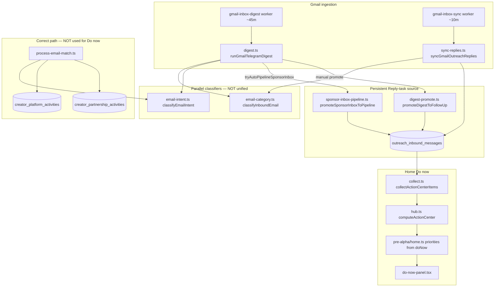
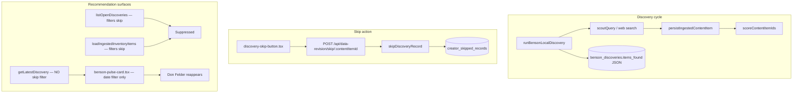

# State Authority / Producer Audit

**Date:** 2026-08-09  
**Status:** Report only — no implementation  
**Scope:** Two production correctness failures demonstrating Benson not consistently honoring upstream semantic decisions.

**Constraints for any fix:**
- Do NOT patch cards/UI to hide symptoms
- Do NOT add one-off Don Felder string exclusions
- Do NOT add hard-coded brand/email exceptions
- Fix producer semantics and reconcile incorrectly generated actions safely

**Workspace implementation:** Paused until these producer fixes are reviewed and approved.

---

## Executive summary

Both failures are **producer-side state authority gaps**, not presentation bugs:

| Failure | Root cause (one line) |
|---------|------------------------|
| **A — Bad email Reply todos** | `emailIntent` classification exists and works on the **creator-partnership path**, but Home → Do now Reply tasks are synthesized from **`outreach_inbound_messages` unread rows** with **zero intent gating**. |
| **B — Don Felder returns after Skip** | Skip persistence (`creator_skipped_records` + semantic matchers) works on most **live inventory feeds**, but **unfiltered read paths** (especially `getLatestDiscovery()` → Benson Pulse snapshot JSON) bypass skip authority; skip rows are also **fragile** (CASCADE on `content_item_id`, optional snooze expiry). |

---

# FAILURE A — Emails becoming bad Reply todos

## Observed symptoms (Home → Do now)

- "Reply: Myyshop" for "Email address verification"
- "Reply: REKLAIM" for "Customer account confirmation"
- "Reply: The ShopMy Team" for "Thank you for your ShopMy application"

We already have email intent classification that distinguishes creator business/platform activity from transactional/security/account messages. Those classifications are **not propagated** to the action-center Reply producer.

## Exact producer path



### Step-by-step trace

| Stage | File / function | Table / job |
|-------|-----------------|-------------|
| 1. Gmail ingestion | `services/core/src/gmail-inbox/digest.ts` `runGmailTelegramDigest()` | Worker `gmail-inbox-digest`; writes `gmail_digest_messages` |
| 2. Channel routing | `services/core/src/gmail-inbox/email-category.ts` `classifyInboundEmail()` | Mail to `sponsors@` → `emailCategory: 'sponsor'` (header routing wins over content) |
| 3. Auto-promotion | `services/core/src/gmail-inbox/sponsor-inbox-pipeline.ts` `tryAutoPipelineSponsorInbox()` → `promoteSponsorInboxToPipeline()` | Inserts `outreach_inbound_messages` with `matchKind: 'sponsors_inbox_pipeline'`, `isRead: false` |
| 4. Parallel intent (ignored by Reply path) | `services/core/src/creator-partnership/process-email-match.ts` `processCreatorEmailMatchFromGmailId()` | Calls `classifyEmailIntent()`; may write platform/partnership activities |
| 5. Do now synthesis | `services/core/src/action-center/collect.ts` `collectActionCenterItems()` lines 334–348 | **Ephemeral** `Reply: …` items — not stored |
| 6. Home surface | `services/core/src/pre-alpha/home.ts` maps `actions.doNow` → Home priorities | `dashboard/components/do-now-panel.tsx` |

**The exact function that creates "Reply: Myyshop" titles:**

```typescript
// services/core/src/action-center/collect.ts lines 334–348
for (const reply of inboundReplies.filter((m) => !m.isRead)) {
  items.push(
    finalize({
      id: `inbox-reply-${reply.id}`,
      section: 'pending_sponsor_emails',
      entityType: 'outreach',
      entityId: reply.outreachEmailId ?? reply.id,
      title: `Reply: ${reply.businessName ?? reply.fromName ?? reply.fromEmail ?? 'Sponsor'}`,
      subtitle: reply.subject ?? reply.snippet ?? 'New sponsor reply',
      dueAt: reply.receivedAt,
      actions: [{ kind: 'send_email', label: 'Open inbox' }],
      href: '/email/inbox',
      meta: { matchKind: reply.matchKind },
    }),
  );
}
```

## Answers to audit questions

| # | Question | Answer |
|---|----------|--------|
| **1** | Does it read `emailIntent`? | **No.** `gmail-inbox/` has zero imports of `classifyEmailIntent`. Action center has zero `emailIntent` references. |
| **2** | Does it read `creator_platform_activities` / `creator_partnership_activities`? | **No.** Action center never queries those tables. |
| **3** | Is it acting directly on raw inbox/digest rows? | **Yes.** It reads `outreach_inbound_messages` via `listOutreachInboundMessages()` (`sync-replies.ts`), filtered only by `!isRead`. |
| **4** | Why can `security_auth` / `transactional_account` become Reply tasks? | Mail routed to `sponsors@` → `emailCategory: 'sponsor'` → auto-promoted to `outreach_inbound_messages` without intent check. `isSecurityEmail()` only matches Google/Apple/Microsoft senders or narrow security-alert subjects — **not** MyyShop "Email address verification" or Shopify "Customer account confirmation". Every unread inbound row becomes a Reply task. |
| **5** | Why does `platform_application_received` become Reply instead of waiting/follow-up? | ShopMy application is correctly inferred as `platform_application_received` with suggested action *"Wait for ShopMy review"* in `infer-email-activity.ts` and written to `creator_platform_activities` — **but the same message is also auto-promoted to `outreach_inbound_messages`**, and action center only sees the inbound row. There is **no producer** that turns platform waiting state into a Do now item; Reply wins by default. |

## Authoritative state currently used

| Layer | Authoritative for | Actually used by Do now? |
|-------|-------------------|--------------------------|
| `classifyEmailIntent()` | Creator business vs transactional/security/platform | **No** |
| `PARTNERSHIP_BLOCKED_INTENTS` in `email-intent.ts` | Blocks partnership activity creation | **No** (partnership path only) |
| `shouldAllowPlatformMatching()` | Platform activity creation | **No** (platform path only) |
| `classifyInboundEmail()` / `emailCategory` | Inbox routing + Telegram headings | Stored on inbound row but **not consulted** by action center |
| `outreach_inbound_messages.isRead` | Whether to show Reply task | **Yes — sole gate** |
| `creator_platform_activities` | Platform waiting/review state | **Not connected to action center** |

## Named examples mapped

| Do now title | Correct `emailIntent` | Inbound writer | Why Reply appears |
|--------------|----------------------|----------------|-------------------|
| Reply: Myyshop | `security_auth` | `sponsors_inbox_pipeline` | Promoted unread inbound; intent ignored |
| Reply: REKLAIM | `transactional_account` | `sponsors_inbox_pipeline` | Same |
| Reply: The ShopMy Team | `platform_creator` → `platform_application_received` | `sponsors_inbox_pipeline` | Platform activity says "wait"; inbound row says "Reply" |

## Required authoritative rules (producer-level)

| Intent | Rule |
|--------|------|
| `security_auth` | **Never** insert into `outreach_inbound_messages`; **never** create Reply/action task unless explicit user-required action (rare; would need strong evidence) |
| `transactional_account` | **Never** create creator-business Reply task |
| `commerce_transactional` | No creator-business Reply task |
| `newsletter_marketing` | No Reply task |
| `platform_application_received` | Platform **waiting/review** state only; follow-up per explicit/default policy — **not** immediate Reply |
| `creator_business` requiring response | Reply **may** be created |
| `unknown` | Action only if strong evidence supports required response |

**Propagation requirement:** MyyShop and REKLAIM classifications already exist in `email-intent.test.ts` — they must gate **inbound promotion** and **action-center collection**, not just partnership activity creation.

## Root cause

**Split brain:** Two parallel classification systems (`emailCategory` for routing, `emailIntent` for creator-partnership) with no unified actionability gate before `outreach_inbound_messages` insert or action-center synthesis.

1. Channel-blind promotion: anything to `sponsors@` with category `sponsor`/`collaboration`/`booking` auto-promotes.
2. `isSecurityEmail()` gap: does not treat generic "verify your email" / "customer account confirmation" from arbitrary domains as non-actionable.
3. Action center has no exclusion filter: every unread inbound → `Reply: {fromName}`.
4. Misleading titles: when `outreachEmailId` is null (pipeline path), title uses sender display name — not a real sponsor reply.
5. Platform waiting state exists in `creator_platform_activities` but action center never reads it.

## Smallest proposed fix

**Two producer gates — no UI changes:**

1. **Write-time gate** — In `promoteSponsorInboxToPipeline()` (and `syncGmailOutreachReplies()` where applicable): call `classifyEmailIntent()` before inserting `outreach_inbound_messages`. Blocked intents → do not insert; optionally mark digest row `actionStatus: 'ignored_transactional'` for audit.

2. **Read-time gate (defense in depth)** — In `collectActionCenterItems()`: skip unread inbounds whose stored `emailIntent` (new column) or live classification is non-actionable. Never synthesize Reply from `matchKind: 'sponsors_inbox_pipeline'` alone.

3. **Platform waiting producer (ShopMy)** — Add action-center items sourced from `creator_platform_activities` where `activityType = 'platform_application_received'` → section like `platform_waiting_review`, **not** `pending_sponsor_emails` / Reply.

**Optional alignment:** Extend `classifyInboundEmail()` confirmation patterns to route verification mail to `security` category — secondary to `emailIntent` as authoritative semantic layer.

## Tables / files affected

| File | Change |
|------|--------|
| `services/core/src/gmail-inbox/sponsor-inbox-pipeline.ts` | Intent gate before inbound insert |
| `services/core/src/gmail-inbox/sync-replies.ts` | Intent gate for non-human thread messages |
| `services/core/src/action-center/collect.ts` | Actionability filter; optional platform-waiting collector |
| `services/core/src/creator-partnership/email-intent.ts` | Export `isActionableInboundIntent()` helper |
| `services/core/src/schema.ts` / migration | Add `email_intent`, `actionability` columns on `outreach_inbound_messages` |

## Migration necessary?

**Recommended but minimal:** add `email_intent text` + `actionability text` (or `suppress_action_center boolean`) to `outreach_inbound_messages` so read path doesn't re-classify ambiguously and cleanup can be audited.

## Cleanup strategy for existing bad actions

1. **Backfill script** (pattern: `correct-false-positive-partnership-activity.ts`): for each unread `outreach_inbound_messages` row, classify intent from subject/snippet/fromEmail; set `isRead: true` + store intent for blocked rows (MyyShop verification, REKLAIM confirmation, etc.).

2. **Do not delete Gmail/digest rows** — preserve audit trail.

3. **ShopMy application rows:** mark inbound non-actionable; ensure `creator_platform_activities` row reflects waiting state (likely already correct).

4. **Re-run action center** — bad Reply todos disappear because producer no longer emits them (not because UI hides them).

## Regression tests required

| Test | Expected |
|------|----------|
| MyyShop verification | Zero Reply todo |
| REKLAIM customer account confirmation | Zero Reply todo |
| ShopMy application receipt | Platform waiting/follow-up state; zero immediate Reply todo |
| Genuine creator-business email requiring response | One Reply todo |
| Same Gmail message processed twice | No duplicate action (`gmail_message_id` unique enforces insert dedupe; verify action-center idempotency) |

---

# FAILURE B — Don Felder returns after Skip

## Exact producer path



## Answers to audit questions

| # | Question | Answer |
|---|----------|--------|
| **1** | What durable DB state does Skip write? | `creator_skipped_records`: `content_item_id`, `occurrence_fingerprint`, `skipped_at`, `source_screen`, `snooze_until`, `restored_at`, `metadata` (`db/migrations/70_data_revision_and_skip.sql`) |
| **2** | What identifier/fingerprint is it attached to? | Primary: `(content_item_id, occurrence_fingerprint)`. Semantic propagation via `loadSkipMatchers()`: `identities` (`computeSkipMatchIdentity`), `performerKeys` (`coreTitle`), strict fingerprints |
| **3** | Does rediscovery reuse that identifier? | **Ingest does not check skip.** New cycles create/update `content_items` by `(source_id, source_external_id)` or exact `source_url`. Different source URL → **new row**. Skip reuse happens at **read time** via matchers |
| **4** | Can different source URLs produce new rows for same event? | **Yes.** `scanner/ingest-persist.ts`; Benson discovery uses new `externalId` per run batch (`benson-discovery/run.ts`) |
| **5** | Does scoring/discovery check skipped state before recommending? | **Partially.** `listOpenDiscoveries`, `loadIngestedInventoryItems`, `getTopScoredOpportunities`, operational home — **yes**. `getLatestDiscovery()`, `runBensonLocalDiscovery` snapshot write, Benson Pulse client — **no** |
| **6** | Skip type? | **Content-item occurrence state** with semantic duplicate matching — **not** presentation-only, **not** canonical-entity (`entity_suppressions` is separate, used by benson-learning only) |
| **7** | Why specifically does Don Felder return? | **Primary:** `getLatestDiscovery()` returns frozen `benson_discoveries.items_found` without `isSkippedByMatchers()` — Benson Pulse re-shows skipped items after reload/new discovery cycle. **Secondary:** skip row **CASCADE-deletes** when `content_items` row deleted; snooze expiry; early-signal skip (`early_signals.signal_state = 'skipped'`) does not write `creator_skipped_records` until promoted. **Historical:** SQL OR-precedence bug in `listOpenDiscoveries` (fixed in code at lines 748–754 of `creator-interest/actions.ts`) may still affect production if not deployed |

## Required invariant

**USER SKIP IS DURABLE ACROSS REDISCOVERY OF THE SAME CANONICAL OPPORTUNITY.**

A rediscovered event matching a durable skipped fingerprint must:
- not create a new actionable/top-pick recommendation
- not reappear merely because the source URL/query changed
- preserve evidence that it was rediscovered if useful internally
- remain suppressed until materially changed according to an explicit policy or user restores it

## Material change policy (proposed)

**Canonical skip identity:** `computeSkipMatchIdentity()` — normalized core title + event day (America/Chicago) + city — **not** source URL alone.

| User action | Semantics |
|-------------|-----------|
| **Skip permanently** | Durable identity key stored in skip metadata; suppress all rediscoveries matching identity until restore |
| **Later / snooze** | Same identity key + `snooze_until`; returns after intended time |
| **Materially new version** | Different event day, city, or materially different core title → eligible again |

**Tighten `performerKeys`:** Current code suppresses **all dates** for a performer (`creator-skip/load-skipped.test.ts`). Required test *"unrelated event by same performer → not automatically suppressed"* implies **identity-level skip**, not performer-wide — semantic correction to existing matcher.

## Authoritative state currently used

| Mechanism | Scope | Durable across rediscovery? |
|-----------|-------|----------------------------|
| `creator_skipped_records` + matchers | Same event via identity/fingerprint/performerKey | **Yes** on filtered paths |
| `performerKeys` in matchers | All dates for same performer title core | **Over-broad** vs "unrelated same-performer event" requirement |
| `benson_discoveries.items_found` | Frozen snapshot | **Bypasses skip entirely on read** |
| `entity_suppressions` | Canonical entity (learning/admin) | Not wired to user Skip button |
| `early_signals.signal_state = 'skipped'` | Signal row only | Lost if promoted without `skipDiscoveryRecord` |

## Smallest proposed fix

**No title blacklists. Reuse existing fingerprint infrastructure.**

1. **Immediate (read-path authority):** Filter `getLatestDiscovery()` through `loadSkipMatchers()` + `isSkippedByMatchers()` before returning items. Same for any other snapshot/read path that serves recommendations.

2. **Write-path hardening:** In `runBensonLocalDiscovery()`, exclude matcher-hit items from `itemsFound` snapshot (prevents re-push notifications for skipped events).

3. **Durability fix (small migration):** On skip, persist `skipMatchIdentity.key` in `creator_skipped_records.metadata`; change FK from `ON DELETE CASCADE` to `ON DELETE SET NULL` **or** add `skip_identity_key text NOT NULL` indexed independently of `content_item_id` so tombstones survive content-item churn.

4. **Early-signal bridge:** When `skipSignal()` runs on a promoted opportunity, also call `skipDiscoveryRecord()` if `linkedOpportunityId` / `content_item_id` exists.

5. **Narrow `performerKeys`:** Use identity matching for default Skip; reserve performer-wide suppression for explicit "never show this act" UX (future) or admin `entity_suppressions`.

## Tables / files affected

| File | Change |
|------|--------|
| `services/core/src/benson-discovery/index.ts` | Filter snapshot through skip matchers |
| `services/core/src/benson-discovery/run.ts` | Exclude skipped items from `itemsFound` |
| `services/core/src/creator-skip/index.ts` | Persist identity key in metadata; tighten matcher policy |
| `services/core/src/early-signals/actions.ts` | Bridge to `creator_skipped_records` on promote |
| `db/migrations/NN_*.sql` | Optional: decouple skip identity from content_item CASCADE |

## Migration necessary?

**Optional but recommended** for durable invariant: store `skip_identity_key` on `creator_skipped_records` and relax CASCADE so user skip survives content-item deletion/re-ingestion. Without this, semantic matchers only work while the original skip row + joined content_item exist.

## Cleanup strategy

1. Query active Don Felder `content_items` + verify `creator_skipped_records` exists (`verify-don-felder-suppression.ts`).
2. If skip row missing, re-skip from any Felder `content_item_id` via API (creates tombstone + identity).
3. No content deletion — preserve evidence.

## Regression tests required

| Test | Expected |
|------|----------|
| Discover Don-Felder-like fixture → Skip | Suppressed |
| Rediscover same event, same source | Remains suppressed |
| Rediscover same event, different source URL | Remains suppressed (identity matcher) |
| Rediscover same canonical event, different search query | Remains suppressed |
| Unrelated event, same performer | **Not** automatically suppressed (requires identity tightening) |
| Later/snooze | Returns only after intended time |
| Restore/unskip | Eligible again |

---

# Cross-cutting: state authority principle

Both failures share the same architectural defect: **upstream semantic decisions exist but downstream producers ignore them.**

| Domain | Upstream authority (exists) | Downstream producer (ignores it) |
|--------|----------------------------|----------------------------------|
| Email | `classifyEmailIntent()` | `outreach_inbound_messages` insert + `collectActionCenterItems()` |
| Discovery skip | `creator_skipped_records` + matchers | `getLatestDiscovery()` frozen JSON |

**Fix pattern:** Make the **producer** consult authoritative state at write time and read time. Do not patch cards, hide in UI, or add per-brand exceptions.

---

# Recommended implementation order (after review)

1. **Failure A write gate** — block non-actionable intents from `outreach_inbound_messages`
2. **Failure A read gate + cleanup script** — reconcile existing bad rows
3. **Failure A platform waiting producer** — ShopMy-style items from platform activities
4. **Failure B read gate** — `getLatestDiscovery()` skip filter
5. **Failure B durability migration** — identity-key tombstone independent of content_item CASCADE
6. **Failure B matcher policy** — identity-level default; narrow performer-wide suppression
7. **Regression tests** for both domains

---

# Key file reference

| Area | Path |
|------|------|
| Reply task producer | `services/core/src/action-center/collect.ts` |
| Action center hub | `services/core/src/action-center/hub.ts` |
| Home Do now | `services/core/src/pre-alpha/home.ts`, `dashboard/components/do-now-panel.tsx` |
| Gmail digest | `services/core/src/gmail-inbox/digest.ts` |
| Sponsor inbox promotion | `services/core/src/gmail-inbox/sponsor-inbox-pipeline.ts` |
| Email intent | `services/core/src/creator-partnership/email-intent.ts` |
| Email activity inference | `services/core/src/creator-partnership/infer-email-activity.ts` |
| Platform activities | `services/core/src/creator-partnership/platform-activities.ts` |
| Inbound messages schema | `services/core/src/schema.ts` (`outreachInboundMessages`) |
| Skip persistence | `services/core/src/creator-skip/index.ts` |
| Skip fingerprint | `services/core/src/creator-skip/fingerprint.ts` |
| Discoveries feed (filtered) | `services/core/src/creator-interest/actions.ts` `listOpenDiscoveries()` |
| Discovery snapshot (unfiltered) | `services/core/src/benson-discovery/index.ts` `getLatestDiscovery()` |
| Benson Pulse UI | `dashboard/components/benson-pulse-card.tsx` |
| Skip migration | `db/migrations/70_data_revision_and_skip.sql` |
| Don Felder verification script | `services/core/src/scripts/verify-don-felder-suppression.ts` |
| False-positive correction pattern | `services/core/src/scripts/correct-false-positive-partnership-activity.ts` |
